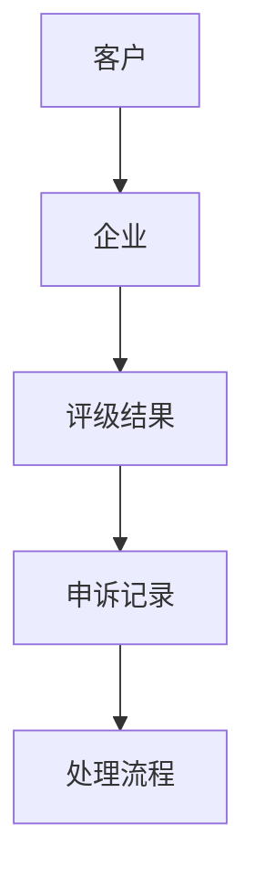
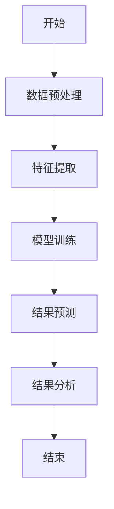
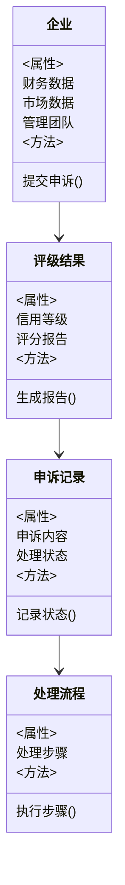
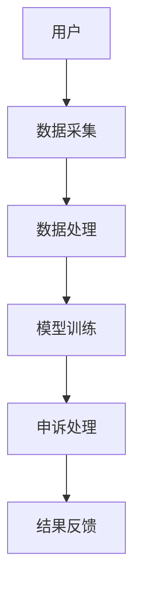
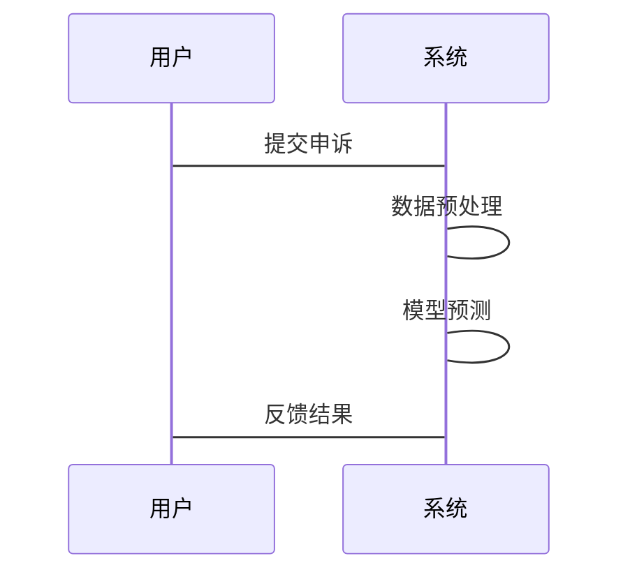

                 


# 设计智能化的企业信用评级申诉处理系统

## 关键词：企业信用评级、智能化处理、申诉系统、机器学习、系统架构、数据驱动

## 摘要

随着企业信用评级在金融和商业领域的重要性日益增加，设计一个高效的申诉处理系统显得尤为关键。本文详细探讨了如何利用智能化技术，如机器学习和大数据分析，来优化企业信用评级的申诉处理流程。文章首先介绍了系统的背景和核心概念，随后深入分析了算法原理和系统架构，最后通过实际案例展示了系统的实现与应用。

---

## 第一部分: 企业信用评级申诉处理系统背景与概述

### 第1章: 企业信用评级申诉处理系统概述

#### 1.1 企业信用评级的背景与意义
- **1.1.1 信用评级的基本概念**
  信用评级是对企业财务状况、经营能力和偿债能力的综合评价，是企业在金融市场中的信用等级的重要指标。
  
- **1.1.2 信用评级的重要性**
  信用评级影响企业的融资成本、市场信任度和合作伙伴的选择。良好的信用评级能够为企业带来更多的商业机会和更低的融资成本。

- **1.1.3 申诉处理的必要性**
  当企业对信用评级结果有异议时，需要一个高效的申诉机制来解决问题，确保评级的公正性和准确性。

#### 1.2 问题背景与描述
- **1.2.1 传统信用评级的局限性**
  传统评级方法依赖人工判断，存在主观性强、效率低、成本高等问题。此外，人工处理申诉可能导致处理时间长、结果不一致。

- **1.2.2 申诉处理的挑战**
  申诉处理需要快速响应、准确分析和公正判断，传统的处理方式难以满足这些要求。

- **1.2.3 智能化处理的需求**
  利用智能化技术可以提高申诉处理的效率和准确性，降低成本，并提供一致性的处理流程。

#### 1.3 问题解决思路
- **1.3.1 智能化处理的核心思想**
  通过机器学习和大数据分析，建立自动化处理流程，实现快速响应和准确判断。

- **1.3.2 数据驱动的解决方案**
  利用企业的历史数据和实时数据，构建预测模型，辅助决策。

- **1.3.3 自动化处理的优势**
  自动化处理可以减少人为错误，提高效率，并确保处理结果的公正性。

#### 1.4 系统边界与外延
- **1.4.1 系统功能边界**
  系统主要处理企业信用评级的申诉，包括数据采集、分析、模型预测和结果反馈。

- **1.4.2 系统的扩展性**
  系统可以扩展到支持更多数据源和更复杂的模型，以适应不同的业务需求。

- **1.4.3 系统的适用范围**
  适用于各类金融机构和企业，帮助其优化信用评级流程。

#### 1.5 核心概念与组成
- **1.5.1 系统核心要素**
  数据采集模块、模型训练模块、申诉处理模块和结果反馈模块。

- **1.5.2 关键功能模块**
  数据预处理、模型训练、申诉分类、结果分析。

- **1.5.3 系统组成结构**
  通过模块化设计，确保系统的可扩展性和可维护性。

---

## 第二部分: 核心概念与联系

### 第2章: 核心概念解析

#### 2.1 智能化处理流程
- **2.1.1 数据采集与处理**
  从企业财务报表、市场数据和历史记录中提取相关特征。
  
- **2.1.2 模型训练与应用**
  使用机器学习算法训练信用评分模型，对企业的信用状况进行预测。

- **2.1.3 结果分析与反馈**
  对模型的预测结果进行分析，生成申诉处理的建议，并反馈给用户。

#### 2.2 数据驱动的信用评估
- **2.2.1 数据特征分析**
  通过数据分析，识别影响企业信用的关键因素，如财务指标、市场表现等。

- **2.2.2 数据预处理方法**
  数据清洗、特征选择和数据标准化，确保数据质量。

- **2.2.3 数据驱动的评估模型**
  使用回归分析或分类算法构建信用评分模型，评估企业的信用风险。

#### 2.3 自动化申诉处理机制
- **2.3.1 申诉分类与处理**
  根据申诉的具体内容，自动分类并触发相应的处理流程。

- **2.3.2 自动化处理流程**
  通过预设的规则和模型，快速处理申诉，减少人工干预。

- **2.3.3 申诉结果反馈**
  将处理结果及时反馈给申诉人，确保透明性和公正性。

#### 2.4 核心概念对比表
| 传统处理 | 智能化处理 |
|----------|------------|
| 人工判断 | 自动化处理 |
| 低效率 | 高效率 |
| 高成本 | 低成本 |
| 不一致 | 一致性 |

#### 2.5 ER实体关系图


---

## 第三部分: 算法原理与数学模型

### 第3章: 算法原理

#### 3.1 信用评分模型
- **3.1.1 模型选择**
  使用逻辑回归或随机森林算法，根据企业的历史数据进行训练。

- **3.1.2 模型训练**
  通过监督学习，利用标记的数据训练模型，使其能够预测企业的信用等级。

- **3.1.3 模型评估**
  使用准确率、召回率和F1分数等指标评估模型的性能，并进行调优。

#### 3.2 申诉处理的机器学习模型
- **3.2.1 数据预处理**
  对企业数据进行清洗，处理缺失值和异常值。

- **3.2.2 特征提取**
  提取关键特征，如财务指标、市场表现和管理能力。

- **3.2.3 模型训练**
  使用决策树或支持向量机（SVM）对申诉内容进行分类，识别潜在的问题。

#### 3.3 算法流程图


#### 3.4 数学公式
- **3.4.1 逻辑回归模型**
  $$ P(y=1|x) = \frac{e^{\beta_0 + \beta_1x_1}}{1 + e^{\beta_0 + \beta_1x_1}} $$
  
- **3.4.2 随机森林算法**
  使用集成学习，通过多个决策树的投票结果进行预测。

---

## 第四部分: 系统分析与架构设计

### 第4章: 系统分析与架构设计

#### 4.1 问题场景介绍
- 企业提交申诉后，系统需要快速分析数据，生成处理结果，并反馈给企业。

#### 4.2 系统功能设计
- 数据采集模块：收集企业的财务数据和市场数据。
- 模型训练模块：构建和训练信用评分模型。
- 申诉处理模块：自动分类和处理申诉内容。
- 结果反馈模块：生成处理报告并反馈给用户。

#### 4.3 领域模型类图


#### 4.4 系统架构图


#### 4.5 系统交互序列图


---

## 第五部分: 项目实战

### 第5章: 项目实战

#### 5.1 环境安装
- 安装Python、TensorFlow、Scikit-learn和相关数据处理库。

#### 5.2 核心代码实现

```python
# 数据预处理
import pandas as pd
from sklearn.preprocessing import StandardScaler

data = pd.read_csv('enterprise_data.csv')
data = data.dropna()
scaler = StandardScaler()
scaled_data = scaler.fit_transform(data)

# 模型训练
from sklearn.ensemble import RandomForestClassifier

model = RandomForestClassifier()
model.fit(scaled_data, labels)

# 申诉处理
def process_complaint(text):
    features = extract_features(text)
    prediction = model.predict(features)
    return prediction

# 结果反馈
def feedback(result):
    if result == 'approved':
        print("申诉成功")
    else:
        print("申诉失败")
```

#### 5.3 实际案例分析
- 使用实际的企业数据，展示系统的处理流程和结果。

---

## 第六部分: 最佳实践与总结

### 第6章: 最佳实践

#### 6.1 小结
- 智能化系统能够显著提高信用评级申诉的处理效率和准确性。
- 数据驱动的方法是实现智能化处理的核心。

#### 6.2 注意事项
- 数据质量和模型选择对系统性能至关重要。
- 系统设计应注重扩展性和可维护性。

#### 6.3 拓展阅读
- 推荐阅读《机器学习实战》和《数据驱动的系统设计》。

---

通过以上结构和内容，文章详细探讨了设计智能化的企业信用评级申诉处理系统的关键点，从背景分析到系统实现，为读者提供了全面的技术指导。

