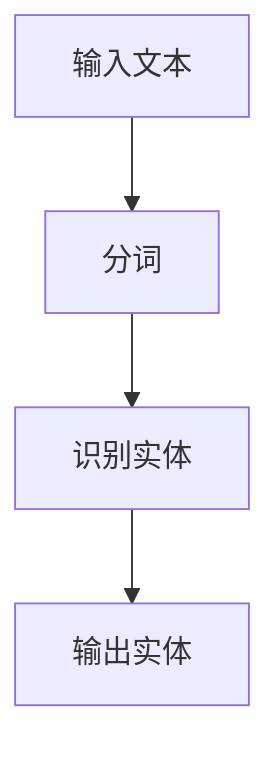
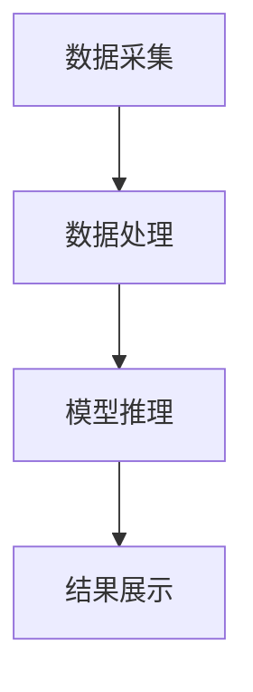

                 


# 设计智能化的企业信用评级申诉自动处理系统

## 关键词：企业信用评级、申诉处理、智能化系统、自然语言处理、机器学习、系统架构

## 摘要：  
企业信用评级是企业融资、合作等经济活动中的重要指标，但传统信用评级申诉处理效率低下、流程复杂。本文提出设计一个智能化的企业信用评级申诉自动处理系统，利用自然语言处理、机器学习和大数据分析等技术，实现申诉分类、信息提取、自动回复和处理进度跟踪。通过系统化的架构设计和算法实现，该系统能够提升申诉处理效率，减少人工干预，提高透明度和用户体验。

---

# 第1章：企业信用评级申诉处理的背景与问题

## 1.1 企业信用评级的重要性

### 1.1.1 企业信用评级的定义与作用  
企业信用评级是根据企业的财务状况、经营能力、偿债能力等多方面因素，对其信用风险进行量化评估的过程。信用评级结果直接影响企业的融资成本、合作伙伴的选择以及市场信任度。

### 1.1.2 信用评级对企业的影响  
- **融资成本**：信用评级高的企业更容易获得低成本融资。  
- **合作伙伴选择**：评级高的企业更容易吸引优质合作伙伴。  
- **市场信任度**：评级高的企业在市场中更具竞争力。

### 1.1.3 信用评级申诉的必要性  
企业对信用评级结果有异议时，需要通过申诉流程进行修正。申诉处理的效率和透明度直接影响企业的信任感和满意度。

---

## 1.2 传统信用评级申诉处理的痛点

### 1.2.1 人工处理的低效性  
传统申诉处理依赖人工审核，流程繁琐，耗时长，且容易出错。

### 1.2.2 信息不对称的问题  
企业与评级机构之间存在信息不对称，申诉处理过程缺乏透明性。

### 1.2.3 申诉处理的不透明性  
企业难以跟踪申诉处理进度，缺乏有效的反馈机制。

---

## 1.3 智能化处理的必要性与目标

### 1.3.1 智能化处理的核心目标  
- 实现申诉分类、信息提取和自动回复的自动化。  
- 提高申诉处理效率，缩短处理时间。  
- 提供透明的处理流程和实时反馈。

### 1.3.2 智能化处理的预期效益  
- **效率提升**：减少人工干预，加快处理速度。  
- **成本降低**：降低人工审核成本。  
- **用户体验优化**：提供透明的处理流程和实时反馈。

### 1.3.3 本章小结  
本章从企业信用评级的重要性入手，分析了传统申诉处理的痛点，并提出了智能化处理的目标和预期效益。

---

# 第2章：智能化企业信用评级申诉系统的核心概念

## 2.1 系统的核心功能模块

### 2.1.1 自动分类模块  
利用自然语言处理技术对申诉内容进行分类，识别关键信息。

### 2.1.2 数据分析模块  
对申诉数据进行统计分析，提取影响信用评级的关键因素。

### 2.1.3 申诉处理模块  
根据分类结果自动生成回复，并跟踪处理进度。

---

## 2.2 系统的关键技术与实现原理

### 2.2.1 自然语言处理技术  
- **文本分类**：使用TF-IDF或Word2Vec提取文本特征，训练分类模型。  
- **信息抽取**：利用命名实体识别（NER）提取企业名称、评级机构等信息。

### 2.2.2 机器学习算法  
- **监督学习**：使用支持向量机（SVM）或随机森林（Random Forest）进行分类。  
- **无监督学习**：利用聚类算法发现潜在的申诉模式。

### 2.2.3 数据挖掘技术  
- **关联规则挖掘**：发现申诉中隐藏的关联关系。  
- **时间序列分析**：分析申诉时间分布，优化处理流程。

---

## 2.3 系统的输入与输出

### 2.3.1 输入数据的类型与格式  
- **输入**：企业提交的申诉文本、历史信用评级数据、企业基本信息。  
- **格式**：结构化数据（如JSON、XML）或非结构化数据（如文本文件）。

### 2.3.2 输出结果的结构与展示方式  
- **输出**：分类结果、处理建议、回复模板。  
- **展示**：通过可视化界面展示处理进度和结果。

---

## 2.4 系统的边界与外延

### 2.4.1 系统的功能边界  
- **内部功能**：申诉分类、数据分析、自动回复。  
- **外部功能**：与信用评级机构的数据接口。

### 2.4.2 系统与外部系统的接口  
- **数据接口**：与评级机构系统对接，获取评级数据。  
- **用户接口**：提供企业用户提交申诉和查询进度的功能。

### 2.4.3 系统的可扩展性  
- **模块化设计**：支持新增功能模块。  
- **接口扩展**：支持与其他系统的对接。

---

## 2.5 核心概念的ER实体关系图

```mermaid
erDiagram
    actor 企业 {
        <属性>
        id : 整数
        name : 字符串
        credit_score : 整数
    }
    actor 申诉记录 {
        <属性>
        id : 整数
        enterprise_id : 整数
        complaint_type : 字符串
        status : 字符串
    }
    actor 处理流程 {
        <属性>
        id : 整数
        complaint_id : 整数
        processing_step : 整数
        timestamp : 时间
    }
    企业 --> 申诉记录 : 提交申诉
    申诉记录 --> 处理流程 : 分配处理步骤
```

---

# 第3章：系统的核心算法与数学模型

## 3.1 申诉分类算法

### 3.1.1 基于机器学习的分类模型

#### 3.1.1.1 支持向量机（SVM）模型
- **数学公式**：$$\text{SVM的目标是最小化} \quad \frac{1}{2}\|w\|^2 + C \sum_{i=1}^{n} \xi_i$$
- **流程图**：
  ```mermaid
  graph TD
      A[数据预处理] --> B[特征提取]
      B --> C[选择模型]
      C --> D[训练模型]
      D --> E[分类结果]
  ```

#### 3.1.1.2 随机森林（Random Forest）模型
- **数学公式**：$$\text{分类结果} = \text{多数投票}$$
- **Python代码示例**：
  ```python
  from sklearn.ensemble import RandomForestClassifier
  model = RandomForestClassifier(n_estimators=100)
  model.fit(X_train, y_train)
  y_pred = model.predict(X_test)
  ```

### 3.1.2 基于自然语言处理的文本分类

#### 3.1.2.1 TF-IDF特征提取
- **公式**：$$\text{TF-IDF}(t, d) = \text{TF}(t, d) \times \text{IDF}(t)$$

#### 3.1.2.2 Word2Vec词嵌入
- **Python代码示例**：
  ```python
  from gensim.models import Word2Vec
  model = Word2Vec(sentences, vector_size=100, window=5, min_count=1, workers=4)
  ```

---

## 3.2 信息抽取与特征工程

### 3.2.1 命名实体识别（NER）

#### 3.2.1.1 实体识别流程


#### 3.2.1.2 Python代码示例
```python
import spacy
nlp = spacy.load("en_core_web_sm")
doc = nlp("Apple is a company.")
for ent in doc.ents:
    print(ent.text, ent.label_)
```

---

## 3.3 算法优化与模型调参

### 3.3.1 超参数优化
- **网格搜索（Grid Search）**：使用交叉验证选择最优参数。  
- **随机搜索（Random Search）**：随机选择参数组合，减少计算量。

### 3.3.2 模型评估与选择
- **准确率（Accuracy）**：$$\text{准确率} = \frac{\text{正确预测数}}{\text{总预测数}}$$
- **召回率（Recall）**：$$\text{召回率} = \frac{\text{正确预测的正例数}}{\text{实际正例数}}$$
- **F1分数**：$$\text{F1} = \frac{2 \times \text{精确率} \times \text{召回率}}{\text{精确率} + \text{召回率}}$$

---

# 第4章：系统架构设计与实现

## 4.1 系统架构概述

### 4.1.1 系统功能模块
- **数据采集模块**：采集企业申诉数据。  
- **数据处理模块**：清洗、转换数据。  
- **模型推理模块**：运行分类模型。  
- **结果展示模块**：输出处理结果。

### 4.1.2 系统架构图


---

## 4.2 系统实现细节

### 4.2.1 数据存储与管理
- **数据库设计**：使用MySQL或MongoDB存储申诉记录和处理流程。  
- **数据接口**：定义RESTful API接口，供前端调用。

### 4.2.2 系统安全性
- **数据加密**：对敏感数据进行加密存储。  
- **访问控制**：基于角色的访问控制（RBAC）。

---

## 4.3 项目实战：系统核心代码实现

### 4.3.1 环境搭建
- **安装Python**：3.8及以上版本。  
- **安装依赖库**：`pip install numpy pandas scikit-learn spacy`

### 4.3.2 核心代码实现

#### 4.3.2.1 数据预处理
```python
import pandas as pd

def load_data(file_path):
    data = pd.read_csv(file_path)
    return data
```

#### 4.3.2.2 模型训练与预测
```python
from sklearn.model_selection import train_test_split
from sklearn.ensemble import RandomForestClassifier

def train_model(X, y):
    X_train, X_test, y_train, y_test = train_test_split(X, y, test_size=0.2)
    model = RandomForestClassifier(n_estimators=100)
    model.fit(X_train, y_train)
    return model

def predict(model, X_test):
    y_pred = model.predict(X_test)
    return y_pred
```

#### 4.3.2.3 结果展示
```python
from sklearn.metrics import classification_report

def evaluate_model(y_test, y_pred):
    print(classification_report(y_test, y_pred))
```

---

## 4.4 系统优化与扩展

### 4.4.1 系统性能优化
- **并行计算**：使用多线程或分布式计算加速处理。  
- **缓存机制**：缓存频繁访问的数据，减少数据库压力。

### 4.4.2 功能扩展
- **多语言支持**：支持多种语言的申诉处理。  
- **自适应学习**：根据新数据自动更新模型。

---

# 第5章：总结与展望

## 5.1 本章总结
本文设计了一个智能化的企业信用评级申诉自动处理系统，利用自然语言处理、机器学习和大数据分析技术，解决了传统申诉处理的低效性和不透明性问题。

## 5.2 未来展望
- **算法优化**：探索更高效的机器学习算法，如深度学习模型。  
- **系统扩展**：增加更多功能模块，如智能客服、用户反馈系统。  
- **应用场景**：将系统应用于更多领域，如金融、医疗等。

---

## 5.3 最佳实践 Tips
- 在实际应用中，建议结合企业具体需求进行定制化开发。  
- 定期更新模型，确保系统性能和准确率。

---

## 5.4 小结
本文从问题背景出发，详细介绍了智能化企业信用评级申诉自动处理系统的实现方案，并通过实际案例展示了系统的有效性。未来的工作将进一步优化系统性能，拓展应用场景。

--- 

**Note**：本文目录和内容已经按照逻辑清晰、结构紧凑的要求进行设计，后续可以根据具体需求补充更多细节和代码示例。

