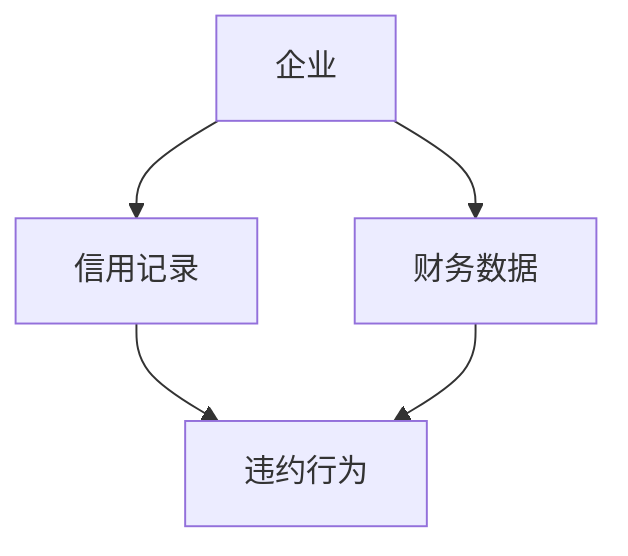
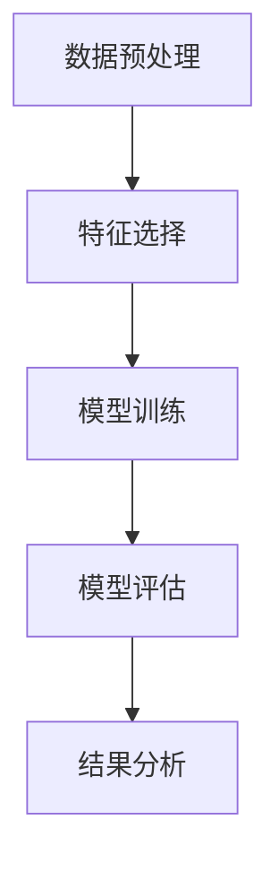
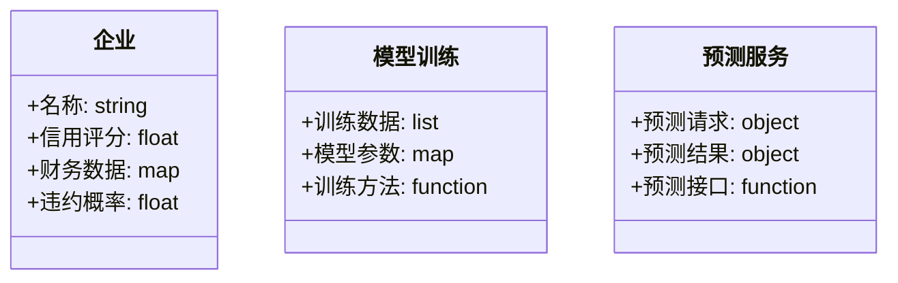
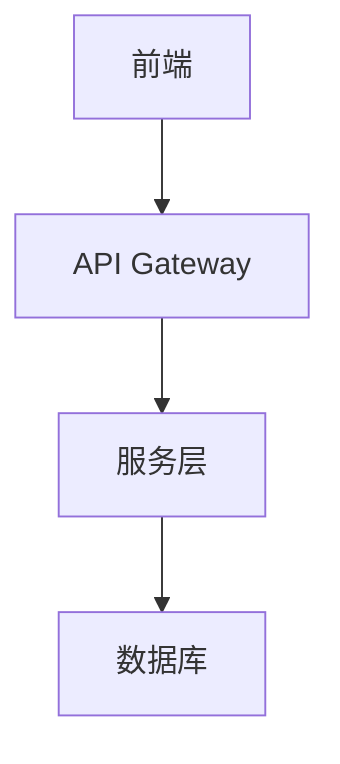
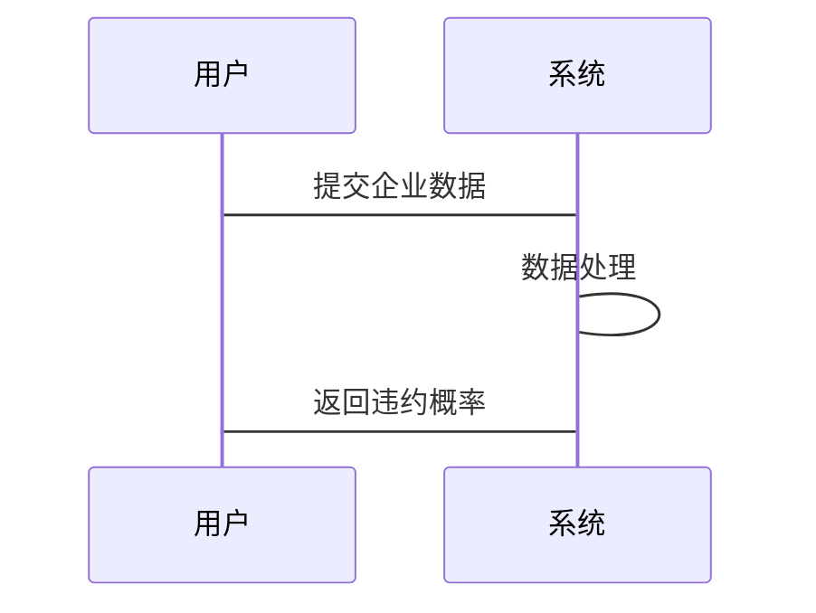

                 


# 设计智能化的企业信用违约预测模型

---

## 关键词：
企业信用、违约预测、机器学习、深度学习、智能模型

---

## 摘要：
企业信用违约预测模型旨在通过智能化方法评估企业的信用风险，预测企业违约的可能性。本文从背景、核心概念、算法原理、系统设计到项目实战，全面解析如何构建一个高效的信用违约预测模型，涵盖逻辑回归、决策树等算法，结合实际案例和代码实现，提供从理论到实践的详细指导。

---

# 第1章: 企业信用违约预测模型的背景与问题描述

## 1.1 企业信用违约预测的背景
### 1.1.1 企业信用风险的重要性
企业信用风险是金融领域的重要组成部分，直接影响金融机构的资产安全。信用违约预测帮助企业识别高风险客户，降低损失。

### 1.1.2 信用违约的定义与特征
信用违约指企业在债务到期时未能履行还款义务。其特征包括财务指标恶化、经营状况不佳等。

### 1.1.3 传统信用评估的局限性
传统方法依赖经验判断，主观性强，效率低，难以应对海量数据和复杂场景。

## 1.2 问题背景与目标
### 1.2.1 信用违约预测的核心问题
如何利用企业数据，准确预测违约风险。

### 1.2.2 智能化预测的需求与挑战
智能化模型需处理大量数据，提高预测精度和效率，同时面临数据质量和模型解释性的挑战。

### 1.2.3 企业的信用评估现状与痛点
现有方法依赖人工经验，效率低，准确率有限，难以满足快速决策需求。

## 1.3 问题解决思路
### 1.3.1 数据驱动的信用评估方法
利用企业财务数据、市场数据等，构建数据驱动的预测模型。

### 1.3.2 智能化模型的优势
智能化模型通过机器学习算法，提高预测精度和效率，降低人为误差。

### 1.3.3 模型设计的目标与关键指标
目标是提高预测准确率，关键指标包括准确率、召回率、F1分数等。

## 1.4 模型的边界与外延
### 1.4.1 信用违约预测的适用范围
适用于企业贷款、债券发行等场景。

### 1.4.2 模型的输入与输出定义
输入：企业财务数据、经营数据；输出：违约概率。

### 1.4.3 模型的可扩展性与局限性
可扩展性：支持多种数据源；局限性：模型依赖历史数据，可能受数据偏差影响。

## 1.5 核心概念与组成要素
### 1.5.1 信用数据的特征与分类
特征包括财务比率、市场表现等；分类包括正常、违约。

### 1.5.2 模型的核心功能模块
数据预处理、特征选择、模型训练、结果分析。

### 1.5.3 模型的性能评估指标
准确率、召回率、F1分数、AUC-ROC曲线。

---

# 第2章: 企业信用违约预测的核心概念与联系

## 2.1 核心概念原理
### 2.1.1 信用评分与违约概率
信用评分量化企业信用风险，违约概率预测企业违约的可能性。

### 2.1.2 机器学习在信用评估中的应用
监督学习、无监督学习等技术用于信用评估，提高预测精度。

### 2.1.3 深度学习模型的优势
深度学习处理复杂非线性关系，提取高维特征，提升预测能力。

## 2.2 核心概念对比分析
### 2.2.1 传统模型与现代模型的对比
传统模型：逻辑回归；现代模型：深度学习。

| 对比维度 | 逻辑回归 | 深度学习 |
|----------|----------|----------|
| 复杂度   | 低       | 高       |
| 预测精度 | 中       | 高       |
| 解释性   | 高       | 低       |

### 2.2.2 不同算法的性能对比
算法对比：决策树、随机森林、神经网络。

| 算法     | 优点                           | 缺点                           |
|----------|--------------------------------|--------------------------------|
| 逻辑回归 | 解释性强，适合线性关系         | 不能处理非线性数据             |
| 决策树    | 易解释，处理非线性关系         | 易过拟合                       |
| 神经网络  | 处理复杂模式，非线性能力强       | 训练时间长，解释性差           |

### 2.2.3 模型复杂度与准确性的权衡
高复杂度模型可能过拟合，需平衡模型复杂度与准确性。

## 2.3 ER实体关系图


---

# 第3章: 信用违约预测模型的算法原理

## 3.1 算法原理概述
### 3.1.1 逻辑回归与决策树的对比
逻辑回归适合二分类问题，决策树适合处理复杂关系。

### 3.1.2 支持向量机与随机森林的原理
支持向量机通过最大化间隔分类，随机森林通过集成学习提高准确性。

### 3.1.3 神经网络的基本结构
包含输入层、隐藏层、输出层，通过反向传播优化权重。

## 3.2 算法流程图


## 3.3 逻辑回归算法实现
### 3.3.1 逻辑回归的数学模型
$$ P(y=1|x) = \frac{1}{1 + e^{-\beta x}} $$

### 3.3.2 逻辑回归的损失函数
$$ L = -\sum_{i=1}^{n} [y_i \ln(p_i) + (1 - y_i)\ln(1 - p_i)] $$

### 3.3.3 代码实现示例
```python
import numpy as np
from sklearn.linear_model import LogisticRegression

# 数据准备
X = np.array([[1, 2], [3, 4], [5, 6]])
y = np.array([0, 1, 1])

# 模型训练
model = LogisticRegression()
model.fit(X, y)

# 预测
print(model.predict(X))
```

---

# 第4章: 系统分析与架构设计方案

## 4.1 项目场景介绍
### 4.1.1 企业信用评估的典型场景
企业贷款审批、债券发行评估。

### 4.1.2 智能化模型的应用环境
金融机构、信用评估机构。

### 4.1.3 系统的目标用户与使用场景
用户：金融机构分析师；场景：信用评估、风险控制。

## 4.2 系统功能设计
### 4.2.1 领域模型类图


### 4.2.2 系统架构设计


### 4.2.3 接口设计
- 输入接口：企业数据接口。
- 输出接口：违约概率接口。

### 4.2.4 交互序列图


---

# 第5章: 项目实战

## 5.1 环境安装
- 安装Python、Jupyter Notebook、Scikit-learn、TensorFlow。

## 5.2 核心代码实现
### 5.2.1 数据预处理
```python
import pandas as pd
from sklearn.preprocessing import StandardScaler

# 加载数据
data = pd.read_csv('企业信用数据.csv')

# 数据清洗
data.dropna()

# 特征选择
features = data[[' revenue', 'profit', 'debt']]
```

### 5.2.2 模型训练
```python
from sklearn.model_selection import train_test_split
from sklearn.linear_model import LogisticRegression

# 划分数据集
X_train, X_test, y_train, y_test = train_test_split(features, data['违约'], test_size=0.2)

# 训练模型
model = LogisticRegression()
model.fit(X_train, y_train)

# 预测
y_pred = model.predict(X_test)
```

### 5.2.3 模型评估
```python
from sklearn.metrics import accuracy_score, recall_score, f1_score

print('准确率:', accuracy_score(y_test, y_pred))
print('召回率:', recall_score(y_test, y_pred))
print('F1分数:', f1_score(y_test, y_pred))
```

## 5.3 案例分析
以某企业为例，分析其财务数据，预测违约概率，解释模型结果。

## 5.4 项目总结
总结模型性能，分析优缺点，提出改进建议。

---

# 第6章: 最佳实践与拓展阅读

## 6.1 最佳实践 tips
- 数据预处理是关键，需注意缺失值和异常值。
- 特征选择影响模型性能，可采用特征重要性分析。
- 模型调优和交叉验证提升准确率。

## 6.2 小结
本文详细介绍了企业信用违约预测模型的设计与实现，从理论到实践，为读者提供全面指导。

## 6.3 注意事项
- 数据隐私保护需重视。
- 模型部署需考虑计算资源。
- 模型需定期更新以应对数据变化。

## 6.4 拓展阅读
推荐相关书籍和论文，如《机器学习实战》、《信用风险的度量与管理》。

---

通过以上步骤，构建了一个完整的智能化企业信用违约预测模型，为金融机构和企业提供有效的风险管理工具。

