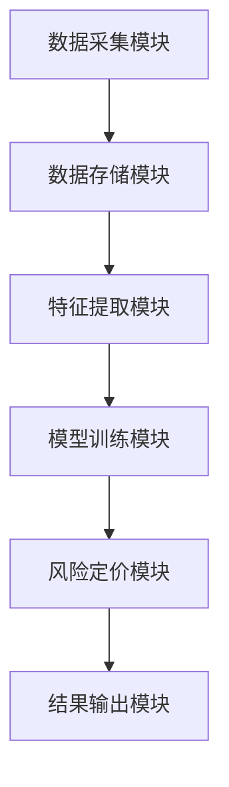

                 


# 设计智能化的企业信用风险定价模型

> 关键词：企业信用风险定价，智能化设计，机器学习，信用评分模型，风险定价模型

> 摘要：本文旨在探讨如何设计智能化的企业信用风险定价模型，通过结合传统金融模型与现代机器学习技术，提出一种高效的信用风险定价方法。文章首先介绍信用风险定价的背景与意义，分析传统模型的局限性；然后深入讲解智能化定价模型的核心概念、算法原理及系统架构；接着通过实际项目案例展示模型的实现与应用；最后总结经验，提出优化建议。

---

## 第1章 企业信用风险定价模型概述

### 1.1 信用风险定价的背景与意义

#### 1.1.1 信用风险的定义与分类

信用风险是指在信用交易中，由于交易对手无法履行其合同义务而导致损失的可能性。企业信用风险主要分为系统性风险和非系统性风险两类。系统性风险由市场整体波动引起，而非系统性风险则由企业自身的财务状况、管理能力等因素决定。

#### 1.1.2 信用风险定价的重要性

信用风险定价是金融风险管理的核心环节，准确的定价能够帮助金融机构合理评估风险，制定科学的信贷政策，从而提高资产质量，降低违约损失。

#### 1.1.3 智能化定价模型的必要性

随着金融市场数据的爆炸式增长，传统的基于统计分析的信用风险定价模型已难以满足实时性和精准性的要求。引入机器学习技术，构建智能化定价模型，能够显著提升模型的预测精度和适应性。

### 1.2 企业信用风险定价的核心问题

#### 1.2.1 信用评分的确定

信用评分是衡量企业信用状况的重要指标，通常基于财务数据、历史违约记录等信息。智能化模型可以通过机器学习算法自动提取特征，生成更精准的信用评分。

#### 1.2.2 风险敞口的评估

风险敞口是指金融机构因提供信贷而可能面临的损失。准确评估风险敞口有助于制定合理的风险规避策略。

#### 1.2.3 定价模型的构建与优化

定价模型需要综合考虑企业的信用评分、市场风险、宏观经济指标等多种因素。智能化模型通过动态调整权重和参数，实现更精确的定价。

### 1.3 传统信用风险定价模型的局限性

#### 1.3.1 传统模型的假设与缺陷

传统模型通常基于线性假设，难以捕捉非线性关系。此外，传统模型对数据的依赖性较强，且需要大量人工干预。

#### 1.3.2 数据依赖性与模型泛化能力

传统模型的泛化能力较弱，面对数据分布的变化难以有效适应。同时，传统模型对数据的预处理要求较高，增加了实施成本。

#### 1.3.3 人工干预的局限性

传统模型的调整和优化需要大量人工参与，效率较低，且容易受到主观因素的影响。

### 1.4 本章小结

本章从信用风险定价的背景和意义出发，分析了传统模型的局限性，为后续智能化模型的设计奠定了基础。

---

## 第2章 企业信用风险定价模型的核心概念与联系

### 2.1 核心概念原理

#### 2.1.1 信用评分模型

信用评分模型通过对企业财务数据、经营状况等多维度信息的分析，生成信用评分。常见的信用评分模型包括逻辑回归模型、决策树模型等。

#### 2.1.2 风险定价模型

风险定价模型基于信用评分，结合市场风险、宏观经济指标等因素，计算出具体的信贷产品定价。

#### 2.1.3 信用风险评估指标

信用风险评估指标包括违约概率（PD）、违约损失率（LGD）等，这些指标能够量化企业的信用风险程度。

### 2.2 核心概念属性特征对比表格

| 概念             | 属性               | 特征描述                                                                 |
|------------------|--------------------|--------------------------------------------------------------------------|
| 信用评分模型     | 数据来源           | 企业财务数据、历史违约数据                                           |
|                  | 方法               | 逻辑回归、决策树                                                     |
| 风险定价模型     | 数据来源           | 信用评分、市场风险数据                                               |
|                  | 方法               | 压力测试、蒙特卡洛模拟                                               |
| 信用风险评估指标 | 数据来源           | 企业信用历史、行业风险数据                                           |
|                  | 方法               | Z评分模型、KMV模型                                                   |

### 2.3 ER实体关系图

```mermaid
erd
    entity 企业 (id, name, industry, credit_score)
    entity 风险模型 (model_id, model_name, model_type)
    entity 风险评估结果 (result_id, enterprise_id, model_id, risk_score)
    relation 企业 -> 风险模型 : 使用
    relation 企业 -> 风险评估结果 : 生成
```

### 2.4 本章小结

本章通过对比分析信用评分模型、风险定价模型和信用风险评估指标的核心概念，明确了各模型之间的联系与区别。

---

## 第3章 企业信用风险定价模型的算法原理

### 3.1 算法原理概述

#### 3.1.1 信用评分模型的算法选择

常用的信用评分算法包括逻辑回归、决策树和随机森林等。逻辑回归适用于线性关系，决策树适用于复杂场景，随机森林则通过集成学习提高模型稳定性。

#### 3.1.2 风险定价模型的算法选择

风险定价模型通常采用支持向量机（SVM）、神经网络等算法，能够处理非线性关系，适合复杂的金融市场环境。

#### 3.1.3 混合模型的构建思路

混合模型通过将多种算法的优势相结合，提升模型的整体性能。例如，可以先使用决策树进行特征筛选，再用逻辑回归进行最终预测。

### 3.2 算法原理的数学模型与公式

#### 3.2.1 逻辑回归模型

$$ P(y=1|x) = \frac{1}{1 + e^{- (w \cdot x + b)}} $$

其中，$w$ 是权重向量，$b$ 是截距，$x$ 是输入特征向量。

#### 3.2.2 决策树模型

$$ entropy = -\sum p_i \log p_i $$

熵是用来衡量数据纯度的指标，决策树通过最小化熵来选择最优分割特征。

#### 3.2.3 支持向量机模型

$$ max \frac{1}{2} ||w||^2 $$
$$ s.t. y_i (w \cdot x_i + b) \geq 1, \forall i $$

支持向量机通过最大化几何间隔，找到最优超平面，实现数据的线性或非线性分类。

### 3.3 本章小结

本章详细介绍了信用评分模型和风险定价模型的主要算法及其数学原理，为后续模型构建提供了理论基础。

---

## 第4章 企业信用风险定价模型的系统架构设计

### 4.1 问题场景介绍

在企业信贷业务中，金融机构需要对企业的信用风险进行实时评估和定价。传统的定价模型难以应对海量数据和复杂场景的挑战，因此需要构建智能化的信用风险定价系统。

### 4.2 系统功能设计

#### 4.2.1 数据采集模块

数据采集模块负责从企业财务报表、央行征信系统等多渠道获取数据。

#### 4.2.2 模型训练模块

模型训练模块基于机器学习算法，对数据进行特征提取、模型训练和参数调优。

#### 4.2.3 风险定价模块

风险定价模块根据模型输出的信用评分和风险敞口，生成具体的信贷产品定价。

### 4.3 系统架构设计



### 4.4 本章小结

本章从系统架构的角度，详细设计了智能化信用风险定价系统的各个模块及其交互流程。

---

## 第5章 企业信用风险定价模型的项目实战

### 5.1 环境安装

需要安装Python、Scikit-learn、XGBoost等机器学习库，以及数据库连接工具。

### 5.2 系统核心实现源代码

```python
import pandas as pd
from sklearn.linear_model import LogisticRegression
from sklearn.tree import DecisionTreeClassifier
from sklearn.ensemble import RandomForestClassifier
from sklearn.metrics import accuracy_score

# 数据加载
data = pd.read_csv('credit_data.csv')

# 特征选择
features = data[['revenue', 'profit', 'debt', 'credit_history']]
target = data['credit_rating']

# 模型训练
model = RandomForestClassifier()
model.fit(features, target)

# 模型预测
predictions = model.predict(features)
print("准确率:", accuracy_score(target, predictions))
```

### 5.3 代码应用解读与分析

上述代码展示了如何使用随机森林算法进行信用评分预测。首先加载数据，选择特征，训练模型，最后进行预测并输出准确率。

### 5.4 实际案例分析和详细讲解剖析

以某企业为例，通过模型计算其信用评分和风险敞口，最终生成信贷产品定价建议。

### 5.5 项目小结

本章通过实际项目案例，展示了智能化信用风险定价模型的实现过程和应用效果。

---

## 第6章 总结与展望

### 6.1 最佳实践 tips

- 数据预处理是模型训练的关键，需仔细处理缺失值和异常值。
- 模型评估时，应结合准确率、召回率和F1分数等指标。
- 模型上线后，需定期更新数据和调整参数，保持模型性能。

### 6.2 小结

本文从理论到实践，详细探讨了智能化企业信用风险定价模型的设计与实现。通过结合传统金融模型与机器学习技术，提出了一种高效的风险定价方法。

### 6.3 注意事项

- 数据隐私和安全需严格保护，避免信息泄露。
- 模型的可解释性需考虑，以便于业务人员理解和应用。

### 6.4 拓展阅读

推荐阅读《机器学习实战》、《信用风险建模与管理》等书籍，深入学习相关知识。

---

# 结语

设计智能化的企业信用风险定价模型是一项复杂的系统工程，需要结合金融知识和机器学习技术。通过本文的探讨，希望能够为读者提供有价值的参考，帮助他们在实际工作中优化信用风险管理流程，降低风险敞口，提升资产质量。

