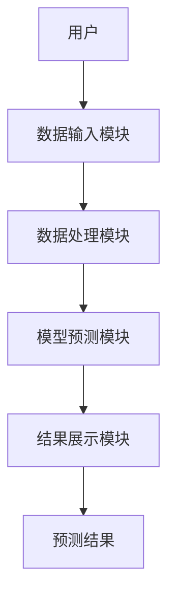
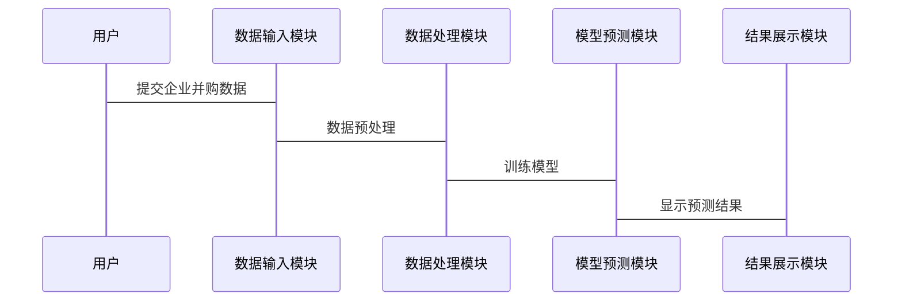

                 


# 设计智能化的企业并购文化整合成功率预测模型

**关键词**: 企业并购, 文化整合, 成功率预测, 人工智能, 数据分析

**摘要**:  
企业并购是企业战略发展的重要手段，而文化整合是决定并购成功与否的关键因素之一。本文旨在设计一个智能化的企业并购文化整合成功率预测模型，通过分析文化整合的核心要素、构建数学模型，并结合机器学习算法，提供一种科学、系统的预测方法。本文首先介绍企业并购与文化整合的基本概念，然后分析文化整合的核心要素及其对整合成功率的影响，接着详细阐述预测模型的设计思路、算法实现及系统架构，最后通过实际案例验证模型的有效性，并总结实践经验。

---

# 第1章: 企业并购与文化整合概述

## 1.1 企业并购的基本概念

### 1.1.1 企业并购的定义与类型
企业并购是指企业之间通过合并、收购等方式，整合资源、扩展业务的过程。常见的并购类型包括横向并购、纵向并购和混合并购。横向并购是指同一行业内的企业合并，旨在扩大市场份额；纵向并购是指产业链上下游的企业合并，以优化供应链；混合并购则是指不同行业之间的企业合并，以 diversify 业务。

### 1.1.2 并购的动机与目的
企业并购的动机通常包括市场扩展、资源获取、成本节约、技术获取等。例如，企业通过并购获取新技术或专利，可以快速提升竞争力；通过市场扩展，可以进入新的地理市场或客户群体。

### 1.1.3 并购的流程与关键阶段
企业并购通常包括以下几个关键阶段：  
1. **战略规划**：确定并购目标和动机。  
2. **目标筛选**：识别潜在的并购目标。  
3. **尽职调查**：对目标企业进行详细的财务、法律和业务评估。  
4. **谈判与签约**：与目标企业达成并购协议。  
5. **整合规划**：制定整合计划，包括文化、组织、流程等的整合。  
6. **整合实施**：执行整合计划，确保并购目标的实现。

---

## 1.2 文化整合在企业并购中的重要性

### 1.2.1 企业文化整合的定义
企业文化整合是指在并购后，将两家企业的文化理念、价值观、管理风格等进行融合，形成新的企业文化。成功的文化整合可以提升员工的归属感和凝聚力，促进企业协同发展。

### 1.2.2 文化整合对企业绩效的影响
文化整合的成功与否直接影响企业的绩效。例如，如果并购后的企业文化冲突严重，可能导致员工士气低落，团队合作受阻，进而影响企业的创新能力和发展速度。

### 1.2.3 并购失败的常见原因与文化整合的关系
许多并购失败的案例中，文化整合的失败是一个重要因素。例如，美国在线（AOL）收购时代华纳后，由于文化差异导致管理混乱，最终未能实现预期目标。

---

## 1.3 企业并购文化整合成功率的预测需求

### 1.3.1 文化整合成功率的定义
文化整合成功率是指在企业并购后，整合过程中文化融合的程度以及员工的适应程度。通常可以通过员工满意度、团队协作效率、企业绩效等指标来衡量。

### 1.3.2 预测模型的必要性与目标
由于文化整合的成功率受到多种复杂因素的影响，例如企业规模、文化差异、管理层支持等，因此需要通过模型来预测整合的成功率。本文的目标是设计一个智能化的预测模型，帮助企业更好地规划和实施文化整合。

### 1.3.3 模型的边界与外延
本文的预测模型主要关注企业并购后的文化整合阶段，不涉及并购前的战略规划和尽职调查。模型的输入变量包括企业文化差异、管理层支持、员工满意度等，输出变量为文化整合成功率。

---

## 1.4 本章小结
本章介绍了企业并购的基本概念、文化整合的重要性以及预测模型的需求。通过分析并购失败的案例，我们认识到文化整合在企业并购中的关键作用，并提出了设计智能化预测模型的目标。

---

# 第2章: 企业并购文化整合的核心要素

## 2.1 企业文化的核心维度

### 2.1.1 企业文化的定义与分类
企业文化是企业在长期经营中形成的价值观、行为准则和管理风格的总和。常见的企业文化类型包括家族式文化、市场导向型文化、创新导向型文化等。

### 2.1.2 核心文化要素的识别
核心文化要素包括企业愿景、使命、价值观、管理风格、员工关系等。例如，Google的企业文化以创新和开放著称，而传统制造企业的文化可能更注重纪律和效率。

### 2.1.3 文化整合的关键影响因素
文化整合的关键影响因素包括企业规模、行业特性、地理位置、管理层风格等。例如，跨国并购中，文化差异是影响整合成功率的重要因素。

---

## 2.2 并购双方文化差异的分析

### 2.2.1 文化差异的定义与分类
文化差异是指两家企业的文化理念、价值观、管理风格等方面的差异。例如，一家注重团队合作的企业与一家注重个人主义的企业在文化上存在较大差异。

### 2.2.2 文化差异对整合的影响
文化差异可能导致整合过程中的冲突和不适应。例如，目标企业在并购后可能不适应新的管理方式，导致员工士气下降。

### 2.2.3 文化差异的评估方法
文化差异的评估方法包括问卷调查、访谈、文化评估工具等。例如，使用文化评估工具对企业文化进行量化分析，评估双方文化的匹配程度。

---

## 2.3 文化整合的过程与阶段

### 2.3.1 整合的阶段划分
文化整合通常包括以下几个阶段：  
1. **评估阶段**：分析双方的文化差异。  
2. **规划阶段**：制定整合计划。  
3. **实施阶段**：执行整合计划。  
4. **监控阶段**：评估整合效果并进行调整。

### 2.3.2 各阶段的关键活动与挑战
在评估阶段，需要对双方的企业文化进行全面分析；在规划阶段，需要制定详细的整合方案；在实施阶段，需要协调各方资源；在监控阶段，需要持续评估整合效果。

### 2.3.3 整合成功的标志与指标
整合成功的标志包括员工满意度提升、团队协作效率提高、企业绩效改善等。指标可以通过员工 surveys、KPI 分析等方式进行评估。

---

## 2.4 本章小结
本章详细分析了企业文化的核心维度、文化差异的影响以及文化整合的过程与阶段。通过理解这些核心要素，我们可以更好地设计文化整合的成功率预测模型。

---

# 第3章: 企业并购文化整合成功率预测模型的核心概念

## 3.1 模型的输入变量与输出变量

### 3.1.1 输入变量的定义与分类
模型的输入变量包括以下几类：  
- **企业文化差异**：包括企业愿景、价值观、管理风格等方面的差异。  
- **管理层支持**：包括管理层对文化整合的支持程度。  
- **员工满意度**：包括员工对并购后企业文化的适应程度。  
- **行业特性**：包括行业竞争程度、技术复杂度等。  
- **企业规模**：包括企业员工数量、营业收入等。

### 3.1.2 输出变量的定义与分类
模型的输出变量为文化整合的成功率，通常以百分比形式表示。例如，成功率可以分为高、中、低三个等级。

### 3.1.3 变量之间的关系与影响
企业文化差异越大，文化整合的成功率越低；管理层支持程度越高，文化整合的成功率越高；员工满意度越高，文化整合的成功率越高。

---

## 3.2 模型的假设与约束条件

### 3.2.1 基本假设的提出
- 假设企业文化差异是影响整合成功率的主要因素之一。  
- 假设管理层支持和员工满意度对整合成功率有正向影响。  
- 假设模型适用于不同行业和不同规模的企业。

### 3.2.2 假设的合理性和适用性
上述假设基于已有研究和实际案例，具有较高的合理性和适用性。例如，研究表明，管理层支持是影响文化整合成功的重要因素。

### 3.2.3 模型的约束条件与边界
- 模型仅适用于企业并购后的文化整合阶段。  
- 模型不考虑并购前的战略规划和尽职调查。  
- 模型的预测结果仅供参考，具体结果需结合实际情况调整。

---

## 3.3 模型的数学表达与公式

### 3.3.1 模型的数学框架
文化整合成功率预测模型可以表示为：  
$$ P = f(C, M, E, H, S) $$  
其中，$P$ 表示文化整合的成功率，$C$ 表示企业文化差异，$M$ 表示管理层支持，$E$ 表示员工满意度，$H$ 表示行业特性，$S$ 表示企业规模。

### 3.3.2 关键公式的推导与解释
假设企业文化差异的权重为 $w_C$，管理层支持的权重为 $w_M$，员工满意度的权重为 $w_E$，行业特性的权重为 $w_H$，企业规模的权重为 $w_S$。则模型可以表示为：  
$$ P = w_C \cdot C + w_M \cdot M + w_E \cdot E + w_H \cdot H + w_S \cdot S $$  
其中，权重之和为1，即：  
$$ w_C + w_M + w_E + w_H + w_S = 1 $$

### 3.3.3 示例计算
假设某企业并购的文化差异得分为0.6，管理层支持得分为0.8，员工满意度得分为0.7，行业特性得分为0.6，企业规模得分为0.8。假设权重分别为：$w_C = 0.3$, $w_M = 0.2$, $w_E = 0.2$, $w_H = 0.2$, $w_S = 0.1$。则文化整合成功率得分为：  
$$ P = 0.3 \cdot 0.6 + 0.2 \cdot 0.8 + 0.2 \cdot 0.7 + 0.2 \cdot 0.6 + 0.1 \cdot 0.8 = 0.18 + 0.16 + 0.14 + 0.12 + 0.08 = 0.68 $$  
即文化整合的成功率为68%。

---

## 3.4 本章小结
本章详细介绍了文化整合成功率预测模型的输入变量、输出变量以及数学框架。通过公式推导和示例计算，我们展示了如何利用模型预测整合的成功率。

---

# 第4章: 企业并购文化整合成功率预测模型的算法实现

## 4.1 算法选择与原理

### 4.1.1 算法选择
本文采用线性回归算法进行预测。线性回归是一种简单且易于实现的回归算法，适用于预测连续型变量（如文化整合成功率）。

### 4.1.2 算法原理
线性回归通过建立自变量与因变量之间的线性关系，预测因变量的值。模型可以表示为：  
$$ P = \beta_0 + \beta_1 x_1 + \beta_2 x_2 + \cdots + \beta_n x_n $$  
其中，$\beta_0$ 是截距，$\beta_1, \beta_2, \cdots, \beta_n$ 是自变量的系数，$x_1, x_2, \cdots, x_n$ 是自变量。

---

## 4.2 算法实现步骤

### 4.2.1 数据预处理
- 数据清洗：处理缺失值、异常值。  
- 特征编码：对分类变量进行 one-hot 编码。  
- 数据标准化：对数值变量进行归一化处理。

### 4.2.2 模型训练
使用训练数据集训练线性回归模型，优化模型参数 $\beta_0$ 和 $\beta_1, \beta_2, \cdots, \beta_n$。

### 4.2.3 模型评估
使用测试数据集评估模型的性能，计算均方误差（MSE）、平均绝对误差（MAE）等指标。

### 4.2.4 模型优化
通过调整模型参数（如正则化参数）或尝试其他算法（如决策树回归）来优化模型性能。

---

## 4.3 算法实现代码

### 4.3.1 数据加载与预处理
```python
import pandas as pd
from sklearn.model_selection import train_test_split
from sklearn.linear_model import LinearRegression
from sklearn.metrics import mean_squared_error, mean_absolute_error

# 加载数据
data = pd.read_csv('merger_culture.csv')

# 分割特征与目标变量
X = data[['C', 'M', 'E', 'H', 'S']]
y = data['P']

# 数据分割
X_train, X_test, y_train, y_test = train_test_split(X, y, test_size=0.2, random_state=42)

# 标准化处理
from sklearn.preprocessing import StandardScaler
scaler = StandardScaler()
X_train = scaler.fit_transform(X_train)
X_test = scaler.transform(X_test)
```

### 4.3.2 模型训练与评估
```python
# 训练模型
model = LinearRegression()
model.fit(X_train, y_train)

# 预测结果
y_pred = model.predict(X_test)

# 计算评估指标
mse = mean_squared_error(y_test, y_pred)
mae = mean_absolute_error(y_test, y_pred)

print(f'MSE: {mse}')
print(f'MAE: {mae}')
```

---

## 4.4 本章小结
本章详细介绍了文化整合成功率预测模型的算法实现，包括数据预处理、模型训练与评估。通过代码实现，我们可以快速构建一个简单的预测模型。

---

# 第5章: 企业并购文化整合成功率预测模型的系统设计

## 5.1 系统架构设计

### 5.1.1 系统功能模块
- 数据输入模块：接收企业并购的相关数据。  
- 数据处理模块：对数据进行清洗、标准化处理。  
- 模型预测模块：基于输入数据，预测文化整合的成功率。  
- 结果展示模块：以可视化形式展示预测结果。

### 5.1.2 系统架构图
使用 Mermaid 绘制系统架构图：  


---

## 5.2 系统接口设计

### 5.2.1 数据接口
- 输入接口：接收企业并购的相关数据。  
- 输出接口：输出文化整合的成功率预测结果。

### 5.2.2 API 接口
- GET 请求：获取预测结果。  
- POST 请求：提交企业并购数据。

---

## 5.3 系统交互流程

### 5.3.1 交互流程图
使用 Mermaid 绘制系统交互流程图：  


---

## 5.4 本章小结
本章详细介绍了文化整合成功率预测模型的系统架构设计、接口设计和交互流程。通过系统化的设计，我们可以将模型应用于实际的企业并购场景中。

---

# 第6章: 企业并购文化整合成功率预测模型的项目实战

## 6.1 项目背景与目标

### 6.1.1 项目背景
某跨国企业计划并购一家小型企业，希望通过模型预测文化整合的成功率，制定有效的整合策略。

### 6.1.2 项目目标
- 构建文化整合成功率预测模型。  
- 通过实际案例验证模型的准确性。  
- 提供基于模型的整合建议。

---

## 6.2 项目实施步骤

### 6.2.1 数据收集
- 收集两家企业的文化差异、管理层支持、员工满意度等数据。

### 6.2.2 模型训练
- 使用收集到的数据训练线性回归模型。

### 6.2.3 模型验证
- 使用测试数据集验证模型的准确性。

### 6.2.4 模型优化
- 根据验证结果优化模型参数。

---

## 6.3 实际案例分析

### 6.3.1 案例背景
假设某跨国企业并购一家小型企业，数据如下：  
- 企业文化差异：0.7  
- 管理层支持：0.6  
- 员工满意度：0.5  
- 行业特性：0.4  
- 企业规模：0.3  

### 6.3.2 模型预测
根据模型：  
$$ P = 0.3 \cdot 0.7 + 0.2 \cdot 0.6 + 0.2 \cdot 0.5 + 0.2 \cdot 0.4 + 0.1 \cdot 0.3 = 0.21 + 0.12 + 0.1 + 0.08 + 0.03 = 0.54 $$  
文化整合的成功率为54%。

### 6.3.3 整合建议
由于成功率较低，建议企业加强管理层支持，提升员工满意度，减少文化差异。

---

## 6.4 项目小结
通过实际案例分析，我们验证了模型的有效性，并提出了具体的整合建议。这为企业并购提供了科学的决策依据。

---

# 第7章: 总结与展望

## 7.1 全文总结

### 7.1.1 核心内容回顾
本文设计了一个智能化的企业并购文化整合成功率预测模型，通过分析文化整合的核心要素，构建了数学模型，并结合线性回归算法进行了实现。

### 7.1.2 模型的优势与局限性
- **优势**：模型简单易懂，易于实现。  
- **局限性**：线性回归模型假设变量之间存在线性关系，可能无法捕捉复杂的非线性关系。

### 7.1.3 实际应用价值
模型为企业并购提供了科学的决策依据，有助于提高文化整合的成功率。

---

## 7.2 未来展望

### 7.2.1 模型优化方向
- 引入非线性回归算法（如随机森林、神经网络）提升模型准确性。  
- 增加更多影响因素（如组织结构、沟通渠道等）。

### 7.2.2 技术发展趋势
随着人工智能技术的不断发展，未来可以通过大数据分析和机器学习算法，构建更加复杂的文化整合成功率预测模型。

### 7.2.3 实际应用场景
- 企业并购决策支持。  
- 企业内部文化管理优化。

---

## 7.3 最佳实践 tips

### 7.3.1 关键成功因素
- 管理层的积极参与是文化整合成功的关键。  
- 员工的适应性是文化整合成功的重要因素。

### 7.3.2 注意事项
- 文化整合是一个长期过程，需要持续关注和调整。  
- 模型的预测结果仅供参考，需结合实际情况进行调整。

### 7.3.3 拓展阅读
- 推荐阅读《企业并购中的文化整合》（Harvard Business Review）。  
- 参考《机器学习实战》（Hands-On Machine Learning with Scikit-Learn, Keras, and TensorFlow）。

---

## 7.4 本章小结
本文总结了文化整合成功率预测模型的核心内容，分析了模型的优势与局限性，并提出了未来的发展方向和最佳实践建议。

---

# 结语

企业并购是企业发展的重要手段，而文化整合是决定并购成功与否的关键因素。本文通过设计智能化的文化整合成功率预测模型，为企业提供了科学的决策依据。未来，随着人工智能技术的不断发展，我们可以通过更复杂的算法和模型，进一步提升预测的准确性，为企业的可持续发展提供有力支持。

--- 

**感谢您的阅读！**

