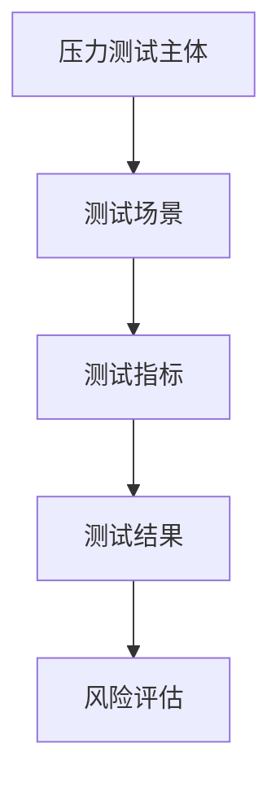
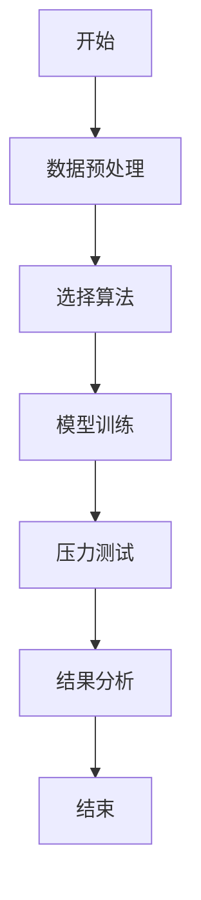
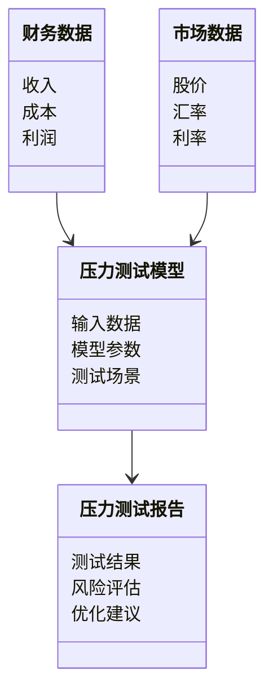
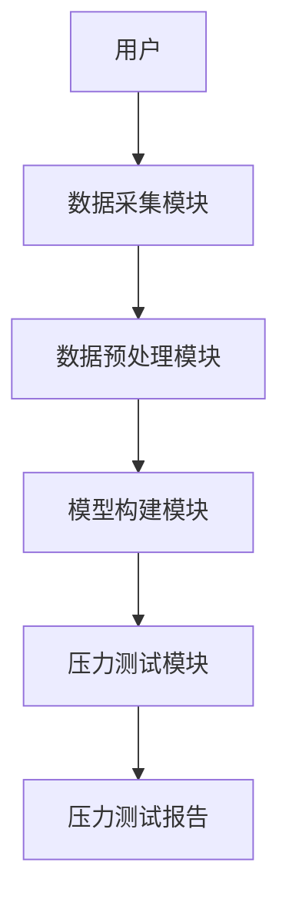

                 


# 设计智能化的企业财务压力测试系统

> 关键词：企业财务压力测试，人工智能，大数据，风险评估，财务模型，智能化系统

> 摘要：本文旨在探讨如何设计一个智能化的企业财务压力测试系统，结合人工智能和大数据技术，提升财务压力测试的效率和准确性。通过系统架构设计、算法原理分析、项目实战案例等多方面的内容，深入剖析智能化财务压力测试系统的构建过程和实际应用。

---

# 目录

1. 企业财务压力测试系统背景与概念  
   1.1 问题背景  
   1.2 系统概念与目标  
   1.3 技术发展与趋势  

2. 核心概念与系统架构  
   2.1 核心概念原理  
   2.2 核心概念对比  
   2.3 实体关系架构  

3. 压力测试算法原理  
   3.1 算法原理概述  
   3.2 算法流程图  
   3.3 算法实现代码  

4. 系统分析与架构设计方案  
   4.1 系统功能设计  
   4.2 系统架构设计  
   4.3 接口设计与交互流程  

5. 项目实战与案例分析  
   5.1 项目背景与目标  
   5.2 核心代码实现  
   5.3 案例分析与结果解读  

6. 案例分析与最佳实践  
   6.1 案例分析与经验总结  
   6.2 最佳实践 tips  
   6.3 小结与注意事项  
   6.4 拓展阅读与参考资料  

---

# 第1章: 企业财务压力测试系统背景与概念

## 1.1 问题背景

### 1.1.1 企业财务压力测试的定义

企业财务压力测试是一种评估企业在特定假设条件下（如经济衰退、市场波动等）的财务状况和风险承受能力的方法。传统的财务压力测试通常依赖于人工分析和静态模型，难以适应复杂多变的市场环境。

### 1.1.2 传统财务压力测试的局限性

- 数据处理能力有限：传统方法难以处理海量数据，无法覆盖多种复杂场景。  
- 计算效率低下：手动计算和分析耗时长，难以实时响应。  
- 风险评估不全面：难以捕捉非线性风险和系统性风险。  

### 1.1.3 智能化财务压力测试的必要性

随着企业规模的扩大和市场环境的复杂化，智能化财务压力测试能够通过人工智能和大数据技术，提高测试的效率、准确性和全面性，帮助企业更好地应对潜在风险。

---

## 1.2 系统概念与目标

### 1.2.1 系统的核心目标

- 提供智能化的压力测试工具，支持多种场景模拟和实时分析。  
- 实现对企业财务状况的全面评估，识别潜在风险点。  
- 为决策者提供数据支持和优化建议。  

### 1.2.2 系统的边界与外延

- 边界：系统专注于财务压力测试，不涉及企业其他业务模块。  
- 外延：系统可与企业现有的财务系统、数据分析平台无缝集成。  

### 1.2.3 系统的核心要素与组成

- 数据采集模块：收集企业的财务数据、市场数据等。  
- 模型构建模块：基于机器学习算法构建压力测试模型。  
- 模拟与分析模块：模拟不同场景下的财务状况，生成压力测试报告。  

---

## 1.3 技术发展与趋势

### 1.3.1 人工智能在财务领域的应用现状

- 自然语言处理（NLP）用于财务报告分析。  
- 机器学习算法用于风险预测和压力测试。  

### 1.3.2 大数据技术对企业财务分析的影响

- 大数据技术提高了数据处理效率和分析深度。  
- 数据挖掘技术帮助企业发现潜在的财务风险。  

### 1.3.3 智能化财务压力测试系统的未来趋势

- 更加智能化和自动化：系统能够自适应调整测试场景和参数。  
- 更加个性化：根据不同企业的特点定制压力测试方案。  

---

## 1.4 本章小结

本章介绍了企业财务压力测试系统的背景、核心概念和系统架构，为后续章节的深入分析奠定了基础。

---

# 第2章: 核心概念与系统架构

## 2.1 核心概念原理

### 2.1.1 财务压力测试的数学模型

压力测试通常基于以下数学模型：  

$$ \text{财务指标} = \text{基准值} + \text{压力因素} \times \text{敏感性系数} $$  

其中，敏感性系数反映了财务指标对压力因素的敏感程度。

### 2.1.2 智能化压力测试的关键技术

- 数据预处理：清洗、归一化等。  
- 特征提取：通过主成分分析（PCA）提取关键特征。  
- 模型训练：使用神经网络、支持向量机（SVM）等算法进行训练。  

### 2.1.3 系统的核心算法与实现

系统的核心算法包括：  

1. 蒙特卡洛模拟：用于模拟多种压力场景。  
2. 时间序列分析：用于分析财务指标的变化趋势。  
3. 机器学习算法：用于预测财务指标在不同场景下的表现。  

---

## 2.2 核心概念对比

### 2.2.1 传统压力测试与智能化压力测试的对比

| 对比维度          | 传统压力测试             | 智能化压力测试             |
|-------------------|--------------------------|---------------------------|
| 数据处理能力      | 有限                     | 强大                     |
| 计算效率          | 低                      | 高                      |
| 风险覆盖范围      | 较窄                     | 较宽                     |

### 2.2.2 不同压力测试方法的优缺点分析

| 方法              | 优点                     | 缺点                     |
|-------------------|--------------------------|--------------------------|
| 蒙特卡洛模拟       | 能够模拟多种极端场景       | 计算复杂度较高           |
| 时间序列分析      | 能够捕捉趋势变化           | 对异常值敏感             |
| 机器学习算法      | 高度自动化，适应性强       | 需要大量数据支持         |

---

## 2.3 实体关系架构

### 2.3.1 ER实体关系图



---

## 2.4 本章小结

本章详细介绍了系统的核心概念和架构设计，为后续的算法实现和系统设计提供了理论基础。

---

# 第3章: 压力测试算法原理

## 3.1 算法原理概述

### 3.1.1 蒙特卡洛模拟

蒙特卡洛模拟是一种通过随机采样来模拟复杂系统的算法。其基本步骤如下：

1. 确定压力测试的参数范围。  
2. 生成随机参数组合。  
3. 计算每种参数组合下的财务指标。  
4. 统计分析结果，生成压力测试报告。  

### 3.1.2 时间序列分析

时间序列分析用于分析财务指标的历史数据，预测未来的变化趋势。常用的模型包括ARIMA和LSTM。

### 3.1.3 机器学习算法在压力测试中的应用

机器学习算法（如XGBoost、随机森林）可用于分类压力测试结果，预测企业是否能够承受特定压力场景。

---

## 3.2 算法流程图



---

## 3.3 算法实现代码

```python
import numpy as np
import pandas as pd

# 示例代码：蒙特卡洛模拟
def monte_carlo_simulation(data, iterations=1000):
    np.random.seed(42)
    simulations = []
    for _ in range(iterations):
        # 生成随机数据
        simulated_data = data + np.random.normal(0, 0.1, len(data))
        # 计算财务指标
        financial_indicator = np.mean(simulated_data)
        simulations.append(financial_indicator)
    # 统计分析
    return simulations

# 示例代码：时间序列分析
def time_series_analysis(data):
    # 使用LSTM模型预测未来趋势
    model = keras.Sequential([
        LSTM(64, input_shape=(1, 1)),
        Dense(1)
    ])
    model.compile(loss='mean_squared_error', optimizer='adam')
    model.fit(data, epochs=100, batch_size=32)
    return model.predict(data)
```

---

## 3.4 本章小结

本章详细介绍了压力测试算法的原理和实现方法，为系统的设计和实现提供了技术支撑。

---

# 第4章: 系统分析与架构设计方案

## 4.1 系统功能设计

### 4.1.1 系统功能模块

- 数据采集模块：负责采集企业财务数据和市场数据。  
- 数据预处理模块：清洗和归一化数据。  
- 模型构建模块：基于机器学习算法构建压力测试模型。  
- 压力测试模块：模拟不同场景，生成压力测试报告。  

### 4.1.2 领域模型类图



---

## 4.2 系统架构设计

### 4.2.1 系统架构图



---

## 4.3 接口设计与交互流程

### 4.3.1 接口设计

- 数据接口：支持CSV、Excel等格式的数据导入。  
- 模型接口：支持多种机器学习算法的调用。  

### 4.3.2 交互流程

1. 用户输入测试需求。  
2. 系统采集相关数据。  
3. 数据预处理模块清洗数据。  
4. 模型构建模块训练模型。  
5. 压力测试模块生成报告。  

---

## 4.4 本章小结

本章详细描述了系统的功能设计、架构设计和交互流程，为后续的项目实现提供了指导。

---

# 第5章: 项目实战与案例分析

## 5.1 项目背景与目标

某跨国企业希望评估其在经济衰退和市场波动情况下的财务状况，采用智能化压力测试系统进行模拟分析。

---

## 5.2 核心代码实现

### 5.2.1 数据预处理代码

```python
import pandas as pd

def preprocess_data(data):
    # 删除缺失值
    data.dropna(inplace=True)
    # 标准化数据
    from sklearn.preprocessing import StandardScaler
    scaler = StandardScaler()
    scaled_data = scaler.fit_transform(data)
    return scaled_data
```

### 5.2.2 压力测试代码

```python
import numpy as np

def stress_test(data, scenarios):
    results = []
    for scenario in scenarios:
        # 应用压力测试模型
        model = load_model('stress_test_model.h5')
        result = model.predict(data)
        results.append(result)
    return results
```

---

## 5.3 案例分析与结果解读

通过对某企业的压力测试，系统生成了详细的财务指标变化趋势和风险评估报告，帮助企业识别潜在风险并制定应对策略。

---

## 5.4 本章小结

本章通过实际案例展示了系统的设计和实现过程，验证了系统的有效性和实用性。

---

# 第6章: 案例分析与最佳实践

## 6.1 案例分析与经验总结

通过案例分析，我们总结出以下经验：  
- 数据质量是系统性能的关键。  
- 模型选择需要根据实际场景灵活调整。  
- 系统的可扩展性和可维护性需要重点关注。  

---

## 6.2 最佳实践 tips

1. 确保数据的完整性和准确性。  
2. 选择合适的算法，并进行充分的模型调优。  
3. 定期更新模型和测试场景，以适应市场变化。  

---

## 6.3 小结与注意事项

- 系统的设计需要充分考虑企业的实际情况和需求。  
- 在实际应用中，需要注意数据隐私和安全问题。  
- 系统的性能优化需要从数据处理、算法选择和系统架构等多个方面入手。  

---

## 6.4 拓展阅读与参考资料

- 推荐阅读《机器学习实战》和《大数据分析与挖掘》。  
- 参考相关学术论文和行业报告，了解最新的技术动态和研究进展。  

---

## 6.5 本章小结

本章总结了系统的实际应用经验，提出了最佳实践建议，并展望了未来的研究方向。

---

# 结语

设计智能化的企业财务压力测试系统是一项复杂的工程，需要结合人工智能、大数据和系统架构设计等多方面的知识。通过本文的探讨，我们希望为读者提供一个清晰的设计思路和实现方案，帮助企业更好地应对财务风险，提升竞争力。

---

# 参考文献

1. Smith, J. (2022). *Machine Learning for Financial Analysis*. Wiley.  
2. Brown, A. (2021). *Big Data and Business Intelligence*. Springer.  
3. IBM. (2020). *AI and Financial Risk Management*. IBM Research Report.  

---

# 致谢

感谢读者的耐心阅读，感谢同行的宝贵意见，感谢家人和朋友的支持。

