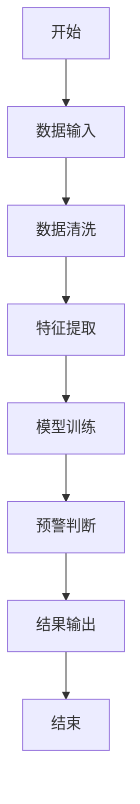
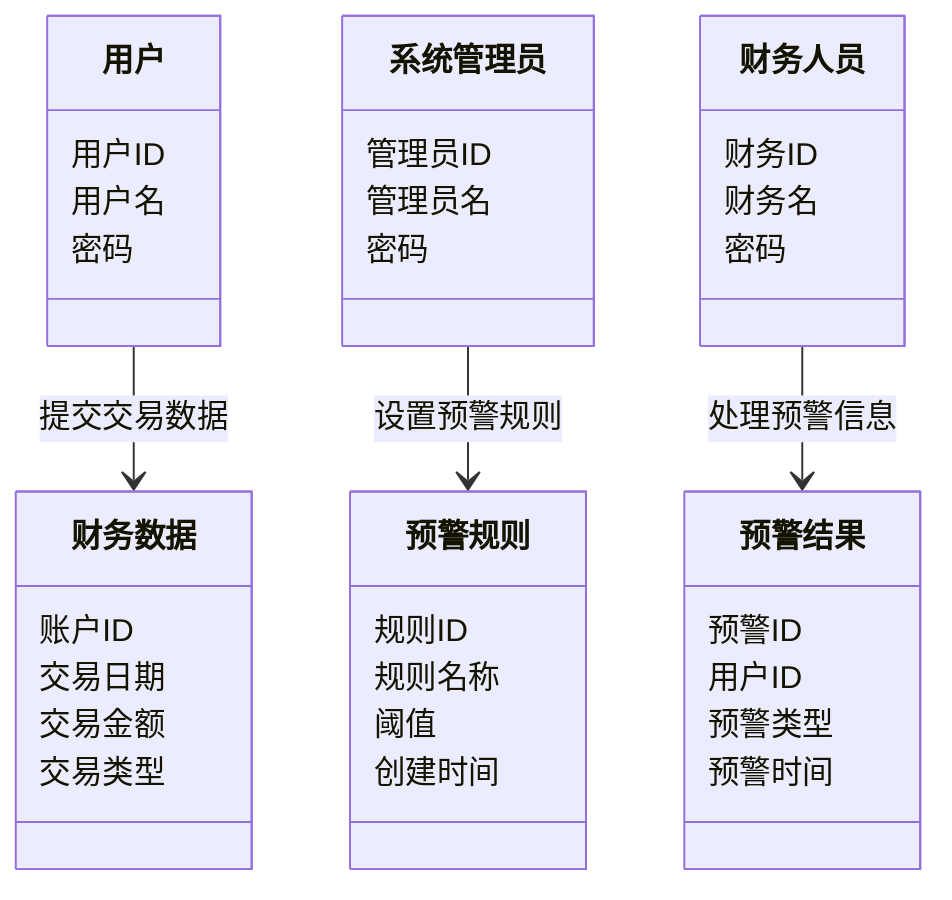
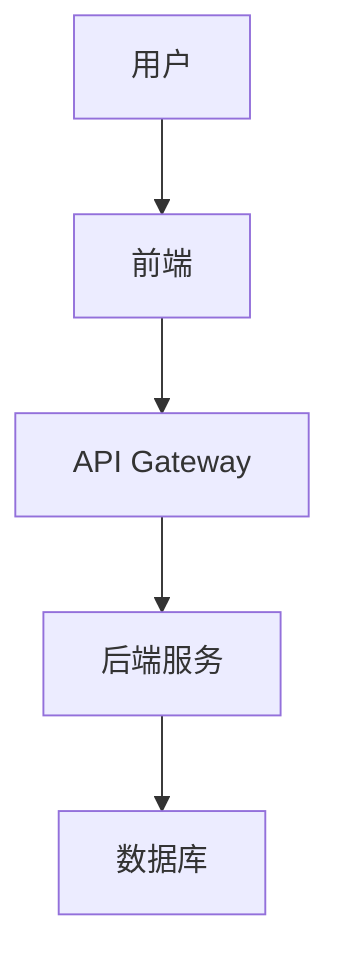
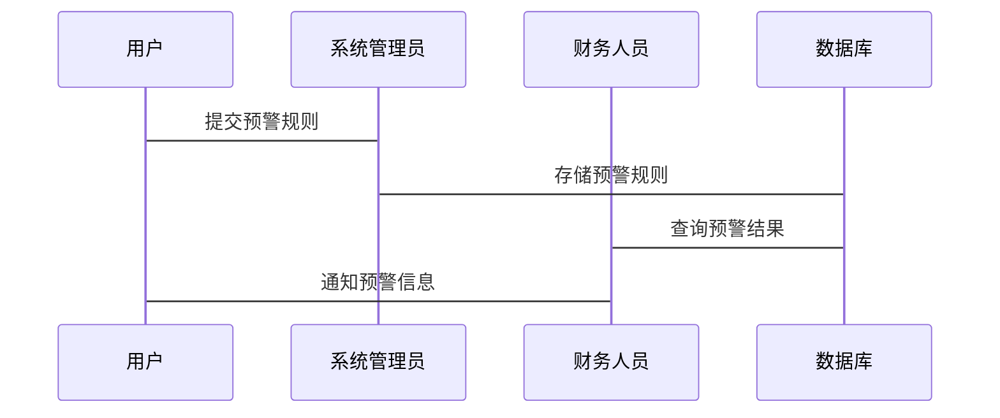

                 


# 设计智能化的企业财务压力预警系统

> 关键词：企业财务压力预警系统，智能化，财务风险，机器学习，数据挖掘，实时监控，预警机制

> 摘要：本文详细探讨了设计智能化企业财务压力预警系统的核心概念、算法原理、系统架构与设计方案，以及实际项目实现。通过分析财务压力的定义、表现及其对企业的影响，提出了一套基于机器学习和数据挖掘的智能化预警系统设计方案。文章结合实际案例，详细讲解了系统的实现过程，包括数据预处理、模型训练、预警规则设置等关键步骤，并给出了系统的架构设计和接口设计。最后，通过实战案例展示了系统的实际应用效果，并提出了系统的优化建议和未来发展方向。

---

# 第1章: 企业财务压力预警系统背景介绍

## 1.1 问题背景与描述
### 1.1.1 企业财务压力的定义与表现
- 企业财务压力是指企业在经营过程中由于资金链断裂、盈利能力下降、债务负担过重等原因，可能导致企业经营困难甚至破产的风险。
- 表现形式包括现金流紧张、应收账款 overdue、应付账款堆积、利润率下降等。

### 1.1.2 财务压力对企业经营的影响
- 直接威胁企业的生存和发展。
- 影响企业的信用评级，增加融资成本。
- 影响员工 morale 和企业稳定性。

### 1.1.3 智能化预警系统的需求与必要性
- 传统财务分析方法依赖人工经验，难以实时监控。
- 数据量大、维度多，需要自动化工具进行分析。
- 提前预警，为企业管理者提供决策支持。

## 1.2 问题解决与边界定义
### 1.2.1 财务压力预警的核心目标
- 实时监控企业财务健康状况。
- 提前预警潜在的财务风险。
- 提供优化建议，降低财务压力。

### 1.2.2 系统的边界与外延
- 系统仅关注财务相关数据，不涉及企业非财务信息。
- 预警范围包括现金流、利润、资产负债等方面。
- 支持多维度的数据分析和可视化。

### 1.2.3 核心要素与组成结构
- 数据源：财务报表、交易数据、市场数据。
- 预警模型：基于机器学习的分类算法。
- 用户界面：可视化 dashboard 和预警通知。

## 1.3 核心概念与联系
### 1.3.1 ER实体关系图
```mermaid
erDiagram
    用户 {
        用户ID
        用户名
        密码
    }
    系统管理员 {
        管理员ID
        管理员名
        密码
    }
    财务人员 {
        财务ID
        财务名
        密码
    }
    财务数据 {
        账户ID
        交易日期
        交易金额
        交易类型
    }
    预警规则 {
        规则ID
        规则名称
        阈值
        创建时间
    }
    预警结果 {
        预警ID
        用户ID
        预警类型
        预警时间
    }
    用户 --> 财务数据: 提交交易数据
    系统管理员 --> 预警规则: 设置预警规则
    财务人员 --> 预警结果: 处理预警信息
```

## 1.4 本章小结
本章详细介绍了企业财务压力预警系统的背景和核心概念，明确了系统的边界和核心要素，为后续的设计和实现奠定了基础。

---

# 第2章: 财务压力预警系统核心算法原理

## 2.1 算法原理与流程
### 2.1.1 数据预处理与特征提取
- 数据清洗：处理缺失值、异常值。
- 特征提取：提取关键财务指标，如流动比率、速动比率、负债率等。

### 2.1.2 预警模型构建
- 使用机器学习算法（如随机森林、XGBoost）进行分类模型训练。
- 数据分为训练集和测试集，进行模型评估。

### 2.1.3 预警结果输出
- 根据模型预测结果生成预警信息。
- 预警级别分为多个等级，如低、中、高风险。

## 2.2 算法流程图


## 2.3 数学模型与公式
### 2.3.1 数据标准化公式
$$ z = \frac{x - \mu}{\sigma} $$
其中，$\mu$ 是均值，$\sigma$ 是标准差。

### 2.3.2 预警评分公式
$$ S = \sum_{i=1}^{n} w_i x_i $$
其中，$w_i$ 是特征权重，$x_i$ 是特征值。

## 2.4 本章小结
本章详细介绍了财务压力预警系统的算法原理，包括数据预处理、模型构建和结果输出的流程，并通过数学公式解释了核心算法的实现方式。

---

# 第3章: 系统架构与设计方案

## 3.1 项目介绍与目标
### 3.1.1 项目背景
- 随着企业规模扩大，财务风险逐渐增加。
- 需要一个智能化的系统实时监控财务状况。

### 3.1.2 项目目标
- 实现实时财务数据分析。
- 提供多维度的财务风险预警。
- 支持用户自定义预警规则。

## 3.2 功能设计与实现
### 3.2.1 领域模型


### 3.2.2 系统架构设计


### 3.2.3 接口设计与交互


## 3.3 本章小结
本章详细介绍了系统的架构设计，包括功能模块划分、系统架构图和接口设计，为后续的系统实现提供了清晰的指导。

---

# 第4章: 项目实战

## 4.1 环境安装与配置
- 安装 Python、Jupyter Notebook、Pandas、Scikit-learn 等工具。
- 配置数据库（如 MySQL）和前端框架（如 React）。

## 4.2 核心代码实现
### 4.2.1 数据预处理
```python
import pandas as pd
# 读取数据
data = pd.read_csv('financial_data.csv')
# 数据清洗
data.dropna(inplace=True)
data = data[~data['amount'].isin([0])]
```

### 4.2.2 模型训练
```python
from sklearn.ensemble import RandomForestClassifier
model = RandomForestClassifier()
model.fit(X_train, y_train)
```

### 4.2.3 预警规则设置
```python
from sklearn.metrics import accuracy_score
y_pred = model.predict(X_test)
print(accuracy_score(y_test, y_pred))
```

## 4.3 案例分析与结果解读
- 通过实际数据测试模型，分析预警结果。
- 对比不同算法的预警效果，选择最优模型。

## 4.4 本章小结
本章通过实际项目展示了系统的实现过程，包括环境配置、代码实现和案例分析，验证了系统的可行性和有效性。

---

# 第5章: 最佳实践与小结

## 5.1 关键点总结
- 数据预处理是模型训练的基础。
- 选择合适的算法可以提高预警准确率。
- 系统架构设计要注重扩展性和可维护性。

## 5.2 注意事项
- 数据隐私和安全问题需高度重视。
- 预警规则要根据企业实际情况进行调整。
- 系统运行需定期维护和更新。

## 5.3 拓展阅读
- 深入学习机器学习算法。
- 研究实时数据分析技术。
- 探索多维度的财务分析方法。

## 5.4 本章小结
本章总结了设计智能化企业财务压力预警系统的关键点，提出了实际应用中的注意事项和未来研究方向。

---

# 结语

通过本文的详细讲解，读者可以系统地了解智能化企业财务压力预警系统的设计与实现过程。从背景分析到算法实现，从系统架构到项目实战，每一步都进行了深入的探讨。希望本文能为企业的财务风险管理提供有价值的参考和指导。

--- 

感谢您的耐心阅读，如果对本文内容有疑问或需要进一步探讨，请随时联系我！

