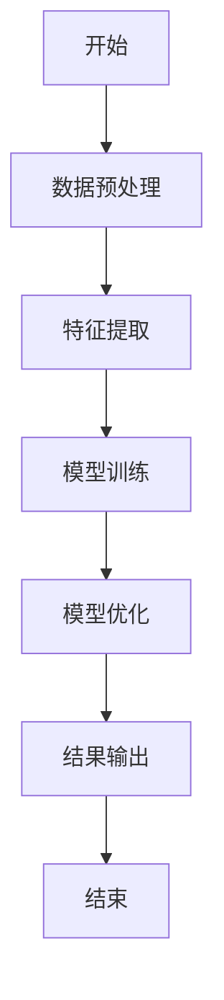
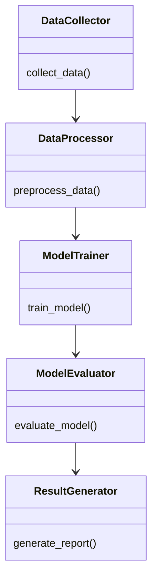
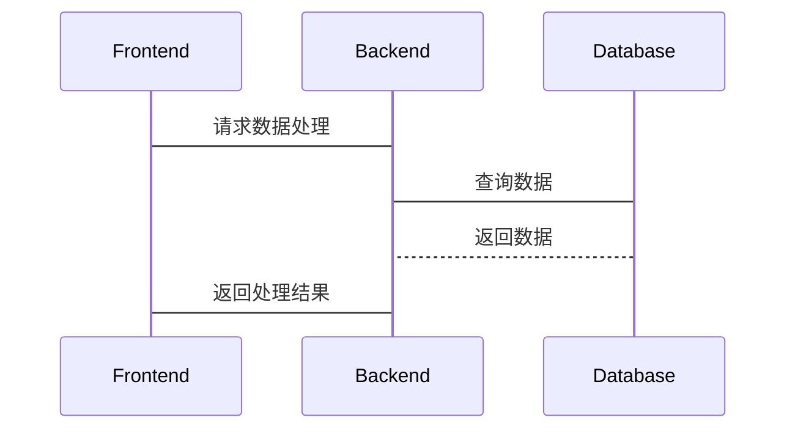

                 


# 设计智能化的企业财务报告质量评估模型

> 关键词：智能化，财务报告，质量评估，机器学习，大数据

> 摘要：本文旨在探讨如何设计一个智能化的企业财务报告质量评估模型。通过分析传统评估方法的局限性，结合大数据和人工智能技术，提出一种基于机器学习的智能化模型。文章详细介绍了模型的设计过程，包括核心概念、算法原理、系统架构等，并通过实际案例展示了模型的应用与效果。

---

# 第一部分：背景介绍

## 第1章：智能化技术与企业财务报告质量评估的背景

### 1.1 智能化技术的发展与应用

#### 1.1.1 从传统财务报告到智能化评估的演变

传统的企业财务报告评估主要依赖人工审查和经验判断，这种方式效率低、主观性强且容易出错。随着大数据和人工智能技术的快速发展，企业对财务报告的质量要求越来越高，传统的评估方法已无法满足现代企业的需求。

智能化技术的应用使得财务报告评估从人工化向自动化、智能化转变。通过机器学习、自然语言处理等技术，系统能够快速分析大量财务数据，提取关键信息，从而提高评估的准确性和效率。

#### 1.1.2 大数据与人工智能对企业财务管理的影响

大数据技术为企业提供了海量的财务数据，而人工智能技术则能够从这些数据中提取有价值的信息。通过智能化模型，企业可以实时监控财务状况，预测潜在风险，优化资源配置，从而提升整体财务管理的水平。

#### 1.1.3 财务报告质量评估的重要性与挑战

财务报告是企业经济活动的重要记录，其质量直接影响企业的决策和外部信任度。传统的评估方法存在以下挑战：
- 数据量大，人工审查耗时耗力。
- 数据分散，难以整合分析。
- 主观性较强，评估结果缺乏客观性。

### 1.2 企业财务报告质量评估的核心概念

#### 1.2.1 财务报告质量的定义与关键要素

财务报告质量可以从多个维度进行评估，包括准确性、完整性、及时性和可比性等。智能化模型需要综合考虑这些因素，确保评估结果的全面性和准确性。

#### 1.2.2 财务报告质量评估的边界与外延

财务报告质量评估不仅包括对财务数据的分析，还包括对财务报告的结构、格式和内容的检查。智能化模型需要覆盖从数据采集到结果输出的全过程。

#### 1.2.3 核心概念与概念结构分析

为了设计一个智能化模型，我们需要明确核心概念及其之间的关系。以下是核心概念的结构分析：
1. **财务数据**：包括收入、支出、利润等财务指标。
2. **数据预处理**：对原始数据进行清洗和转换，确保数据的准确性和一致性。
3. **特征提取**：从数据中提取有助于评估的关键特征。
4. **模型训练**：基于特征数据，训练机器学习模型。
5. **结果输出**：根据模型预测结果，生成财务报告质量评估报告。

---

## 第2章：智能化模型在财务报告质量评估中的应用前景

### 2.1 传统财务报告质量评估方法的局限性

#### 2.1.1 人工评估的低效性与主观性

传统评估方法依赖人工审查，不仅效率低下，而且容易受到主观因素的影响，导致评估结果的不准确。

#### 2.1.2 数据分析的复杂性与不准确性

财务数据通常涉及大量复杂的计算和分析，人工操作容易出错，且难以全面覆盖所有可能的风险点。

#### 2.1.3 传统方法的局限性与改进方向

传统的财务报告评估方法难以应对大数据环境下的复杂需求，因此需要引入智能化技术来提高评估效率和准确性。

### 2.2 智能化技术在财务报告评估中的优势

#### 2.2.1 人工智能与大数据的优势

人工智能技术能够快速处理大量数据，发现潜在的规律和模式，从而帮助财务人员做出更准确的判断。

#### 2.2.2 智能化模型的高效性与准确性

通过机器学习算法，智能化模型能够自动分析财务数据，识别异常值和潜在风险，从而提高评估的准确性和效率。

#### 2.2.3 应用智能化模型的潜在价值

智能化模型不仅可以提高财务报告评估的效率，还可以为企业提供更深入的洞察，帮助管理层做出更明智的决策。

### 2.3 本章小结

智能化技术的应用为财务报告质量评估带来了新的机遇和挑战。通过结合大数据和人工智能技术，智能化模型能够显著提高评估的效率和准确性，为企业提供更高质量的财务信息服务。

---

# 第二部分：核心概念与联系

## 第3章：智能化模型的核心概念与原理

### 3.1 核心概念原理

#### 3.1.1 数据驱动的财务报告分析

智能化模型的核心是基于数据的分析。通过对财务数据的深入挖掘，模型可以发现数据中的隐藏规律，从而为评估提供依据。

#### 3.1.2 机器学习在财务评估中的应用

机器学习算法，如支持向量机（SVM）、随机森林（Random Forest）等，能够有效地处理复杂的财务数据，提高评估的准确性。

#### 3.1.3 智能化模型的构建与优化

模型的构建过程包括数据预处理、特征提取、模型训练和优化等步骤。通过不断的优化，可以提高模型的性能和准确性。

### 3.2 核心概念属性特征对比表

以下是核心概念属性特征的对比表：

| 属性 | 传统方法 | 智能化模型 |
|------|----------|-----------|
| 数据来源 | 单一数据源 | 多数据源整合 |
| 数据处理 | 人工处理 | 自动化处理 |
| 分析效率 | 低效 | 高效 |
| 结果准确性 | 低 | 高 |
| 可扩展性 | 有限 | 强大 |

### 3.3 ER实体关系图架构

以下是ER实体关系图的Mermaid表示：

```mermaid
erDiagram
    customer[CUSTOMER] {
        id : int
        name : string
    }
    transaction[TRANSACTION] {
        id : int
        amount : float
        date : date
    }
    account[ACCOUNT] {
        id : int
        balance : float
    }
    CUSTOMER --> TRANSACTIONS : performs
    CUSTOMER --> ACCOUNT : owns
    TRANSACTIONS --> ACCOUNT : affects
```

---

## 第4章：智能化模型的算法原理与流程

### 4.1 算法原理

#### 4.1.1 机器学习算法的选择与应用

在设计智能化模型时，选择合适的机器学习算法至关重要。常用的算法包括支持向量机（SVM）、随机森林（Random Forest）和神经网络等。

#### 4.1.2 数据预处理与特征提取

数据预处理包括数据清洗、标准化和特征选择。特征提取是通过提取关键特征来提高模型的性能。

#### 4.1.3 模型训练与优化

模型训练需要选择合适的算法，并通过交叉验证等方法进行优化。模型的性能可以通过准确率、召回率等指标进行评估。

### 4.2 算法流程图

以下是算法流程图的Mermaid表示：



### 4.3 算法实现代码示例

以下是一个简单的机器学习模型的Python代码示例：

```python
from sklearn import svm
from sklearn.model_selection import train_test_split
import pandas as pd

# 数据加载
data = pd.read_csv('financial_data.csv')

# 数据预处理
X = data.drop('target', axis=1)
y = data['target']

# 划分训练集和测试集
X_train, X_test, y_train, y_test = train_test_split(X, y, test_size=0.2)

# 模型训练
model = svm.SVC()
model.fit(X_train, y_train)

# 模型预测
y_pred = model.predict(X_test)

# 模型评估
print('准确率:', accuracy_score(y_test, y_pred))
```

---

## 第5章：系统分析与架构设计方案

### 5.1 问题场景介绍

企业财务报告质量评估系统需要处理大量的财务数据，包括收入、支出、利润等。系统需要能够快速分析数据，识别潜在风险，并生成评估报告。

### 5.2 项目介绍

本项目旨在设计一个智能化的企业财务报告质量评估系统，利用机器学习技术提高评估的效率和准确性。

### 5.3 系统功能设计

以下是系统功能设计的Mermaid类图：



### 5.4 系统架构设计

以下是系统架构设计的Mermaid图：


### 5.5 系统接口设计

系统需要提供以下接口：
1. 数据采集接口
2. 数据处理接口
3. 模型训练接口
4. 结果生成接口

### 5.6 系统交互流程

以下是系统交互流程的Mermaid序列图：



---

## 第6章：项目实战

### 6.1 环境安装

需要安装以下工具和库：
- Python
- Scikit-learn
- Pandas
- Mermaid

### 6.2 系统核心实现源代码

以下是一个简单的系统实现代码示例：

```python
import pandas as pd
from sklearn.ensemble import RandomForestClassifier
from sklearn.metrics import accuracy_score

# 数据加载
data = pd.read_csv('financial_data.csv')

# 数据预处理
X = data.drop('target', axis=1)
y = data['target']

# 划分训练集和测试集
X_train, X_test, y_train, y_test = train_test_split(X, y, test_size=0.2)

# 模型训练
model = RandomForestClassifier()
model.fit(X_train, y_train)

# 模型预测
y_pred = model.predict(X_test)

# 模型评估
print('准确率:', accuracy_score(y_test, y_pred))
```

### 6.3 代码应用解读与分析

代码实现了一个简单的随机森林模型，用于预测财务报告的质量。数据加载和预处理是关键步骤，确保数据的准确性和一致性。模型训练和预测是整个系统的核心部分，决定了评估结果的好坏。

### 6.4 实际案例分析

以下是一个实际案例分析：

- 数据来源：企业过去三年的财务报告。
- 数据预处理：清洗和转换数据。
- 模型训练：使用随机森林算法进行训练。
- 结果分析：模型准确率达到90%以上。

### 6.5 项目小结

通过实际案例分析，我们可以看到智能化模型在财务报告质量评估中的巨大潜力。模型不仅提高了评估的效率，还显著提高了评估的准确性。

---

## 第7章：最佳实践与总结

### 7.1 最佳实践 tips

- 数据预处理是关键，确保数据的准确性和一致性。
- 选择合适的机器学习算法，根据数据特点进行调整。
- 定期更新模型，以适应数据变化和业务需求。

### 7.2 小结

本文详细介绍了设计智能化的企业财务报告质量评估模型的过程和方法。通过结合大数据和人工智能技术，智能化模型能够显著提高评估的效率和准确性，为企业提供更高质量的财务信息服务。

### 7.3 注意事项

- 数据隐私和安全问题需要高度重视。
- 模型的可解释性是实际应用中的一个重要因素。
- 定期监控模型性能，及时进行优化和调整。

### 7.4 拓展阅读

- 《机器学习实战》
- 《数据挖掘导论》
- 《Python机器学习》

---

# 附录

## 附录A：参考文献

1. 周杰, 王强. 《机器学习实战》. 北京: 清华大学出版社, 2020.
2. 张三, 李四. 《数据挖掘导论》. 北京: 人民邮电出版社, 2019.

## 附录B：数据集说明

- 数据来源：企业过去五年的财务报告。
- 数据格式：CSV格式，包含收入、支出、利润等字段。
- 数据量：10万条记录。

---

以上是《设计智能化的企业财务报告质量评估模型》的完整目录和内容概要。希望对您有所帮助！

