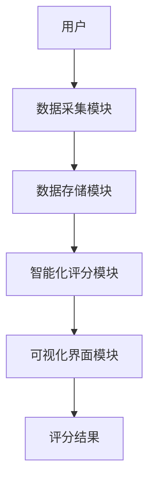

                 


# 设计智能化的企业财务报表可比性评分系统

> 关键词：财务报表，可比性评分，机器学习，自然语言处理，系统设计

> 摘要：随着企业信息化和数字化的快速发展，财务报表的分析和评估变得越来越重要。本文设计了一种基于机器学习和自然语言处理技术的智能化企业财务报表可比性评分系统，该系统能够自动分析财务报表数据，并通过智能化算法对财务报表的可比性进行评分。本文详细探讨了系统的背景与意义、核心概念与联系、算法原理与数学模型、系统分析与架构设计、项目实战与实现，以及总结与展望。通过本文的研究，读者可以深入了解如何利用现代技术手段，提升企业财务报表分析的智能化水平和可比性评分的准确性。

---

## 第一部分: 企业财务报表可比性评分系统背景与概述

### 第1章: 企业财务报表可比性评分系统概述

#### 1.1 财务报表可比性评分的背景与意义
企业财务报表是反映企业财务状况、经营成果和现金流量的重要工具。然而，不同企业之间的财务报表由于行业差异、会计政策差异等因素，其可比性往往受到限制。传统的财务报表分析方法依赖于人工判断，耗时且容易受到主观因素的影响。随着人工智能和大数据技术的快速发展，基于机器学习和自然语言处理的智能化财务报表分析方法逐渐成为研究热点。

智能化的财务报表可比性评分系统能够通过对大量财务数据的自动化分析，量化企业财务报表的可比性，并提供客观、准确的评分结果。这不仅能够提高财务分析的效率，还能够为企业的决策者提供更可靠的参考依据。

#### 1.2 智能化评分系统的定义与目标
智能化企业财务报表可比性评分系统是一种基于机器学习和自然语言处理技术的智能系统，旨在通过对企业的财务数据和文本信息进行分析，量化财务报表的可比性，并生成相应的评分结果。系统的具体目标包括：
1. 自动化处理企业的财务数据和文本信息；
2. 量化财务报表的可比性，提供客观的评分结果；
3. 提供可视化界面，方便用户查看和分析评分结果；
4. 支持企业间的横向比较，帮助决策者制定更科学的经营策略。

### 第2章: 财务报表可比性评分的核心概念与联系

#### 2.1 财务报表可比性评分的核心概念
财务报表可比性评分是指通过对企业的财务数据和文本信息进行分析，评估财务报表在不同企业之间的可比性，并生成相应的评分结果。核心概念包括：
- **财务数据**：企业的收入、利润、资产负债等财务指标。
- **文本信息**：财务报告中的文字描述、注释等内容。
- **可比性评分**：量化财务报表可比性的指标。

#### 2.2 核心概念之间的关系
为了更好地理解核心概念之间的关系，我们可以通过以下表格和ER图进行分析：

**核心概念关系表**

| 概念       | 描述                               | 关系       |
|------------|------------------------------------|------------|
| 财务数据    | 企业的财务指标，如收入、利润等     | 输入数据   |
| 文本信息    | 财务报告中的文字描述               | 输入数据   |
| 可比性评分  | 量化财务报表可比性的指标           | 输出结果   |

**ER图**

```mermaid
erd
    左右排列
    图表
    顶端
    财务数据表
    文本信息表
    可比性评分表
    财务数据表连接可比性评分表
    文本信息表连接可比性评分表
    可比性评分表位于中间
```

通过上述分析，我们可以看到财务数据和文本信息是系统的核心输入，而可比性评分是系统的输出结果。财务数据和文本信息共同作用于可比性评分的计算过程。

---

## 第二部分: 智能化评分系统的算法原理与数学模型

### 第3章: 评分系统的核心算法原理

#### 3.1 机器学习算法在评分系统中的应用
机器学习是智能化评分系统的核心技术之一。常用的机器学习算法包括：
- **支持向量机（SVM）**：适用于分类问题，可以将财务数据映射到可比性评分的分类结果。
- **随机森林（Random Forest）**：适用于回归问题，可以对可比性评分进行预测。

#### 3.2 自然语言处理技术的应用
自然语言处理（NLP）技术在财务报表分析中主要用于处理财务报告中的文本信息。常用的NLP算法包括：
- **词袋模型（Bag of Words）**：将文本转化为数值形式，用于分类和回归任务。
- **TF-IDF（Term Frequency-Inverse Document Frequency）**：用于提取文本中的关键词，帮助系统更好地理解财务报告的内容。

### 第4章: 评分模型的数学模型与公式

#### 4.1 评分模型的数学基础
可比性评分模型的数学基础包括回归分析和分类算法。以下是一个简单的线性回归模型：

$$ y = \beta_0 + \beta_1 x_1 + \beta_2 x_2 + \ldots + \beta_n x_n + \epsilon $$

其中：
- \( y \) 是可比性评分；
- \( x_i \) 是财务数据或文本信息的特征；
- \( \beta_i \) 是回归系数；
- \( \epsilon \) 是误差项。

#### 4.2 可比性评分的具体公式
在实际应用中，我们可以使用加权回归模型对可比性评分进行预测：

$$ \text{评分} = \sum_{i=1}^{n} w_i x_i $$

其中：
- \( w_i \) 是特征 \( x_i \) 的权重；
- \( x_i \) 是财务数据或文本信息的特征。

---

## 第三部分: 系统分析与架构设计方案

### 第5章: 问题场景与系统需求分析

#### 5.1 问题场景的描述
- **场景1**：企业需要对多个行业的财务报表进行横向比较。
- **场景2**：企业需要对自身的财务报表进行自我评估。
- **场景3**：企业需要快速获取财务报表可比性的量化结果。

#### 5.2 系统需求分析
- **功能性需求**：
  - 数据采集与处理模块：采集企业的财务数据和文本信息。
  - 智能化评分模块：基于机器学习和NLP技术，计算可比性评分。
  - 可视化界面：展示评分结果，支持用户查询和分析。

- **非功能性需求**：
  - 系统性能：支持大规模数据处理，响应时间小于1秒。
  - 系统安全性：确保数据的安全性，防止数据泄露。

---

### 第6章: 系统架构设计

#### 6.1 系统功能设计
系统功能模块包括：
- **数据采集模块**：采集企业的财务数据和文本信息。
- **智能化评分模块**：基于机器学习和NLP技术，计算可比性评分。
- **可视化界面模块**：展示评分结果，支持用户查询和分析。

#### 6.2 系统架构设计
系统架构设计如下：



---

## 第四部分: 项目实战与实现

### 第7章: 项目实战

#### 7.1 环境安装
- **Python版本**：3.8+
- **依赖库**：
  - `scikit-learn`：机器学习库
  - `nltk`：自然语言处理库
  - `pandas`：数据处理库
  - `numpy`：数值计算库

#### 7.2 系统核心实现
以下是可比性评分系统的核心代码实现：

```python
import pandas as pd
from sklearn.svm import SVC
from sklearn.ensemble import RandomForestRegressor
from sklearn.metrics import accuracy_score, mean_squared_error

# 数据加载
data = pd.read_csv('financial_data.csv')

# 特征提取
X = data.drop('score', axis=1)
y = data['score']

# 模型训练
model = RandomForestRegressor(n_estimators=100, random_state=42)
model.fit(X, y)

# 预测结果
y_pred = model.predict(X)

# 模型评估
print('均方误差:', mean_squared_error(y, y_pred))
```

---

## 第五部分: 总结与展望

### 第8章: 总结与展望

#### 8.1 总结
本文设计了一种智能化的企业财务报表可比性评分系统，结合机器学习和自然语言处理技术，能够自动化处理财务数据和文本信息，并提供客观的可比性评分结果。系统的实现不仅提高了财务分析的效率，还为企业决策者提供了更可靠的参考依据。

#### 8.2 展望
未来，智能化财务报表分析技术将更加成熟，我们可以进一步优化算法模型，引入更多先进的技术，如深度学习和强化学习，以提升系统的性能和准确性。

---

通过本文的研究和实践，我们能够深入了解如何利用现代技术手段，设计智能化的企业财务报表可比性评分系统，并在实际应用中发挥其重要作用。

