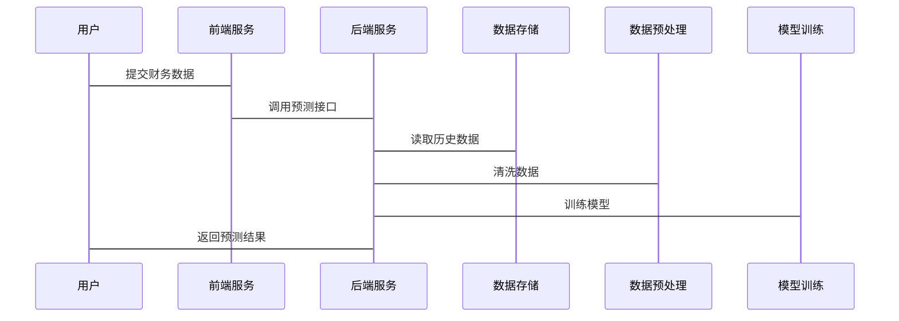

                 


# 设计智能化的企业财务报表预测模型

> 关键词：企业财务报表预测、人工智能、机器学习、深度学习、数学模型、系统架构

> 摘要：本文将探讨如何利用人工智能技术设计智能化的企业财务报表预测模型。通过分析传统财务预测方法的局限性，结合机器学习和深度学习的核心原理，构建基于数学模型的预测系统，并通过实际案例展示模型的实现与应用。本文旨在为企业提供一种高效、准确的财务预测解决方案，助力企业决策优化。

---

# 第一部分: 背景介绍与核心概念

## 第1章: 企业财务报表预测的背景与挑战

### 1.1 企业财务报表预测的重要性
#### 1.1.1 财务报表预测的核心作用
企业财务报表是反映企业经营状况的重要工具，准确的预测可以帮助企业在经营决策中提前规避风险、优化资源配置。传统财务预测方法依赖人工经验，存在主观性强、效率低下的问题。

#### 1.1.2 传统财务预测方法的局限性
传统财务预测方法通常基于简单的线性回归或专家经验，难以处理复杂的财务数据和非线性关系。此外，人工预测容易受到主观因素的影响，且效率较低。

#### 1.1.3 智能化预测的必要性与优势
智能化预测通过机器学习和深度学习技术，能够高效处理海量数据，发现数据中的复杂模式，显著提升预测的准确性和效率。

### 1.2 问题背景与目标
#### 1.2.1 财务数据的特点与挑战
财务数据通常具有时间序列特性，且受多种因素（如市场环境、行业趋势等）影响。数据中可能存在缺失值、异常值等问题，增加了预测的难度。

#### 1.2.2 智能化预测的目标与边界
目标：构建一个智能化的企业财务报表预测模型，能够自动学习历史数据，预测未来的财务指标（如收入、利润、资产等）。  
边界：明确模型的应用范围和限制，例如仅针对单个企业或特定行业的预测。

#### 1.2.3 问题解决的路径与方法
路径：数据采集与预处理 → 特征提取 → 模型训练与优化 → 预测与评估。  
方法：采用机器学习和深度学习算法，结合数学模型进行预测。

### 1.3 核心概念与联系
#### 1.3.1 核心概念的定义与属性
- **财务数据**：企业的收入、利润、资产、负债等财务指标。  
- **模型参数**：算法中的权重、偏置等参数。  
- **预测结果**：模型输出的预测值及其置信度。

#### 1.3.2 核心概念的ER实体关系图
```mermaid
er
  entity 财务数据 {
    key: id
    属性: 收入, 利润, 资产, 负债
  }
  entity 模型参数 {
    key: id
    属性: 系数, 偏置, 模型类型
  }
  entity 预测结果 {
    key: id
    属性: 预测值, 精确度, 可靠度
  }
```

### 1.4 本章小结
本章介绍了企业财务报表预测的重要性和智能化预测的必要性，明确了问题的背景与目标，并通过ER图展示了核心概念之间的关系。

---

# 第二部分: 机器学习与深度学习的核心原理

## 第2章: 机器学习与深度学习的核心原理

### 2.1 机器学习的基本原理
#### 2.1.1 机器学习的定义与分类
- **定义**：机器学习是一种通过数据训练模型，使其能够从经验中学习并做出预测的技术。  
- **分类**：监督学习、无监督学习、强化学习。

#### 2.1.2 监督学习、无监督学习与强化学习的区别
| 学习类型 | 定义 | 应用场景 |
|----------|------|----------|
| 监督学习 | 基于带标签的数据进行训练，预测新的数据标签。 | 分类、回归（如财务预测）。 |
| 无监督学习 | 基于无标签数据进行聚类或特征提取。 | 市场细分、异常检测。 |
| 强化学习 | 基于奖励机制，通过试错优化策略。 | 游戏AI、机器人控制。 |

#### 2.1.3 机器学习的核心算法与流程
- **算法**：线性回归、支持向量机（SVM）、随机森林等。  
- **流程**：数据预处理 → 特征工程 → 模型训练 → 模型评估 → 模型优化。

### 2.2 深度学习的核心原理
#### 2.2.1 神经网络的定义与结构
- **定义**：深度学习是通过多层神经网络模拟人脑的处理方式，提取数据中的高层次特征。  
- **结构**：输入层 → 隐藏层（卷积层、全连接层） → 输出层。

#### 2.2.2 卷积神经网络与循环神经网络的区别
| 网络类型 | 定义 | 应用场景 |
|----------|------|----------|
| 卷积神经网络（CNN） | 基于局部感知和权值共享，适合处理图像、时间序列数据。 | 图像识别、时间序列预测。 |
| 循环神经网络（RNN） | 基于序列数据，适合处理序列数据中的依赖关系。 | 自然语言处理、时间序列预测。 |

#### 2.2.3 深度学习在财务预测中的应用
- **应用**：利用LSTM（长短期记忆网络）处理时间序列数据，预测企业的收入和利润。

### 2.3 算法原理与流程图
#### 2.3.1 算法选择与流程设计


### 2.4 本章小结
本章介绍了机器学习和深度学习的基本原理，重点讲解了常用算法及其在财务预测中的应用，并通过流程图展示了算法选择与流程设计。

---

# 第三部分: 算法原理与数学模型

## 第3章: 算法原理与数学模型

### 3.1 线性回归模型
#### 3.1.1 线性回归的定义与公式
- **定义**：线性回归是一种简单且常用的回归分析方法，用于预测连续型变量。  
- **公式**：
  $$ y = \beta_0 + \beta_1x + \epsilon $$
  其中，$\beta_0$ 是截距，$\beta_1$ 是斜率，$\epsilon$ 是误差项。

#### 3.1.2 线性回归的假设与验证
- **假设**：线性性、独立性、正态性、同方差性。  
- **验证**：通过残差分析、Durbin-Watson检验等方法验证假设。

#### 3.1.3 线性回归的优缺点
- **优点**：简单、易于解释。  
- **缺点**：只能处理线性关系，对非线性数据表现不佳。

### 3.2 支持向量机模型
#### 3.2.1 支持向量机的定义与公式
- **定义**：支持向量机是一种监督学习算法，用于分类和回归问题。  
- **公式**：
  $$ \text{max} \frac{1}{2}\|w\|^2 $$
  $$ \text{subject to } y_i(w \cdot x_i + b) \geq 1 $$

#### 3.2.2 支持向量机的核函数与应用
- **核函数**：将低维数据映射到高维空间，解决非线性问题。  
- **应用**：用于企业信用评级、财务数据分类。

### 3.3 随机森林模型
#### 3.3.1 随机森林的定义与原理
- **定义**：随机森林是一种基于决策树的集成学习方法，通过随机采样和特征选择提高模型的泛化能力。  
- **原理**：构建多棵决策树，通过投票或平均的方式进行预测。

#### 3.3.2 随机森林的优势与应用
- **优势**：能够处理高维数据，抗过拟合能力强。  
- **应用**：用于企业财务风险评估、市场趋势预测。

### 3.4 算法选择与模型评估指标
#### 3.4.1 模型评估指标
- **均方误差（MSE）**：$$ \text{MSE} = \frac{1}{n}\sum_{i=1}^{n}(y_i - \hat{y}_i)^2 $$
- **决定系数（R²）**：$$ R^2 = 1 - \frac{\text{MSE}}{\text{SST}} $$
  其中，SST是总平方误差。

### 3.5 本章小结
本章详细讲解了线性回归、支持向量机和随机森林三种算法的原理与公式，并通过数学模型和公式展示了它们的应用与优缺点。

---

# 第四部分: 系统分析与架构设计方案

## 第4章: 系统分析与架构设计方案

### 4.1 问题场景介绍
- **目标**：构建一个智能化的企业财务报表预测系统。  
- **场景**：企业财务部门需要定期预测未来的收入、利润等财务指标，以便制定合理的经营计划。

### 4.2 项目介绍
#### 4.2.1 项目目标
- 实现企业财务数据的自动采集与预处理。  
- 构建基于机器学习的财务预测模型。  
- 提供直观的预测结果展示与分析。

### 4.3 系统功能设计
#### 4.3.1 领域模型（Mermaid 类图）


#### 4.3.2 系统架构设计（Mermaid 架构图）
```mermaid
docker
    service 前端服务 {
        API Gateway
    }
    service 后端服务 {
        财务数据预处理
        模型训练与预测
    }
    service 数据存储 {
        数据库
    }
```

#### 4.3.3 系统接口设计
- **输入接口**：接收企业的财务数据和预测参数。  
- **输出接口**：提供预测结果和模型评估指标。

#### 4.3.4 系统交互（Mermaid 序列图）


### 4.4 本章小结
本章通过系统架构设计和交互流程图，展示了智能化企业财务报表预测系统的整体结构与功能模块。

---

# 第五部分: 项目实战

## 第5章: 项目实战

### 5.1 环境安装与配置
#### 5.1.1 环境要求
- **Python**：3.6+  
- **库**：pandas、numpy、scikit-learn、xgboost、keras、tensorflow

#### 5.1.2 安装依赖
```bash
pip install pandas numpy scikit-learn xgboost keras tensorflow
```

### 5.2 核心实现
#### 5.2.1 数据预处理
```python
import pandas as pd
import numpy as np

# 数据加载
df = pd.read_csv('financial_data.csv')

# 数据清洗
df = df.dropna()
df = df.drop_duplicates()

# 特征提取
features = df[['收入', '资产', '负债']]
target = df['利润']
```

#### 5.2.2 模型训练与优化
```python
from sklearn.model_selection import train_test_split
from sklearn.ensemble import RandomForestRegressor
from sklearn.metrics import mean_squared_error

# 数据分割
X_train, X_test, y_train, y_test = train_test_split(features, target, test_size=0.2, random_state=42)

# 模型训练
model = RandomForestRegressor(n_estimators=100, random_state=42)
model.fit(X_train, y_train)

# 模型预测
y_pred = model.predict(X_test)

# 模型评估
mse = mean_squared_error(y_test, y_pred)
print(f'MSE: {mse}')
```

#### 5.2.3 模型优化与调参
```python
from sklearn.model_selection import GridSearchCV

# 调参
param_grid = {
    'n_estimators': [100, 200],
    'max_depth': [None, 10, 20],
    'min_samples_split': [2, 5]
}

grid_search = GridSearchCV(model, param_grid, cv=5, scoring='neg_mean_squared_error')
grid_search.fit(X_train, y_train)
best_model = grid_search.best_estimator_
print(f'最优参数：{grid_search.best_params_}')
```

### 5.3 项目小结
本章通过实际案例展示了如何利用Python和机器学习库构建企业财务报表预测模型，包括数据预处理、模型训练与优化等步骤。

---

# 第六部分: 最佳实践与总结

## 第6章: 最佳实践与总结

### 6.1 最佳实践
#### 6.1.1 数据预处理
- 确保数据的完整性和准确性。  
- 处理缺失值和异常值。

#### 6.1.2 模型选择与优化
- 根据数据特性选择合适的算法。  
- 通过交叉验证和调参优化模型性能。

#### 6.1.3 模型部署与维护
- 将模型部署到生产环境，提供API接口。  
- 定期更新模型，确保预测结果的准确性。

### 6.2 小结
智能化的企业财务报表预测模型能够显著提升预测的准确性和效率，为企业决策提供有力支持。

### 6.3 注意事项
- 数据隐私与安全问题。  
- 模型的可解释性问题。  
- 避免过拟合和欠拟合问题。

### 6.4 拓展阅读
- 《机器学习实战》  
- 《深度学习》  
- 《时间序列分析》

---

# 结语

通过本文的详细讲解，读者可以了解到如何利用人工智能技术设计智能化的企业财务报表预测模型，并通过实际案例掌握模型的实现与应用。未来，随着AI技术的不断发展，财务预测模型将更加智能化和精准化，为企业创造更大的价值。

