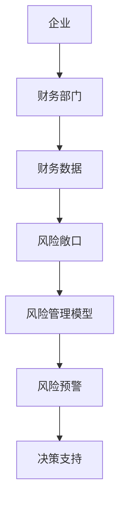
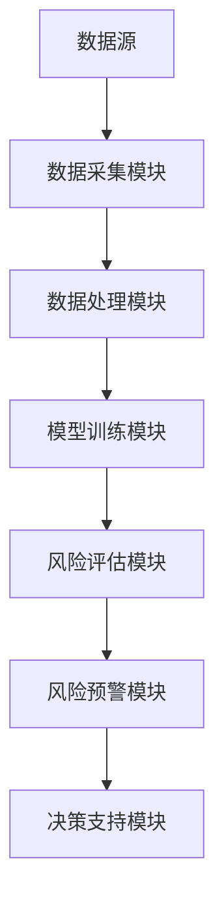
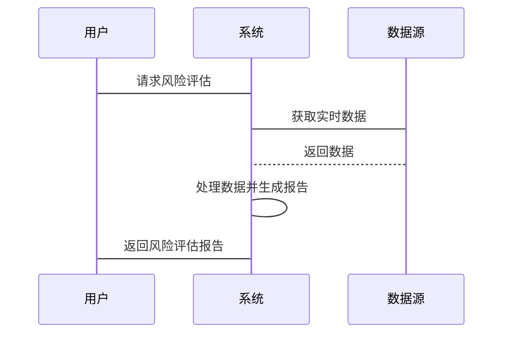

                 


# 设计智能化的企业财务风险敞口动态管理模型

**关键词：** 智能化、企业财务、风险敞口、动态管理模型、人工智能

**摘要：**  
本文旨在设计和实现一个智能化的企业财务风险敞口动态管理模型，结合先进的AI技术和大数据分析方法，为企业提供实时、动态的财务风险管理解决方案。通过详细分析财务风险敞口的核心概念、算法原理、系统架构及项目实战，本文将为企业财务管理的智能化转型提供理论支持和实践指导。

---

# 第一部分：企业财务风险敞口动态管理模型的背景与核心概念

## 第1章：企业财务风险敞口动态管理模型的背景与问题描述

### 1.1 企业财务风险敞口的定义与特征
#### 1.1.1 企业财务风险敞口的定义
企业的财务风险敞口是指企业在经营活动中因市场波动、经济环境变化或内部管理不善等因素而可能遭受的财务损失。它是企业风险管理和决策的重要指标。

#### 1.1.2 财务风险敞口的核心特征
- **可测量性**：可以通过财务指标量化。
- **动态性**：随市场和企业经营状况变化而变化。
- **可预测性**：通过模型和数据分析可以预测其变化趋势。

#### 1.1.3 财务风险敞口的分类与边界
- **分类**：包括市场风险、信用风险、流动性风险等。
- **边界**：企业财务风险敞口的管理范围通常包括资产负债表、损益表和现金流量表中的关键指标。

### 1.2 动态管理模型的必要性
#### 1.2.1 传统财务风险管理的局限性
- 传统方法依赖静态数据和固定模型，无法实时捕捉市场变化。
- 缺乏对复杂市场环境的适应能力，难以应对突发事件。

#### 1.2.2 动态管理模型的优势
- 实时更新：能够根据市场变化动态调整风险敞口。
- 数据驱动：基于实时数据和历史数据，提供精准的风险评估。
- 自适应性：模型可以根据企业经营状况自动优化。

#### 1.2.3 企业智能化管理的需求
- 随着数字化转型的推进，企业需要更高效的管理工具。
- AI和大数据技术为财务风险管理提供了新的可能性。

### 1.3 智能化技术在财务风险管理中的应用
#### 1.3.1 AI与大数据在财务风险管理中的作用
- 数据挖掘：从海量数据中提取关键特征。
- 模型预测：利用机器学习算法预测风险敞口的变化。
- 实时监控：通过AI技术实现对财务风险的实时预警。

#### 1.3.2 智能化财务风险管理的现状
- 当前，许多企业已经开始尝试将AI技术应用于财务风险管理。
- 但仍存在数据不足、模型不够精准等问题。

#### 1.3.3 智能化财务风险管理的未来趋势
- 更加智能化：AI和自动化技术将进一步普及。
- 更加数据化：基于大数据的分析将成为主流。
- 更加实时化：实时监控和预警能力将显著提升。

### 1.4 本章小结
本章介绍了企业财务风险敞口的定义、特征和分类，并分析了动态管理模型的必要性及智能化技术在其中的应用。接下来，将详细阐述模型的核心概念和算法原理。

---

## 第2章：企业财务风险敞口动态管理模型的核心概念与联系

### 2.1 核心概念的定义与属性特征
#### 2.1.1 财务风险敞口的属性特征对比
| 概念       | 定义                                                                 | 属性特征                         |
|------------|----------------------------------------------------------------------|----------------------------------|
| 风险敞口   | 企业因经营活动中产生的财务风险暴露程度                             | 可测量性、动态性、可预测性       |
| 智能化模型 | 基于AI和大数据的动态风险管理模型                                   | 数据驱动性、实时性、自适应性     |

#### 2.1.2 实体关系图


### 2.2 模型的核心要素
- **数据源**：包括财务数据、市场数据和行业数据。
- **模型算法**：包括时间序列分析、机器学习模型等。
- **风险评估**：通过模型输出风险评分和预警信号。
- **决策支持**：为管理层提供优化建议。

### 2.3 模型的输入与输出
- **输入**：财务数据、市场数据、历史数据。
- **输出**：风险敞口评分、风险预警、优化建议。

### 2.4 本章小结
本章详细阐述了企业财务风险敞口动态管理模型的核心概念及其属性特征，并通过实体关系图展示了模型的主要组成部分。接下来，将重点讲解模型的算法原理。

---

# 第二部分：企业财务风险敞口动态管理模型的算法原理

## 第3章：模型算法的设计与实现

### 3.1 时间序列分析
#### 3.1.1 ARIMA模型
- **定义**：ARIMA（自回归积分滑动平均模型）是一种广泛应用于时间序列预测的方法。
- **数学公式**：  
  $$ ARIMA(p, d, q) = y_t - \phi_1 y_{t-1} - \dots - \phi_p y_{t-p} = \theta_1 \epsilon_{t-1} + \dots + \theta_q \epsilon_{t-q} $$  
- **步骤**：
  1. 数据预处理：检查数据的平稳性。
  2. 参数估计：通过最大似然估计确定p、d、q。
  3. 模型验证：检验残差的正态性和独立性。
  4. 预测：基于模型进行未来值的预测。

#### 3.1.2 实际案例
```python
from statsmodels.tsa.arima_model import ARIMA
import pandas as pd

# 加载数据
data = pd.read_csv('financial_data.csv')

# 拆分训练集和测试集
train = data['revenue'][:80]
test = data['revenue'][80:]

# 模型训练
model = ARIMA(train, order=(5,1,0))
model_fit = model.fit()

# 预测
forecast = model_fit.forecast(steps=len(test))
print(forecast)
```

### 3.2 机器学习模型
#### 3.2.1 LSTM网络
- **定义**：长短期记忆网络（LSTM）是一种特殊的循环神经网络，适合处理时间序列数据。
- **结构**：
  - 输入门（Input Gate）
  - 遗忘门（Forget Gate）
  - 输出门（Output Gate）

#### 3.2.2 实际案例
```python
import numpy as np
from tensorflow.keras.models import Sequential
from tensorflow.keras.layers import LSTM, Dense

# 数据预处理
data = ...  # 时间序列数据
X = []
y = []
for i in range(len(data) - 1):
    X.append(data[i])
    y.append(data[i+1])

# 转换为张量
X = np.array(X).reshape(-1, 1, 1)
y = np.array(y).reshape(-1, 1)

# 模型训练
model = Sequential()
model.add(LSTM(4, input_shape=(1,1)))
model.add(Dense(1))
model.compile(optimizer='adam', loss='mse')
model.fit(X, y, epochs=50, batch_size=1)

# 预测
test_input = np.array([data[-1]]).reshape(-1,1,1)
prediction = model.predict(test_input)
print(prediction)
```

### 3.3 贝叶斯网络
#### 3.3.1 贝叶斯网络简介
- 贝叶斯网络是一种基于概率论的图形化模型，能够表示变量之间的依赖关系。

#### 3.3.2 实际案例
```python
import numpy as np
from sklearn.naive_bayes import GaussianNB

# 数据预处理
X = data[['revenue', 'profit', 'expenses']]
y = data['risk']

# 模型训练
model = GaussianNB()
model.fit(X, y)

# 预测
new_data = np.array([[1000000, 200000, 800000]])
prediction = model.predict(new_data)
print(prediction)
```

### 3.4 算法对比与优化
- **对比**：LSTM在时间序列预测中表现优于ARIMA，但计算复杂度较高。
- **优化**：结合多种算法进行集成预测，如将ARIMA和LSTM的结果进行加权平均。

### 3.5 本章小结
本章详细讲解了模型算法的设计与实现，包括时间序列分析、机器学习模型和贝叶斯网络的应用。接下来，将从系统架构的角度进一步分析模型的实现细节。

---

## 第4章：系统架构设计与实现

### 4.1 系统功能设计
- **数据采集**：从企业财务系统中获取实时数据。
- **数据处理**：清洗和预处理数据，提取特征。
- **模型训练**：基于历史数据训练模型。
- **风险评估**：实时评估风险敞口并生成预警。
- **决策支持**：为管理层提供优化建议。

### 4.2 系统架构设计


### 4.3 接口设计
- **数据接口**：与企业财务系统对接。
- **API接口**：提供给前端或其他系统调用。

### 4.4 交互流程图


### 4.5 本章小结
本章从系统架构的角度详细设计了模型的实现方案，并通过交互流程图展示了系统的运行流程。接下来，将通过一个具体项目实战来验证模型的有效性。

---

## 第5章：项目实战与优化

### 5.1 项目环境搭建
- **工具安装**：Python、TensorFlow、Keras、statsmodels。
- **数据获取**：从企业财务系统中获取历史数据。

### 5.2 核心代码实现
```python
import pandas as pd
from statsmodels.tsa.arima_model import ARIMA
from tensorflow.keras.models import Sequential
from tensorflow.keras.layers import LSTM, Dense

# 加载数据
data = pd.read_csv('financial_data.csv')

# 模型训练
model_arima = ARIMA(data['revenue'], order=(5,1,0)).fit()
model_lstm = Sequential()
model_lstm.add(LSTM(4, input_shape=(1,1)))
model_lstm.add(Dense(1))
model_lstm.compile(optimizer='adam', loss='mse')
model_lstm.fit(data[['revenue']], data['revenue'].shift(-1), epochs=50)

# 预测
forecast_arima = model_arima.forecast(10)
forecast_lstm = model_lstm.predict(data[['revenue']].values)
```

### 5.3 实际案例分析
- **案例背景**：某制造企业面临市场波动导致的财务风险。
- **数据分析**：通过模型预测未来10天的收入和风险敞口。
- **结果展示**：生成风险报告并提出优化建议。

### 5.4 项目优化
- **模型优化**：结合多种算法进行集成预测。
- **数据优化**：引入更多维度的数据，如行业趋势和宏观经济指标。

### 5.5 本章小结
本章通过一个具体项目实战验证了模型的有效性，并提出了优化建议。接下来，将总结项目的成果和经验。

---

## 第6章：最佳实践与未来展望

### 6.1 小结
- 本文设计了一个智能化的企业财务风险敞口动态管理模型，结合了多种AI算法和大数据分析技术。
- 通过系统架构设计和项目实战，验证了模型的有效性和实用性。

### 6.2 注意事项
- 数据质量：确保数据的准确性和完整性。
- 模型选择：根据实际情况选择合适的算法。
- 实时性：确保系统的实时性，满足企业的动态管理需求。

### 6.3 拓展阅读
- 推荐阅读相关书籍：《时间序列分析》、《机器学习实战》、《深度学习》。
- 关注行业动态，了解最新的AI技术在财务风险管理中的应用。

### 6.4 本章小结
本文总结了项目的成果和经验，并提出了未来的研究方向。智能化的企业财务风险管理模型将为企业提供更高效、更精准的管理工具，助力企业在复杂多变的市场环境中稳健发展。

---

# 结语

设计智能化的企业财务风险敞口动态管理模型是一项复杂的系统工程，需要结合先进的AI技术和深入的财务知识。通过本文的详细讲解和实战分析，读者可以掌握模型的设计方法和实现步骤，为企业财务管理的智能化转型提供有力支持。未来，随着技术的不断发展，智能化财务风险管理模型将更加精准和高效，为企业创造更大的价值。

