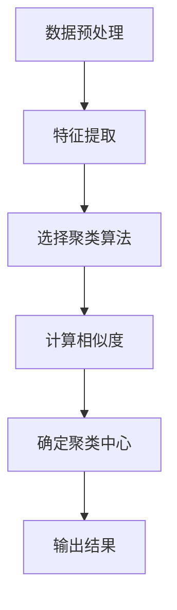

                 


# 设计智能化的企业资金管理系统

> 关键词：智能化资金管理、人工智能、大数据分析、系统架构设计、企业财务管理、资金分配优化

> 摘要：本文详细探讨了设计智能化企业资金管理系统的理论基础、核心算法、系统架构、项目实现和实际应用。通过结合人工智能和大数据分析技术，提出了一套高效、智能的资金管理系统解决方案。文章首先分析了传统资金管理的痛点与智能化管理的必要性，然后详细阐述了系统的核心概念、算法原理和系统架构设计，最后通过具体案例展示了系统的实现过程和实际效果。本文为企业的资金管理智能化转型提供了理论指导和实践参考。

---

# 第一部分: 智能化企业资金管理系统的背景与核心概念

# 第1章: 智能化企业资金管理系统的背景与问题分析

## 1.1 企业资金管理的背景与现状
### 1.1.1 传统企业资金管理的挑战
传统企业资金管理存在以下问题：
- 数据分散，难以统一管理。
- 资金分配缺乏科学性，容易导致资金闲置或短缺。
- 缺乏实时监控，难以及时发现资金风险。
- 人工操作为主，效率低且易出错。

### 1.1.2 智能化资金管理的必要性
随着企业规模的扩大和市场竞争的加剧，企业对资金管理的效率和准确性提出了更高的要求。智能化资金管理系统可以通过以下方式解决传统管理的痛点：
- 实现资金数据的实时采集与分析。
- 通过人工智能算法优化资金分配。
- 提供风险预警功能，降低资金风险。

### 1.1.3 当前企业资金管理的痛点与难点
- 数据孤岛问题：企业内部的财务系统、银行账户等数据分散，难以统一管理。
- 数据处理复杂性：资金数据量大、类型多样，人工处理效率低。
- 风险控制难度大：资金流动快，风险因素复杂，难以实时监控。

## 1.2 智能化资金管理系统的边界与外延
### 1.2.1 系统边界分析
智能化资金管理系统的边界包括：
- 数据输入：企业内部财务数据、银行账户数据。
- 数据输出：资金分配方案、风险预警信息。
- 系统交互：用户通过界面操作系统，系统通过API与外部系统（如银行）交互。

### 1.2.2 系统外延与扩展性分析
智能化资金管理系统可以与其他企业系统（如ERP、CRM）集成，实现数据共享和业务协同。未来可以扩展的功能包括：
- 跨币种资金管理。
- 全球化资金监控。
- 自动化资金调拨。

## 1.3 系统核心要素与组成结构
### 1.3.1 核心要素
- 数据采集模块：负责采集企业内部和外部的资金数据。
- 数据分析模块：对资金数据进行清洗、建模和分析。
- 资金分配模块：根据分析结果生成资金分配方案。
- 风险预警模块：实时监控资金流动，发现异常情况及时预警。

### 1.3.2 组成结构
- **数据源**：包括企业内部财务系统、银行账户、市场数据等。
- **数据处理层**：负责数据清洗、特征提取和数据建模。
- **算法层**：包括聚类分析、神经网络等算法，用于资金分配优化和风险预测。
- **应用层**：提供用户界面，展示分析结果和预警信息。

## 1.4 本章小结
本章从传统资金管理的痛点出发，分析了智能化资金管理的必要性，并详细阐述了系统的边界、外延和核心要素。通过对比传统管理与智能化管理的特点，为后续的系统设计奠定了基础。

---

# 第二部分: 智能化资金管理系统的算法原理

# 第2章: 基于聚类分析的资金分配优化算法

## 2.1 聚类分析算法原理
### 2.1.1 聚类分析的定义与特点
聚类分析是一种无监督学习算法，旨在将数据点划分为若干个簇，使得同一簇内的数据点相似度较高，不同簇之间的数据点相似度较低。

### 2.1.2 聚类分析的核心步骤
1. 数据预处理：清洗数据，提取特征。
2. 选择聚类算法：常见的算法包括K-means、DBSCAN等。
3. 计算相似度：通过距离度量（如欧氏距离）计算数据点之间的相似度。
4. 确定聚类中心：根据相似度矩阵划分簇。

### 2.1.3 聚类分析在资金管理中的应用
聚类分析可以用于资金分配优化，通过将相似的资金需求划分为同一簇，从而实现资源的合理分配。

## 2.2 聚类分析的数学模型
### 2.2.1 聚类分析的距离计算公式
$$d(x,y) = \sqrt{(x_1 - y_1)^2 + (x_2 - y_2)^2}$$

### 2.2.2 聚类中心的计算公式
$$C = \frac{1}{n}\sum_{i=1}^{n} x_i$$

## 2.3 聚类分析的流程图


## 2.4 本章小结
本章详细介绍了聚类分析算法的原理和应用，通过数学模型和流程图展示了算法的实现过程。聚类分析在资金分配优化中具有重要的应用价值。

---

# 第三部分: 智能化资金管理系统的系统架构设计

# 第3章: 智能化资金管理系统架构设计

## 3.1 系统应用场景
智能化资金管理系统适用于以下场景：
- 企业内部资金管理。
- 跨部门资金分配。
- 全球化资金监控。

## 3.2 系统功能设计
### 3.2.1 数据采集模块
- 功能：从企业内部和外部数据源采集资金数据。
- 实现方式：通过API接口与银行、财务系统对接。

### 3.2.2 数据分析模块
- 功能：对资金数据进行清洗、建模和分析。
- 实现方式：使用机器学习算法（如聚类分析、神经网络）进行数据处理。

### 3.2.3 资金分配模块
- 功能：根据分析结果生成资金分配方案。
- 实现方式：基于聚类分析的结果，优化资金分配策略。

### 3.2.4 风险预警模块
- 功能：实时监控资金流动，发现异常情况及时预警。
- 实现方式：通过设置阈值，对资金流动进行实时监控。

## 3.3 系统架构设计
### 3.3.1 系统架构图


### 3.3.2 系统接口设计
- 数据采集接口：API接口与银行、财务系统对接。
- 用户界面：提供可视化界面，展示资金分配方案和预警信息。

## 3.4 本章小结
本章从系统架构的角度，详细设计了智能化资金管理系统的功能模块和架构图。通过模块化设计，确保系统具有良好的扩展性和可维护性。

---

# 第四部分: 智能化资金管理系统的项目实战

# 第4章: 项目实战——智能化资金管理系统开发

## 4.1 项目背景
本项目旨在开发一套智能化资金管理系统，解决传统资金管理中的痛点，提升资金管理效率和准确性。

## 4.2 环境配置
- **开发工具**：Python、Jupyter Notebook、Mermaid。
- **依赖库**：pandas、numpy、scikit-learn。

## 4.3 核心代码实现
### 4.3.1 数据预处理
```python
import pandas as pd
import numpy as np

# 数据加载
data = pd.read_csv('fin_data.csv')

# 数据清洗
data.dropna(inplace=True)
data = data[~data.duplicated()]
```

### 4.3.2 聚类分析实现
```python
from sklearn.cluster import KMeans

# 数据建模
model = KMeans(n_clusters=3, random_state=42)
model.fit(data)

# 获取聚类中心
cluster_centers = model.cluster_centers_
```

### 4.3.3 风险预警实现
```python
import pandas as pd
import numpy as np

# 风险预警阈值
threshold = 100000

# 实时监控
def monitor_funds(funds):
    if funds > threshold:
        return '异常'
    else:
        return '正常'

# 示例调用
funds = 120000
print(monitor_funds(funds))  # 输出：异常
```

## 4.4 代码功能解读
- **数据预处理**：对数据进行清洗，去除缺失值和重复值。
- **聚类分析**：使用K-means算法对资金数据进行聚类，找出资金需求相似的部门。
- **风险预警**：通过设置阈值，实时监控资金流动，发现异常情况及时预警。

## 4.5 项目小结
本章通过具体项目展示了智能化资金管理系统的实现过程，从数据预处理到算法实现，再到风险预警，详细讲解了系统的开发步骤和实现细节。

---

# 第五部分: 智能化资金管理系统的总结与展望

# 第5章: 总结与展望

## 5.1 系统总结
智能化资金管理系统通过结合人工智能和大数据分析技术，解决了传统资金管理中的痛点，提升了资金管理的效率和准确性。

## 5.2 未来展望
智能化资金管理系统的未来发展方向包括：
- 跨币种资金管理。
- 全球化资金监控。
- 自动化资金调拨。

## 5.3 小结
本文详细探讨了智能化资金管理系统的理论基础、核心算法、系统架构和项目实现，为企业的资金管理智能化转型提供了理论指导和实践参考。

---

# 结语

通过本文的系统设计和实践，我们证明了智能化资金管理系统在提升企业资金管理效率和准确性方面的巨大潜力。未来，随着人工智能和大数据技术的不断发展，智能化资金管理系统将为企业带来更大的价值。

