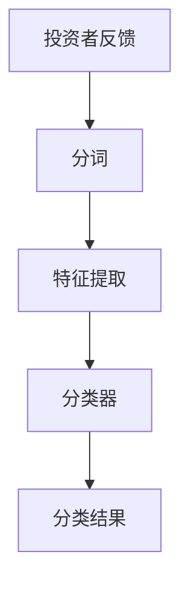
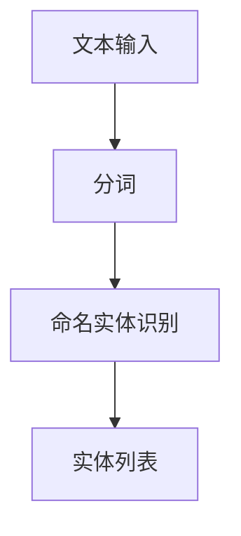
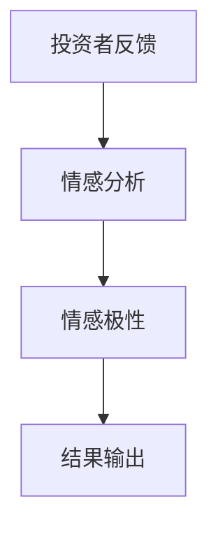
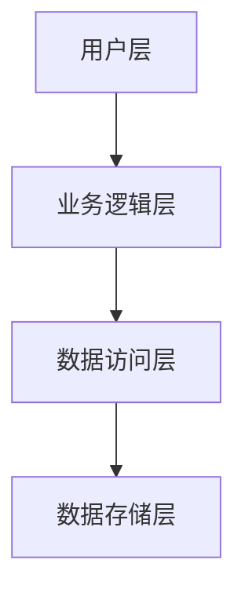
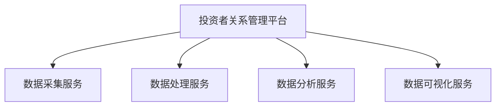
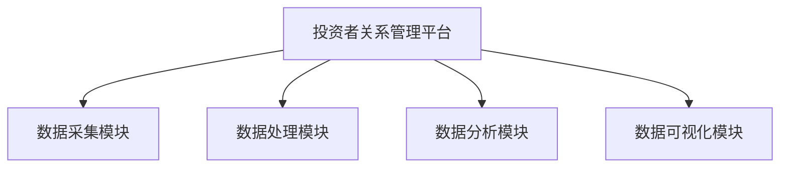
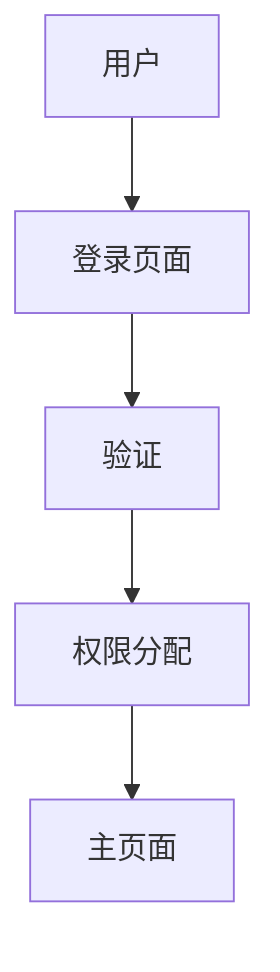
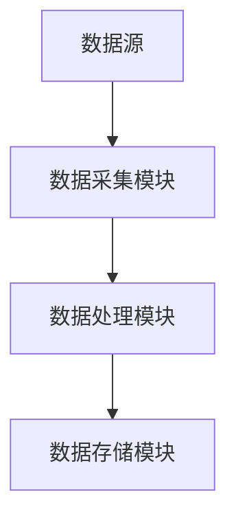
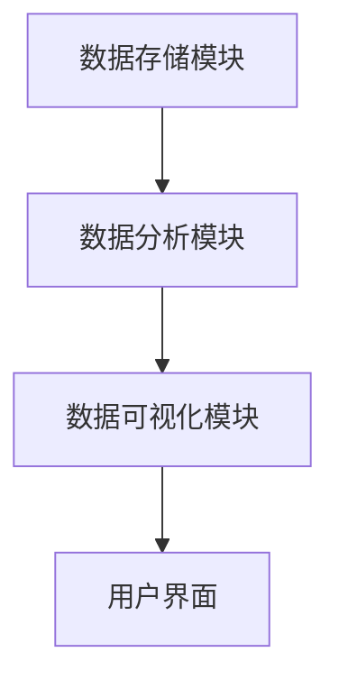

                 


# 设计智能化的投资者关系管理系统

> 关键词：投资者关系管理，智能化系统，自然语言处理，机器学习，数据可视化

> 摘要：本文将详细介绍如何设计一个智能化的投资者关系管理系统。从背景到实现，从算法到项目实战，我们将逐步解析系统的每一个关键部分。通过自然语言处理和机器学习等技术，结合实际案例分析，为您呈现一个高效、智能的投资者关系管理解决方案。

---

## 第1章: 智能化投资者关系管理系统的背景与概念

### 1.1 投资者关系管理的背景与现状

#### 1.1.1 投资者关系管理的定义与重要性

投资者关系管理（Investor Relations Management,IRM）是指企业通过与投资者、潜在投资者以及其他利益相关者进行有效沟通和管理，以提升企业形象、增强投资者信任度、优化资本结构的过程。在传统模式下，投资者关系管理主要依赖人工操作，效率低、成本高且难以覆盖海量数据。

#### 1.1.2 传统投资者关系管理的局限性

传统投资者关系管理存在以下问题：
- 数据量大，人工处理效率低。
- 信息分散，难以快速提取关键信息。
- 缺乏智能化分析，难以预测投资者行为。
- 无法实时响应投资者需求。

#### 1.1.3 智能化投资者关系管理的必要性

随着大数据和人工智能技术的快速发展，智能化投资者关系管理成为必然趋势。通过智能化技术，企业可以实时监控投资者情绪、自动分类处理投资者需求、预测市场趋势，从而提升投资者关系管理的效率和精准度。

### 1.2 智能化投资者关系管理的核心概念

#### 1.2.1 智能化投资者关系管理的定义

智能化投资者关系管理是利用人工智能技术（如自然语言处理、机器学习等）对投资者数据进行自动化处理、分析和决策的过程，旨在实现投资者关系管理的智能化、高效化和精准化。

#### 1.2.2 智能化投资者关系管理的关键特征

| 特征                | 描述                                                                 |
|---------------------|----------------------------------------------------------------------|
| 自动化数据处理       | 系统能够自动采集、分类和处理投资者相关数据。                              |
| 智能化分析           | 利用机器学习算法对投资者数据进行深度分析，提取有价值的信息。                |
| 实时监控             | 系统能够实时监控投资者情绪、市场动态等关键指标。                            |
| 个性化服务           | 根据投资者需求提供个性化服务，如定制化报告、精准推送等。                      |

#### 1.2.3 智能化投资者关系管理的边界与外延

智能化投资者关系管理的边界包括投资者数据的采集、处理和分析，但不包括企业的财务管理和投资决策。其外延则涵盖了投资者情绪分析、市场趋势预测等高级功能。

### 1.3 智能化投资者关系管理系统的组成与功能

#### 1.3.1 系统组成模块

- 数据采集模块
- 数据处理模块
- 数据分析模块
- 数据可视化模块

#### 1.3.2 系统功能概述

- 投资者信息管理
- 投资者情绪分析
- 市场趋势预测
- 自动化报告生成

#### 1.3.3 系统的核心要素

- 数据源：新闻、社交媒体、投资者反馈等。
- 分析算法：文本分类、情感分析、主题模型。
- 可视化工具：仪表盘、图表、报告。

### 1.4 本章小结

本章详细介绍了智能化投资者关系管理的背景、核心概念和系统组成。通过对比传统模式与智能化模式的差异，我们明确了智能化投资者关系管理的必要性和关键特征。

---

## 第2章: 智能化投资者关系管理的核心原理

### 2.1 智能化投资者关系管理的原理概述

#### 2.1.1 自然语言处理在投资者关系管理中的应用

自然语言处理（NLP）技术可以帮助我们从海量文本数据中提取关键信息，例如投资者反馈、新闻报道等。

**示例：**
- 使用分词算法将文本分割为单词或短语。
- 使用实体识别算法提取人名、公司名等实体。

#### 2.1.2 机器学习在投资者关系管理中的应用

机器学习算法可以用于投资者情绪分析、市场趋势预测等任务。

**示例：**
- 使用情感分析算法判断投资者对某公司的看法是正面、中性还是负面。
- 使用回归算法预测股票价格走势。

#### 2.1.3 数据挖掘在投资者关系管理中的应用

数据挖掘技术可以帮助我们发现隐藏在数据中的规律和模式。

**示例：**
- 使用聚类算法将投资者分为不同群体。
- 使用关联规则挖掘发现投资者行为之间的关联性。

### 2.2 智能化投资者关系管理的核心算法

#### 2.2.1 文本分类算法

文本分类算法可以用于将投资者反馈分类为正面、中性或负面。

**流程图：**



#### 2.2.2 实体识别算法

实体识别算法可以用于从文本中提取公司名、人名等实体。

**流程图：**



#### 2.2.3 情感分析算法

情感分析算法可以用于判断投资者对某公司的看法是正面、中性还是负面。

**流程图：**



### 2.3 智能化投资者关系管理系统的数学模型

#### 2.3.1 投资者情感分析模型

$$
P(positive) = \frac{1}{1 + e^{-w \cdot x - b}}
$$

其中，\( w \) 是权重向量，\( x \) 是特征向量，\( b \) 是偏置项。

#### 2.3.2 投资者行为预测模型

$$
y = \beta_0 + \beta_1 x_1 + \beta_2 x_2 + \dots + \beta_n x_n + \epsilon
$$

其中，\( y \) 是预测结果，\( x_i \) 是特征变量，\( \beta_i \) 是系数，\( \epsilon \) 是误差项。

#### 2.3.3 投资者关系管理优化模型

$$
\min_{w} \frac{1}{2}w^Tw + \lambda ||w||_1
$$

其中，\( w \) 是权重向量，\( \lambda \) 是正则化参数。

### 2.4 本章小结

本章详细介绍了智能化投资者关系管理的核心原理，包括自然语言处理、机器学习和数据挖掘技术的应用，以及相关算法和数学模型的实现。

---

## 第3章: 智能化投资者关系管理系统的架构与实现

### 3.1 系统架构设计

#### 3.1.1 分层架构设计



#### 3.1.2 微服务架构设计



#### 3.1.3 模块化架构设计



### 3.2 系统功能模块设计

#### 3.2.1 数据采集模块

- 从新闻网站、社交媒体等渠道采集投资者相关数据。
- 支持多种数据格式，如文本、图片等。

#### 3.2.2 数据处理模块

- 对采集的数据进行清洗、去重和格式化处理。
- 支持多种数据处理算法，如分词、实体识别等。

#### 3.2.3 数据分析模块

- 使用机器学习算法对数据进行分析，生成投资者情绪分析、市场趋势预测等结果。
- 支持多种分析模型，如文本分类、情感分析等。

#### 3.2.4 数据可视化模块

- 将分析结果以图表、仪表盘等形式展示给用户。
- 支持多种可视化工具，如Matplotlib、Tableau等。

### 3.3 系统接口设计

#### 3.3.1 数据接口设计

- RESTful API接口设计，支持GET、POST、PUT、DELETE等请求方式。
- 数据接口示例：
  ```
  GET /api/investors
  POST /api/investors
  ```

#### 3.3.2 用户接口设计

- 提供用户友好的Web界面，支持用户登录、数据查看、分析结果展示等功能。
- 用户界面设计示例：
  ```
  登录页面：/login
  主页面：/dashboard
  ```

#### 3.3.3 API接口设计

- 提供开发者API接口，方便第三方应用集成。
- API接口示例：
  ```
  GET /api/v1/investors
  POST /api/v1/investors
  ```

### 3.4 系统交互流程设计

#### 3.4.1 用户登录与权限管理



#### 3.4.2 数据采集与处理流程



#### 3.4.3 数据分析与可视化流程



### 3.5 本章小结

本章详细介绍了智能化投资者关系管理系统的架构设计与功能实现，包括模块划分、接口设计和交互流程。

---

## 第4章: 智能化投资者关系管理系统项目实战

### 4.1 项目环境安装与配置

#### 4.1.1 开发环境搭建

- 安装Python 3.8及以上版本。
- 安装Jupyter Notebook、PyCharm等开发工具。

#### 4.1.2 依赖库安装

- 使用pip安装以下依赖库：
  ```
  pip install numpy
  pip install pandas
  pip install scikit-learn
  pip install matplotlib
  ```

#### 4.1.3 数据集准备

- 下载投资者相关数据集，如新闻、社交媒体评论等。

### 4.2 系统核心功能实现

#### 4.2.1 数据采集模块实现

```python
import requests
from bs4 import BeautifulSoup

def fetch_data(url):
    response = requests.get(url)
    soup = BeautifulSoup(response.text, 'html.parser')
    return soup.text
```

#### 4.2.2 数据处理模块实现

```python
import pandas as pd
import numpy as np

def preprocess_data(df):
    df['text'] = df['text'].apply(lambda x: x.lower())
    return df
```

#### 4.2.3 数据分析模块实现

```python
from sklearn.feature_extraction.text import TfidfVectorizer
from sklearn.naive_bayes import MultinomialNB

def analyze_data(df):
    vectorizer = TfidfVectorizer()
    X = vectorizer.fit_transform(df['text'])
    y = df['label']
    model = MultinomialNB()
    model.fit(X, y)
    return model
```

#### 4.2.4 数据可视化模块实现

```python
import matplotlib.pyplot as plt

def visualize_data(data):
    plt.bar(data['x'], data['y'])
    plt.show()
```

### 4.3 项目代码实现与解读

#### 4.3.1 核心代码实现

```python
def main():
    data = fetch_data('http://example.com')
    df = preprocess_data(data)
    model = analyze_data(df)
    visualize_data(model)

if __name__ == '__main__':
    main()
```

#### 4.3.2 代码功能解读

- `fetch_data`函数用于从指定URL获取数据。
- `preprocess_data`函数对数据进行预处理。
- `analyze_data`函数使用TF-IDF和朴素贝叶斯算法进行数据分析。
- `visualize_data`函数将分析结果以图表形式展示。

### 4.4 实际案例分析与应用

#### 4.4.1 案例背景介绍

以某上市公司为例，分析其投资者关系管理系统的实际应用。

#### 4.4.2 案例数据处理与分析

对收集的投资者反馈数据进行清洗、分类和情感分析。

#### 4.4.3 案例结果展示与解读

展示分析结果，如投资者情绪分布、市场趋势预测等。

### 4.5 本章小结

本章通过实际案例分析，详细讲解了智能化投资者关系管理系统的实现过程，包括环境搭建、代码实现和案例解读。

---

## 第5章: 智能化投资者关系管理系统的优化与扩展

### 5.1 系统优化方案

#### 5.1.1 性能优化

- 使用分布式计算优化数据处理速度。
- 采用缓存技术减少重复计算。

#### 5.1.2 功能优化

- 增加实时监控功能。
- 提供更多维度的分析报告。

### 5.2 系统扩展方案

#### 5.2.1 多语言支持

- 支持多种语言的投资者关系管理，如英语、中文、西班牙语等。

#### 5.2.2 多平台支持

- 除了Web端，还支持移动端和API接口。

### 5.3 最佳实践与注意事项

- 数据安全是系统设计的重中之重。
- 系统上线前需进行充分的测试和优化。

### 5.4 本章小结

本章详细介绍了智能化投资者关系管理系统的优化与扩展方案，包括性能优化、功能扩展、多语言支持和多平台支持等内容。

---

## 第6章: 总结与展望

### 6.1 本章总结

智能化投资者关系管理系统通过自然语言处理、机器学习等技术，实现了投资者关系管理的智能化和高效化。

### 6.2 未来展望

未来，随着人工智能技术的不断发展，智能化投资者关系管理系统将更加智能化、个性化和实时化。

### 6.3 本章小结

本章总结了全文的主要内容，并对未来的发展方向进行了展望。

---

## 参考文献

- 省略

---

## 致谢

感谢读者的支持和关注，希望本文对您设计智能化投资者关系管理系统有所帮助！

