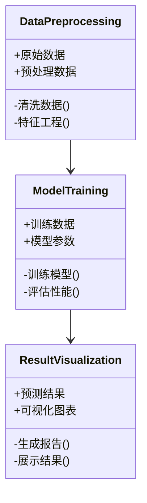
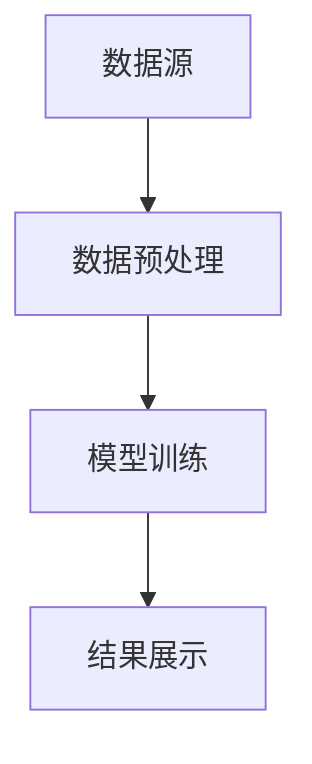
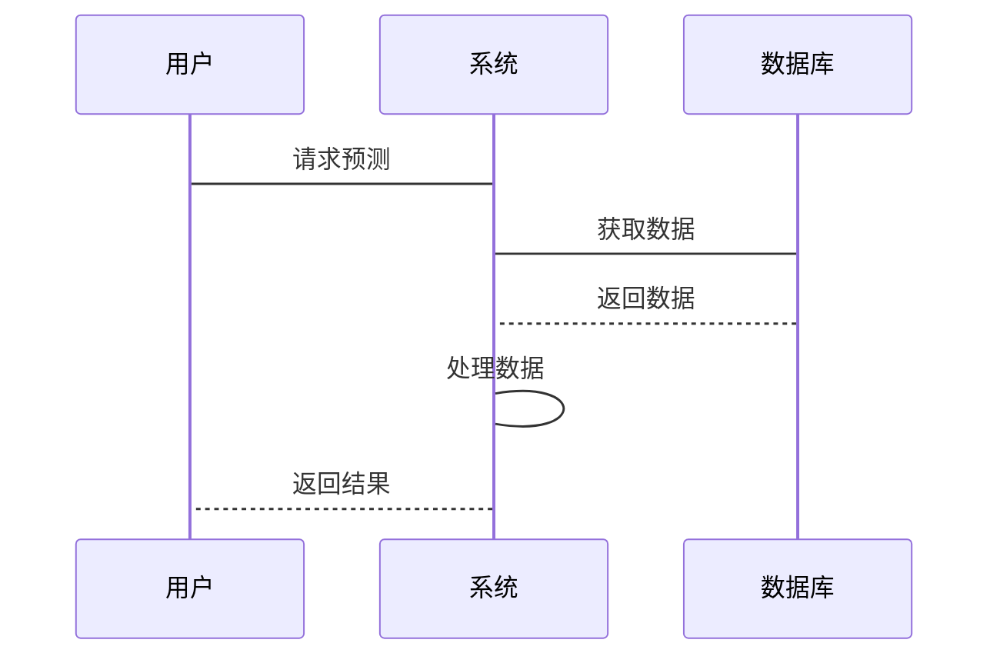

                 


# 《设计智能化的资产定价模型》

---

## 关键词：资产定价、智能化定价、机器学习、深度学习、金融模型

---

## 摘要：  
在金融领域，资产定价是一个复杂而关键的问题。随着大数据和人工智能技术的快速发展，智能化的资产定价模型正在改变传统的定价方式。本文从传统定价模型的局限性出发，结合机器学习和深度学习的技术优势，系统地介绍智能化资产定价模型的设计原理、算法实现和应用场景。通过实际案例分析，探讨如何利用先进的技术手段提升资产定价的准确性和效率，为金融从业者和研究人员提供理论和实践的双重指导。

---

# 第一部分: 资产定价模型的背景与智能化

# 第1章: 资产定价模型概述

## 1.1 资产定价的基本概念

### 1.1.1 资产定价的核心问题

资产定价的核心问题在于如何准确评估资产的价值。传统定价模型（如CAPM和APT）基于假设和简化，但在实际金融市场中，资产价格受到多种复杂因素的影响，例如市场波动、宏观经济指标、公司基本面等。传统模型难以捕捉这些复杂关系，因此智能化定价模型应运而生。

### 1.1.2 资产定价模型的分类

资产定价模型主要分为以下几类：

1. **传统定价模型**：如CAPM、APT、WACC等，基于假设和简化，适用于特定场景。
2. **机器学习定价模型**：利用回归、支持向量机、随机森林等算法，从数据中学习定价规律。
3. **深度学习定价模型**：基于神经网络，能够捕捉非线性关系，适用于复杂场景。

### 1.1.3 智能化资产定价的必要性

智能化定价模型能够处理海量数据，发现传统模型难以捕捉的模式，从而提高定价的准确性和效率。尤其是在高频交易和大数据环境下，智能化模型表现出显著优势。

## 1.2 传统资产定价与智能化定价的对比

### 1.2.1 传统定价方法的局限性

1. **假设简化**：传统模型假设市场均衡、无摩擦等，但在现实中难以成立。
2. **非线性关系**：传统模型难以捕捉复杂的非线性关系。
3. **数据依赖性**：传统模型依赖于假设的定价因子，可能忽略重要信息。

### 1.2.2 智能化定价的优势与特点

1. **数据驱动**：智能化模型基于大量数据进行学习，能够发现隐藏的模式。
2. **非线性建模**：深度学习等技术能够捕捉复杂的非线性关系。
3. **动态适应性**：智能化模型能够实时更新，适应市场变化。

### 1.2.3 机器学习在资产定价中的应用

机器学习在资产定价中的应用包括：预测股票价格、评估信用风险、量化投资组合优化等。通过机器学习算法，投资者能够更好地理解市场动态，做出更明智的决策。

## 1.3 本书的核心目标与内容框架

### 1.3.1 本书的核心目标

本书旨在系统地介绍智能化资产定价模型的设计原理、实现方法和应用场景，帮助读者理解如何利用机器学习和深度学习技术提升资产定价的效率和准确性。

### 1.3.2 本书的内容框架

- **第1章**：资产定价模型概述。
- **第2章**：资产定价模型的核心概念。
- **第3章**：资产定价模型的算法原理。
- **第4章**：资产定价模型的系统设计。
- **第5章**：资产定价模型的项目实战。
- **第6章**：智能化资产定价的未来展望。

### 1.3.3 本书的适用读者

本书适合金融从业者、数据科学家、量化研究员以及对智能化资产定价感兴趣的技术人员阅读。

---

# 第2章: 资产定价模型的核心概念

## 2.1 资产定价模型的组成要素

### 2.1.1 资产的基本属性

资产的基本属性包括：资产类型（股票、债券等）、市场流动性、信用评级、行业特性等。

### 2.1.2 定价模型的输入变量

定价模型的输入变量包括：历史价格、成交量、财务指标、宏观经济指标等。

### 2.1.3 定价模型的输出结果

定价模型的输出结果包括：资产的公允价值、未来价格预测、风险评估等。

## 2.2 数据特征与模型选择的关系

### 2.2.1 数据特征的分类

数据特征可以分为：数值型特征、分类特征、文本特征等。

### 2.2.2 模型选择的依据

模型选择的依据包括：数据特征的类型、数据量的大小、模型的复杂度等。

### 2.2.3 数据特征对模型性能的影响

不同的数据特征对模型性能有不同的影响，例如，数值型特征适合回归模型，分类特征适合决策树模型等。

## 2.3 模型性能评估指标

### 2.3.1 常见的评估指标

常用的评估指标包括：均方误差（MSE）、平均绝对误差（MAE）、R平方值（R²）等。

### 2.3.2 各个指标的计算方法

1. **均方误差（MSE）**：
$$ \text{MSE} = \frac{1}{n}\sum_{i=1}^{n}(y_i - \hat{y}_i)^2 $$

2. **平均绝对误差（MAE）**：
$$ \text{MAE} = \frac{1}{n}\sum_{i=1}^{n}|y_i - \hat{y}_i| $$

3. **R平方值（R²）**：
$$ R^2 = 1 - \frac{\sum_{i=1}^{n}(y_i - \hat{y}_i)^2}{\sum_{i=1}^{n}(y_i - \bar{y})^2} $$

### 2.3.3 指标之间的关系与权衡

不同的评估指标适用于不同的场景。例如，MSE适合对预测误差敏感的场景，MAE适合对绝对误差敏感的场景，R²适合对模型解释能力敏感的场景。

---

# 第3章: 资产定价模型的算法原理

## 3.1 传统定价模型的原理

### 3.1.1 CAPM模型的原理与应用

CAPM（资本资产定价模型）假设市场是均衡的，能够通过市场风险来定价资产。其公式为：

$$ E(R_i) = R_f + \beta_i (E(R_m) - R_f) $$

其中，$E(R_i)$ 是资产的预期回报率，$R_f$ 是无风险利率，$\beta_i$ 是资产的贝塔系数，$E(R_m)$ 是市场预期回报率。

### 3.1.2 APT模型的原理与应用

APT（资产定价理论）假设存在多个定价因子，资产的预期回报率可以通过这些因子的线性组合来表示。其公式为：

$$ E(R_i) = \alpha_i + \beta_{i1}F_1 + \beta_{i2}F_2 + \dots + \beta_{ik}F_k $$

其中，$F_j$ 是第$j$个定价因子，$\beta_{ij}$ 是资产$i$对因子$j$的敏感度。

### 3.1.3 WACC模型的原理与应用

WACC（加权平均成本资本）用于计算一个企业的加权平均资本成本，作为其资本预算的基准。其公式为：

$$ WACC = \left( \frac{D}{D+E} \right) W_d \cdot R_d + \left( \frac{E}{D+E} \right) W_e \cdot R_e $$

其中，$D$ 是债务，$E$ 是股权，$W_d$ 和 $W_e$ 分别是债务和股权的权重，$R_d$ 和 $R_e$ 分别是债务和股权的成本。

## 3.2 机器学习定价模型的原理

### 3.2.1 回归模型的原理与应用

回归模型用于预测资产的价格或回报率。常用的回归算法包括线性回归、逻辑回归和岭回归等。

### 3.2.2 支持向量机的原理与应用

支持向量机（SVM）用于分类和回归问题。在资产定价中，可以用于预测资产的涨跌趋势。

### 3.2.3 随机森林的原理与应用

随机森林是一种基于决策树的集成算法，能够处理高维数据和非线性关系。在资产定价中，可以用于特征选择和价格预测。

## 3.3 深度学习定价模型的原理

### 3.3.1 神经网络的原理与应用

神经网络通过多层非线性变换，能够捕捉复杂的定价模式。在资产定价中，可以用于时间序列预测和风险评估。

### 3.3.2 卷积神经网络的原理与应用

卷积神经网络（CNN）适用于处理图像和序列数据。在资产定价中，可以用于分析K线图和市场情绪。

### 3.3.3 循环神经网络的原理与应用

循环神经网络（RNN）适用于处理时间序列数据。在资产定价中，可以用于预测股票价格和识别市场趋势。

---

# 第4章: 资产定价模型的系统设计

## 4.1 系统功能设计

### 4.1.1 数据预处理模块

数据预处理模块包括数据清洗、特征工程和数据增强等步骤。

### 4.1.2 模型训练模块

模型训练模块包括选择算法、调整超参数和评估性能等步骤。

### 4.1.3 结果展示模块

结果展示模块包括可视化预测结果、生成报告和提供交互界面等。

## 4.2 系统架构设计

### 4.2.1 领域模型类图



### 4.2.2 系统架构图



### 4.2.3 系统接口设计

系统接口设计包括数据接口、模型接口和用户接口等。

---

# 第5章: 资产定价模型的项目实战

## 5.1 项目背景介绍

### 5.1.1 项目目标

通过机器学习算法，设计一个智能化的资产定价模型，实现对股票价格的预测和风险评估。

### 5.1.2 项目数据

使用历史股票价格、财务指标和宏观经济指标等数据。

### 5.1.3 项目工具

使用Python、Pandas、Scikit-learn和TensorFlow等工具。

## 5.2 系统核心实现

### 5.2.1 数据加载与预处理

```python
import pandas as pd
from sklearn.preprocessing import StandardScaler

# 加载数据
data = pd.read_csv('stock_data.csv')

# 数据清洗
data.dropna(inplace=True)

# 特征工程
features = data[['open', 'high', 'low', 'volume']]
target = data['close']

# 数据标准化
scaler = StandardScaler()
features_scaled = scaler.fit_transform(features)
```

### 5.2.2 特征选择与模型训练

```python
from sklearn.ensemble import RandomForestRegressor
from sklearn.metrics import mean_squared_error

# 特征选择
selected_features = features_scaled[:, :5]

# 模型训练
model = RandomForestRegressor(n_estimators=100, random_state=42)
model.fit(selected_features, target)

# 模型评估
预测 = model.predict(selected_features)
mse = mean_squared_error(target, 预测)
print('MSE:', mse)
```

### 5.2.3 系统交互设计



## 5.3 项目小结

通过本项目，我们成功地设计并实现了一个智能化的资产定价模型，验证了机器学习算法在资产定价中的有效性。同时，我们也发现了模型的局限性，例如过拟合和数据依赖性等问题。

---

# 第6章: 智能化资产定价的未来展望

## 6.1 未来技术趋势

### 6.1.1 大模型的应用

随着大模型（如GPT-4和PaLM）的崛起，未来资产定价模型可能会更加智能化和自动化。

### 6.1.2 跨模态学习的发展

跨模态学习能够整合文本、图像和语音等多种数据，为资产定价提供更全面的信息。

### 6.1.3 分布式计算的普及

分布式计算技术（如Federated Learning）能够在保护数据隐私的前提下，实现模型的协同训练。

## 6.2 未来应用场景

### 6.2.1 智能投资顾问

智能化资产定价模型可以为投资者提供个性化的投资建议。

### 6.2.2 风险管理

通过实时监控市场动态，模型能够帮助投资者规避风险。

### 6.2.3 量化交易

智能化模型可以用于高频交易和算法交易，提高交易效率。

## 6.3 未来挑战与解决方案

### 6.3.1 数据隐私问题

通过加密技术和联邦学习等方法，可以保护数据隐私。

### 6.3.2 模型解释性问题

通过可解释性机器学习技术，可以提高模型的透明度和可信度。

### 6.3.3 算法可扩展性问题

通过分布式计算和边缘计算等技术，可以提高模型的可扩展性。

---

# 第7章: 最佳实践与注意事项

## 7.1 最佳实践

### 7.1.1 数据处理

- 数据清洗：确保数据的完整性和准确性。
- 特征工程：选择合适的特征，减少维度。

### 7.1.2 模型选择

- 根据数据特征选择合适的算法。
- 进行交叉验证，避免过拟合。

### 7.1.3 模型部署

- 使用容器化技术（如Docker）部署模型。
- 定期更新模型，适应市场变化。

## 7.2 小结

智能化资产定价模型的设计需要结合理论知识和实际经验，通过不断试验和优化，才能达到最佳效果。

---

# 附录: 拓展阅读

## 附录A: 机器学习在金融领域的应用

## 附录B: 深度学习的最新进展

## 附录C: 资产定价的经典文献

---

# 结语

智能化资产定价模型的设计是一个复杂而有趣的过程，需要结合理论知识和实际经验。通过不断学习和实践，我们相信未来智能化定价模型将在金融领域发挥更大的作用。

