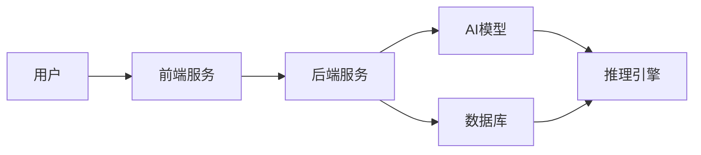

                 


# 设计高可用性金融AI系统架构

> 关键词：高可用性、金融AI系统、容错机制、分布式系统、系统架构设计、AI算法优化、金融数据处理

> 摘要：设计高可用性金融AI系统架构是确保在金融领域中AI系统稳定运行的关键。本文从系统背景、核心概念、算法原理、系统分析与架构设计、项目实战等多个方面详细探讨了高可用性金融AI系统的构建方法，涵盖容错机制、负载均衡、分布式架构等核心要素，结合实际案例和代码实现，为读者提供了一套完整的解决方案。

---

## 目录大纲

### 第一部分: 高可用性金融AI系统架构背景与核心概念

### 第1章: 高可用性金融AI系统架构概述

#### 1.1 问题背景
- 1.1.1 金融行业的AI需求
  - 人工智能在金融领域的广泛应用
  - 金融行业的高可靠性要求
- 1.1.2 当前金融AI系统的挑战
  - 数据质量与模型鲁棒性问题
  - 系统容错与恢复机制的不足
- 1.1.3 高可用性的重要性
  - 系统稳定运行的核心要素
  - 高可用性对金融业务的影响

#### 1.2 问题描述
- 1.2.1 金融AI系统的可用性问题
  - 系统故障对业务的影响
  - 数据一致性与系统恢复
- 1.2.2 数据质量与模型鲁棒性
  - 数据偏差对AI模型的影响
  - 模型的容错与纠错机制
- 1.2.3 系统容错与恢复机制
  - 系统故障的检测与处理
  - 数据备份与恢复策略

#### 1.3 问题解决
- 1.3.1 高可用性系统的特点
  - 系统的冗余设计
  - 系统的自愈能力
- 1.3.2 容错机制的设计原则
  - 错误检测与定位
  - 错误处理与恢复
- 1.3.3 系统性能优化策略
  - 并行计算与分布式处理
  - 负载均衡与资源分配

#### 1.4 边界与外延
- 1.4.1 系统边界定义
  - 系统功能的范围界定
  - 系统与其他模块的接口
- 1.4.2 系统外延与接口
  - 系统扩展性设计
  - 系统与外部环境的交互
- 1.4.3 系统与外部环境的交互
  - 数据输入与输出的规范
  - 系统与用户的接口设计

#### 1.5 概念结构与核心要素
- 1.5.1 核心概念组成
  - 高可用性系统的核心要素
  - 容错机制的关键组成部分
- 1.5.2 系统架构要素
  - 分布式架构的设计要素
  - 负载均衡的实现要素
- 1.5.3 关键性能指标
  - 系统响应时间
  - 系统吞吐量
  - 系统可靠性

### 第2章: 高可用性金融AI系统的核心概念与联系

#### 2.1 核心概念原理
- 2.1.1 高可用性系统原理
  - 系统冗余与备份
  - 系统自愈能力
- 2.1.2 容错机制原理
  - 错误检测与定位
  - 错误处理与恢复
- 2.1.3 分布式系统原理
  - 分布式计算与任务分配
  - 系统节点间的通信与协调

#### 2.2 概念属性对比表
| 概念 | 属性 | 描述 |
|------|------|------|
| 高可用性 | 可用性 | 系统在故障时的快速恢复能力 |
| 容错机制 | 错误处理 | 系统在错误发生时的处理策略 |
| 分布式系统 | 并行处理 | 系统在多节点环境中的协调能力 |

#### 2.3 实体关系图


---

### 第3章: 高可用性金融AI系统的算法原理

#### 3.1 算法原理讲解
- 3.1.1 负载均衡算法
  - 轮询算法
  - 加权轮询算法
  - 最小连接数算法
- 3.1.2 容错机制算法
  - 故障检测算法
  - 故障恢复算法
- 3.1.3 分布式一致性算法
  - 一致性哈希算法
  - Paxos算法
  - Raft算法

#### 3.2 算法实现
- 3.2.1 负载均衡算法实现
  ```mermaid
  graph T
      A[用户请求] --> B[负载均衡器]
      B --> C[可用服务器节点]
  ```
  ```python
  import random

  class LoadBalancer:
      def __init__(self, servers):
          self.servers = servers

      def get_server(self):
          return random.choice(self.servers)
  ```

- 3.2.2 容错机制算法实现
  ```mermaid
  graph T
      A[节点故障] --> B[容错机制]
      B --> C[故障恢复]
  ```
  ```python
  class FaultTolerance:
      def __init__(self, nodes):
          self.nodes = nodes

      def detect_fault(self):
          # 检测节点故障
          pass

      def recover(self):
          # 故障恢复逻辑
          pass
  ```

#### 3.3 数学模型与公式
- 3.3.1 负载均衡算法的数学模型
  $$ \text{负载均衡} = \frac{\text{总负载}}{\text{可用节点数}} $$
- 3.3.2 容错机制的数学模型
  $$ \text{容错能力} = 1 - \left( \frac{\text{故障概率}}{\text{总节点数}} \right) $$

---

### 第4章: 系统分析与架构设计

#### 4.1 系统分析
- 4.1.1 问题场景介绍
  - 高可用性金融AI系统的应用场景
  - 系统可能面临的关键问题
- 4.1.2 项目介绍
  - 系统目标与功能
  - 系统设计的约束与挑战

#### 4.2 系统功能设计
- 4.2.1 领域模型设计
  ```mermaid
  classDiagram
      class 用户 {
          id: int
          name: string
      }
      class 前端服务 {
          handle_request()
      }
      class 后端服务 {
          process_request()
      }
      class AI模型 {
          predict()
      }
      class 数据库 {
          save()
          retrieve()
      }
      用户 --> 前端服务
      前端服务 --> 后端服务
      后端服务 --> AI模型
      AI模型 --> 数据库
  ```

#### 4.3 系统架构设计
- 4.3.1 分层架构设计
  ```mermaid
  architecture
  frontend
  backend
  database
  AI-engine
  ```
- 4.3.2 接口设计
  - API接口定义
  - 接口交互流程

#### 4.4 系统交互设计
- 4.4.1 序列图
  ```mermaid
  sequenceDiagram
      用户 -> 前端服务: 发起请求
      前端服务 -> 后端服务: 转发请求
      后端服务 -> AI模型: 调用模型
      AI模型 -> 数据库: 查询数据
      数据库 --> AI模型: 返回数据
      AI模型 --> 后端服务: 返回结果
      后端服务 --> 前端服务: 返回结果
      前端服务 --> 用户: 返回结果
  ```

---

### 第5章: 项目实战

#### 5.1 环境安装
- 5.1.1 安装Python与相关库
  - 安装TensorFlow、Keras、Scikit-learn等
- 5.1.2 安装其他工具
  - 安装Docker、Kubernetes等容器化工具

#### 5.2 核心代码实现
- 5.2.1 负载均衡代码实现
  ```python
  import random

  class LoadBalancer:
      def __init__(self, servers):
          self.servers = servers

      def get_server(self):
          return random.choice(self.servers)
  ```

- 5.2.2 容错机制代码实现
  ```python
  class FaultTolerance:
      def __init__(self, nodes):
          self.nodes = nodes

      def detect_fault(self):
          # 检测节点故障
          pass

      def recover(self):
          # 故障恢复逻辑
          pass
  ```

#### 5.3 实际案例分析
- 5.3.1 案例背景介绍
  - 智能投顾系统的高可用性设计
- 5.3.2 系统设计与实现
  - 系统架构设计
  - 系统功能实现
- 5.3.3 系统性能优化
  - 负载均衡优化
  - 系统容错优化

#### 5.4 项目小结
- 5.4.1 项目总结
  - 项目目标达成情况
  - 系统设计的经验与教训
- 5.4.2 项目注意事项
  - 系统设计的关键点
  - 系统维护与优化建议

---

### 第6章: 最佳实践

#### 6.1 小结
- 高可用性金融AI系统设计的核心要素
- 系统设计的常见误区与解决方案

#### 6.2 注意事项
- 系统设计中的常见问题
- 系统维护中的注意事项
- 系统优化的建议

#### 6.3 拓展阅读
- 推荐的相关书籍与论文
- 金融AI领域的最新研究进展
- 高可用性系统设计的未来发展趋势

---

### 参考文献
- [1] 《分布式系统：设计与实现》
- [2] 《高可用性系统设计模式》
- [3] 《人工智能在金融领域的应用》

---

通过以上目录大纲，您可以逐步展开每章的内容，详细阐述高可用性金融AI系统架构的设计方法和实现细节。

