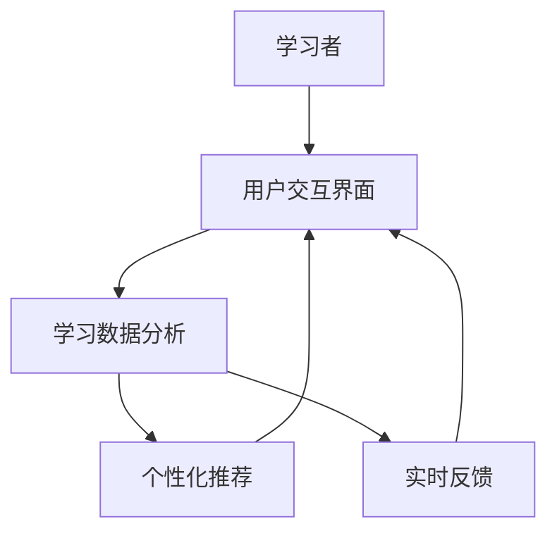

                 


# 语言学习AI Agent：个性化外语教学助手

> 关键词：语言学习AI Agent，个性化学习，自然语言处理，机器学习，系统架构

> 摘要：本文深入探讨了语言学习AI Agent的实现与应用，结合自然语言处理、机器学习等技术，提出了一种基于AI Agent的个性化外语教学助手设计方案，详细分析了其核心概念、算法原理、系统架构及实现方案。

---

## 第1章：语言学习AI Agent的背景与问题背景

### 1.1 语言学习AI Agent的背景
语言学习AI Agent是一种基于人工智能技术的智能助手，旨在为学习者提供个性化的外语教学服务。随着AI技术的快速发展，语言学习领域逐渐从传统的人工教学模式向智能化、个性化模式转变。AI Agent通过自然语言处理（NLP）、机器学习等技术，能够实时分析学习者的需求、能力水平和学习偏好，为其提供定制化的学习建议和反馈。

#### 1.1.1 AI Agent和个性化学习的背景
- AI Agent是一种能够感知环境并采取行动以实现目标的智能体。在教育领域，AI Agent可以用于个性化学习、智能推荐、实时反馈等场景。
- 个性化学习强调根据学习者的特点（如学习风格、兴趣、能力水平）制定个性化教学方案，以提高学习效率和效果。
- 语言学习是一个复杂的过程，涉及听、说、读、写等多种技能，且每个学习者的语言能力和学习需求都不同。传统的一对一教学模式成本高、覆盖面有限，而AI Agent能够有效解决这些问题。

#### 1.1.2 语言学习AI Agent的应用场景
- 自适应学习：根据学习者的水平动态调整教学内容和进度。
- 实时反馈：对学习者的发音、语法错误等进行实时纠正。
- 个性化推荐：基于学习者的学习数据，推荐适合的学习材料和练习任务。

#### 1.1.3 语言学习AI Agent的目标
- 提供个性化的语言学习支持，帮助学习者提高语言能力。
- 实现高效、便捷、低成本的语言教学服务。
- 提供实时反馈和学习建议，增强学习者的学习体验和成就感。

### 1.2 问题背景与问题描述
在语言学习过程中，学习者通常面临以下问题：
1. **学习效率低**：传统教学模式难以满足每个学习者的需求，导致学习效率低下。
2. **学习资源分散**：学习者需要在多个渠道（如在线课程、书籍、App等）中寻找适合自己的学习资源。
3. **缺乏个性化反馈**：学习者难以获得针对性的反馈和指导，影响学习效果。
4. **学习动力不足**：缺乏互动和个性化支持，导致学习者兴趣和动力不足。

### 1.3 问题解决与边界定义
语言学习AI Agent通过以下方式解决上述问题：
1. **个性化学习路径**：根据学习者的水平和需求，动态调整学习计划和内容。
2. **实时反馈与指导**：利用自然语言处理技术，对学习者的发音、语法等进行实时分析和反馈。
3. **智能化推荐**：基于学习者的行为数据和学习偏好，推荐适合的学习资源和练习任务。

#### 1.3.1 AI Agent的功能范围
- **输入输出接口**：与学习者进行自然语言交互。
- **学习数据分析**：收集和分析学习者的行为数据，如学习时间、错误率、进步情况等。
- **个性化推荐**：根据数据生成个性化学习计划和推荐内容。
- **实时反馈**：对学习者的输入进行分析并提供反馈。

#### 1.3.2 核心要素与组成结构
- **学习者模型**：用于建模学习者的能力、兴趣、学习风格等。
- **知识库**：包含语言学习相关的知识，如语法规则、词汇库、发音模型等。
- **推理引擎**：用于根据学习者的行为和数据，推理出最佳的学习策略。
- **反馈模块**：提供实时反馈和学习建议。

---

## 第2章：AI Agent的核心概念与原理

### 2.1 AI Agent的基本概念
AI Agent是一种智能体，能够感知环境并采取行动以实现目标。在语言学习场景中，AI Agent需要具备以下能力：
- **自然语言理解**：理解学习者的输入（如问题、句子）。
- **推理与决策**：根据学习者的需求和数据，生成合适的回应和建议。
- **自适应能力**：根据学习者的反馈动态调整行为。

#### 2.1.1 AI Agent与传统教学模式的对比
| 对比维度         | 传统教学模式               | AI Agent                     |
|------------------|----------------------------|------------------------------|
| 教学效率         | 较低，需要一对一教学         | 高，可同时服务多个学习者       |
| 个性化支持       | 有限，依赖教师的经验         | 强大，可根据数据动态调整         |
| 反馈速度         | 较慢，依赖教师的反馈         | 实时，快速响应                   |

### 2.2 AI Agent的核心原理
语言学习AI Agent的核心原理包括自然语言处理、机器学习和强化学习。

#### 2.2.1 自然语言处理（NLP）
NLP技术是AI Agent实现语言理解的关键。以下是NLP的主要步骤：
1. **分词**：将输入文本分割成词语或短语。
2. **词性标注**：为每个词语标注词性（如名词、动词）。
3. **句法分析**：分析句子的语法结构。
4. **语义理解**：理解文本的含义。

#### 2.2.2 机器学习
机器学习用于训练AI Agent的学习模型，使其能够从数据中学习和改进。常用的算法包括：
- **监督学习**：基于标注数据进行训练。
- **无监督学习**：基于未标注数据进行聚类或主题建模。

#### 2.2.3 强化学习
强化学习用于训练AI Agent的决策能力，使其能够在复杂环境中做出最优选择。例如，AI Agent可以通过与学习者的互动，逐步优化其反馈策略。

---

## 第3章：语言学习AI Agent的算法原理

### 3.1 自然语言处理算法
自然语言处理是AI Agent的核心技术之一，以下是常用的NLP算法：
1. **分词算法**：使用动态规划或深度学习模型（如LSTM）进行分词。
2. **语义理解算法**：基于词嵌入（如Word2Vec）或 Transformer 模型（如BERT）进行语义分析。
3. **生成算法**：使用生成对抗网络（GAN）或Transformer模型生成自然语言文本。

#### 3.1.1 分词算法的数学模型
分词算法可以通过动态规划实现，其目标函数为：
$$
f(i) = \min_{0 \leq j < i} (f(j) + cost(j, i))
$$
其中，$f(j)$ 表示前i个字符的最小分词成本，$cost(j, i)$ 表示从位置j到i的分词成本。

### 3.2 个性化推荐算法
个性化推荐是AI Agent的核心功能之一，以下是常用的推荐算法：
1. **基于协同过滤的推荐**：根据用户行为数据进行推荐。
2. **基于内容的推荐**：根据内容特征进行推荐。
3. **混合推荐**：结合协同过滤和内容推荐的优点。

#### 3.2.1 协同过滤的数学模型
协同过滤可以通过矩阵分解实现，目标函数为：
$$
\min_{X, Y} \| R - XY^T \|^2
$$
其中，$R$ 是用户-物品评分矩阵，$X$ 和 $Y$ 是用户和物品的隐向量。

---

## 第4章：语言学习AI Agent的系统分析与架构设计

### 4.1 系统功能设计
语言学习AI Agent的系统功能包括：
1. **用户交互界面**：提供自然语言输入和输出的界面。
2. **学习数据分析**：收集和分析学习者的行为数据。
3. **个性化推荐**：根据数据生成个性化学习计划和推荐内容。
4. **实时反馈**：对学习者的输入进行分析并提供反馈。

#### 4.1.1 系统架构图


### 4.2 系统架构设计
语言学习AI Agent采用分层架构设计，包括数据层、业务逻辑层和用户界面层。

#### 4.2.1 分层架构设计
- **数据层**：负责数据的存储和管理。
- **业务逻辑层**：负责核心算法的实现。
- **用户界面层**：负责与用户的交互。

---

## 第5章：语言学习AI Agent的项目实战

### 5.1 环境安装
语言学习AI Agent的开发环境包括以下工具：
- **Python**：编程语言
- **TensorFlow/Keras**：深度学习框架
- **NLTK/Spacy**：自然语言处理库
- **Flask/Django**：Web框架

### 5.2 核心代码实现
以下是语言学习AI Agent的核心代码示例：
```python
class LanguageLearningAI:
    def __init__(self):
        self.nlp = spacy.load("en_core_web_sm")
        self.model = self.build_model()

    def build_model(self):
        # 构建深度学习模型
        model = Sequential()
        model.add(Embedding(input_dim=10000, output_dim=32, input_length=500))
        model.add(LSTM(64))
        model.add(Dense(1, activation='sigmoid'))
        model.compile(loss='binary_crossentropy', optimizer='adam', metrics=['accuracy'])
        return model

    def process_input(self, text):
        # 处理用户输入
        doc = self.nlp(text)
        # 提取关键词
        keywords = [token.text for token in doc if token.pos_ in ['NOUN', 'VERB']]
        return keywords

    def generate_response(self, keywords):
        # 根据关键词生成回复
        response = "Based on your input, the keywords are: " + ", ".join(keywords)
        return response
```

### 5.3 案例分析
以下是一个实际案例分析：
- **输入**：用户输入“如何提高英语口语？”
- **处理**：AI Agent首先进行分词和词性标注，提取关键词“提高”、“英语口语”。
- **输出**：生成回复“提高英语口语的关键是多听多说，建议每天练习15分钟。”

### 5.4 项目小结
通过以上实现，语言学习AI Agent能够为学习者提供个性化的语言学习支持，显著提高学习效率和效果。

---

## 第6章：最佳实践与小结

### 6.1 小结
语言学习AI Agent是一种基于AI技术的智能助手，能够为学习者提供个性化的语言学习支持。通过自然语言处理、机器学习等技术，AI Agent能够实现实时反馈、个性化推荐等功能，显著提升学习效率和效果。

### 6.2 注意事项
- **数据隐私**：在处理学习者数据时，需要注意数据隐私和安全。
- **模型优化**：需要不断优化模型，以提高准确性和响应速度。
- **用户体验**：设计友好的用户界面，提升用户体验。

### 6.3 拓展阅读
- 《Deep Learning》——Ian Goodfellow
- 《自然语言处理入门》——NLP Bible
- 《机器学习实战》——Andrew Ng

---

以上是《语言学习AI Agent：个性化外语教学助手》的技术博客文章的完整内容，涵盖从背景到实现的各个方面，结合了技术原理和实际应用，旨在为读者提供深入的理论和实践指导。

