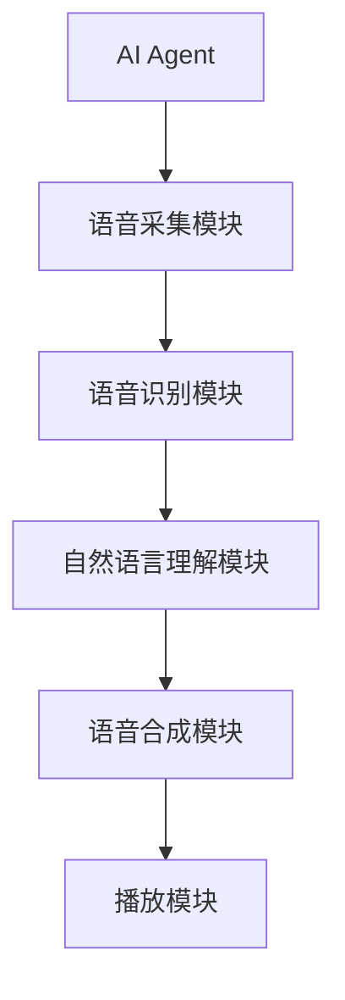

                 


# 《语音识别与合成：为AI Agent添加语音交互能力》

## 关键词：语音识别，语音合成，AI Agent，自然语言处理，语音交互

## 摘要：  
随着人工智能技术的快速发展，语音交互已成为AI Agent与用户进行自然沟通的重要方式。本文从语音识别和语音合成的核心原理出发，详细探讨了如何将这些技术应用于AI Agent中，实现高效的语音交互能力。通过分析语音识别和合成的关键算法、系统设计及实际案例，本文为AI Agent的开发者提供了一套完整的解决方案，帮助其构建功能强大的语音交互系统。

---

# 第1章: 语音交互与AI Agent的背景与重要性

## 1.1 语音交互的核心概念

### 1.1.1 语音交互的定义  
语音交互是指通过语音输入和输出，实现人与计算机或智能设备之间的信息交换。它包括语音识别（ASR）和语音合成（TTS）两个主要技术。

### 1.1.2 语音交互的重要性  
语音交互能够提供更自然、便捷的用户界面，尤其适用于需要快速响应和高可用性的场景，如智能音箱、车载系统和虚拟助手。

### 1.1.3 语音交互的主要应用场景  
- **智能家居**：控制家电、查询信息  
- **智能手机**：语音助手（如Siri、小爱同学）  
- **智能车载系统**：语音导航、音乐播放  

## 1.2 AI Agent的发展趋势

### 1.2.1 AI Agent的定义与分类  
AI Agent是一种能够感知环境并执行任务的智能实体，可分类为简单规则型、基于知识的、基于机器学习的和人机协作型。

### 1.2.2 语音交互在AI Agent中的作用  
语音交互使AI Agent能够以更自然的方式与用户互动，提升用户体验和交互效率。

### 1.2.3 语音交互对AI Agent的影响  
- 提高用户满意度  
- 降低操作复杂性  
- 增强设备的智能化水平  

## 1.3 语音识别与合成技术概述

### 1.3.1 语音识别的基本流程  
1. **声音采集**：通过麦克风获取语音信号  
2. **预处理**：降噪、端点检测  
3. **特征提取**：提取 MFCC、 LPC 等特征  
4. **声学模型与语言模型**：结合上下文进行识别  
5. **输出结果**：将语音转换为文本  

### 1.3.2 语音合成的基本流程  
1. **文本预处理**：分词、语调分析  
2. **文本特征提取**：提取音素、韵律信息  
3. **声学模型生成**：生成波形或频谱  
4. **语音合成**：将频谱转换为音频信号  

---

# 第2章: 语音识别技术的原理与实现

## 2.1 语音识别的核心算法

### 2.1.1 隐马尔可夫模型（HMM）  
HMM 是早期语音识别的核心算法，通过状态转移和观测概率建模语音信号。

**HMM 的状态转移矩阵：**  
$$ a_{ij} = P(state=j | state=i) $$  

### 2.1.2 深度神经网络（DNN）  
DNN 通过多层非线性变换，直接从语音信号中提取高级特征。

### 2.1.3 端到端模型（如 Transformer）  
端到端模型通过自注意力机制，直接将语音信号映射为文本。

### 2.1.4 比较与选择  
- HMM 适用于小规模数据，DNN 适合大数据场景，Transformer 则在复杂场景中表现更优。

## 2.2 语音识别的性能优化

### 2.2.1 降噪技术  
- **波束形成**：通过 microphone 阵列消除环境噪声  
- **深度学习降噪**：使用神经网络提取干净语音  

### 2.2.2 语言模型优化  
- **n-gram 模型**：捕捉上下文信息  
- **基于 Transformer 的语言模型**：提升语义理解能力  

## 2.3 语音识别系统的实现

### 2.3.1 开源工具的选择  
- **Kaldi**：适合研究者  
- **Deep Speech**：适合企业级部署  

### 2.3.2 系统架构设计  
1. **前端处理**：降噪、特征提取  
2. **后端处理**：声学模型、语言模型  
3. **输出层**：文本结果、置信度评分  

---

# 第3章: 语音合成技术的原理与实现

## 3.1 语音合成的核心算法

### 3.1.1 基于规则的合成方法  
- **拼接法（Unit Selection）**：选择合适音素拼接成语音  
- **统计参数法（Diphone）**：基于统计模型生成语音  

### 3.1.2 基于神经网络的合成方法  
- **Tacotron**：端到端模型，生成波形  
- **FastSpeech**：基于 Transformer 的高效模型  

## 3.2 语音合成的性能优化

### 3.2.1 文本预处理  
- **情感分析**：生成具有情感的语音  
- **语调调整**：根据上下文调整语速和音高  

### 3.2.2 合成语音的优化  
- **声学模型优化**：提升语音自然度  
- **韵律模型优化**：使语音更接近人类发音  

## 3.3 语音合成系统的实现

### 3.3.1 开源工具的选择  
- **MaryTTS**：开源 TTS 引擎  
- **FastSpeech2**：基于开源代码实现  

### 3.3.2 系统架构设计  
1. **文本处理模块**：分词、情感分析  
2. **特征提取模块**：提取音素特征  
3. **声学模型模块**：生成语音信号  
4. **语音合成模块**：将信号转换为音频  

---

# 第4章: 为AI Agent设计语音交互系统

## 4.1 系统需求分析

### 4.1.1 功能需求  
- **语音识别**：支持多种语言、多说话人识别  
- **语音合成**：支持多种音色、情感表达  
- **自然语言理解**：理解用户意图  

### 4.1.2 性能需求  
- **延迟低**：实时交互  
- **准确率高**：识别和合成准确率≥95%  

## 4.2 系统架构设计

### 4.2.1 模块划分  
1. **语音采集模块**：通过麦克风获取语音信号  
2. **语音识别模块**：将语音转换为文本  
3. **自然语言理解模块**：理解用户意图  
4. **语音合成模块**：生成响应语音  
5. **播放模块**：播放合成语音  

### 4.2.2 实体关系图  



---

# 第5章: 项目实战——构建AI Agent的语音交互系统

## 5.1 环境搭建与工具安装

### 5.1.1 开发环境  
- **操作系统**：Linux/Windows/MacOS  
- **编程语言**：Python 3.8+  
- **开发工具**：PyCharm/VS Code  

### 5.1.2 依赖库安装  
```bash
pip install numpy scipy librosa pydub pocketsphinx
```

---

## 5.2 语音识别模块实现

### 5.2.1 代码实现  

```python
import librosa
import numpy as np

def audio_feature_extraction(audio_path, sr=16000):
    # 加载音频文件
    y, _ = librosa.load(audio_path, sr=sr, duration=5)
    # 降噪处理
    y = librosa.declick(y)
    # 提取MFCC特征
    mfccs = librosa.feature.mfcc(y, sr=sr)
    return mfccs
```

### 5.2.2 代码解读  
1. **加载音频文件**：使用 librosa 加载音频信号  
2. **降噪处理**：消除环境噪声  
3. **提取MFCC特征**：将语音信号转换为特征向量  

## 5.3 语音合成模块实现

### 5.3.1 代码实现  

```python
import tensorflow as tf
from tensorflow import keras

def build_tts_model():
    model = keras.Sequential([
        # 前置网络
        keras.layers.Dense(128, activation='relu'),
        # 输出层
        keras.layers.Dense(16000, activation='linear')
    ])
    return model
```

---

## 5.4 系统集成与测试

### 5.4.1 系统集成  
将语音识别和合成模块集成到AI Agent中，确保各模块协同工作。

### 5.4.2 测试与优化  
- **功能测试**：识别准确率、合成自然度  
- **性能优化**：降低延迟、提升准确率  

---

# 第6章: 总结与展望

## 6.1 本章总结  
本文详细探讨了语音识别与合成技术的核心原理，并展示了如何将这些技术应用于AI Agent中，构建高效的语音交互系统。

## 6.2 技术展望  
未来，语音交互将更加智能化和个性化，结合情感计算和增强学习，实现更自然的语音交互体验。

## 6.3 最佳实践 tips  
- **选择合适的工具**：根据需求选择开源库或商业解决方案  
- **注重数据质量**：高质量的数据是系统性能的基础  
- **持续优化**：通过反馈机制不断提升识别和合成的准确率  

---

# 参考文献  
[此处列出相关技术论文、书籍和开源项目]

---

通过以上内容，读者可以系统地了解语音识别与合成技术的核心原理，并掌握如何将其应用于AI Agent的语音交互设计中。希望这篇文章能够为相关领域的开发者提供有价值的参考和指导。

