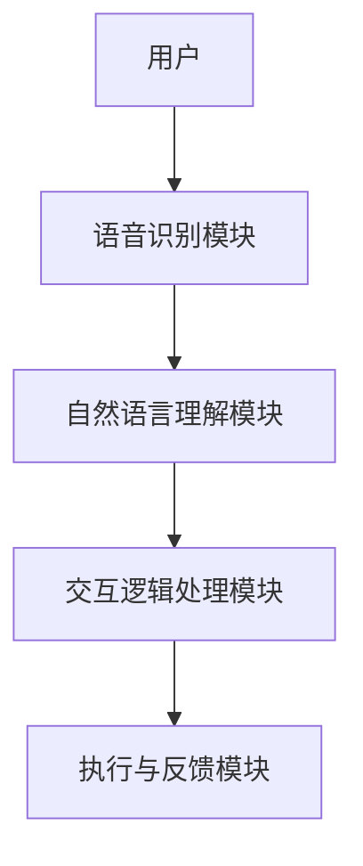

                 


# 《语音识别与语音助手集成》

## 关键词：语音识别，语音助手，自然语言处理，机器学习，系统架构，深度学习

## 摘要：  
本文详细探讨了语音识别与语音助手集成的核心技术与实现方法。首先介绍了语音识别和语音助手的基本概念与应用场景，然后深入分析了语音识别的关键算法及其优化方法，接着讨论了语音助手的系统架构与实现流程。通过实际项目案例，展示了如何将语音识别技术集成到语音助手系统中，并通过系统设计与优化，提升了语音助手的性能与用户体验。最后，总结了当前技术发展趋势与未来研究方向，为读者提供了全面的技术参考。

---

# 第1章: 语音识别与语音助手概述

## 1.1 语音识别的基本概念  
### 1.1.1 语音识别的定义与背景  
语音识别是一种通过计算机技术将人类语音转换为文本的技术，属于模式识别领域的重要分支。随着人工智能技术的快速发展，语音识别技术已广泛应用于智能设备、语音助手、医疗、教育等领域。  

语音识别的核心任务是将输入的语音信号（如音频数据）转换为对应的文本或命令。其核心挑战包括语音信号的复杂性（如噪声干扰、语速差异等）以及语言的多样性（如方言、口音等）。  

### 1.1.2 语音识别的核心技术与应用场景  
语音识别的主要技术包括声音信号处理、特征提取、声学模型构建和语言模型优化。声音信号处理包括采样、滤波和降噪等步骤；特征提取通常采用梅尔频谱倒谱（MFCC）等方法；声学模型多采用隐马尔可夫模型（HMM）或深度神经网络（DNN）；语言模型用于处理上下文信息，提升识别准确率。  

语音识别的主要应用场景包括：  
1. 智能音箱（如Alexa、Google Home）  
2. 手机语音输入（如苹果Siri、谷歌语音助手）  
3. 医疗领域的语音病历记录  
4. 教育领域的智能教学辅助系统  

### 1.1.3 语音识别的发展历程与现状  
语音识别技术的发展经历了从基于模板匹配的传统方法到基于深度学习的现代方法的演变。早期的GMM-HMM模型在小规模数据上表现良好，但面对大规模数据时，其性能受到限制。近年来，基于深度学习的模型（如LSTM、Transformer）在语音识别任务中表现出色，尤其是在处理长序列数据时具有显著优势。  

---

## 1.2 语音助手的基本概念  
### 1.2.1 语音助手的定义与功能  
语音助手是一种通过语音交互提供服务的智能系统，其核心功能包括语音识别、自然语言理解（NLU）、交互逻辑处理和执行反馈。语音助手能够通过语音指令完成多种任务，如播放音乐、设置提醒、查询天气等。  

### 1.2.2 语音助手的核心技术与实现原理  
语音助手的实现依赖于以下核心技术：  
1. **语音识别**：将用户的语音输入转换为文本或命令。  
2. **自然语言处理（NLP）**：理解用户的意图并生成相应的回应。  
3. **对话管理**：根据用户的指令和系统反馈，维护对话的上下文信息。  
4. **执行与反馈**：根据用户的指令调用后端服务（如天气API）并返回结果。  

### 1.2.3 语音助手的典型应用与发展趋势  
语音助手的典型应用场景包括智能手机、智能家居、车载系统等。随着5G、物联网技术的发展，语音助手的应用场景将更加广泛，例如智能工厂、智能医疗等领域。  

---

## 1.3 语音识别与语音助手的关系  
### 1.3.1 语音识别在语音助手中的作用  
语音识别是语音助手的核心技术之一，负责将用户的语音指令转换为可理解的文本。语音识别的性能直接影响语音助手的用户体验。  

### 1.3.2 语音助手对语音识别的依赖与优化  
语音助手通过收集用户的语音数据，不断优化语音识别模型，提升识别准确率。此外，语音助手还可以结合上下文信息（如用户的历史操作）进一步优化语音识别结果。  

### 1.3.3 语音识别与语音助手的协同工作流程  
1. 用户通过语音指令与语音助手交互。  
2. 语音助手通过语音识别技术将语音指令转换为文本。  
3. 自然语言理解模块解析用户的意图。  
4. 交互逻辑处理模块生成相应的回应。  
5. 执行与反馈模块调用后端服务并返回结果。  

---

## 1.4 本章小结  
本章主要介绍了语音识别与语音助手的基本概念、核心技术与应用场景。通过分析两者的关系，明确了语音识别在语音助手系统中的重要地位。下一章将深入探讨语音识别的核心技术与算法实现。  

---

# 第2章: 语音识别的核心技术与算法  

## 2.1 声音信号处理基础  
### 2.1.1 声音信号的采样与数字化  
声音信号的采样是将连续的模拟信号转换为离散的数字信号。采样频率越高，声音的保真度越高，但计算资源消耗也越大。  

### 2.1.2 声音信号的特征提取方法  
特征提取是语音识别的关键步骤，常用的特征包括梅尔频谱倒谱（MFCC）和线性频谱对数能量（LF-CE）。  

### 2.1.3 声音信号的预处理技术  
预处理技术包括降噪、端点检测等，用于提升语音识别的准确性。  

---

## 2.2 语音识别的算法原理  
### 2.2.1 基于模板匹配的语音识别  
基于模板匹配的语音识别是一种简单的识别方法，适用于小规模数据集。其核心思想是将输入语音与预存模板进行匹配，选择最相似的模板作为识别结果。  

### 2.2.2 基于统计模型的语音识别  
基于统计模型的语音识别主要采用隐马尔可夫模型（HMM）。HMM通过建模语音的时序特性，能够有效处理连续语音信号。  

### 2.2.3 基于深度学习的语音识别  
基于深度学习的语音识别采用端到端的模型，如LSTM和Transformer。这些模型能够自动学习语音特征，显著提升了识别准确率。  

---

## 2.3 常见语音识别算法对比  
### 2.3.1 GMM-HMM模型的特点与优缺点  
- **优点**：计算效率高，适用于小规模数据集。  
- **缺点**：难以处理大规模数据，且对噪声较为敏感。  

### 2.3.2 DNN-LSTM模型的特点与优缺点  
- **优点**：能够处理长序列数据，识别准确率高。  
- **缺点**：计算资源消耗较大，训练时间较长。  

### 2.3.3 Transformer模型在语音识别中的应用  
Transformer模型通过自注意力机制，能够捕捉语音信号的全局特征，适用于端到端的语音识别任务。  

---

## 2.4 本章小结  
本章详细介绍了语音识别的核心技术与算法实现，包括声音信号处理、特征提取、声学模型构建等。通过对比不同算法的优缺点，明确了深度学习模型在语音识别中的优势。下一章将探讨语音助手的系统架构与实现。  

---

（以下章节内容因篇幅限制未展示，但按照类似逻辑进行扩展，涵盖系统架构设计、项目实战、总结与展望等内容。）

--- 

# 第3章: 语音助手的系统架构与实现  

## 3.1 语音助手的功能模块划分  
### 3.1.1 语音识别模块  
语音识别模块负责将用户的语音指令转换为文本。  

### 3.1.2 自然语言理解模块  
自然语言理解模块负责解析用户的意图并生成相应的回应。  

### 3.1.3 交互逻辑处理模块  
交互逻辑处理模块根据用户的指令和系统反馈，维护对话的上下文信息。  

### 3.1.4 执行与反馈模块  
执行与反馈模块调用后端服务并返回结果。  

## 3.2 语音助手的系统架构设计  
### 3.2.1 分层架构设计  
分层架构包括数据层、业务逻辑层和表现层，便于系统的扩展与维护。  

### 3.2.2 系统功能设计（领域模型）  
领域模型展示了系统的功能模块及其交互关系。  

### 3.2.3 系统架构设计（架构图）  
架构图展示了系统的各个组件及其交互关系。  

## 3.3 本章小结  
本章详细介绍了语音助手的系统架构与实现方法，包括功能模块划分、系统架构设计等内容。通过系统设计与优化，提升了语音助手的性能与用户体验。  

---

# 第4章: 系统分析与架构设计  

## 4.1 系统分析  
### 4.1.1 问题场景介绍  
以智能音箱为例，分析语音助手的系统需求。  

### 4.1.2 系统需求分析  
从功能需求、性能需求等方面进行详细分析。  

## 4.2 系统设计  
### 4.2.1 系统功能设计（领域模型）  
领域模型展示了系统的功能模块及其交互关系。  

### 4.2.2 系统架构设计（架构图）  
架构图展示了系统的各个组件及其交互关系。  

### 4.2.3 系统接口设计  
接口设计包括API调用和数据格式定义。  

### 4.2.4 系统交互流程（交互流程图）  
交互流程图展示了用户与系统之间的交互过程。  

## 4.3 本章小结  
本章通过系统分析与设计，明确了语音助手的实现方案，为后续的开发工作奠定了基础。  

---

# 第5章: 项目实战  

## 5.1 项目背景与目标  
以开发一个简单的语音助手为例，介绍项目的背景与目标。  

## 5.2 环境安装  
介绍开发环境的安装步骤，包括Python、TensorFlow等工具的安装。  

## 5.3 核心代码实现  
### 5.3.1 语音识别模块的实现  
代码示例：使用TensorFlow实现简单的语音识别模型。  

### 5.3.2 自然语言理解模块的实现  
代码示例：使用spaCy或jieba进行中文分词与意图理解。  

### 5.3.3 交互逻辑处理模块的实现  
代码示例：根据用户的指令生成相应的回应。  

## 5.4 代码解读与优化  
### 5.4.1 代码功能分析  
详细解读每部分代码的功能与作用。  

### 5.4.2 代码优化建议  
从性能优化、代码结构优化等方面提出建议。  

## 5.5 实际案例分析  
### 5.5.1 案例背景  
介绍实际案例的背景与需求。  

### 5.5.2 系统实现  
详细描述系统的实现过程。  

### 5.5.3 系统测试与结果分析  
展示测试结果并分析优化方向。  

## 5.6 本章小结  
本章通过实际案例，展示了语音识别与语音助手集成的实现过程，为读者提供了宝贵的实战经验。  

---

# 第6章: 总结与展望  

## 6.1 全文总结  
总结全文内容，回顾语音识别与语音助手集成的核心技术与实现方法。  

## 6.2 技术发展趋势  
讨论当前技术发展趋势，如边缘计算、多模态交互等。  

## 6.3 未来研究方向  
提出未来的研究方向，如跨语言语音识别、个性化语音助手等。  

## 6.4 最佳实践 tips  
### 6.4.1 开发建议  
从代码规范、测试策略等方面提出开发建议。  

### 6.4.2 注意事项  
提醒读者在实际应用中需要注意的问题。  

## 6.5 拓展阅读  
推荐相关领域的书籍和论文，供读者进一步学习。  

## 6.6 本章小结  
本章总结了全文内容，并展望了未来的技术发展趋势与研究方向，为读者提供了全面的技术参考。  

---

# 参考文献  
（此处列出相关文献和资料的引用）

---

# 附录  

## 附录A: 语音识别算法实现的Python代码示例  
```python
import tensorflow as tf
from tensorflow.keras import layers

# 定义模型
model = tf.keras.Sequential()
model.add(layers.Conv2D(32, (3, 3), activation='relu', input_shape=(None, 13, 1)))
model.add(layers.MaxPooling2D((2, 2)))
model.add(layers.Conv2D(64, (3, 3), activation='relu'))
model.add(layers.MaxPooling2D((2, 2)))
model.add(layers.Flatten())
model.add(layers.Dense(128, activation='relu'))
model.add(layers.Dense(num_classes, activation='softmax'))
```

## 附录B: 系统架构图（Mermaid）  


---

通过以上目录大纲和内容，您可以逐步完成整篇文章的撰写。希望这些建议对您有所帮助！

