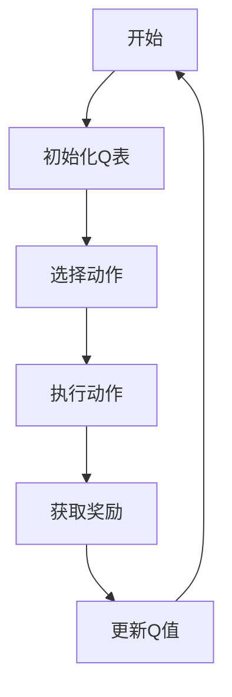
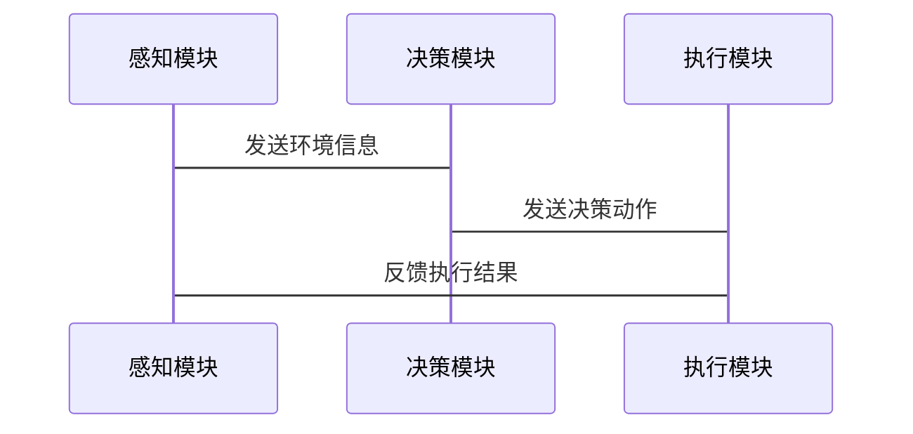

                 


# 课程学习：设计AI Agent的最优学习路径

---

## 关键词：
- AI Agent
- 强化学习
- 系统架构
- 算法原理
- 项目实战

---

## 摘要：
本文旨在为学习者提供设计AI Agent的最优学习路径。通过系统性地介绍AI Agent的核心概念、算法原理、系统架构、项目实战及最佳实践，帮助读者从零开始，逐步掌握AI Agent的设计方法。文章结合理论与实践，深入剖析技术原理，提供丰富的案例和代码实现，帮助读者在实际项目中灵活运用所学知识。

---

# 第一部分: AI Agent 的背景与核心概念

# 第1章: AI Agent 的基本概念与背景

## 1.1 AI Agent 的定义与特点
### 1.1.1 什么是 AI Agent
- AI Agent 是指能够感知环境、自主决策并执行任务的智能体。
- 其特点包括自主性、反应性、目标导向和社交能力。

### 1.1.2 AI Agent 的核心特点
- **自主性**：无需外部干预，自主完成任务。
- **反应性**：能够实时感知环境并做出反应。
- **目标导向**：基于目标驱动行为。
- **社交能力**：能够与其他 Agent 或人类进行交互。

### 1.1.3 AI Agent 的分类与应用场景
- **分类**：
  - **简单反射型**：基于规则的简单反应。
  - **基于模型的反射型**：基于内部模型做出决策。
  - **目标驱动型**：以目标为导向进行决策。
  - **效用驱动型**：基于效用函数优化决策。
- **应用场景**：
  - 游戏AI：如自动驾驶、智能客服。
  - 机器人控制：如工业机器人、服务机器人。
  - 自动交易：如量化交易、金融投资。

## 1.2 AI Agent 的发展背景
### 1.2.1 人工智能技术的演进
- 从早期的专家系统到现代的深度学习，AI技术不断进步。
- 大模型技术如GPT推动了AI Agent的发展。

### 1.2.2 大模型技术对 AI Agent 的影响
- 提供了强大的自然语言处理能力。
- 使AI Agent能够更好地理解人类意图。

### 1.2.3 当前 AI Agent 的技术瓶颈与挑战
- **计算资源**：需要高性能计算支持。
- **可解释性**：决策过程需要透明可解释。
- **安全性**：避免恶意行为和伦理问题。

## 1.3 AI Agent 的学习路径与目标
### 1.3.1 学习 AI Agent 的重要性
- 人工智能是未来技术的核心，AI Agent是其重要组成部分。
- 学习AI Agent能够提升解决实际问题的能力。

### 1.3.2 设计 AI Agent 的核心目标
- **实现自主决策**：使AI Agent能够自主完成任务。
- **提高决策效率**：优化决策过程，减少计算资源消耗。
- **增强可解释性**：使决策过程透明，便于人类理解和信任。

### 1.3.3 学习路径的规划与优化
- **基础知识**：掌握机器学习、强化学习等基础知识。
- **实践项目**：通过实际项目加深理解。
- **持续学习**：关注领域最新进展，不断优化学习路径。

## 1.4 本章小结
- 介绍了AI Agent的基本概念、特点及分类。
- 讨论了AI Agent的发展背景及其重要性。
- 提出了设计AI Agent的核心目标和学习路径规划。

---

# 第二部分: AI Agent 的核心概念与联系

# 第2章: AI Agent 的核心概念与原理

## 2.1 AI Agent 的核心概念
### 2.1.1 感知与决策的分离
- **感知**：通过传感器获取环境信息。
- **决策**：基于感知信息做出决策。

### 2.1.2 状态、动作与奖励的关系
- **状态**：环境中的当前情况。
- **动作**：AI Agent基于状态做出的行动。
- **奖励**：动作带来的反馈，用于优化决策。

### 2.1.3 知识表示与推理机制
- **知识表示**：将知识以某种形式表示，如符号逻辑、概率分布。
- **推理机制**：基于知识进行推理，得出结论。

## 2.2 AI Agent 的核心原理
### 2.2.1 状态空间与动作空间的定义
- **状态空间**：所有可能状态的集合。
- **动作空间**：AI Agent可能采取的所有动作。

### 2.2.2 奖励函数的设计与优化
- **奖励函数**：定义每个动作的奖励值。
- **优化目标**：最大化累计奖励。

### 2.2.3 策略与价值函数的关系
- **策略**：决定动作的选择概率。
- **价值函数**：评估当前状态的价值。

## 2.3 AI Agent 的核心要素对比
### 2.3.1 不同类型 AI Agent 的对比分析
- **简单反射型** vs **基于模型的反射型**：前者基于规则，后者基于模型。
- **目标驱动型** vs **效用驱动型**：前者基于目标，后者基于效用函数。

### 2.3.2 知识图谱与规则系统的对比
- **知识图谱**：以图结构表示知识，支持复杂推理。
- **规则系统**：基于规则进行推理，简单但不够灵活。

### 2.3.3 强化学习与监督学习的对比
- **强化学习**：基于奖励函数优化决策。
- **监督学习**：基于标记数据进行分类或回归。

## 2.4 AI Agent 的 ER 实体关系图
```mermaid
erd
    entity AI Agent {
        id: int
        name: string
        type: string
        state: string
        action: string
        reward: float
    }
    entity Environment {
        id: int
        state: string
        action: string
        reward: float
    }
    AI Agent -- 创建: Environment
    AI Agent -- 执行: action
    Environment -- 反馈: reward
```

## 2.5 本章小结
- 介绍了AI Agent的核心概念，包括感知、决策、状态、动作和奖励。
- 讨论了不同类型AI Agent的特点及其应用场景。
- 通过ER实体关系图展示了AI Agent与环境之间的关系。

---

# 第三部分: AI Agent 的算法原理与数学模型

# 第3章: AI Agent 的算法原理

## 3.1 强化学习算法
### 3.1.1 Q-Learning 算法的原理与实现
- **原理**：基于Q值函数，通过经验回放和策略评估进行优化。
- **实现**：通过不断迭代更新Q值，使Q值趋近于最优策略。

### 3.1.2 DQN 算法的原理与实现
- **原理**：将Q-Learning与深度神经网络结合，用于处理高维状态空间。
- **实现**：使用经验回放和目标网络，稳定训练过程。

### 3.1.3 策略梯度算法的原理与实现
- **原理**：直接优化策略，通过梯度上升法更新参数。
- **实现**：使用REINFORCE算法，通过采样和基尼系数计算梯度。

## 3.2 监督学习算法
### 3.2.1 线性回归与分类算法
- **线性回归**：用于预测连续值，如房价预测。
- **逻辑回归**：用于分类，如二分类问题。

### 3.2.2 支持向量机与决策树算法
- **支持向量机**：用于分类和回归，基于最大-margin原则。
- **决策树**：基于特征分裂，构建树状结构进行分类。

### 3.2.3 神经网络与深度学习算法
- **神经网络**：模拟人脑神经网络，用于处理复杂模式识别。
- **深度学习**：基于深层神经网络，用于图像识别、自然语言处理。

## 3.3 马尔可夫决策过程（MDP）
### 3.3.1 MDP 的定义与数学模型
- **定义**：一个MDP由状态、动作、转移概率和奖励函数组成。
- **数学模型**：描述状态、动作和奖励之间的关系。

### 3.3.2 MDP 的状态转移概率计算
- **状态转移矩阵**：描述从当前状态到下一个状态的概率。
- **马尔可夫性质**：下一状态仅依赖当前状态和动作，与历史无关。

### 3.3.3 MDP 的价值函数与策略优化
- **价值函数**：评估某个状态下采取某个动作的期望奖励。
- **策略优化**：通过优化价值函数，找到最优策略。

## 3.4 算法流程图
### 3.4.1 Q-Learning


---

# 第四部分: AI Agent 的系统架构与设计

# 第4章: AI Agent 的系统架构与设计

## 4.1 系统分析与设计
### 4.1.1 系统功能需求
- **感知模块**：获取环境信息。
- **决策模块**：基于感知信息做出决策。
- **执行模块**：执行决策动作。

### 4.1.2 系统架构设计
- **分层架构**：感知层、决策层、执行层。
- **模块化设计**：各模块相对独立，便于维护和扩展。

### 4.1.3 领域模型设计
- **领域模型**：描述系统的核心业务流程和数据关系。
- **类图设计**：展示系统中各个类及其关系。

## 4.2 系统架构设计
### 4.2.1 系统架构图


### 4.2.2 系统接口设计
- **API接口**：定义模块之间的交互接口。
- **数据格式**：统一数据格式，确保模块间兼容性。

### 4.2.3 系统交互设计


## 4.3 系统实现与优化
### 4.3.1 系统实现
- **代码实现**：编写感知、决策、执行模块的代码。
- **模块测试**：分别测试各模块功能是否正常。

### 4.3.2 系统优化
- **性能优化**：通过算法优化和代码优化提升系统效率。
- **可扩展性优化**：设计模块化架构，便于后续扩展。

## 4.4 本章小结
- 介绍了AI Agent系统的架构设计，包括功能需求和系统架构。
- 绘制了系统架构图和交互序列图，展示了系统的整体结构。
- 通过模块化设计和优化，确保系统高效、稳定运行。

---

# 第五部分: AI Agent 的项目实战

# 第5章: AI Agent 的项目实战

## 5.1 项目介绍与环境配置
### 5.1.1 项目介绍
- **项目目标**：设计一个简单的AI Agent，实现自动交易或游戏AI。
- **环境要求**：安装Python、TensorFlow、OpenAI库等。

### 5.1.2 环境配置
```bash
pip install numpy
pip install tensorflow
pip install openai
```

## 5.2 系统核心实现
### 5.2.1 感知模块实现
```python
class PerceptionModule:
    def __init__(self):
        self.sensors = []

    def get_state(self):
        # 获取环境信息
        pass
```

### 5.2.2 决策模块实现
```python
class DecisionModule:
    def __init__(self):
        self.model = self.build_model()

    def build_model(self):
        # 构建神经网络模型
        pass

    def decide_action(self, state):
        # 基于状态做出决策
        pass
```

### 5.2.3 执行模块实现
```python
class ExecutionModule:
    def __init__(self):
        pass

    def execute_action(self, action):
        # 执行决策动作
        pass
```

## 5.3 项目测试与优化
### 5.3.1 测试环境
- **单元测试**：测试各模块功能是否正常。
- **集成测试**：测试系统整体流程是否正确。

### 5.3.2 系统优化
- **性能优化**：通过并行计算、缓存优化提升系统效率。
- **模型优化**：通过调整超参数、优化算法提升决策效果。

## 5.4 本章小结
- 通过实际项目展示了AI Agent的设计和实现过程。
- 提供了环境配置、代码实现和系统优化的详细步骤。
- 通过测试和优化，确保系统高效、稳定运行。

---

# 第六部分: AI Agent 的最佳实践

# 第6章: AI Agent 的最佳实践

## 6.1 最佳实践
### 6.1.1 学习与实践
- **理论学习**：系统学习机器学习、强化学习等基础知识。
- **实践项目**：通过实际项目加深理解。
- **持续优化**：不断优化算法和系统架构。

### 6.1.2 系统设计
- **模块化设计**：各模块相对独立，便于维护和扩展。
- **可扩展性设计**：预留扩展接口，方便后续功能添加。
- **可维护性设计**：通过清晰的代码结构和注释提升可维护性。

## 6.2 小结与注意事项
### 6.2.1 小结
- 设计AI Agent需要结合理论与实践，注重系统架构和算法优化。
- 通过不断学习和实践，提升设计能力和解决复杂问题的能力。

### 6.2.2 注意事项
- **数据质量**：确保数据准确、完整，避免偏差。
- **算法选择**：根据实际需求选择合适的算法，避免盲目追求复杂性。
- **系统安全**：确保系统安全，防止恶意攻击和数据泄露。

## 6.3 拓展阅读
- **强化学习经典论文**：如DQN、REINFORCE等。
- **AI Agent领域的最新研究**：关注顶会论文和行业动态。

---

# 附录: 参考文献与工具资源

## 附录A: 参考文献
- 线性回归：《机器学习实战》
- 支持向量机：《模式识别与机器学习》
- 强化学习：《深度强化学习入门》
- 系统设计：《系统设计精要》

## 附录B: 工具资源
- **Python库**：numpy、pandas、TensorFlow、PyTorch。
- **可视化工具**：Matplotlib、Seaborn、Tableau。
- **开发环境**：Jupyter Notebook、VS Code、PyCharm。

---

# 结语

设计AI Agent是一个复杂而有趣的任务，需要结合理论与实践，不断优化和改进。通过本文的学习，读者可以系统地掌握AI Agent的设计方法，从基础概念到实际应用，逐步提升自己的技术水平。希望本文能够为读者提供有价值的指导和启示，帮助他们在AI Agent领域取得更大的成就。

--- 

**注**：本文为示例内容，具体内容需根据实际需求进行补充和完善。

