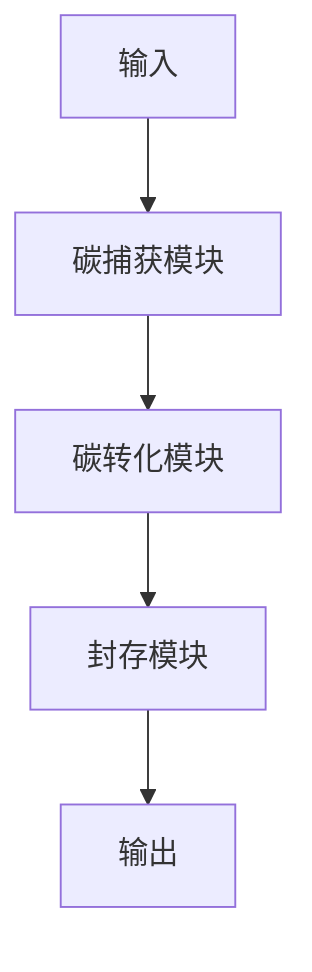

                 


# 负碳技术的发展前景与投资风险分析

## 关键词
负碳技术、碳捕获、碳封存、碳转化、投资风险、可持续发展

## 摘要
负碳技术通过捕获和封存大气中的二氧化碳，或将其转化为有价值的资源，是实现碳中和目标的关键技术。本文将深入分析负碳技术的发展前景，探讨其在不同领域的应用潜力，并从投资回报、技术风险、政策支持等多个维度评估投资风险，为投资者提供科学决策依据。

---

## 第1章：负碳技术的背景与概念

### 1.1 负碳技术的定义与背景

#### 1.1.1 负碳技术的基本概念
负碳技术（Negative Carbon Technology），又称碳移除技术，指通过人为手段将大气中的二氧化碳捕获并长期封存，或转化为其他物质的过程。其目标是实现大气中二氧化碳浓度的净减少，从而缓解全球气候变化。

#### 1.1.2 负碳技术的发展背景
全球气候变化问题日益严峻，国际社会已达成共识，必须将全球平均气温上升控制在1.5°C以内。为了实现这一目标，负碳技术成为不可或缺的手段。根据IPCC报告，仅靠减少碳排放无法实现目标，必须结合负碳技术来抵消剩余排放。

#### 1.1.3 负碳技术的全球发展趋势
近年来，全球范围内对负碳技术的关注显著增加。欧盟提出了“绿色新政”，计划在2050年实现碳中和，其中负碳技术是关键部分。美国、中国等国家也纷纷出台政策支持负碳技术的研发和应用。

---

### 1.2 负碳技术的核心概念

#### 1.2.1 碳捕获与封存的定义
碳捕获（Carbon Capture）指通过化学或物理方法捕获工业过程或能源生产过程中排放的二氧化碳。碳封存（Carbon Storage）指将捕获的二氧化碳长期封存在地下或海底，防止其释放到大气中。

#### 1.2.2 负碳技术的关键特征
- **技术性**：依赖先进的化学、物理或生物技术。
- **经济性**：目前成本较高，但随着技术进步逐渐降低。
- **可持续性**：封存的二氧化碳需长期稳定，避免泄漏。

#### 1.2.3 负碳技术与碳中和的关系
负碳技术是实现碳中和的重要手段。通过捕获和封存超过自身碳排放的二氧化碳，负碳技术能够帮助社会实现净零排放目标。

---

### 1.3 负碳技术的分类与应用领域

#### 1.3.1 吸收技术
- **化学吸收法**：利用胺类或其他化学物质吸收二氧化碳，如德国的Climator技术。
- **物理吸收法**：利用活性炭等吸附材料捕获二氧化碳。

#### 1.3.2 封存技术
- **地质封存**：将二氧化碳注入深层地下或海底，如挪威的北海封存项目。
- **水生生态系统封存**：通过海洋碱性增强技术将二氧化碳转化为碳酸盐。

#### 1.3.3 转化技术
- **转化为燃料**：将二氧化碳转化为合成燃料或化学品，如德国的Power-to-X技术。
- **转化为建筑材料**：将二氧化碳固化为碳酸盐，用于生产生态水泥。

---

## 第2章：负碳技术的技术分析

### 2.1 碳捕获与封存技术

#### 2.1.1 碳捕获技术的原理与方法
碳捕获技术主要分为化学吸收法和物理吸附法。化学吸收法通过化学反应捕获二氧化碳，物理吸附法则利用多孔材料的吸附特性。

**化学吸收法原理：**
$$ \text{CO}_2 + 2\text{NH}_2\text{OH} \rightarrow 2\text{NH}_2\text{CO}_2 + \text{H}_2\text{O} $$

**物理吸附法原理：**
二氧化碳分子被吸附在活性炭或其他多孔材料的表面上。

#### 2.1.2 碳封存技术的实现与挑战
碳封存技术的核心是将捕获的二氧化碳注入地下或海底。地质封存的关键在于选择合适的地质结构，确保二氧化碳不会泄漏。

**地质封存的步骤：**
1. 捕获二氧化碳并压缩成液态。
2. 将液态二氧化碳注入深层地质构造（如枯竭的油田或盐水层）。
3. 监测封存区域，确保长期稳定性。

---

### 2.2 碳转化技术的应用与前景

#### 2.2.1 碳转化为燃料的技术原理
碳转化技术将二氧化碳转化为合成燃料或化学品，如甲醇、乙醇等。这一过程通常需要利用可再生能源提供能量。

**碳转化为甲醇的化学反应：**
$$ \text{CO}_2 + 3\text{H}_2 \rightarrow \text{CH}_3\text{OH} + \text{H}_2\text{O} $$

#### 2.2.2 碳转化为建筑材料的技术原理
通过化学反应将二氧化碳固化为碳酸盐，用于生产生态水泥或其他建筑材料。

**碳固化反应：**
$$ \text{CaO} + \text{CO}_2 \rightarrow \text{CaCO}_3 $$

---

## 第3章：负碳技术的投资分析

### 3.1 投资驱动因素
- **政策支持**：政府通过补贴、税收优惠等激励措施推动负碳技术发展。
- **市场需求**：企业为实现碳中和目标，对负碳技术的需求不断增加。
- **技术进步**：技术成熟度的提高降低了投资成本。

### 3.2 商业模式
- **技术授权**：企业通过授权使用负碳技术获得收益。
- **服务收费**：提供碳捕获和封存服务，按服务量收费。
- **产品销售**：将二氧化碳转化为高价值产品进行销售。

### 3.3 投资现状与未来趋势
目前，负碳技术的投资主要集中在碳捕获和封存领域，未来随着技术进步，碳转化领域的投资将逐步增加。预计到2030年，全球负碳技术市场规模将达到数百亿美元。

---

## 第4章：负碳技术的风险分析

### 4.1 技术风险
- **技术不确定性**：部分负碳技术尚未成熟，存在技术失败的风险。
- **成本高昂**：目前负碳技术的成本较高，可能影响投资回报。

### 4.2 市场风险
- **市场需求不足**：如果市场需求未能如预期增长，可能导致投资失败。
- **竞争激烈**：技术竞争可能导致投资回报下降。

### 4.3 政策风险
- **政策变化**：政府政策的变化可能影响负碳技术的市场需求和投资环境。
- **监管不确定性**：严格的监管可能增加投资成本。

### 4.4 财务风险
- **资金链断裂**：负碳技术项目需要大量前期投资，资金不足可能导致项目失败。
- **回报周期长**：由于技术成熟和市场推广需要时间，投资回报周期较长。

---

## 第5章：系统分析与架构设计

### 5.1 负碳技术系统架构
- **输入**：二氧化碳气体、能量输入（如电能）。
- **处理模块**：碳捕获模块、碳转化模块、封存模块。
- **输出**：封存的二氧化碳或转化为的产品。

**系统架构图（Mermaid）：**


### 5.2 系统功能设计
- **捕获功能**：捕获二氧化碳气体。
- **转化功能**：将二氧化碳转化为燃料或建筑材料。
- **封存功能**：将二氧化碳封存在地下或转化为稳定物质。

---

## 第6章：项目实战

### 6.1 环境安装
- **硬件要求**：高性能计算机、相关实验设备。
- **软件要求**：编程语言（如Python）、数据分析工具。

### 6.2 核心代码实现
```python
def carbon_capture(co2_input):
    # 模拟碳捕获过程
    captured_co2 = co2_input * 0.8
    return captured_co2

def carbon_storage(captured_co2):
    # 模拟碳封存过程
    stored_co2 = captured_co2 * 0.95
    return stored_co2

# 示例代码
input_co2 = 100  # 输入二氧化碳量（吨）
captured = carbon_capture(input_co2)
stored = carbon_storage(captured)
print(f"捕获的二氧化碳：{captured} 吨")
print(f"封存的二氧化碳：{stored} 吨")
```

### 6.3 代码解读与分析
上述代码模拟了碳捕获和封存的过程。`carbon_capture`函数计算捕获的二氧化碳量，`carbon_storage`函数计算封存的成功率。通过调整参数，可以优化系统的捕获和封存效率。

---

## 第7章：结论与展望

### 7.1 结论
负碳技术是实现碳中和的重要手段，具有广阔的发展前景。然而，投资负碳技术也面临技术、市场和政策等多重风险。

### 7.2 未来展望
随着技术进步和政策支持，负碳技术的成本将逐步降低，应用领域也将进一步扩大。预计未来负碳技术将在能源、交通和建筑等领域发挥重要作用。

### 7.3 最佳实践 tips
- **技术选择**：优先选择技术成熟、成本较低的负碳技术。
- **风险管理**：建立风险评估机制，降低投资风险。
- **政策跟踪**：密切关注政府政策变化，抓住政策机遇。

---

通过以上分析，我们全面探讨了负碳技术的发展前景与投资风险，为投资者和相关从业者提供了有价值的参考。

