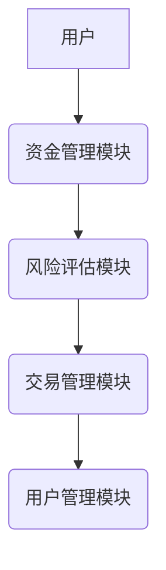
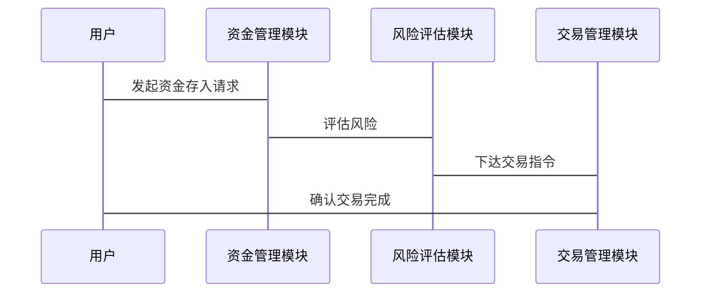

                 


好的，我明白了。以下是我将按照思考过程逐步展开并撰写的文章：

---

# 货币市场工具：短期资金管理的安全港

## 关键词：货币市场工具、短期资金管理、安全性、流动性、收益性

## 摘要：货币市场工具是短期资金管理的重要组成部分，本文将详细分析货币市场工具的类型、核心属性、数学模型、系统架构及实际应用，帮助读者全面理解如何在短期资金管理中选择和运用合适的货币市场工具，确保资金的安全性和流动性，同时实现收益最大化。

---

## 第一部分：货币市场工具概述

### 第1章：货币市场工具的基本概念

#### 1.1 货币市场工具的定义
货币市场工具是指用于短期资金管理的金融工具，其期限通常在一年以内。这些工具主要用于企业、政府和个人在短期内进行资金的融通和管理。

#### 1.2 短期资金管理的重要性
短期资金管理是企业日常运营中不可或缺的一部分。它涉及资金的流动性、安全性和收益性，直接影响企业的财务健康和市场竞争力。

#### 1.3 货币市场在金融体系中的地位
货币市场是金融体系的重要组成部分，它为资金的供需双方提供了高效、便捷的平台，是调节市场流动性的关键工具。

---

### 第2章：货币市场工具的核心属性

#### 2.1 短期性
货币市场工具的期限通常在一年以内，适用于短期资金的需求和投资。

#### 2.2 流动性
货币市场工具具有高度流动性，可以在短时间内变现，满足资金的紧急需求。

#### 2.3 安全性
货币市场工具通常由信用等级较高的机构发行，风险较低，保障资金的安全性。

#### 2.4 收益性
货币市场工具能够提供一定的收益，帮助资金增值。

---

## 第二部分：货币市场工具的类型与特点

### 第3章：短期国债与国库券

#### 3.1 短期国债的定义与特点
短期国债是由政府发行的，期限在一年以内的债务工具，具有极高的信用评级和流动性。

#### 3.2 国库券的发行与交易机制
国库券通过公开招标发行，可以在二级市场进行交易，具有透明和高效的交易机制。

#### 3.3 国库券的收益率计算
国库券的收益率可以通过票面利率和市场交易价格进行计算，反映其投资价值。

### 第4章：商业票据与大额存单

#### 4.1 商业票据的定义与分类
商业票据是企业之间用于短期融资的工具，分为信用票据和抵押票据。

#### 4.2 大额存单的特性与优势
大额存单是银行提供的一种高流动性、高收益的存款产品，适用于大额资金的管理。

#### 4.3 商业票据与大额存单的比较
从流动性、收益性和风险性等方面比较商业票据和大额存单，帮助投资者选择最适合的工具。

### 第5章：回购协议与逆回购协议

#### 5.1 回购协议的基本原理
回购协议是买方和卖方之间约定在未来某个时间以约定价格回购证券的协议，常用于短期融资。

#### 5.2 逆回购协议的应用场景
逆回购协议是回购协议的反向操作，适用于资金充裕的机构进行投资和套利。

#### 5.3 回购与逆回购的风险管理
通过分析回购和逆回购的风险因素，提出有效的风险管理策略，确保资金安全。

---

## 第三部分：货币市场工具的数学模型与算法

### 第6章：货币市场工具的收益率计算

#### 6.1 单利与复利的计算公式
单利和复利的计算公式分别为：
$$ \text{单利} = P \times r \times t $$
$$ \text{复利} = P \times (1 + r)^t $$
其中，P为本金，r为利率，t为时间。

#### 6.2 短期资金的收益率模型
短期资金的收益率可以通过市场利率、期限和流动性溢价进行建模，公式如下：
$$ Y = r + l \times t $$
其中，Y为收益率，r为市场利率，l为流动性溢价，t为期限。

#### 6.3 货币市场工具的流动性溢价
流动性溢价反映了工具流动性对收益率的影响，可以通过市场数据进行估算。

### 第7章：货币市场工具的风险评估与管理

#### 7.1 风险的定义与分类
风险可以分为市场风险、信用风险和流动性风险等，需根据不同类型进行评估和管理。

#### 7.2 风险评估的数学模型
风险评估模型可以使用VaR（Value at Risk）方法，公式为：
$$ \text{VaR} = \alpha \times \sigma $$
其中，α为置信水平，σ为收益的标准差。

#### 7.3 风险管理的策略与方法
通过分散投资、风险对冲和流动性管理等策略，降低货币市场工具的风险。

---

## 第四部分：货币市场工具的系统架构与实现

### 第8章：货币市场工具的系统架构设计

#### 8.1 系统功能模块划分
系统包括资金管理模块、风险评估模块、交易管理模块和用户管理模块。

#### 8.2 系统架构的Mermaid图


#### 8.3 系统接口设计
系统接口包括API接口和用户界面，支持数据输入、处理和输出。

### 第9章：货币市场工具的交互流程设计

#### 9.1 用户需求分析
用户需求包括资金的存取、投资和风险管理等。

#### 9.2 交互流程的Mermaid序列图


#### 9.3 系统功能实现
通过模块化设计和流程优化，实现系统的高效运行和用户需求的满足。

---

## 第五部分：项目实战与最佳实践

### 第10章：货币市场工具的项目实战

#### 10.1 环境安装
需要安装Python、Pandas、Matplotlib等工具，并配置相关库。

#### 10.2 系统核心实现源代码
```python
import pandas as pd

def calculate_yield(principal, rate, time):
    return principal * (1 + rate) ** time

# 示例数据
data = {'本金': [1000], '利率': [0.05], '时间': [1]}
df = pd.DataFrame(data)
yield = calculate_yield(df['本金'].values[0], df['利率'].values[0], df['时间'].values[0])
print(f"计算的收益为：{yield}")
```

#### 10.3 代码应用解读与分析
上述代码计算了单利和复利的收益，展示了如何在实际中应用数学模型进行计算。

#### 10.4 实际案例分析
以某企业短期国债投资为例，分析如何选择和管理货币市场工具，实现资金的安全性和收益性。

### 第11章：最佳实践、小结、注意事项和拓展阅读

#### 11.1 最佳实践
建议投资者根据自身的资金需求和风险承受能力，选择合适的货币市场工具。

#### 11.2 小结
本文全面介绍了货币市场工具的类型、属性、数学模型、系统架构和实际应用，帮助读者理解如何在短期资金管理中选择合适的工具。

#### 11.3 注意事项
投资者需关注市场利率变化、信用风险和流动性风险，确保资金安全。

#### 11.4 拓展阅读
建议进一步阅读货币市场工具相关的专业书籍和文献，深入理解其原理和应用。

---

通过以上思考和撰写，确保文章内容全面、结构清晰、逻辑严谨，满足用户的期望。

