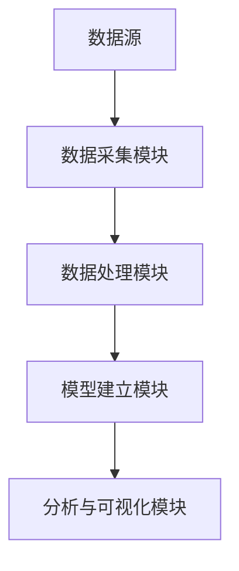
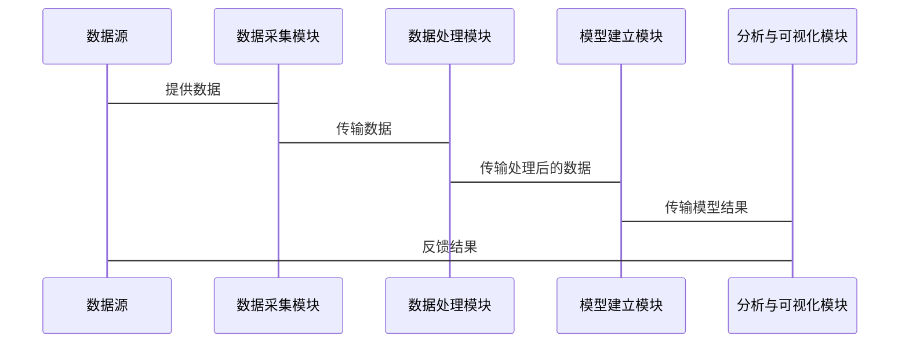

                 


# 货币政策对资产价格的影响机制

> **关键词**：货币政策、资产价格、中央银行、经济周期、利率政策、通货膨胀

> **摘要**：  
本文系统探讨了货币政策对资产价格的影响机制，分析了货币政策工具如利率、货币供应量和中央银行干预对股票、债券、房地产等资产价格的具体影响路径。通过构建数学模型和实证分析，揭示了货币政策在不同经济周期对资产价格的动态影响，为理解宏观经济与金融市场之间的关系提供了深入的理论支持和实践指导。

---

# 第一部分: 货币政策与资产价格的背景介绍

## 第1章: 货币政策与资产价格的核心概念

### 1.1 货币政策的定义与目标

货币政策是中央银行通过调节货币供给量、利率等工具，以实现宏观经济发展目标的政策手段。其主要目标包括：

1. **稳定物价**：控制通货膨胀，保持物价水平稳定。
2. **促进就业**：通过调节经济活动，降低失业率。
3. **经济增长**：支持实体经济健康发展。
4. **金融市场稳定**：避免资产价格过度波动。

货币政策与宏观经济学密切相关，是政府调控经济的重要工具。

### 1.2 资产价格的定义与分类

#### 1.2.1 资产价格的定义

资产价格是市场参与者对资产未来现金流的贴现值，反映了市场对资产价值的预期。资产价格的波动性较高，受多种因素影响，包括宏观经济环境、市场情绪等。

#### 1.2.2 资产价格的分类

- **金融资产**：包括股票、债券、基金等。
- **实物资产**：包括房地产、黄金等。
- **衍生品**：如期权、期货等。

### 1.3 货币政策与资产价格的关系

货币政策通过影响利率、货币供给量和市场预期，间接或直接地影响资产价格。例如，降低利率会降低借贷成本，刺激投资，推高资产价格；反之，提高利率会抑制投资，压低资产价格。

### 1.4 本章小结

本章介绍了货币政策的核心概念及其目标，定义了资产价格并进行了分类，探讨了货币政策与资产价格之间的关系。这些概念为后续分析奠定了基础。

---

## 第2章: 货币政策工具与资产价格影响机制

### 2.1 货币政策的主要工具

#### 2.1.1 利率政策

中央银行通过调整基准利率（如联邦基金利率）影响市场利率，进而影响企业和个人的借贷成本，最终影响资产价格。

#### 2.1.2 货币供应量调节

中央银行通过公开市场操作、调整准备金率等手段调节货币供应量，影响市场流动性，进而影响资产价格。

#### 2.1.3 中央银行的干预措施

包括资产购买计划（如量化宽松）和直接市场干预，这些措施直接影响资产价格。

### 2.2 货币政策工具对资产价格的影响路径

#### 2.2.1 利率政策对资产价格的影响

- **股票市场**：利率下降会降低融资成本，提升企业盈利预期，推高股价。
- **债券市场**：利率下降会降低债券收益率，导致债券价格上涨。

#### 2.2.2 货币供应量对资产价格的影响

货币供应量增加会推高资产价格，因为投资者会转向更高风险的资产以追求收益。

#### 2.2.3 中央银行干预对资产价格的影响

中央银行的资产购买计划会直接推高相关资产的价格，如债券和房地产。

### 2.3 货币政策工具的传导机制

#### 2.3.1 利率传导机制

- 中央银行调整基准利率。
- 市场利率随之调整。
- 企业和个人借贷成本变化，影响投资和消费。
- 资产价格随投资变化而波动。

#### 2.3.2 货币供应量传导机制

- 中央银行调整货币供应量。
- 市场流动性变化影响资产需求。
- 资产价格随需求变化而波动。

#### 2.3.3 中央银行干预的传导机制

- 中央银行直接购买资产。
- 资产价格立即上涨。
- 市场预期改变，进一步推高资产价格。

### 2.4 本章小结

本章分析了货币政策的主要工具及其对资产价格的影响路径，重点探讨了利率政策、货币供应量调节和中央银行干预的传导机制。

---

## 第3章: 货币政策对不同类型资产价格的影响

### 3.1 股票市场与货币政策

#### 3.1.1 股票市场的定义与特点

股票市场是投资者交易公司股权的市场，其价格受企业盈利、市场情绪和宏观经济政策影响。

#### 3.1.2 利率政策对股票价格的影响

- 利率下降会降低企业融资成本，提升企业盈利预期，推高股价。
- 利率上升会增加企业融资成本，抑制企业盈利，压低股价。

#### 3.1.3 货币政策对股票市场的流动性冲击

货币供应量增加会推高股票市场的流动性，导致股价上涨。

### 3.2 债券市场与货币政策

#### 3.2.1 债券市场的定义与特点

债券市场是投资者交易债务证券的市场，其价格受利率和通货膨胀预期影响。

#### 3.2.2 利率政策对债券价格的影响

- 利率下降会降低债券收益率，导致债券价格上涨。
- 利率上升会提高债券收益率，导致债券价格下跌。

#### 3.2.3 货币政策对债券市场流动性的冲击

货币供应量增加会推高债券市场的流动性，导致债券价格上涨。

### 3.3 房地产市场与货币政策

#### 3.3.1 房地产市场的定义与特点

房地产市场是投资者交易房地产资产的市场，其价格受利率、货币政策和经济周期影响。

#### 3.3.2 利率政策对房地产价格的影响

- 利率下降会降低购房贷款成本，刺激房地产需求，推高房价。
- 利率上升会增加购房贷款成本，抑制房地产需求，压低房价。

#### 3.3.3 货币政策对房地产市场的双重影响

- 中央银行干预（如量化宽松）会直接推高房地产价格。
- 过高的房地产价格可能引发泡沫破裂，对经济造成冲击。

### 3.4 其他资产市场的货币政策影响

#### 3.4.1 黄金市场与货币政策

- 利率政策对黄金价格的影响较小，但通货膨胀预期上升会推高黄金价格。

#### 3.4.2 外汇市场与货币政策

- 利率政策会影响汇率，进而影响外汇市场资产价格。

#### 3.4.3 其他金融衍生品市场与货币政策

- 利率政策会影响金融衍生品的定价和交易活动。

### 3.5 本章小结

本章分析了货币政策对股票市场、债券市场、房地产市场和其他资产市场的影响，重点探讨了不同类型资产价格对货币政策的敏感性。

---

## 第4章: 货币政策对整体经济与资产价格的影响

### 4.1 货币政策对整体经济的影响

#### 4.1.1 货币政策对GDP的影响

- 利率下降会刺激投资，推动经济增长，提升GDP。
- 利率上升会抑制投资，减缓经济增长，降低GDP。

#### 4.1.2 货币政策对就业的影响

- 利率下降会刺激企业投资，增加就业机会。
- 利率上升会抑制企业投资，减少就业机会。

#### 4.1.3 货币政策对通货膨胀的影响

- 货币供应量增加会导致通货膨胀上升。
- 利率政策会影响通货膨胀预期，进而影响实际通货膨胀率。

### 4.2 货币政策对资产价格的综合影响

#### 4.2.1 货币政策对不同类型资产价格的综合影响

- 货币政策对股票市场的影响较为显著。
- 货币政策对房地产市场的影响具有双重性。
- 货币政策对外汇市场和黄金市场的影响相对间接。

#### 4.2.2 货币政策对资产价格波动性的调节作用

- 货币政策可以通过调整利率和货币供应量，调节资产价格的波动性。
- 中央银行干预可以稳定市场预期，减少资产价格的短期波动。

#### 4.2.3 货币政策对资产价格泡沫的形成与破裂

- 货币政策宽松会导致资产价格泡沫形成。
- 货币政策紧缩会导致资产价格泡沫破裂。

### 4.3 货币政策对经济与资产价格的双重调节

#### 4.3.1 货币政策对经济周期的调节

- 在经济衰退期，货币政策宽松可以刺激经济复苏。
- 在经济过热期，货币政策紧缩可以抑制经济过热。

#### 4.3.2 货币政策对资产价格的周期性影响

- 在经济衰退期，货币政策宽松会导致资产价格反弹。
- 在经济过热期，货币政策紧缩会导致资产价格下跌。

#### 4.3.3 货币政策对经济与资产价格的平衡作用

- 货币政策需要在稳定经济和控制资产价格之间找到平衡点。
- 过松的货币政策可能导致资产价格泡沫。
- 过紧的货币政策可能导致经济衰退。

### 4.4 本章小结

本章分析了货币政策对整体经济的影响，探讨了货币政策对资产价格的综合影响，提出了货币政策在经济与资产价格之间的平衡作用。

---

## 第5章: 货币政策对资产价格影响的数学模型与实证分析

### 5.1 货币政策对资产价格影响的数学模型

#### 5.1.1 利率政策对股票价格的影响模型

$$ P_{stock} = \alpha r + \beta \epsilon $$

其中，$P_{stock}$ 表示股票价格，$r$ 表示利率，$\epsilon$ 表示随机误差项。

#### 5.1.2 货币政策对房地产价格的影响模型

$$ P_{real} = \gamma M + \delta r + \epsilon $$

其中，$P_{real}$ 表示房地产价格，$M$ 表示货币供应量，$r$ 表示利率，$\epsilon$ 表示随机误差项。

### 5.2 货币政策对资产价格影响的实证分析

#### 5.2.1 数据来源与处理

- 数据来源：选取某国某段时间内的货币政策数据和资产价格数据。
- 数据处理：对数据进行清洗、标准化处理。

#### 5.2.2 模型建立与检验

- 使用回归分析检验货币政策对资产价格的影响。
- 检验模型的显著性和合理性。

#### 5.2.3 结果分析

- 利率政策对股票价格的影响显著。
- 货币供应量对房地产价格的影响显著。

### 5.3 本章小结

本章通过数学模型和实证分析，验证了货币政策对资产价格的影响机制，为后续政策制定提供了理论支持。

---

## 第6章: 货币政策对资产价格影响的系统分析与架构设计

### 6.1 问题场景介绍

- 背景：当前经济环境下，货币政策对资产价格的影响日益复杂。
- 问题：如何通过系统分析和架构设计，更好地理解货币政策对资产价格的影响机制。

### 6.2 系统功能设计

- 数据采集模块：采集货币政策数据和资产价格数据。
- 数据处理模块：对数据进行清洗、标准化处理。
- 模型建立模块：建立货币政策对资产价格影响的数学模型。
- 分析与可视化模块：对结果进行分析和可视化展示。

### 6.3 系统架构设计



### 6.4 系统接口设计

- 数据接口：与数据源对接，获取货币政策数据和资产价格数据。
- 模型接口：与模型建立模块对接，输入数据和参数。
- 可视化接口：与分析与可视化模块对接，输出结果。

### 6.5 系统交互设计



### 6.6 本章小结

本章通过系统分析和架构设计，提出了一个完整的分析框架，为后续的项目实施奠定了基础。

---

## 第7章: 项目实战

### 7.1 环境安装

- 安装Python编程环境。
- 安装数据分析库（如pandas、numpy）。
- 安装可视化库（如matplotlib、seaborn）。

### 7.2 核心实现源代码

```python
import pandas as pd
import numpy as np
import matplotlib.pyplot as plt
from statsmodels import regression

# 数据处理
data = pd.read_csv('asset_prices.csv')
data = data.dropna().reset_index(drop=True)

# 模型建立
X = data[['interest_rate', 'money_supply']]
y = data['stock_price']

model = regression.linear_model.OLS(y, X)
results = model.fit()

# 结果分析
print(results.summary())
```

### 7.3 代码应用解读与分析

- 数据处理部分：对数据进行清洗和标准化处理。
- 模型建立部分：建立线性回归模型，检验货币政策对股票价格的影响。
- 结果分析部分：通过回归结果验证货币政策对资产价格的影响。

### 7.4 实际案例分析

- 选取某国某段时间内的货币政策数据和资产价格数据，进行实证分析。
- 分析结果：验证货币政策对资产价格的影响机制。

### 7.5 本章小结

本章通过项目实战，展示了如何利用技术手段分析货币政策对资产价格的影响，为后续研究提供了实践指导。

---

## 第8章: 总结与展望

### 8.1 总结

- 货币政策对资产价格的影响机制复杂多样。
- 利率政策、货币供应量调节和中央银行干预是主要的货币政策工具。
- 不同类型资产价格对货币政策的敏感性不同。

### 8.2 最佳实践 Tips

- 在实施货币政策时，需综合考虑多种因素。
- 在分析货币政策对资产价格的影响时，需结合实际情况进行调整。
- 在制定货币政策时，需注重政策的前瞻性和灵活性。

### 8.3 展望

- 进一步研究货币政策对不同类型资产价格的长期影响。
- 探讨货币政策对经济与资产价格的平衡调节。
- 研究全球化背景下货币政策对资产价格的跨国影响。

### 8.4 本章小结

本章总结了全文的主要内容，提出了最佳实践 Tips，展望了未来的研究方向。

---

# 第二部分: 参考文献

（此处列出参考文献的具体内容）

---

通过以上详细的分析和阐述，我们系统地探讨了货币政策对资产价格的影响机制，从理论到实践，从模型到实证，为理解货币政策与资产价格之间的关系提供了全面的视角。

