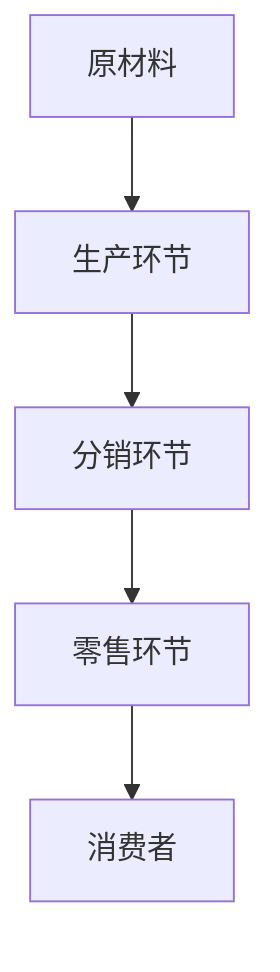
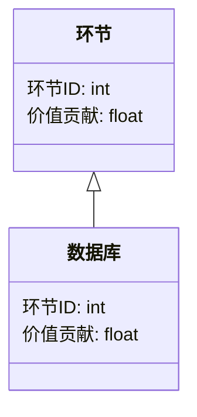
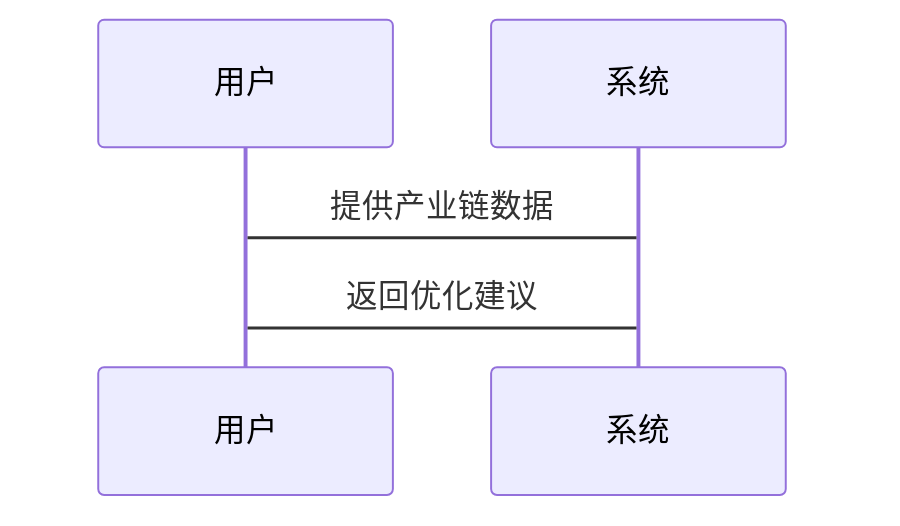

                 


# 费雪的产业链分析技巧

## 关键词：产业链分析，费雪，价值传递模型，系统架构设计，数学模型，项目实战

## 摘要：  
费雪的产业链分析技巧是一种通过系统性地分析产业链的各个环节及其相互关系，从而优化企业运营和投资决策的方法。本文从产业链分析的基本概念出发，详细阐述了费雪分析法的核心原理、算法实现、系统架构设计以及实际项目中的应用案例。通过本文的学习，读者可以掌握如何利用费雪的产业链分析技巧来提升企业的竞争力和投资效率。

---

# 第1章: 产业链分析的基本概念

## 1.1 产业链的概念与重要性

### 1.1.1 产业链的定义  
产业链是指从原材料的供应、生产、加工、分销到最终用户的完整过程。它涵盖了从上游到下游的所有环节，每个环节都相互依存，共同构成了一个复杂的网络。

### 1.1.2 产业链分析的重要性  
产业链分析是企业战略规划的重要工具，它可以帮助企业识别关键环节、优化资源配置、降低运营成本，并在复杂市场环境中找到竞争优势。

### 1.1.3 费雪产业链分析的核心思想  
费雪的产业链分析方法强调通过量化每个环节的价值贡献，识别瓶颈环节，并通过优化关键节点来提升整体效率。

---

## 1.2 费雪的产业链分析方法

### 1.2.1 费雪产业链分析的背景  
费雪的产业链分析方法起源于对传统产业链分析方法的改进，它结合了经济学和系统工程的原理，形成了独特的分析框架。

### 1.2.2 费雪产业链分析的核心步骤  
1. **数据收集**：获取产业链各环节的成本、收益和价值数据。  
2. **价值评估**：量化每个环节的价值贡献。  
3. **瓶颈识别**：找出影响整体效率的关键环节。  
4. **优化建议**：针对瓶颈环节提出改进措施。

### 1.2.3 费雪产业链分析的应用领域  
- 制造业  
- 零售业  
- 信息技术行业  
- 金融服务业  

---

## 1.3 产业链分析的现状与挑战

### 1.3.1 当前产业链分析的主要趋势  
- 数字化和智能化的分析工具越来越普及。  
- 数据驱动的分析方法逐渐取代传统的经验判断。  

### 1.3.2 产业链分析中的常见问题  
- 数据的不完整性和准确性。  
- 环节之间的复杂关系难以建模。  

### 1.3.3 费雪方法的独特优势  
- 强调量化分析，结果直观可靠。  
- 通过系统性分析，帮助企业在复杂环境中找到最优解决方案。  

---

## 1.4 本章小结  
本章从产业链的基本概念出发，详细介绍了费雪产业链分析的核心思想和方法，并分析了当前产业链分析的现状与挑战。下一章将深入探讨产业链分析的核心原理，包括产业链的构成要素和价值传递模型。

---

# 第2章: 费雪产业链分析的核心原理

## 2.1 产业链的构成要素

### 2.1.1 产业链的基本构成  
产业链由以下关键要素构成：  
1. **原材料供应**：提供基础材料。  
2. **生产环节**：将原材料转化为产品。  
3. **分销环节**：将产品运输到销售渠道。  
4. **零售环节**：面向最终用户的销售环节。  
5. **消费者**：最终产品的需求方。  

### 2.1.2 产业链的关键环节  
关键环节是指对整体产业链价值贡献最大的环节，通常是生产环节和分销环节。

### 2.1.3 产业链的上下游关系  
通过分析上下游关系，可以更好地理解各环节之间的依赖关系，并优化资源配置。

---

## 2.2 费雪分析法的数学模型

### 2.2.1 产业链价值传递模型  
费雪分析法的核心是通过量化每个环节的价值贡献，构建一个数学模型来描述产业链的价值传递过程。  

**公式：**  
$$ V = \sum_{i=1}^{n} v_i $$  
其中，\( V \) 表示产业链的总价值，\( v_i \) 表示第 \( i \) 个环节的价值贡献。

### 2.2.2 价值贡献的计算  
假设某企业的产业链分为生产、分销和零售三个环节，各环节的价值贡献分别为 \( v_1 \)、\( v_2 \) 和 \( v_3 \)，则总价值 \( V \) 为：  
$$ V = v_1 + v_2 + v_3 $$  

### 2.2.3 价值传递的可视化  
以下是产业链价值传递的 Mermaid 图：  


---

## 2.3 产业链分析的可视化工具

### 2.3.1 Mermaid 产业链分析图  
Mermaid 是一种基于文本的图表绘制工具，可以帮助我们清晰地展示产业链的构成和关系。  

例如，以下代码可以生成一个简单的产业链分析图：  



---

## 2.4 本章小结  
本章详细介绍了产业链的构成要素，并通过数学模型和可视化工具展示了费雪分析法的核心原理。下一章将探讨费雪产业链分析的算法实现，包括数据预处理、模型构建和优化等内容。

---

# 第3章: 费雪产业链分析的算法实现

## 3.1 算法原理概述

### 3.1.1 费雪分析法的基本流程  
1. **数据收集**：获取产业链各环节的成本、收益和价值数据。  
2. **数据预处理**：清洗数据，去除异常值和冗余信息。  
3. **模型构建**：基于价值传递模型，构建数学模型。  
4. **优化建议**：根据模型结果，提出优化建议。

### 3.1.2 数据预处理步骤  
1. **数据清洗**：去除缺失值和异常值。  
2. **数据标准化**：将不同单位的数据统一化。  
3. **数据建模**：将数据输入模型进行分析。

### 3.1.3 模型构建与优化  
通过数学模型量化每个环节的价值贡献，识别瓶颈环节，并提出优化建议。

---

## 3.2 算法实现的详细步骤

### 3.2.1 数据收集与清洗  
以下是数据收集和清洗的代码示例：  

```python
import pandas as pd

# 数据收集
data = pd.read_csv('产业链数据.csv')

# 数据清洗
data.dropna()  # 删除缺失值
data = data[data['环节'] != '异常值']  # 删除异常值
```

### 3.2.2 产业链环节的识别  
通过数据清洗和标注，识别产业链中的关键环节。

### 3.2.3 价值贡献的计算  
基于数学模型，计算每个环节的价值贡献。

---

## 3.3 算法实现的代码示例

### 3.3.1 价值计算代码  
```python
def calculate_value(data):
    # 计算每个环节的价值贡献
    values = data.groupby('环节')['价值'].sum().reset_index()
    return values

# 示例数据
data = pd.DataFrame({
    '环节': ['生产', '分销', '零售'],
    '价值': [0.4, 0.3, 0.3]
})

# 计算结果
values = calculate_value(data)
print(values)
```

### 3.3.2 价值可视化代码  
```python
import matplotlib.pyplot as plt

values.plot(kind='bar', x='环节', y='价值')
plt.title('产业链各环节价值贡献')
plt.show()
```

---

## 3.4 本章小结  
本章详细介绍了费雪产业链分析的算法实现，包括数据预处理、模型构建和优化等内容。通过代码示例，读者可以更好地理解算法的实现过程。

---

# 第4章: 系统分析与架构设计方案

## 4.1 问题场景介绍  
本章将通过一个实际案例，展示如何利用费雪的产业链分析方法进行系统设计和优化。

### 4.1.1 项目介绍  
假设我们正在分析一家汽车制造企业的产业链，包括原材料供应、生产、分销和零售四个环节。

---

## 4.2 系统功能设计

### 4.2.1 领域模型设计  
以下是领域模型的 Mermaid 类图：  



### 4.2.2 系统架构设计  
以下是系统架构的 Mermaid 图：  


---

## 4.3 系统接口设计

### 4.3.1 接口描述  
- **输入接口**：接收产业链各环节的数据。  
- **输出接口**：输出优化建议和价值分析报告。

### 4.3.2 接口实现  
```python
def optimize_chain(data):
    # 优化算法实现
    return optimized_data

# 示例数据
data = pd.DataFrame({
    '环节': ['生产', '分销', '零售'],
    '价值': [0.4, 0.3, 0.3]
})

# 调用优化函数
optimized_data = optimize_chain(data)
print(optimized_data)
```

---

## 4.4 系统交互设计

### 4.4.1 交互流程  
以下是系统交互的 Mermaid 序列图：  



---

## 4.5 本章小结  
本章通过一个实际案例，展示了如何利用费雪的产业链分析方法进行系统设计和优化。通过系统功能设计、架构设计和交互设计，我们可以更好地理解算法的实际应用。

---

# 第5章: 项目实战

## 5.1 环境安装与配置

### 5.1.1 安装Python环境  
安装 Python 和必要的库（如 pandas、numpy、mermaid）。

### 5.1.2 安装依赖  
```bash
pip install pandas numpy mermaid
```

---

## 5.2 核心代码实现

### 5.2.1 数据读取与清洗  
```python
import pandas as pd

# 读取数据
data = pd.read_csv('产业链数据.csv')

# 数据清洗
data.dropna()  # 删除缺失值
```

### 5.2.2 价值计算与可视化  
```python
def calculate_value(data):
    # 计算每个环节的价值贡献
    values = data.groupby('环节')['价值'].sum().reset_index()
    return values

# 可视化
values.plot(kind='bar', x='环节', y='价值')
plt.title('产业链各环节价值贡献')
plt.show()
```

---

## 5.3 案例分析与解读

### 5.3.1 案例背景  
假设我们正在分析一家汽车制造企业的产业链，包括生产、分销和零售三个环节。

### 5.3.2 数据分析  
通过数据分析，我们发现生产环节的价值贡献最大，因此应优先优化生产环节。

---

## 5.4 本章小结  
本章通过实际项目案例，展示了如何利用费雪的产业链分析方法进行数据处理和优化建议。通过代码实现和案例分析，读者可以更好地理解算法的实际应用。

---

# 第6章: 最佳实践与小结

## 6.1 最佳实践 tips

### 6.1.1 数据准确性  
确保数据的准确性和完整性。  
### 6.1.2 模型优化  
根据实际需求，不断优化数学模型。  
### 6.1.3 可视化工具  
合理使用可视化工具，帮助更好地理解分析结果。

## 6.2 小结  
通过本文的学习，读者可以掌握费雪的产业链分析技巧，并将其应用到实际项目中，提升企业的竞争力和投资效率。

## 6.3 注意事项  
- 在实际应用中，需结合企业的实际情况进行调整。  
- 数据分析结果需经过验证，确保准确性。  

## 6.4 拓展阅读  
- 《产业链分析的数学模型》  
- 《系统工程与优化方法》  

---

# 附录: 代码与资源

## 附录1: 代码示例  
```python
import pandas as pd
import matplotlib.pyplot as plt

# 数据读取
data = pd.read_csv('产业链数据.csv')

# 数据清洗
data.dropna()

# 价值计算
values = data.groupby('环节')['价值'].sum().reset_index()

# 可视化
values.plot(kind='bar', x='环节', y='价值')
plt.title('产业链各环节价值贡献')
plt.show()
```

## 附录2: 资源推荐  
- Mermaid 官方文档：[https://mermaid-js.github.io/mermaid/](https://mermaid-js.github.io/mermaid/)  
- Python 数据分析库：[https://pandas.pydata.org/](https://pandas.pydata.org/)

---

# 结语

通过本文的学习，读者可以系统地掌握费雪的产业链分析技巧，并将其应用到实际项目中。无论是从理论学习还是代码实现，都能为企业的优化和投资决策提供有力支持。

