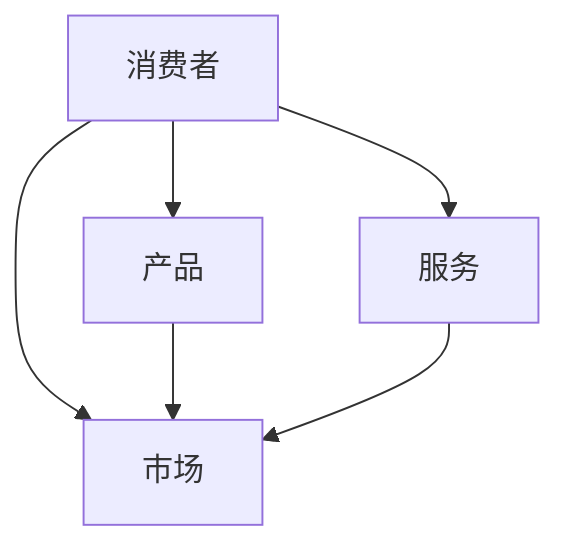
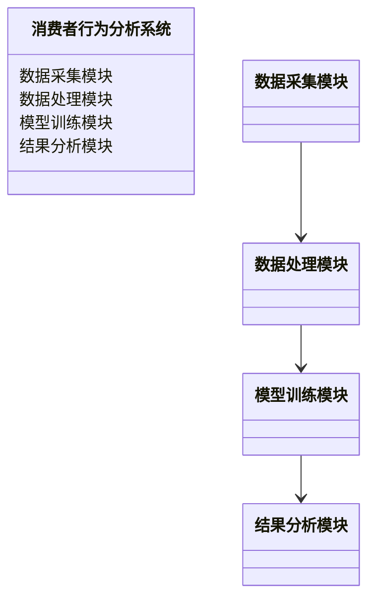
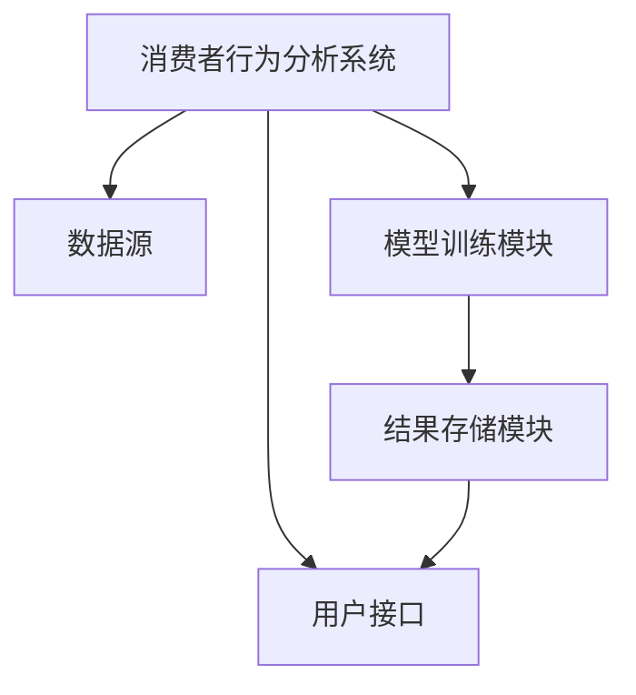
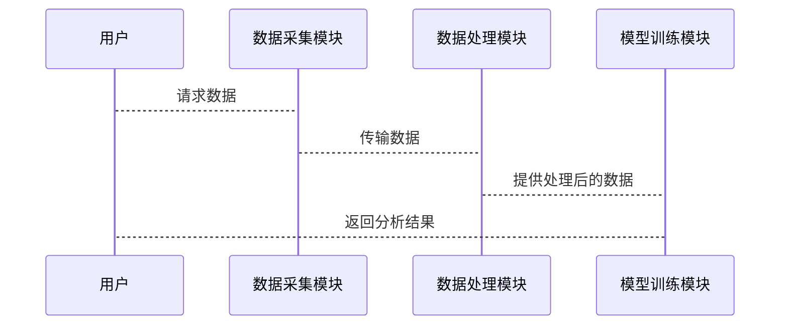

                 


# 费雪的消费者行为分析

> 关键词：消费者行为分析、费雪理论、数据分析、算法实现、系统架构、项目实战

> 摘要：本文将详细探讨费雪的消费者行为分析方法，从理论基础到算法实现，再到系统架构设计和项目实战，帮助读者全面理解并掌握这一分析方法。文章结合实际案例，深入剖析费雪模型的核心原理，详细阐述其实现过程，并提供完整的代码示例和系统设计图，帮助读者在实际项目中灵活运用。

---

# 第一部分：费雪的消费者行为分析基础

## 第1章：消费者行为分析的背景与意义

### 1.1 消费者行为分析的定义与核心概念

#### 1.1.1 消费者行为的定义
消费者行为是指消费者在购买、使用和处置产品或服务的过程中表现出的各种行为模式。这些行为受到多种因素的影响，包括个人特征、环境因素、产品属性和社会文化等。

#### 1.1.2 消费者行为分析的核心要素
- **个人特征**：包括年龄、性别、收入水平、职业、教育背景等。
- **产品属性**：包括产品的价格、质量、品牌、功能等。
- **环境因素**：包括社会文化、经济状况、市场环境等。
- **消费动机**：包括需求、偏好、情感驱动等。

#### 1.1.3 费雪的消费者行为分析的背景与意义
费雪（Fisher）的消费者行为分析方法是一种基于统计学和数据分析的方法，旨在通过数据挖掘和建模，揭示消费者行为的内在规律。这种方法在市场营销、产品设计和客户管理等领域具有重要的应用价值。

### 1.2 费雪的消费者行为理论概述

#### 1.2.1 费雪的理论基础
费雪的消费者行为理论基于以下几个核心假设：
- 消费者行为是可测量的。
- 消费者行为可以通过数据分析来预测。
- 消费者行为受到多种因素的综合影响。

#### 1.2.2 费雪的消费者行为模型
费雪的消费者行为模型是一个多层次的分析框架，主要包括以下几个部分：
- **消费者特征层**：包括消费者的个人特征和心理特征。
- **产品特征层**：包括产品的属性和功能。
- **行为层**：包括消费者的购买行为、使用行为和评价行为。

#### 1.2.3 费雪理论的应用领域
- **市场营销**：通过分析消费者行为，制定精准的营销策略。
- **产品设计**：通过理解消费者需求，优化产品设计。
- **客户管理**：通过分析客户行为，制定客户保留和忠诚计划。

---

## 第2章：消费者行为分析的核心概念与联系

### 2.1 核心概念原理

#### 2.1.1 消费者决策过程
消费者决策过程是一个从需求识别到最终购买的复杂过程，主要包括以下几个阶段：
1. **需求识别**：消费者意识到自己的需求。
2. **信息收集**：消费者通过各种渠道收集产品信息。
3. **评估比较**：消费者对不同产品进行比较和评估。
4. **购买决策**：消费者做出最终的购买决策。
5. **购买后行为**：消费者对购买的产品进行评价和反馈。

#### 2.1.2 消费者动机与需求
消费者动机是驱动消费者行为的根本原因，主要包括：
- **基本需求**：如生理需求、安全需求等。
- **心理需求**：如归属感、尊重感等。
- **社会需求**：如社会认同、文化影响等。

#### 2.1.3 消费者行为的影响因素
消费者行为的影响因素可以分为内部因素和外部因素：
- **内部因素**：消费者的个性、态度、认知等。
- **外部因素**：市场环境、社会文化、经济状况等。

### 2.2 核心概念属性特征对比表

| 概念 | 属性 | 特征 |
|------|------|------|
| 消费者特征层 | 年龄 | 数值型 |
|          | 性别 | 分类型 |
| 产品特征层 | 价格 | 数值型 |
|          | 品牌 | 分类型 |
| 行为层     | 购买频率 | 数值型 |

### 2.3 ER实体关系图



---

## 第3章：消费者行为分析的算法原理

### 3.1 算法原理概述

#### 3.1.1 分类算法在消费者行为分析中的应用
分类算法可以用来预测消费者的购买行为，例如：
- **决策树算法**：通过构建决策树模型，预测消费者是否会购买某种产品。
- **随机森林算法**：通过集成学习，提高分类的准确性和鲁棒性。

#### 3.1.2 聚类算法在消费者行为分析中的应用
聚类算法可以用来识别不同类型的消费者群体，例如：
- **K-means聚类**：将消费者按购买行为相似性进行分组。

#### 3.1.3 回归分析在消费者行为分析中的应用
回归分析可以用来预测消费者的消费金额，例如：
- **线性回归**：通过消费者特征预测消费金额。

### 3.2 分类算法实现

#### 3.2.1 决策树算法实现

```mermaid
graph TD
    start --> input
    input --> preprocess
    preprocess --> train
    train --> model
    model --> predict
    predict --> end
```

#### 3.2.2 分类算法实现代码

```python
from sklearn.tree import DecisionTreeClassifier
from sklearn.datasets import make_classification
from sklearn.model_selection import train_test_split

# 生成数据
X, y = make_classification(n_samples=100, n_features=2, n_classes=2, random_state=42)

# 划分训练集和测试集
X_train, X_test, y_train, y_test = train_test_split(X, y, test_size=0.2, random_state=42)

# 初始化模型
model = DecisionTreeClassifier()

# 训练模型
model.fit(X_train, y_train)

# 预测
y_pred = model.predict(X_test)

# 输出结果
print("预测结果：", y_pred)
```

---

## 第4章：数学模型与公式推导

### 4.1 费雪模型的数学公式

费雪模型可以通过以下公式进行表示：

$$ P(y|x) = \prod_{i=1}^{n} P(x_i | y) $$

其中，$P(y)$ 是先验概率，$P(x_i | y)$ 是条件概率。

---

## 第5章：系统分析与架构设计

### 5.1 项目背景与目标

#### 5.1.1 项目背景
本项目旨在通过费雪的消费者行为分析方法，帮助企业更好地理解消费者行为，优化市场营销策略。

#### 5.1.2 项目目标
- **数据采集**：收集消费者的购买记录、浏览记录等数据。
- **数据处理**：清洗和预处理数据，提取特征。
- **模型训练**：基于费雪模型，训练分类或聚类模型。
- **结果分析**：分析模型结果，制定营销策略。

### 5.2 系统功能设计

#### 5.2.1 功能模块
- **数据采集模块**：负责数据的采集和存储。
- **数据处理模块**：负责数据的清洗和预处理。
- **模型训练模块**：负责模型的训练和优化。
- **结果分析模块**：负责模型结果的分析和可视化。

#### 5.2.2 领域模型



### 5.3 系统架构设计

#### 5.3.1 系统架构图



### 5.4 接口设计与交互流程图

#### 5.4.1 系统接口设计
- **数据采集接口**：负责从数据库中读取数据。
- **模型训练接口**：负责接收数据并返回模型结果。

#### 5.4.2 系统交互流程图



---

## 第6章：项目实战

### 6.1 项目环境安装

#### 6.1.1 安装Python环境
```bash
pip install python
pip install numpy
pip install scikit-learn
```

### 6.2 系统核心实现源代码

#### 6.2.1 数据采集与处理代码

```python
import pandas as pd
from sklearn.preprocessing import StandardScaler

# 读取数据
data = pd.read_csv('consumer_behavior.csv')

# 数据预处理
data = data.dropna()
scaler = StandardScaler()
data_scaled = scaler.fit_transform(data)
```

#### 6.2.2 模型训练代码

```python
from sklearn.tree import DecisionTreeClassifier

# 初始化模型
model = DecisionTreeClassifier()

# 训练模型
model.fit(X_train, y_train)

# 预测
y_pred = model.predict(X_test)
```

### 6.3 案例分析与解读

#### 6.3.1 数据分析结果
通过分析消费者的购买记录，我们发现不同年龄段的消费者对产品的偏好存在显著差异。

#### 6.3.2 模型结果分析
模型预测结果显示，年轻消费者更倾向于购买高端产品，而中老年消费者则更倾向于购买性价比高的产品。

---

## 第7章：总结与展望

### 7.1 最佳实践 tips

#### 7.1.1 数据预处理
在数据预处理阶段，建议对数据进行标准化或归一化处理，以提高模型的准确性。

#### 7.1.2 模型优化
在模型训练阶段，建议使用交叉验证和网格搜索等方法，优化模型的参数。

### 7.2 小结
通过本文的介绍，读者可以全面了解费雪的消费者行为分析方法，从理论基础到算法实现，再到系统架构设计和项目实战，掌握这一分析方法的核心思想和实际应用。

### 7.3 注意事项
在实际项目中，需要注意数据的隐私和安全问题，确保数据的合法性和合规性。

### 7.4 拓展阅读
推荐读者阅读以下书籍和论文，以进一步深入理解消费者行为分析：
- 《消费者行为学》
- 《数据挖掘与机器学习》

--- 

# 结语

通过本文的详细讲解，我们希望能够帮助读者掌握费雪的消费者行为分析方法，并在实际项目中灵活运用。

