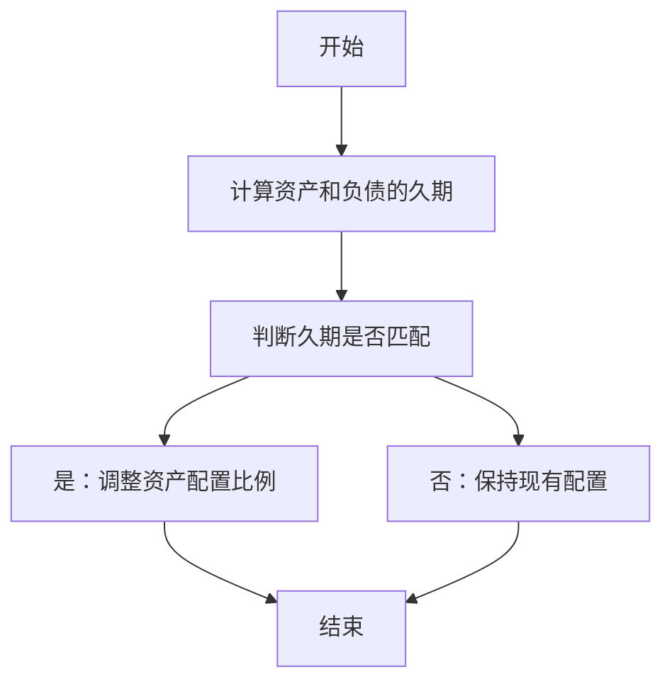
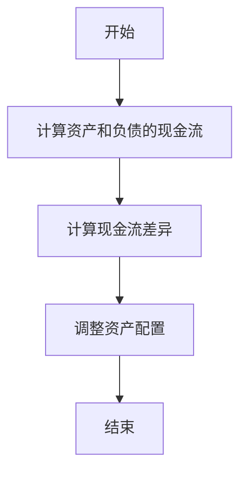
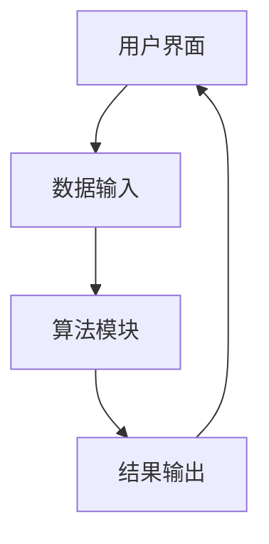
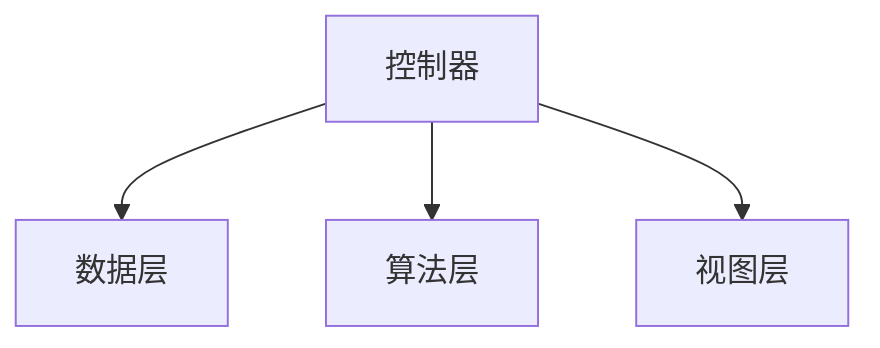
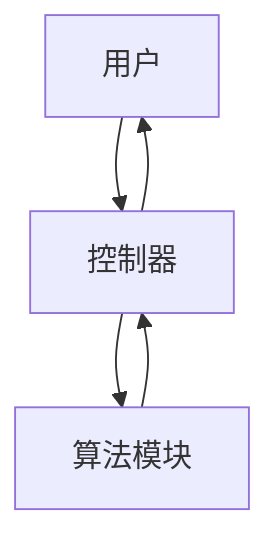

                 


# 资产负债匹配：机构投资者的长期投资策略

## 关键词：资产负债匹配、机构投资者、长期投资策略、资产配置、风险控制、财务规划

## 摘要：资产负债匹配是机构投资者实现长期稳健投资的重要策略，通过科学匹配资产与负债的结构、期限和流动性，确保在不同市场条件下实现风险可控、收益稳定的目标。本文将从核心概念、算法原理、系统架构到项目实战，全面解析资产负债匹配的实现路径和应用价值。

---

## 第一部分: 资产负债匹配的背景与概述

### 第1章: 资产负债匹配的基本概念

#### 1.1 资产负债匹配的定义与背景

##### 1.1.1 资产负债匹配的定义
资产负债匹配是一种通过优化资产与负债在结构、期限和流动性上的匹配，以实现投资目标的策略。其核心在于确保资产的收益与负债的偿付能力相匹配，从而降低流动性风险和信用风险。

##### 1.1.2 资产负债匹配的背景与重要性
在金融市场中，机构投资者需要面对复杂多变的经济环境，包括利率波动、市场波动和政策变化等。资产负债匹配能够帮助机构投资者在不确定的市场条件下保持财务稳定性，同时实现长期的投资收益目标。

##### 1.1.3 机构投资者的长期投资策略
机构投资者通常采用多策略组合来实现长期投资目标，其中资产负债匹配是基础性策略之一。通过匹配资产与负债的特性，机构可以更好地应对市场变化，优化资本使用效率。

#### 1.2 资产负债匹配的核心要素

##### 1.2.1 资产与负债的结构分析
- 资产结构：包括现金、债券、股票、房地产等不同资产的配置比例。
- 负债结构：包括短期负债和长期负债的比例，以及负债的利率类型（固定或浮动）。

##### 1.2.2 资产负债匹配的目标与原则
- 目标：确保资产的流动性能够覆盖负债的偿付需求，同时实现资产的保值增值。
- 原则：期限匹配、收益匹配、风险匹配。

##### 1.2.3 资产负债匹配的边界与外延
- 边界：匹配范围通常限定在机构自身的资产负债表内。
- 外延：匹配策略可以扩展到跨境投资、衍生品对冲等领域。

---

### 第2章: 机构投资者的长期投资策略

#### 2.1 机构投资者的资产配置策略

##### 2.1.1 资产配置的基本原理
资产配置是资产负债匹配的核心，通过将资金分配到不同资产类别中，以平衡风险与收益。常见的资产配置策略包括：
1. 战略性资产配置：根据长期投资目标确定资产比例。
2. 战术性资产配置：根据市场变化进行短期调整。

##### 2.1.2 不同资产类别的风险与收益特征
- 现金：流动性高，但收益低。
- 债券：收益稳定，但面临利率风险。
- 股票：收益高，但波动性大。
- 其他资产：如房地产、大宗商品，具有多样化收益特点。

##### 2.1.3 资产配置的动态调整
根据市场环境和机构目标的变化，定期审视和调整资产配置比例，以维持匹配的有效性。

#### 2.2 资产负债匹配的实现路径

##### 2.2.1 资产负债的期限匹配
- 确保资产的到期日与负债的到期日相匹配，减少再投资风险。

##### 2.2.2 资产负债的流动性匹配
- 保持高流动性资产（如现金、短期债券）的比例，以应对负债的短期偿付需求。

##### 2.2.3 资产负债的收益与风险匹配
- 通过资产的选择和组合优化，确保资产收益能够覆盖负债的利息支出和通货膨胀影响。

---

## 第二部分: 资产负债匹配的核心概念与联系

### 第3章: 资产负债匹配的核心概念与联系

#### 3.1 核心概念原理

##### 3.1.1 资产负债匹配的数学模型
资产负债匹配可以通过以下数学模型进行量化：
$$ \text{资产收益} = \text{负债成本} + \text{风险溢价} $$
其中，风险溢价是根据资产的风险程度确定的额外收益。

##### 3.1.2 资产负债匹配的经济意义
通过匹配资产与负债，机构可以降低因资产错配导致的流动性风险和信用风险，同时优化资本成本。

#### 3.2 核心概念属性特征对比表

| **属性**   | **资产**                 | **负债**                 |
|------------|--------------------------|--------------------------|
| **期限**   | 短期或长期               | 短期或长期               |
| **流动性** | 高或低                   | 高或低                   |
| **风险**   | 市场风险、信用风险       | 利率风险、流动性风险     |
| **收益**   | 收益波动较大             | 收益相对固定             |

#### 3.3 ER实体关系图
以下是一个简化的ER实体关系图，展示资产与负债之间的关系：

```mermaid
erd
  资产 --|{分配}--> 资产负债表
  负债 --|{分配}--> 资产负债表
  资产负债表 --> 资产负债匹配规则
```

---

### 第4章: 资产负债匹配的算法原理

#### 4.1 算法原理概述

##### 4.1.1 资产负债匹配的算法选择
常用算法包括：
1. 久期匹配法：通过匹配资产和负债的久期（Duration）来降低再投资风险。
2. 现金流匹配法：通过匹配资产和负债的现金流来实现期限匹配。

##### 4.1.2 算法原理的数学模型
久期匹配法的数学模型：
$$ D_a = D_l $$
其中，$D_a$ 是资产的久期，$D_l$ 是负债的久期。

现金流匹配法的数学模型：
$$ \sum_{t=1}^{n} (CF_a(t) - CF_l(t)) = 0 $$
其中，$CF_a(t)$ 是资产在时间 $t$ 的现金流，$CF_l(t)$ 是负债在时间 $t$ 的现金流。

#### 4.2 算法实现步骤

##### 4.2.1 久期匹配法


##### 4.2.2 现金流匹配法


#### 4.3 算法实现的注意事项
- 数据输入的准确性：确保资产和负债的数据准确无误。
- 模型的适用性：根据市场环境选择合适的算法。
- 调整的及时性：定期审视和调整资产配置，以适应市场变化。

---

## 第三部分: 资产负债匹配的系统架构设计

### 第5章: 系统架构设计

#### 5.1 系统功能设计

##### 5.1.1 功能模块划分
- 数据输入模块：接收资产和负债的数据。
- 匹配算法模块：执行久期匹配或现金流匹配。
- 结果展示模块：输出匹配结果和调整建议。

##### 5.1.2 功能流程图


#### 5.2 系统架构设计

##### 5.2.1 系统架构图


#### 5.3 接口设计与交互

##### 5.3.1 接口设计
- 输入接口：接收资产和负债的数据。
- 输出接口：返回匹配结果和调整建议。

##### 5.3.2 交互流程图


---

## 第四部分: 资产负债匹配的项目实战

### 第6章: 项目实战

#### 6.1 环境安装

##### 6.1.1 系统环境
- 操作系统：Windows 10或更高版本。
- 开发工具：Python 3.8或更高版本，Jupyter Notebook。

#### 6.2 核心实现

##### 6.2.1 久期匹配算法的Python实现
```python
def duration_matching(asset_duration, liability_duration):
    if asset_duration == liability_duration:
        return "匹配成功"
    else:
        return "匹配失败"
```

##### 6.2.2 现金流匹配算法的Python实现
```python
def cash_flow_matching(asset_cash_flows, liability_cash_flows):
    difference = sum(asset_cash_flows) - sum(liability_cash_flows)
    if difference == 0:
        return "匹配成功"
    else:
        return "匹配失败"
```

#### 6.3 案例分析

##### 6.3.1 案例背景
某机构投资者的资产组合包括债券和股票，负债包括短期贷款和长期债券。

##### 6.3.2 案例实现
1. 计算资产和负债的久期。
2. 使用久期匹配法进行匹配。
3. 调整资产配置比例以实现匹配。

---

## 第五部分: 资产负债匹配的最佳实践与小结

### 第7章: 最佳实践与小结

#### 7.1 最佳实践

##### 7.1.1 定期审视和调整匹配策略
市场环境不断变化，需要定期审视和调整资产负债匹配策略。

##### 7.1.2 结合其他投资策略
资产负债匹配可以与其他策略（如对冲策略）结合使用，以提高整体收益。

#### 7.2 小结

##### 7.2.1 核心要点回顾
- 资产负债匹配是机构投资者实现长期稳健投资的重要策略。
- 通过匹配资产与负债的结构、期限和流动性，可以降低风险并实现收益最大化。

##### 7.2.2 注意事项
- 数据的准确性和及时性。
- 算法选择的合理性。
- 系统架构的稳定性和可扩展性。

#### 7.3 拓展阅读

##### 7.3.1 推荐书籍
1. 《投资学》（教材）。
2. 《机构投资的创新策略》。

##### 7.3.2 相关博客和资源
- 机构投资博客：[链接]。
- 专业论坛：[链接]。

---

通过以上内容，您可以全面了解资产负债匹配的理论与实践，掌握机构投资者的长期投资策略。希望对您有所帮助！

