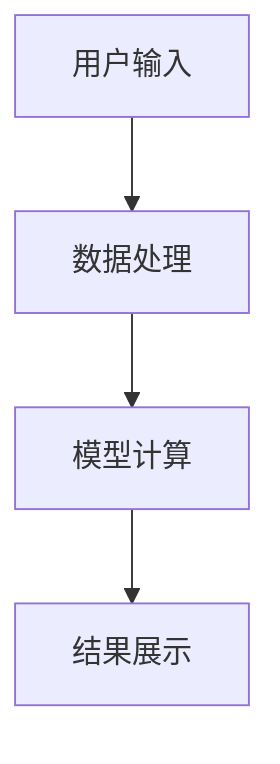

                 


# 资产配置模型：优化风险收益比的科学方法

> 关键词：资产配置模型、风险收益比、投资组合优化、现代投资组合理论、均值-方差模型、风险平价模型

> 摘要：资产配置模型是金融领域中的重要工具，用于优化投资组合的风险与收益比。本文从背景介绍、核心概念、算法原理、系统设计到项目实战，详细探讨了资产配置模型的构建与实现，帮助读者理解如何通过科学方法实现资产的最优配置。

---

# 第一部分: 资产配置模型的背景与概述

## 第1章: 资产配置模型的核心概念

### 1.1 资产配置的定义与重要性

#### 1.1.1 资产配置的定义
资产配置是指将资金分配到不同的资产类别（如股票、债券、房地产等）中，以实现投资目标的过程。它通过分散投资降低风险，同时追求最大化的收益。

#### 1.1.2 资产配置的重要性
- **分散风险**：通过将资金分配到不同资产类别，降低单一资产波动带来的风险。
- **优化收益**：根据市场环境调整资产比例，捕捉更高收益的机会。
- **长期稳健**：资产配置是投资组合管理的核心，帮助投资者在不同市场条件下保持稳健收益。

#### 1.1.3 资产配置与投资组合管理的区别与联系
- **区别**：
  - 资产配置侧重于资产类别间的比例分配。
  - 投资组合管理则包括资产选择、权重分配、风险控制等更广泛的内容。
- **联系**：
  - 资产配置是投资组合管理的基础，决定了投资组合的整体风险和收益特征。

### 1.2 资产配置的分类

#### 1.2.1 按资产类别划分
- **股票**：高风险高收益。
- **债券**：相对稳定，低风险。
- **房地产**：实物资产，抗通胀能力强。
- **现金**：流动性高，风险最低。

#### 1.2.2 按时间维度划分
- **短期配置**：适应市场短期波动。
- **中期配置**：关注经济周期变化。
- **长期配置**：基于长期投资目标。

#### 1.2.3 按风险偏好划分
- **保守型**：低风险，优先配置债券、现金等。
- **平衡型**：中等风险，股票与债券结合。
- **激进型**：高风险，高比例股票配置。

### 1.3 资产配置的数学模型

#### 1.3.1 简单资产配置模型
例如，固定比例配置：将资金按固定比例分配到不同资产类别。

#### 1.3.2 复杂资产配置模型
涉及优化算法，如均值-方差优化模型。

#### 1.3.3 数学模型的优缺点
- **优点**：量化分析，科学合理。
- **缺点**：市场波动和模型假设可能影响准确性。

---

## 第2章: 资产配置模型的理论基础

### 2.1 现代投资组合理论（MPT）

#### 2.1.1 MPT的核心思想
由Harry Markowitz提出，强调通过分散投资降低风险，优化投资组合的收益-风险比。

#### 2.1.2 有效前沿的概念
有效前沿是指在给定风险下，提供最高收益的投资组合所构成的曲线。

#### 2.1.3 马科维茨均值-方差优化模型
公式：
$$
\text{目标：} \min_w \frac{1}{2} w^T \Sigma w \quad \text{subject to} \quad \mathbb{E}[r] = w^T \mu = \text{目标收益}
$$
其中，$w$是权重向量，$\Sigma$是协方差矩阵，$\mu$是收益向量。

### 2.2 资产定价模型

#### 2.2.1 CAPM模型
资本资产定价模型（CAPM）用于确定资产的预期收益：
$$
E(r_i) = r_f + \beta_i (E(r_m) - r_f)
$$
其中，$r_f$是无风险利率，$\beta_i$是资产的贝塔系数，$E(r_m)$是市场预期收益。

#### 2.2.2 Fama三因子模型
扩展CAPM，引入多个因子解释资产收益：
$$
E(r_i) = r_f + \beta_1 F_1 + \beta_2 F_2 + \beta_3 F_3
$$

#### 2.2.3 其他资产定价模型
如APT模型，基于市场因子的多元定价。

### 2.3 风险管理理论

#### 2.3.1 风险的定义与分类
- 市场风险：市场波动导致的损失。
- 信用风险：债务人违约风险。
- 流动性风险：资产难以变现的风险。

#### 2.3.2 风险收益比的计算
$$
\text{风险收益比} = \frac{\text{收益}}{\text{风险}}
$$

#### 2.3.3 风险调整后的收益评估
使用夏普比率、特雷诺比率等指标评估收益与风险的关系。

---

# 第二部分: 资产配置模型的核心算法

## 第3章: 均值-方差优化模型

### 3.1 均值-方差优化的原理

#### 3.1.1 投资组合的期望收益与方差计算
$$
\text{期望收益} = \sum_{i=1}^n w_i r_i
$$
$$
\text{方差} = \sum_{i=1}^n \sum_{j=1}^n w_i w_j \sigma_{ij}
$$
其中，$\sigma_{ij}$是资产$i$和$j$的协方差。

#### 3.1.2 优化目标的数学表达
目标是最小化方差，同时满足收益约束：
$$
\min_w \frac{1}{2} w^T \Sigma w \quad \text{subject to} \quad w^T \mu = \text{目标收益}
$$

### 3.2 均值-方差优化的实现

#### 3.2.1 数学模型的构建
使用拉格朗日乘数法求解约束优化问题。

#### 3.2.2 算法的实现步骤
1. 计算资产收益和协方差矩阵。
2. 构建优化模型。
3. 使用数值优化算法（如凸优化）求解权重。

#### 3.2.3 优化结果的解释
- 权重分配：各资产在组合中的比例。
- 有效前沿：展示最优组合的风险收益 trade-off。

---

## 第4章: 风险平价模型

### 4.1 风险平价模型的原理

#### 4.1.1 风险平价的定义
风险平价是指每个资产的风险贡献相等的投资组合配置。

#### 4.1.2 风险平价与传统资产配置的区别
- 传统配置：按比例分配。
- 风险平价：按风险贡献分配。

#### 4.1.3 风险平价模型的优势
- 降低尾部风险。
- 更加注重风险控制。

### 4.2 风险平价模型的实现

#### 4.2.1 风险贡献的计算
$$
\text{风险贡献}_i = w_i^2 \cdot \sigma^2
$$
其中，$\sigma^2$是资产$i$的方差。

#### 4.2.2 资产权重的调整
通过迭代优化，使每个资产的风险贡献相等。

#### 4.2.3 模型的优缺点分析
- 优点：分散风险，降低系统性风险。
- 缺点：计算复杂，难以实时调整。

---

## 第5章: 资产配置模型的数学公式

### 5.1 均值-方差优化的数学公式

#### 5.1.1 投资组合的期望收益公式
$$
E(r_p) = \sum_{i=1}^n w_i E(r_i)
$$

#### 5.1.2 投资组合的方差公式
$$
\sigma_p^2 = \sum_{i=1}^n \sum_{j=1}^n w_i w_j \sigma_{ij}
$$

#### 5.1.3 优化目标的数学表达
$$
\min_w \frac{1}{2} w^T \Sigma w \quad \text{subject to} \quad w^T \mu = \text{目标收益}
$$

### 5.2 风险平价模型的数学公式

#### 5.2.1 风险贡献的计算公式
$$
\text{风险贡献}_i = w_i^2 \cdot \sigma^2
$$

#### 5.2.2 资产权重的调整公式
$$
w_i = \frac{\text{风险贡献}_i}{\sum_{j=1}^n \text{风险贡献}_j}
$$

#### 5.2.3 模型的数学推导
通过拉格朗日乘数法求解风险平价权重。

---

# 第三部分: 资产配置模型的系统设计

## 第6章: 资产配置系统的架构设计

### 6.1 系统功能模块划分

#### 6.1.1 数据输入模块
- 接收资产收益、协方差等数据。

#### 6.1.2 模型计算模块
- 实现均值-方差优化或风险平价模型。

#### 6.1.3 结果展示模块
- 可视化最优权重和风险收益比。

### 6.2 系统架构设计

#### 6.2.1 系统功能模块划分
- 数据输入、模型计算、结果展示。

#### 6.2.2 系统架构图


#### 6.2.3 系统接口设计
- 输入接口：资产数据。
- 输出接口：最优权重、风险收益比。

---

## 第7章: 项目实战

### 7.1 环境安装

#### 7.1.1 安装Python
```bash
python --version
pip install numpy pandas matplotlib
```

#### 7.1.2 安装优化库
```bash
pip install cvxopt
```

### 7.2 系统核心实现源代码

#### 7.2.1 均值-方差优化实现
```python
import numpy as np
from cvxopt import matrix, solvers

def mean_variance_optimization(returns):
    n = len(returns.columns)
    mu = returns.mean().values
    Sigma = returns.cov().values
    w = solvers_qp(mu, Sigma)
    return w

def solvers_qp(mu, Sigma):
    # 线性约束：sum(w) = 1
    G = matrix(-np.eye(n), n, 'd')
    h = matrix(0.0, n)
    A = matrix(1.0, (1, n))
    b = matrix(1.0)
    # 优化目标：最小化 w^T Sigma w - 2 mu^T w
    P = matrix(Sigma, (n, n))
    q = matrix(-2 * mu, n)
    sol = solvers.qp(P, q, G, h, A, b)
    w = sol['x']
    return w
```

#### 7.2.2 风险平价模型实现
```python
def risk_parity(returns):
    n = len(returns.columns)
    Sigma = returns.cov().values
    w = np.ones(n) / n
    for _ in range(100):
        risk_contribution = w**2 * np.diag(Sigma)
        total_risk = np.sum(risk_contribution)
        w = risk_contribution / total_risk
    return w
```

### 7.3 案例分析

#### 7.3.1 数据准备
使用历史收益数据进行回测。

#### 7.3.2 模型实现
运行上述代码，获取最优权重。

#### 7.3.3 结果展示
绘制有效前沿，分析风险收益比。

### 7.4 项目小结
- 代码实现的关键点在于优化算法的选择和参数调整。
- 实际应用中需考虑交易成本和市场摩擦。

---

## 第8章: 最佳实践与注意事项

### 8.1 最佳实践 tips
- 定期再平衡投资组合。
- 结合市场环境调整配置。
- 使用风险管理工具控制尾部风险。

### 8.2 小结
- 资产配置模型是科学的投资工具。
- 实践中需结合市场环境和投资者风险偏好。

### 8.3 注意事项
- 数据质量影响模型效果。
- 模型假设与实际市场可能有偏差。
- 需要考虑交易成本和税收因素。

### 8.4 拓展阅读
- Harry Markowitz的《Portfolio Selection》。
-《风险管理与保险》相关书籍。

---

通过以上详细的内容，您可以系统地了解资产配置模型的构建与实现，掌握优化风险收益比的科学方法。

