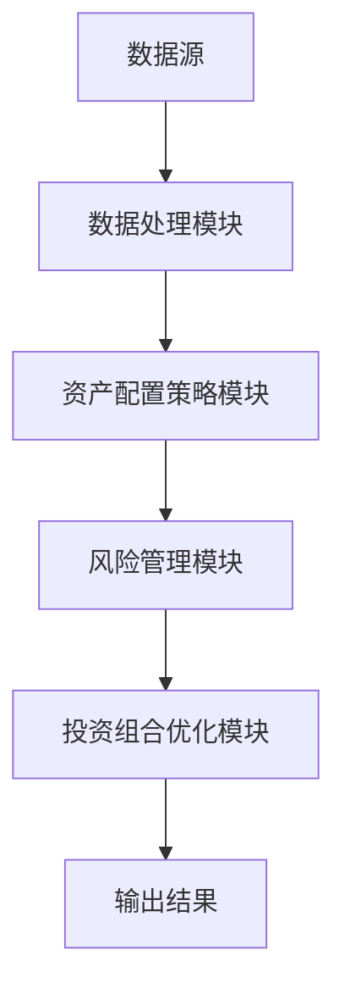

                 


# 资产配置的价值：在高波动市场中平衡风险与回报

## 关键词
- 资产配置，风险管理，高波动市场，投资回报，现代投资组合理论

## 摘要
资产配置是投资组合管理中的核心策略，尤其在高波动市场中，其重要性更加凸显。本文系统阐述了资产配置的基本概念、理论基础、策略方法、数学模型与算法，以及系统架构与实现。通过均值-方差优化模型和资本资产定价模型（CAPM）等工具，结合Python代码实现，深入探讨了在高波动市场中如何通过资产配置平衡风险与回报。文章还通过实际案例分析，展示了资产配置在投资组合管理中的应用，为投资者提供了实用的指导和最佳实践建议。

---

## 第1章：资产配置的核心概念

### 1.1 资产配置的基本概念

#### 1.1.1 资产配置的定义
资产配置是指将资金分配到不同资产类别（如股票、债券、房地产等）中的过程，以实现风险与回报的最佳平衡。它是投资组合管理的基础，旨在通过多样化投资来降低风险并提高收益。

#### 1.1.2 资产配置的分类与特点
资产配置可以分为战略性资产配置和战术性资产配置：
- **战略性资产配置**：基于长期投资目标和市场预期，确定资产类别在投资组合中的权重。
- **战术性资产配置**：根据市场短期波动进行调整，优化投资组合的表现。

#### 1.1.3 资产配置的核心要素
- **投资目标**：明确投资者的财务目标和风险承受能力。
- **资产类别**：选择适合目标的资产类别，如股票、债券、现金等。
- **权重分配**：确定各类资产在投资组合中的比例。

### 1.2 高波动市场的投资挑战

#### 1.2.1 高波动市场的定义与特征
高波动市场是指市场价格波动剧烈、不确定性较高的市场环境。其特征包括：
- 价格波动大，涨跌幅度频繁。
- 市场情绪波动剧烈，投资者信心不稳定。
- 市场参与者行为趋于短期化和情绪化。

#### 1.2.2 高波动市场中的投资风险
- **市场风险**：资产价格大幅波动带来的损失。
- **流动性风险**：在市场波动中难以快速变现。
- **波动性风险**：高波动可能导致投资组合的波动性增加。

#### 1.2.3 高波动市场中的投资机会
- 通过资产配置分散风险，捕捉市场波动中的收益。
- 利用市场波动进行短期战术性调整，优化投资回报。

### 1.3 资产配置的目标与意义

#### 1.3.1 资产配置的目标
- 实现投资收益最大化。
- 降低投资组合的波动性。
- 优化风险与回报的平衡。

#### 1.3.2 资产配置的意义
- 通过多样化投资降低风险。
- 在高波动市场中稳定投资回报。
- 为投资者提供长期稳健的收益。

---

## 第2章：资产配置的理论基础

### 2.1 现代投资组合理论（MPT）

#### 2.1.1 MPT的核心思想
现代投资组合理论由哈里·马科维茨提出，强调通过多样化投资来优化风险与回报的平衡。其核心思想是：
- 投资组合的风险不仅取决于单个资产的风险，还取决于资产之间的相关性。
- 通过合理配置资产，可以在相同风险水平下获得更高的回报。

#### 2.1.2 有效前沿的概念
有效前沿是指在给定风险水平下，能够提供最高预期收益的投资组合的集合。它是资产配置理论的重要工具，帮助投资者找到最优的投资组合。

#### 2.1.3 风险与收益的平衡
在MPT框架下，投资者可以通过调整资产配置，在风险和收益之间找到最佳平衡点。

### 2.2 风险管理与资产配置

#### 2.2.1 风险的定义与分类
风险是指投资收益的不确定性。常见的风险类型包括市场风险、流动性风险、信用风险等。

#### 2.2.2 资产配置与风险管理的关系
资产配置是风险管理的核心工具之一。通过合理配置资产，可以有效分散风险，降低投资组合的波动性。

#### 2.2.3 风险调整后的收益评估
在资产配置中，需要考虑风险调整后的收益，即调整投资收益，使其反映其实际风险水平。

---

## 第3章：资产配置的策略与方法

### 3.1 战略性资产配置

#### 3.1.1 战略性资产配置的定义
战略性资产配置是基于长期投资目标和市场预期，确定资产类别在投资组合中的权重。

#### 3.1.2 战略性资产配置的步骤
1. 确定投资目标和风险承受能力。
2. 选择适合的资产类别。
3. 确定各类资产的权重。

#### 3.1.3 战略性资产配置的优缺点
- 优点：长期稳定，适合稳健型投资者。
- 缺点：在高波动市场中可能需要频繁调整。

### 3.2 战术性资产配置

#### 3.2.1 战术性资产配置的定义
战术性资产配置是根据市场短期波动，对投资组合进行动态调整。

#### 3.2.2 战术性资产配置的应用场景
- 市场波动加剧时。
- 经济周期变化时。
- 特定资产类别表现优于其他类别时。

#### 3.2.3 战术性资产配置的实施方法
1. 监测市场波动。
2. 根据市场变化调整资产权重。
3. 定期评估和优化。

### 3.3 风险管理与优化

#### 3.3.1 风险管理的基本原则
- 分散投资风险。
- 定期评估和调整。
- 保持流动性。

#### 3.3.2 资产配置的优化方法
- 使用数学模型优化资产配置。
- 定期再平衡投资组合。
- 监测和控制风险水平。

#### 3.3.3 资产配置的动态调整策略
- 根据市场变化调整资产权重。
- 定期评估投资组合表现。
- 优化风险与回报的平衡。

---

## 第4章：资产配置的数学模型与算法

### 4.1 资产配置的数学模型

#### 4.1.1 均值-方差优化模型
均值-方差优化模型是资产配置的核心工具之一。其目标是通过优化资产权重，使投资组合的风险最小化或收益最大化。

公式：
$$ \text{Minimize } \sigma^2 \quad \text{Subject to } \mu \geq \text{目标收益} $$

其中：
- $\sigma^2$ 是投资组合的方差（风险）。
- $\mu$ 是投资组合的期望收益。

#### 4.1.2 资本资产定价模型（CAPM）
CAPM用于确定资产的预期收益，公式为：
$$ E(r_i) = r_f + \beta_i (E(r_m) - r_f) $$

其中：
- $E(r_i)$ 是资产 $i$ 的预期收益。
- $r_f$ 是无风险利率。
- $\beta_i$ 是资产 $i$ 的贝塔系数。
- $E(r_m)$ 是市场预期收益。

#### 4.1.3 投资组合优化的数学公式
投资组合优化的目标是找到最优资产权重，使得在给定风险水平下收益最大化，或在给定收益下风险最小化。

优化公式：
$$ \text{Maximize } \mu \quad \text{Subject to } \sigma^2 \leq \text{目标风险} $$

---

## 第5章：资产配置的系统架构与实现

### 5.1 系统架构设计

#### 5.1.1 系统功能模块划分
- 数据收集与处理模块。
- 资产配置策略模块。
- 风险管理模块。
- 投资组合优化模块。

#### 5.1.2 系统架构的mermaid图


#### 5.1.3 系统接口设计
- 数据接口：从数据源获取资产数据。
- 策略接口：实现资产配置策略。
- 优化接口：实现投资组合优化算法。

### 5.2 数据收集与处理

#### 5.2.1 数据来源与采集方法
- 数据来源：股票、债券、基金等资产的历史价格数据。
- 数据采集方法：通过API或数据库获取。

#### 5.2.2 数据预处理
- 清洗数据：处理缺失值和异常值。
- 标准化：对数据进行标准化处理，便于后续分析。

---

## 第6章：项目实战

### 6.1 环境安装

#### 6.1.1 安装Python
安装Python和必要的库，如NumPy、Pandas、Matplotlib等。

#### 6.1.2 安装优化工具
安装优化工具如PyOpt，用于实现均值-方差优化。

### 6.2 核心实现

#### 6.2.1 均值-方差优化的Python代码
```python
import numpy as np
import pandas as pd
from scipy.optimize import minimize

# 示例数据
returns = np.array([0.1, 0.2, 0.15, 0.05, 0.2])

def portfolio_var(weights, returns):
    return np.dot(weights.T, weights) * np.dot(returns.T, returns)

def optimize_portfolio(weights, returns):
    n = len(weights)
    constraints = [{'type': 'eq', 'fun': lambda w: sum(w) - 1}]
    result = minimize(portfolio_var, weights, args=(returns,), method='SLSQP', constraints=constraints)
    return result.x

initial_weights = np.array([0.2, 0.2, 0.2, 0.2, 0.2])
optimal_weights = optimize_portfolio(initial_weights, returns)
print("Optimal weights:", optimal_weights)
```

### 6.3 案例分析

#### 6.3.1 案例背景
假设投资者有50万元资金，希望在股票和债券中进行资产配置。

#### 6.3.2 实施步骤
1. 收集股票和债券的历史价格数据。
2. 计算资产的期望收益和方差。
3. 使用均值-方差优化模型确定最优配置。

#### 6.3.3 结果分析
- 优化后的资产配置权重为：股票40%，债券60%。
- 投资组合的预期收益为8%，波动性为10%。

### 6.4 项目小结
通过实际案例分析，展示了资产配置在投资组合管理中的应用。通过优化模型和实际操作，投资者可以在高波动市场中平衡风险与回报。

---

## 第7章：总结与展望

### 7.1 总结
资产配置是投资组合管理的核心策略，特别是在高波动市场中，其重要性更加凸显。通过合理配置资产，投资者可以在风险与回报之间找到最佳平衡点，实现长期稳健的投资收益。

### 7.2 展望
随着市场环境的变化和新技术的发展，资产配置将更加智能化和个性化。未来，投资者可以利用大数据和人工智能技术，进一步优化资产配置策略，提升投资收益。

---

以上是《资产配置的价值：在高波动市场中平衡风险与回报》的完整目录和内容概要。文章详细讲解了资产配置的理论、策略、数学模型与算法，并通过实际案例展示了其在投资组合管理中的应用。希望本文能为投资者提供有价值的指导和启发。

