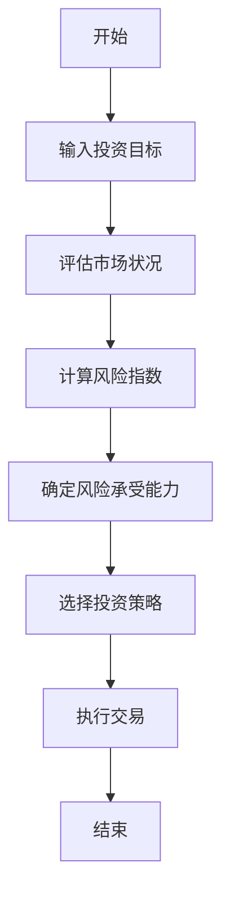
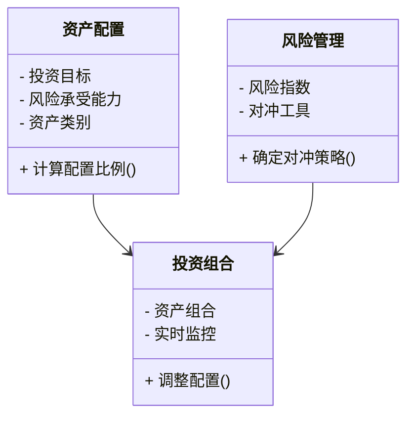
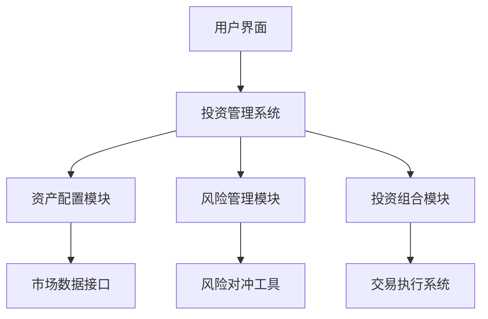
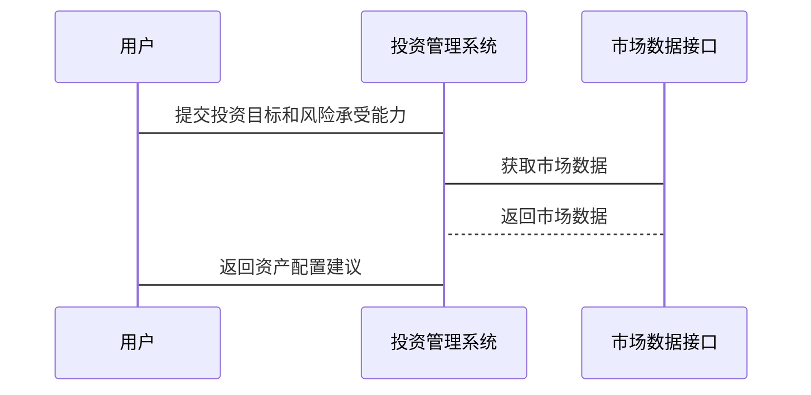

                 


# 跨境投资策略：把握全球市场机遇的方法

> 关键词：跨境投资，全球市场，投资策略，风险管理，资产配置，量化分析

> 摘要：本文将深入探讨跨境投资的策略与方法，从背景介绍到算法原理，从系统架构设计到项目实战，全面解析如何在全球市场中把握机遇，制定有效的投资策略，帮助投资者在复杂多变的市场环境中实现资产增值。

---

## 第一部分: 背景介绍

### 第1章: 跨境投资策略概述

#### 1.1 跨境投资的定义与重要性

##### 1.1.1 跨境投资的定义

跨境投资是指投资者将资金投入其他国家或地区的资产，以实现资产多元化和风险分散的一种投资行为。与本地投资相比，跨境投资具有更广泛的市场覆盖和更高的潜在收益，但也伴随着更高的风险。

##### 1.1.2 跨境投资的重要性

在经济全球化和金融一体化的背景下，跨境投资的重要性日益凸显。通过投资海外市场，投资者可以利用不同市场之间的差异，如利率、汇率、资产价格等，捕捉套利机会，分散风险，并优化资产配置。

##### 1.1.3 跨境投资与其他投资策略的区别

跨境投资与其他投资策略（如本地投资、单一市场投资）的主要区别在于其跨越国界的特点。它不仅涉及不同国家的市场，还涉及到复杂的法律、税务和监管环境。

#### 1.2 跨境投资的背景与发展趋势

##### 1.2.1 全球化与经济一体化

全球化促进了跨国公司的发展，使得资本、技术、人才和信息在全球范围内的流动更加频繁。这种趋势为跨境投资提供了坚实的基础。

##### 1.2.2 数字化与金融创新

随着金融科技的发展，跨境支付、区块链技术和智能投顾等创新工具的应用，使得跨境投资变得更加便捷和高效。

##### 1.2.3 跨境投资的未来趋势

未来，随着技术的进步和全球化的深入，跨境投资将更加普及，投资者将更加依赖数据驱动的决策和自动化工具。

#### 1.3 跨境投资的挑战与机遇

##### 1.3.1 跨境投资的主要挑战

- 外汇风险：汇率波动可能导致投资收益下降或亏损。
- 政治风险：政策变化、地缘政治冲突等可能影响投资回报。
- 税务复杂性：不同国家的税务政策差异增加了税务规划的难度。

##### 1.3.2 跨境投资的潜在机遇

- 市场多样性：不同国家的经济发展阶段和市场周期不同，投资者可以利用这些差异进行套利。
- 资产类别多样性：不同国家可能有不同的优势资产，如新兴市场的高增长潜力。

##### 1.3.3 如何应对挑战抓住机遇

- 通过多元化配置降低风险。
- 利用金融工具（如期权、期货）进行风险对冲。
- 选择经验丰富、专业的投资机构进行委托投资。

#### 1.4 本章小结

本章介绍了跨境投资的定义、重要性及其与其他投资策略的区别，分析了其发展的背景和趋势，并探讨了面临的挑战与机遇。下一章将深入探讨跨境投资的核心概念与联系。

---

## 第二部分: 核心概念与联系

### 第2章: 跨境投资的核心概念

#### 2.1 跨境投资的原理

##### 2.1.1 跨境投资的基本原理

跨境投资的基本原理是通过在全球范围内配置资产，分散风险并优化收益。投资者需要考虑宏观经济因素、市场状况、公司基本面等多个方面。

##### 2.1.2 跨境投资的驱动因素

- 经济周期：不同国家的经济周期不同，投资者可以通过投资处于增长周期的市场获得收益。
- 利率差异：通过套利交易，投资者可以在低利率国家借入资金投资于高利率国家。
- 汇率变动：通过预测汇率变化，投资者可以在合适的时间进行买卖，获得汇率差额。

##### 2.1.3 跨境投资的实施步骤

1. 确定投资目标：明确投资期限、风险承受能力、预期收益等。
2. 资产配置：根据目标分配资金到不同国家或地区的资产。
3. 风险管理：通过多元化和对冲工具降低风险。
4. 监测与调整：定期评估投资组合的表现并进行调整。

#### 2.2 跨境投资的核心要素

##### 2.2.1 投资目标

投资目标是指投资者希望通过投资实现的具体目标，如资产增值、保值或追求高收益。

##### 2.2.2 投资策略

投资策略是实现投资目标的具体方法，包括资产配置、分散投资、杠杆效应等。

##### 2.2.3 投资组合管理

投资组合管理是指根据市场变化和个人目标调整投资组合的过程，包括买入、卖出或重新配置资产。

#### 2.3 跨境投资与全球化的关系

##### 2.3.1 全球化对跨境投资的影响

全球化促进了资本的自由流动，使得投资者可以更容易地进行跨境投资。

##### 2.3.2 跨境投资对全球化的作用

跨境投资促进了资本的全球流动，支持了全球化的经济发展。

##### 2.3.3 两者的相互作用

全球化为跨境投资提供了基础，而跨境投资则进一步推动了全球化的进程。

#### 2.4 核心概念对比表格

| 概念 | 定义 | 特点 | 示例 |
|------|------|------|------|
| 投资目标 | 投资者希望通过投资实现的具体目标 | 长期收益、风险控制 | 实现资产增值 |
| 投资策略 | 为实现投资目标而采取的具体方法 | 分散投资、杠杆效应 | 股票、债券组合 |

---

### 第3章: 跨境投资的算法原理

#### 3.1 跨境投资算法概述

##### 3.1.1 动态资产配置

动态资产配置是一种根据市场变化不断调整资产配置比例的策略，旨在最大化收益并最小化风险。

##### 3.1.2 风险评估模型

风险评估模型通过分析历史数据和市场状况，评估不同资产的风险程度。

#### 3.2 算法实现

##### 3.2.1 动态资产配置算法

```python
def dynamic_asset Allocation(risky_asset_return, safe_asset_return, risk_tolerance):
    # 根据风险承受能力和市场状况调整资产配置比例
    if risk_tolerance == 'low':
        return {'risky': 0.4, 'safe': 0.6}
    elif risk_tolerance == 'medium':
        return {'risky': 0.5, 'safe': 0.5}
    else:
        return {'risky': 0.6, 'safe': 0.4}
```

##### 3.2.2 风险评估模型

$$ \text{风险指数} = \sqrt{\sum_{i=1}^{n} (r_i - \mu)^2} $$

其中，\( r_i \) 是资产i的收益率，\( \mu \) 是资产的平均收益率。

#### 3.3 算法流程图



---

### 第4章: 跨境投资的系统分析与架构设计

#### 4.1 系统功能设计

##### 4.1.1 领域模型



#### 4.2 系统架构设计

##### 4.2.1 系统架构



#### 4.3 接口设计

##### 4.3.1 API接口

```python
class InvestmentSystem:
    def __init__(self):
        self.portfolio = Portfolio()
        self.risk_management = RiskManagement()

    def allocate_assets(self, target, risk_tolerance):
        return self.portfolio.allocate(target, risk_tolerance)
```

#### 4.4 系统交互流程

##### 4.4.1 交互流程图



---

### 第5章: 跨境投资的项目实战

#### 5.1 项目环境安装

##### 5.1.1 安装Python和相关库

```bash
pip install numpy pandas matplotlib
```

#### 5.2 核心实现

##### 5.2.1 动态资产配置

```python
def dynamic_allocation(risky_asset_return, safe_asset_return, risk_tolerance):
    if risk_tolerance == 'low':
        return {'risky': 0.4, 'safe': 0.6}
    elif risk_tolerance == 'medium':
        return {'risky': 0.5, 'safe': 0.5}
    else:
        return {'risky': 0.6, 'safe': 0.4}
```

##### 5.2.2 风险管理

```python
def calculate_risk(portfolio_return, market_return):
    return (portfolio_return - market_return).std()
```

#### 5.3 项目小结

通过实际案例分析，展示了如何利用动态资产配置和风险管理模型进行跨境投资，帮助投资者在复杂的市场环境中实现资产优化配置。

---

## 第三部分: 最佳实践与小结

### 第6章: 跨境投资策略的最佳实践

#### 6.1 小结

本文详细探讨了跨境投资的策略与方法，从背景介绍到算法原理，从系统架构设计到项目实战，全面解析了如何在全球市场中把握机遇。

#### 6.2 注意事项

- 风险管理是跨境投资的核心，投资者需要时刻关注市场变化和政策调整。
- 投资者应选择经验丰富、专业的投资机构进行委托投资。

#### 6.3 未来趋势

随着金融科技的发展，跨境投资将更加依赖数据驱动的决策和自动化工具。

#### 6.4 拓展阅读

建议读者进一步阅读相关书籍和文献，深入了解跨境投资的高级策略和风险管理技术。

---

## 结语

通过本文的分析，读者可以系统地了解跨境投资的策略与方法，掌握如何在全球市场中把握机遇，制定有效的投资策略。希望本文对读者在跨境投资领域有所帮助。

---

