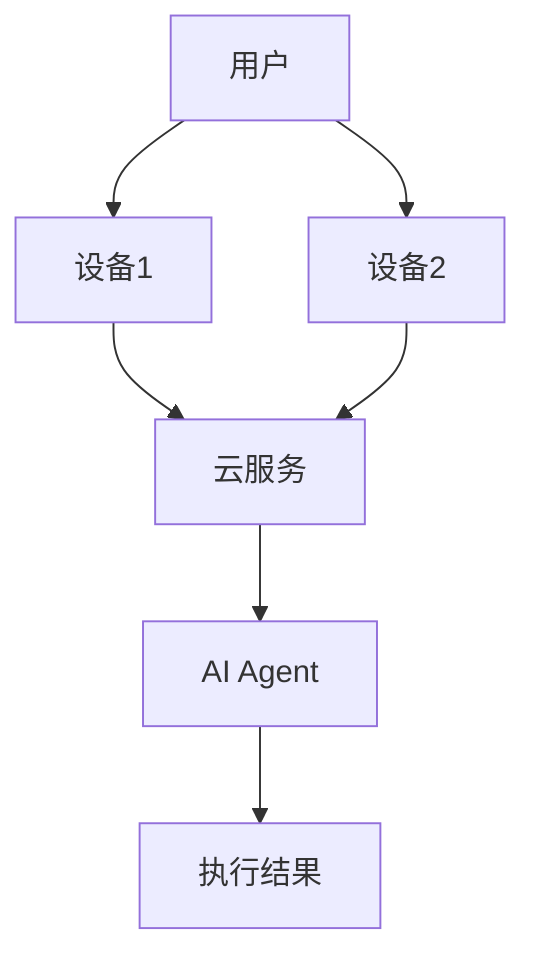

                 


# 跨平台AI Agent：PC、移动端和IoT设备的统一体验

## 关键词：
- 跨平台AI Agent
- 统一用户体验
- 多平台通信
- AI算法
- 系统架构
- 物联网设备

## 摘要：
本文详细探讨了跨平台AI Agent的设计与实现，涵盖PC、移动端和IoT设备的统一体验。通过分析AI Agent的基本原理、跨平台通信机制、统一数据模型的设计，以及实际项目中的系统架构和算法实现，本文为读者提供了从理论到实践的全面指导。文章还提供了丰富的图表和代码示例，帮助读者深入理解跨平台AI Agent的核心技术与应用。

---

## 第一部分: 跨平台AI Agent的背景与核心概念

### 第1章: 跨平台AI Agent概述

#### 1.1 跨平台AI Agent的背景与意义
##### 1.1.1 人工智能与智能助手的演进
人工智能技术的快速发展使得智能助手成为我们生活中不可或缺的一部分。从最初的单一功能工具到现在的多模态交互系统，AI Agent（智能代理）在各个平台上发挥着越来越重要的作用。然而，随着设备种类的增多（如PC、手机、IoT设备），如何在不同平台上提供一致的用户体验成为了一个新的挑战。

##### 1.1.2 跨平台AI Agent的核心概念
AI Agent是一种能够感知环境并主动执行任务的智能系统。跨平台AI Agent是指能够在不同平台上运行，并为用户提供统一服务的智能代理。其核心在于通过统一的API和数据模型，实现PC、移动端和IoT设备之间的无缝协作。

##### 1.1.3 跨平台统一体验的重要性
在多设备环境下，用户希望无论使用哪种设备，都能获得一致的操作体验和功能支持。跨平台AI Agent通过统一的交互界面和数据同步机制，解决了设备间功能割裂的问题，提升了用户体验。

#### 1.2 跨平台AI Agent的問題背景
##### 1.2.1 多平台环境下的兼容性挑战
不同平台的软硬件差异可能导致AI Agent的功能受限，例如传感器数据格式不统一、API接口不兼容等。

##### 1.2.2 不同设备间的交互一致性问题
用户在不同设备上使用AI Agent时，可能会遇到操作流程不一致、反馈机制不同步等问题，影响用户体验。

##### 1.2.3 用户体验的统一性需求
用户希望在任何设备上都能以相同的方式与AI Agent交互，获得一致的功能支持和服务质量。

#### 1.3 跨平台AI Agent的解决方案
##### 1.3.1 统一API设计
通过定义统一的API接口，确保AI Agent在不同平台上能够一致地调用设备功能和数据。

##### 1.3.2 跨平台通信机制
采用通用的通信协议（如WebSocket、HTTP）和数据格式（如JSON、Protobuf），实现设备间的高效通信。

##### 1.3.3 统一数据模型
构建统一的数据模型，确保不同设备上的数据能够无缝同步和共享。

---

### 第2章: 跨平台AI Agent的核心概念与原理

#### 2.1 AI Agent的基本原理
##### 2.1.1 AI Agent的定义
AI Agent是一种能够感知环境、理解用户需求并主动执行任务的智能系统。它可以基于用户输入（如语音、文本、手势）生成相应的输出（如操作指令、反馈信息）。

##### 2.1.2 AI Agent的核心功能
- 感知与理解：通过传感器、摄像头等设备获取环境信息，并利用NLP技术理解用户意图。
- 决策与执行：根据理解的结果，调用相应服务或设备完成任务。
- 学习与优化：通过机器学习算法不断优化自身的决策能力和用户体验。

##### 2.1.3 AI Agent的分类
- 单设备AI Agent：运行在单一设备上的智能代理，如手机上的语音助手。
- 跨平台AI Agent：能够同时在多个平台上运行，并为用户提供统一服务。
- 去中心化AI Agent：分布式部署，设备间协作完成任务。

#### 2.2 跨平台AI Agent的实现原理
##### 2.2.1 跨平台通信机制
跨平台AI Agent需要通过统一的通信协议和数据格式，在不同设备之间传递信息。例如，可以通过WebSocket协议建立实时通信通道，使用JSON格式传递数据。

##### 2.2.2 统一数据模型的设计
为了确保不同设备上的数据能够无缝同步，需要设计一个统一的数据模型。该模型应包含设备的基本信息（如设备ID、类型）、用户数据（如偏好设置）、任务状态等。

##### 2.2.3 跨平台UI适配策略
AI Agent的用户界面需要根据不同设备的特点进行适配，例如PC端提供桌面界面，移动端提供原生应用，IoT设备提供简洁的操作界面。

#### 2.3 跨平台AI Agent的核心要素
##### 2.3.1 跨平台通信协议
- WebSocket：支持实时双向通信。
- HTTP：适用于非实时的请求响应。

##### 2.3.2 统一API设计
- 设备控制API：用于调用设备功能（如摄像头、麦克风）。
- 数据同步API：用于设备间的数据共享。

##### 2.3.3 跨平台数据同步
- 数据存储：使用云服务（如AWS、Firebase）实现设备间的数据同步。
- 数据加密：确保数据传输和存储的安全性。

---

## 第二部分: 跨平台AI Agent的核心技术与算法原理

### 第3章: 跨平台AI Agent的核心算法

#### 3.1 多模态模型的原理
##### 3.1.1 多模态模型的定义
多模态模型是指能够同时处理多种数据类型（如文本、语音、图像）的AI模型。跨平台AI Agent需要支持多模态交互，以提供更丰富的用户体验。

##### 3.1.2 多模态模型的输入与输出
- 输入：用户的声音、文本、手势等。
- 输出：任务指令、反馈信息等。

##### 3.1.3 多模态模型的训练过程
通过监督学习或无监督学习，训练模型识别不同输入类型并生成相应的输出。

#### 3.2 跨平台AI Agent的算法实现
##### 3.2.1 跨平台数据处理算法
- 数据清洗：去除噪声，确保数据质量。
- 数据转换：将不同设备的数据格式转换为统一格式。

##### 3.2.2 跨平台通信算法
- 通信协议选择：根据设备类型选择合适的通信协议。
- 数据压缩：减少数据传输量，提升通信效率。

##### 3.2.3 跨平台UI适配算法
- 界面适配：根据设备屏幕尺寸、分辨率等调整UI布局。
- 交互优化：优化设备间的交互流程，提升用户体验。

#### 3.3 跨平台AI Agent的优化算法
##### 3.3.1 跨平台性能优化算法
- 并行计算：利用多核处理器提升计算效率。
- 分布式计算：在多个设备上分布式执行任务，提升整体性能。

##### 3.3.2 跨平台资源分配算法
- 资源调度：根据设备负载动态分配资源。
- 负载均衡：确保设备间的资源使用均衡。

---

### 第4章: 跨平台AI Agent的系统架构与实现

#### 4.1 系统架构设计
##### 4.1.1 系统功能设计
- 用户身份认证：确保用户安全登录。
- 任务管理：管理用户的任务请求。
- 数据同步：实现设备间数据的实时同步。

##### 4.1.2 系统架构图


#### 4.2 系统实现细节
##### 4.2.1 设备间通信实现
- 使用WebSocket协议建立实时通信通道。
- 数据格式统一为JSON。

##### 4.2.2 数据同步实现
- 使用云服务（如Firebase）进行数据同步。
- 数据加密传输，确保安全性。

#### 4.3 系统交互流程
##### 4.3.1 用户发起请求
用户通过设备1发送请求，设备1通过WebSocket与云服务通信。

##### 4.3.2 云服务处理请求
云服务接收请求后，调用AI Agent进行处理，生成响应。

##### 4.3.3 设备间数据同步
处理结果通过云服务同步到设备2，设备2显示反馈信息。

---

## 第三部分: 跨平台AI Agent的项目实战与优化

### 第5章: 跨平台AI Agent的项目实战

#### 5.1 项目背景
本项目旨在开发一个支持PC、手机和IoT设备的跨平台AI Agent，实现统一的用户体验。

#### 5.2 环境配置
- 开发工具：Visual Studio、Android Studio、Xcode。
- 通信协议：WebSocket。
- 数据库：Firebase。

#### 5.3 核心代码实现
##### 5.3.1 WebSocket通信实现
```python
import websockets
import asyncio

async def agent_communicator(websocket, path):
    async for message in websocket:
        # 处理消息
        response = process_request(message)
        await websocket.send(response)

start_server = websockets.serve(agent_communicator, 'localhost', 8000)
asyncio.get_event_loop().run_until_complete(start_server)
```

##### 5.3.2 数据同步实现
```python
import firebase_admin
from firebase_admin import credentials, db

cred = credentials.Credential.from_service_account_info(...)
firebase_app = firebase_admin.initialize_app(cred, {'databaseURL': 'https://<project-id>.firebaseio.com'})

def sync_data(local_data, remote_data):
    # 同步本地数据到云端
    db.reference('agent_data').set(local_data)
    # 获取云端数据
    return db.reference('agent_data').get().to_dict()
```

#### 5.4 项目测试与优化
- 功能测试：确保跨平台通信和数据同步正常。
- 性能测试：优化通信延迟和数据同步效率。

---

## 第四部分: 跨平台AI Agent的最佳实践与未来展望

### 第6章: 跨平台AI Agent的最佳实践

#### 6.1 开发注意事项
- 确保API设计的统一性和扩展性。
- 注意设备间的兼容性问题，避免功能冲突。

#### 6.2 系统优化建议
- 使用分布式架构提升系统性能。
- 定期更新AI模型，优化用户体验。

### 第7章: 跨平台AI Agent的未来展望

随着AI技术的不断进步和物联网设备的普及，跨平台AI Agent将在更多领域得到应用。未来的发展方向包括：

- 更强的多模态交互能力。
- 更高效的设备协同机制。
- 更智能的自适应学习能力。

---

## 总结
跨平台AI Agent的实现是一个复杂的系统工程，需要从API设计、通信机制、数据模型等多个方面进行综合考虑。通过本文的详细讲解，读者可以全面了解跨平台AI Agent的核心技术和实现方法，并在实际项目中加以应用。

---

