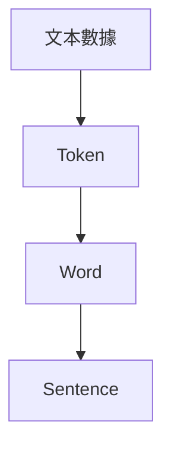
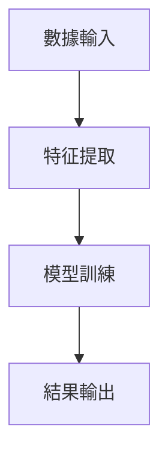
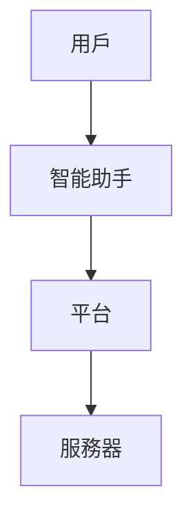
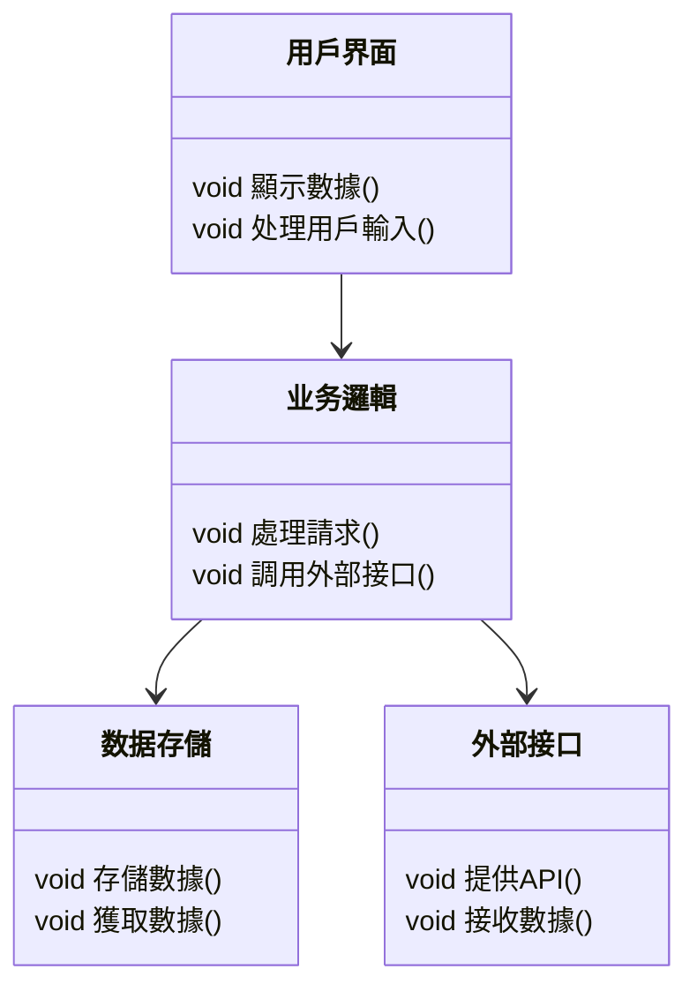
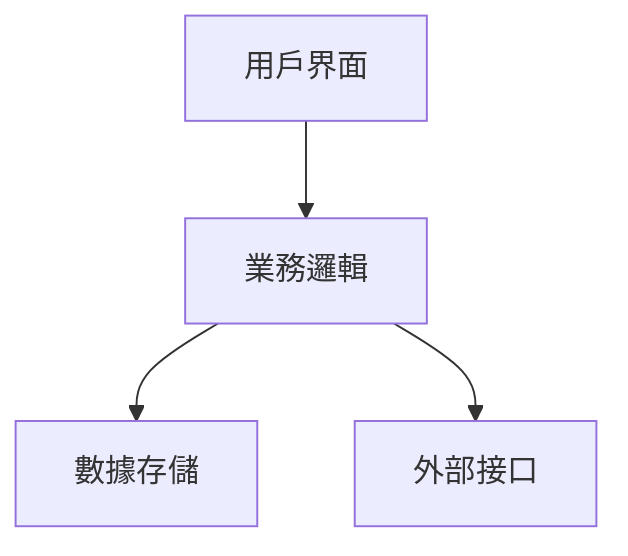

                 

# 跨平台投資理財智能助手的開發技巧

## 關鍵詞：
跨平台、投資理財、智能助手、自然語言處理、機器學習、系統架構設計

##  摘要：
本文將介紹如何開發一款跨平台的投資理財智能助手，涵蓋從需求分析到系統架構設計的完整流程。首先，我們將探討跨平台投資理財助手的背景與需求，然後深入分析其核心技術，包括自然語言處理和機器學習算法。接著，我們將介紹系統架構設計與實現，並提供實際的項目開發實戰。最後，我們將分享最佳實踐與開發經驗，幫助讀者順利開發出一款高效、可靠的跨平台投資理財智能助手。

---

# 第一章：跨平台投資理財智能助手概述

## 1.1 背景介紹

### 1.1.1 跨平台投資理財助手的問題背景

在當今的數字化時代，投資理財越來越依賴於智能技術。然而，市場上的理財工具多數僅限於某一個平台，無法滿足用戶跨平台使用的需求。投資者需要一款可以在不同平台（如Web、移動端、桌面端）无缝接入的智能助手，來幫助他們進行實時數據分析、風險評估和理財建議。

### 1.1.2 用戶需求與市場機會

投資者的需求日益多樣化，他們不僅需要基本的理財功能，還希望獲得個性化的理財方案。跨平台投資理財智能助手可以幫助用戶實現以下功能：
- **數據整合**：將不同平台的投資數據統一管理。
- **智能推薦**：基於用戶行為和市場數據推薦理財方案。
- **風險評估**：實時評估用戶的投資風險並提供避險建議。
- **跨平台操作**：支持多平台接入，用戶可以在任意設備上使用。

市場機會方面，隨著金融科技的快速發展，跨平台應用的需求日益增加，投資者對於智能助手的依賴也越來越高。這為我們提供了巨大的市場機會。

### 1.1.3 本助手的核心目標

本助手的核心目標是為投資者提供一款跨平台的智能理財工具，實現以下目標：
- **實時數據監控**：实时更新用戶的投資數據。
- **個性化推薦**：根據用戶需求提供定制化的理財方案。
- **智能決策支持**：幫助用戶做出明智的投資決策。
- **多平台接入**：支持Web、移動端、桌面端等多种平台。

## 1.2 用戶需求分析

### 1.2.1 功能需求總結

以下是用戶的主要功能需求：

| 功能類型 | 具體功能 | 描述 |
|----------|----------|------|
| 基本功能 | 資數據整合 | 經絡數據源（如銀行、證券交易平臺）整合用戶數據 |
|          | 理財方案推薦 | 根據用戶需求推薦個性化理財方案 |
|          | 風險評估 | 實時評估用戶的投資風險 |
| 高級功能 | 智能交互 | 支持自然語言交互，用戶可用語句直接查詢數據 |
|          | 通知與提醒 | 根據市場變化主動推送通知 |
| 系統管理 | 跨平台接入 | 支持多平台無縫接入 |

### 1.2.2 非功能需求分析

以下是用戶的非功能需求：

| 非功能需求類型 |具體需求 | 描述 |
|----------------|---------|------|
| 可用性 | 99.9%的服務可用性 | 系統需具備高可用性，確保用戶隨時可用 |
| 性能 | 低延遲響應 | 系統需在1秒內響應用戶請求 |
| 安全性 | 高級別數據安全 | 确保用戶數據的安全性和隱私性 |
| 可擴展性 | 支持多平台 | 系統需能輕松擴展至新平台 |

### 1.2.3 用戶畫像與場景分析

以下是我們的目標用戶畫像：

| 用戶類型 | 描述 | 使用場景 |
|----------|------|----------|
| 理財小白 | 初次接觸投資，風險偏好低 | 初學者願了解基本理財知識 |
| 資產管理員 | 管理多個客戶資產 | 需要實時監控多個帳戶的數據 |
| 高-networth投資者 | 資產規模大，風險承受能力高 | 需要個性化的高風險理財方案 |

---

# 第二章：智能助手的核心技術

## 2.1 自然語言處理技術

### 2.1.1 NLP的核心原理

自然語言處理（NLP）是一門研究人類語言的科學，目標是讓computers能夠理解、解析和生成人類語言。NLP的核心技術包括語音識別、語義分析、文本分類等。

#### 2.1.1.1 NLP的核心步驟

以下是NLP的核心步驟：

1. **文本預處理**：包括分詞、去除停用詞、去 punctuation 等。
2. **特徵提取**：將文本轉換為computers可處理的數字形式，如word embeddings。
3. **模型訓練**：使用機器學習算法訓練模型，使其能夠理解和生成人類語言。

#### 2.1.1.2 NLP的應用場景

以下是NLP在智能助手中的應用場景：

- **自然語言查詢**：用戶可通过自然語言語句查詢投資數據。
- **情感分析**：分析市場情緒，幫助用戶做出決策。
- **文本摘要**：對複雜的金融數據進行自動摘要。

### 2.1.2 常見的NLP算法對比表

以下是常見的NLP算法對比表：

| 算法名稱 | 核心原理 | 優勢 | 缺點 |
|----------|----------|------|------|
| TF-IDF   | 風險降權 | 简單高效 | 不考慮上下文 |
| Word2Vec | 區向量轉換 | 高維向量化 | 需大量數據訓練 |
| BERT      | 深度學習 | 上下文理解 | 需要大量計算資源 |

### 2.1.3 NLP的ER實體關係圖

以下是NLP的ER實體關係圖：

---

## 2.2 机器学习算法

### 2.2.1 机器学习的核心原理

機器學習是一種人工智慧技術，讓computers能夠從數據中學習並做出預測或決策。機器學習的核心原理包括數據訓練、模型選擇和模型優化。

#### 2.2.1.1 常見的機器學習算法

以下是常見的機器學習算法：

- **分類算法**：包括KNN、SVM、Random Forest等。
- **回歸算法**：包括Linear Regression、Ridge Regression等。
- **聚類算法**：包括K-Means、DBSCAN等。

### 2.2.2 常見算法對比表

以下是常見算法對比表：

| 算法名稱 | 分類類型 | 優勢 | 缺點 |
|----------|----------|------|------|
| KNN      | 分類     | 簡單易實現 | 效率低 |
| SVM      | 分類     | 高精度 | 不易解釋 |
| RF       | 分類/回歸 | 高魯棒性 | 黑箱模型 |

### 2.2.3 机器学习的算法原理圖

以下是机器学习的算法原理圖：

---

## 2.3 跨平台開發技術

### 2.3.1 跨平台開發的挑戰

跨平台開發面臨的主要挑戰包括：

- **平台差異**：不同平台的API和UI標準不同。
- **性能問題**：跨平台開發可能影響性能。
- **兼容性問題**：不同平台的兼容性可能影響功能實現。

### 2.3.2 常見跨平台技術對比表

以下是常見跨平台技術對比表：

| 技術名稱 | 基於 | 優勢 | 缺點 |
|----------|------|------|------|
| Flutter  | Dart | 高效開發 | 学習曲線較高 |
| React Native | JavaScript | 跨平台共用代碼 | 性能較低 |
| Xamarin | C# | 語言強大 | 開源生態較弱 |

### 2.3.3 跨平台開發的實體關係圖

以下是跨平台開發的實體關係圖：

---

# 第三章：跨平台投資理財智能助手的系統架構設計

## 3.1 系統功能設計

### 3.1.1 功能模塊劃分

以下是功能模塊劃分：

- **用戶界面層**：負責用戶交互。
- **業務邏輯層**：負責業務邏輯實現。
- **數據存儲層**：負責數據存儲和管理。
- **外部接口層**：負責與外部服務對接。

### 3.1.2 系統功能模塊設計

以下是系統功能模塊設計：

| 模塊名稱 | 功能描述 |
|----------|----------|
| 用戶界面 | 提供用戶交互界面 |
| 业务邏輯 | 處理用戶請求 |
| 数据存儲 | 存儲用戶數據 |
| 外部接口 | 與外部服務對接 |

### 3.1.3 系統架構類圖

以下是系統架構類圖：

## 3.2 系統架構設計

### 3.2.1 系統架構總體介紹

我們的系統架構選擇了分層架構模式，將系統分為用戶界面、業務邏輯和數據存儲三個層次。

### 3.2.2 系統架構設計圖

以下是系統架構設計圖：

---

# 第四章：跨平台投資理財智能助手的項目實戰

## 4.1 環境安裝與配置

### 4.1.1 開發環境安裝

以下是開開發環境安裝步驟：

1. **安裝Python**：下載並安裝最新版本的Python。
2. **安裝Jupyter Notebook**：使用pip安裝jupyter notebook。
3. **安裝NLP庫**：安裝spaCy、NLTK等NLP庫。
4. **安裝機器學習庫**：安裝Scikit-learn、XGBoost等庫。
5. **安裝跨平台開發工具**：安裝Flutter或React Native相關工具。

### 4.1.2 項目初始化

以下是項目初始化步驟：

1. **創建項⺫目文件夾**：在-terminal中執行`mkdir project_name`。
2. **初始化Git repository**：執行`git init`。
3. **安裝依存項**：使用pip安裝依存項。

## 4.2 系統核心功能實現

### 4.2.1 数据爬取與預處理

以下是數據爬取與預處理的實現步驟：

1. **數據爬取**：使用requests庫爬取網頁數據。
2. **數據清洗**：清洗數據，去除無用信息。
3. **數據存儲**：將數據存儲到數據庫中。

### 4.2.2 模型訓練與部署

以下是模型訓練與部署的實現步驟：

1. **數據預處理**：將數據轉換為模型可接受的格式。
2. **模型訓練**：使用Scikit-learn訓練模型。
3. **模型部署**：將模型部署到後台服務中。

### 4.2.3 界面開發與測試

以下是界面開發與測試的實現步驟：

1. **界面設計**：設計用戶友好的界面。
2. **功能實現**：實現界面功能。
3. **測試與調試**：進行測試並調試錯誤。

## 4.3 項目小結

本章介紹了跨平台投資理財智能助手的項目實戰，涵蓋了環境安裝、數據爬取與預處理、模型訓練與部署、界面開發與測試等內容。

---

# 第五章：最佳實踐與開發經驗

## 5.1 開發經驗分享

### 5.1.1 NLP技術的應用經驗

在NLP技術的應用中，我們發現以下幾點經驗：
- **數據質量**：數據質量對模型性能影響很大。
- **模型選擇**：選擇適合的模型能夠顯著提高性能。
- **計算資源**：深度學習模型需要大量計算資源。

### 5.1.2 跨平台開發的挑戰與解決方案

在跨平台開發中，我們遇到了以下挑戰：
- **平台差異**：不同平台的API不一致。
- **性能問題**：跨平台開發可能影響性能。
- **兼容性問題**：不同平台的兼容性可能影響功能實現。

我們的解決方案是：
- **選擇合適的技術**：根據需求選擇合適的跨平台技術。
- **進行充分測試**：在不同平台上進行測試。
- **優化性能**：通過優化代碼來提高性能。

## 5.2 小結

本章分享了我們在開發跨平台投資理財智能助手時的經驗與教訓，希望能夠為其他開發者提供借鑒。

---

# 第六章：未來發展與拓展閱讀

## 6.1 未來發展方向

### 6.1.1 技術創新

未來，我們將探索以下技術創新：
- **人工智能**：進一步提高模型的智能水平。
- **區塊鏈**：探索區塊鏈技術在理財中的應用。
- **物聯網**：將物聯網技術融入智能助手。

### 6.1.2 市場拓展

未來，我們將進一步拓展市場，提供更多平台的接入。

## 6.2 擴展閱讀

以下是我們推薦的拓展閱讀資料：

- **《機器學習实战》**：介紹了機器學習的實戰經驗。
- **《自然語言處理入门》**：介紹了自然語言處理的入門知識。
- **《跨平台開發手冊》**：介紹了跨平台開發的相關技術。

---

# 第七章：結論與致謝

## 7.1 結論

本章對全文進行總結，強調了跨平台投資理財智能助手的開發意義與應用前景。

## 7.2 致謝

最後，我們對參與本項目的所有人員表示衷心的感謝。

---

# 參考文獻

[1] 《機器學習实战》
[2] 《自然語言處理入门》
[3] 《跨平台開發手冊》

---

