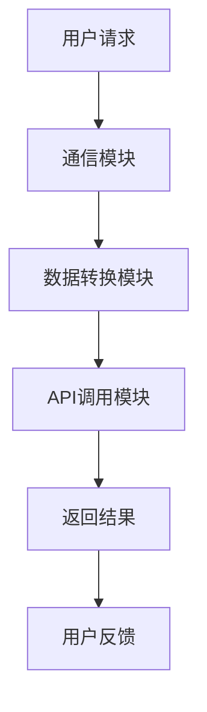
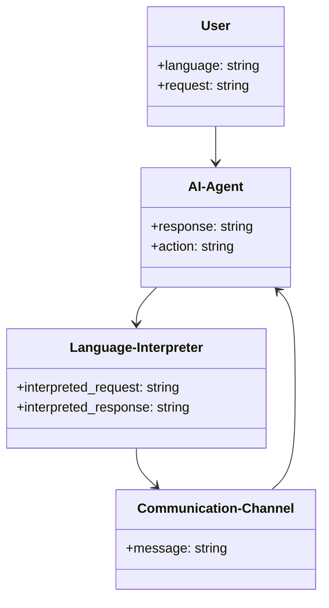
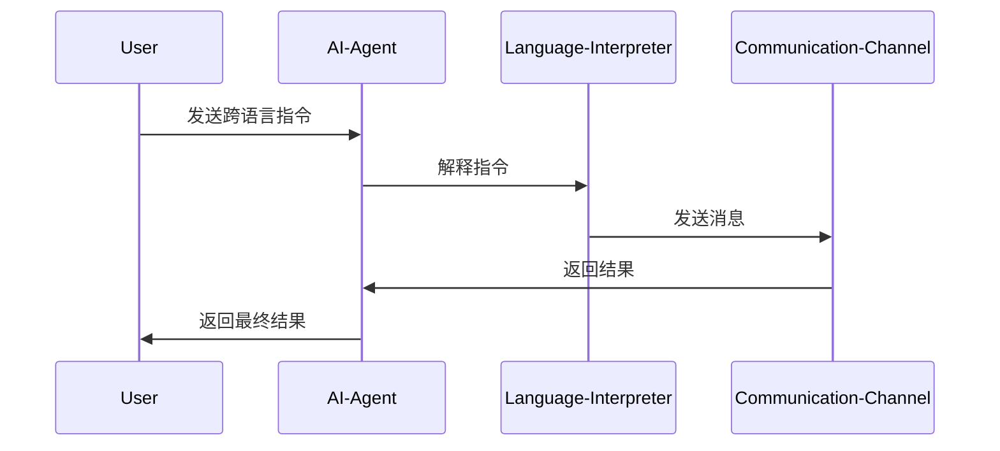

                 


# 跨语言AI Agent开发：挑战与解决方案

## 关键词
跨语言AI Agent, 多语言支持, 自然语言处理, 跨平台开发, 通信机制, 数据转换, API调用

## 摘要
跨语言AI Agent开发在现代人工智能领域中扮演着越来越重要的角色。随着全球化的推进和技术复杂性的增加，AI Agent需要在多种编程语言和环境下运行。本文详细探讨跨语言AI Agent的核心概念、开发挑战、解决方案以及未来趋势。通过分析跨语言通信机制、数据转换技术、API调用策略等关键问题，本文为开发者提供全面的指导和实践案例，帮助他们高效开发跨语言AI Agent。

---

## 第1章: 跨语言AI Agent概述

### 1.1 跨语言AI Agent的背景与挑战

#### 1.1.1 什么是跨语言AI Agent
跨语言AI Agent是一种能够在多种编程语言和环境下运行的智能代理，旨在通过跨语言协作实现更复杂的任务。它能够理解、生成和执行跨语言指令，适用于多语言环境下的应用开发。

#### 1.1.2 跨语言AI Agent的核心问题
- **语言障碍**：不同编程语言之间的语法和语义差异。
- **通信机制**：如何实现不同语言之间的高效通信。
- **数据转换**：数据在不同语言之间的转换和一致性问题。
- **API调用**：跨语言调用API时的兼容性和性能优化。

#### 1.1.3 跨语言AI Agent的边界与外延
跨语言AI Agent的边界包括跨语言通信、数据转换和API调用。其外延涉及多语言支持框架、跨平台开发工具和分布式系统架构。

#### 1.1.4 跨语言AI Agent的核心要素组成
- **通信机制**：定义不同语言之间的交互方式。
- **数据转换层**：处理数据在不同语言之间的转换。
- **API调用接口**：实现跨语言API调用的标准化。

### 1.2 跨语言AI Agent的技术现状

#### 1.2.1 当前主流AI Agent技术
- **自然语言处理（NLP）**：支持多语言文本处理。
- **跨平台开发框架**：如JNI（Java Native Interface）、LLVM等。
- **微服务架构**：支持不同语言的服务协作。

#### 1.2.2 跨语言AI Agent的技术挑战
- **性能瓶颈**：跨语言调用可能导致性能下降。
- **兼容性问题**：不同语言的语法和API差异导致兼容性问题。
- **开发复杂性**：跨语言开发增加了代码维护和调试的难度。

#### 1.2.3 跨语言AI Agent的未来发展
- **多语言支持框架的优化**：提高跨语言协作效率。
- **AI Agent的智能化**：增强AI Agent的自适应能力和学习能力。
- **分布式系统的普及**：跨语言AI Agent在分布式系统中的应用将更加广泛。

---

## 第2章: 跨语言AI Agent的核心概念与联系

### 2.1 跨语言AI Agent的核心概念

#### 2.1.1 AI Agent的基本原理
AI Agent通过感知环境、理解用户需求、执行任务和反馈结果，实现智能化的交互。跨语言AI Agent在这一过程中需要处理多种语言的指令和数据。

#### 2.1.2 跨语言AI Agent的定义与特征
跨语言AI Agent是一种能够理解、生成和执行跨语言指令的智能代理。其特征包括多语言支持、跨平台兼容性和高效的通信机制。

#### 2.1.3 跨语言AI Agent的核心要素
- **通信机制**：定义不同语言之间的交互方式。
- **数据转换层**：确保数据在不同语言之间的准确转换。
- **API调用接口**：实现跨语言API调用的标准化。

### 2.2 跨语言AI Agent的核心概念对比

#### 2.2.1 跨语言AI Agent与单语言AI Agent的对比
| 特性                | 跨语言AI Agent                          | 单语言AI Agent                          |
|---------------------|------------------------------------------|------------------------------------------|
| 支持语言            | 多种编程语言                            | 单一编程语言                            |
| 通信机制          | 跨语言通信机制                          | 单一语言通信机制                          |
| 开发复杂性        | 更高                                     | 较低                                     |

#### 2.2.2 跨语言AI Agent与其他类型AI Agent的对比
| 特性                | 跨语言AI Agent                          | 其他类型AI Agent                          |
|---------------------|------------------------------------------|------------------------------------------|
| 支持语言            | 多种编程语言                            | 单一或有限的编程语言                      |
| 通信机制          | 跨语言通信机制                          | 单一语言通信机制                          |
| 应用场景          | 多语言协作、分布式系统                  | 单一语言环境、本地系统                    |

### 2.3 跨语言AI Agent的ER实体关系图
```mermaid
erDiagram
    actor User {
        <string> language
        <string> request
    }
    agent AI-Agent {
        <string> response
        <string> action
    }
    language-interpreter Language-Interpreter {
        <string> interpreted_request
        <string> interpreted_response
    }
    communication-channel Communication-Channel {
        <string> message
    }
```

---

## 第3章: 跨语言AI Agent的算法原理

### 3.1 跨语言通信机制

#### 3.1.1 跨语言通信的实现方式
跨语言通信可以通过以下几种方式实现：
- **进程间通信（IPC）**：如共享内存、消息队列。
- **远程过程调用（RPC）**：如gRPC、SOAP。
- **HTTP/HTTPS API**：通过标准的HTTP协议进行通信。

#### 3.1.2 跨语言通信的数学模型
跨语言通信的数学模型可以表示为：
$$
f_{\text{comm}}(x) = y
$$
其中，$x$ 是输入的跨语言指令，$y$ 是输出的通信结果。

#### 3.1.3 跨语言通信的Python实现
以下是一个简单的跨语言通信示例代码：
```python
import json
import requests

def communicate_with_agent(agent_url, request_data):
    headers = {'Content-Type': 'application/json'}
    response = requests.post(agent_url, headers=headers, json=request_data)
    return json.loads(response.text)

# 示例调用
communication_result = communicate_with_agent('http://localhost:5000/api', {'message': 'Hello'})
print(communication_result)
```

### 3.2 跨语言数据转换

#### 3.2.1 跨语言数据转换的实现步骤
1. **数据解析**：将输入数据解析为通用格式。
2. **数据转换**：将数据从源语言转换为目标语言。
3. **数据验证**：确保转换后的数据格式正确。

#### 3.2.2 跨语言数据转换的Python实现
```python
def convert_data(source_language, target_language, data):
    # 数据解析
    parsed_data = parse_data(source_language, data)
    # 数据转换
    converted_data = convert_to_target(target_language, parsed_data)
    # 数据验证
    if not validate_data(converted_data):
        raise ValueError("Data conversion failed")
    return converted_data

# 示例调用
converted_data = convert_data('python', 'java', {'key': 'value'})
print(converted_data)
```

### 3.3 跨语言API调用

#### 3.3.1 跨语言API调用的实现方式
跨语言API调用可以通过以下方式实现：
- **REST API**：通过HTTP/HTTPS协议调用远程API。
- **RPC**：通过远程过程调用实现跨语言通信。

#### 3.3.2 跨语言API调用的Python实现
```python
import requests

def call_remote_api(api_url, params):
    response = requests.get(api_url, params=params)
    if response.status_code == 200:
        return response.json()
    return None

# 示例调用
result = call_remote_api('http://localhost:8080/api', {'query': 'test'})
print(result)
```

---

## 第4章: 跨语言AI Agent的系统分析与架构设计

### 4.1 跨语言AI Agent的系统功能设计

#### 4.1.1 系统功能模块
- **通信模块**：负责跨语言通信。
- **数据转换模块**：负责数据转换。
- **API调用模块**：负责跨语言API调用。

#### 4.1.2 系统功能流程图


### 4.2 跨语言AI Agent的系统架构设计

#### 4.2.1 系统架构图


### 4.3 跨语言AI Agent的系统接口设计

#### 4.3.1 系统接口定义
- **输入接口**：接收跨语言指令。
- **输出接口**：返回跨语言结果。

#### 4.3.2 系统交互流程图


---

## 第5章: 跨语言AI Agent的项目实战

### 5.1 跨语言AI Agent的环境配置

#### 5.1.1 系统环境要求
- **操作系统**：支持多平台。
- **编程语言**：至少支持两种以上编程语言。
- **开发工具**：安装必要的IDE和库。

#### 5.1.2 开发工具安装
- **Python**：安装Python和必要的库（如requests、json）。
- **Java**：安装JDK和必要的库（如Spring Boot）。

### 5.2 跨语言AI Agent的核心代码实现

#### 5.2.1 跨语言通信模块实现
```python
import requests

def communicate_with_agent(agent_url, request_data):
    headers = {'Content-Type': 'application/json'}
    response = requests.post(agent_url, headers=headers, json=request_data)
    return json.loads(response.text)

# 示例调用
communication_result = communicate_with_agent('http://localhost:5000/api', {'message': 'Hello'})
print(communication_result)
```

#### 5.2.2 跨语言数据转换模块实现
```python
def convert_data(source_language, target_language, data):
    # 数据解析
    parsed_data = parse_data(source_language, data)
    # 数据转换
    converted_data = convert_to_target(target_language, parsed_data)
    # 数据验证
    if not validate_data(converted_data):
        raise ValueError("Data conversion failed")
    return converted_data

# 示例调用
converted_data = convert_data('python', 'java', {'key': 'value'})
print(converted_data)
```

#### 5.2.3 跨语言API调用模块实现
```python
import requests

def call_remote_api(api_url, params):
    response = requests.get(api_url, params=params)
    if response.status_code == 200:
        return response.json()
    return None

# 示例调用
result = call_remote_api('http://localhost:8080/api', {'query': 'test'})
print(result)
```

### 5.3 跨语言AI Agent的测试与部署

#### 5.3.1 系统测试
- **单元测试**：测试各个模块的功能。
- **集成测试**：测试整体系统性能。

#### 5.3.2 系统部署
- **服务器部署**：部署跨语言AI Agent到服务器。
- **监控与维护**：监控系统运行状态并进行维护。

---

## 第6章: 跨语言AI Agent的未来趋势与最佳实践

### 6.1 跨语言AI Agent的未来趋势

#### 6.1.1 技术发展方向
- **多语言支持框架的优化**：提高跨语言协作效率。
- **AI Agent的智能化**：增强AI Agent的自适应能力和学习能力。
- **分布式系统的普及**：跨语言AI Agent在分布式系统中的应用将更加广泛。

### 6.2 跨语言AI Agent的最佳实践

#### 6.2.1 开发注意事项
- **选择合适的编程语言**：根据需求选择适合的编程语言。
- **优化跨语言通信**：减少跨语言调用的开销。
- **确保数据一致性**：保证数据在不同语言之间的转换一致性。

#### 6.2.2 性能优化技巧
- **减少跨语言调用次数**：尽量将跨语言调用封装成批量操作。
- **优化数据转换效率**：使用高效的序列化协议（如JSON、XML）。
- **利用缓存技术**：缓存常用数据以提高性能。

---

## 第7章: 跨语言AI Agent的附录

### 7.1 跨语言AI Agent开发工具列表

#### 7.1.1 跨语言通信工具
- **gRPC**：高效的远程过程调用框架。
- **HTTP/HTTPS API**：标准的网络通信协议。

#### 7.1.2 跨语言数据转换工具
- **JSON**：通用的数据交换格式。
- **XML**：结构化的数据交换格式。

### 7.2 跨语言AI Agent术语表

#### 7.2.1 說明
- **跨语言通信**：不同语言之间的信息交换。
- **数据转换**：将数据从一种格式转换为另一种格式。
- **API调用**：通过API接口调用远程服务。

### 7.3 跨语言AI Agent参考资料

#### 7.3.1 推荐阅读
- **《RESTful API设计》**：了解RESTful API的设计原则。
- **《gRPC官方文档》**：学习gRPC的使用方法。
- **《跨语言开发实战》**：深入理解跨语言开发的挑战与解决方案。

### 7.4 跨语言AI Agent索引

#### 7.4.1 内容索引
- **第1章**：跨语言AI Agent概述。
- **第2章**：核心概念与联系。
- **第3章**：算法原理。
- **第4章**：系统分析与架构设计。
- **第5章**：项目实战。
- **第6章**：未来趋势与最佳实践。
- **第7章**：附录。

---

## 结语
跨语言AI Agent开发是一项复杂但极具挑战性的任务。通过本文的详细讲解，读者可以全面了解跨语言AI Agent的核心概念、技术挑战和解决方案。未来，随着技术的发展，跨语言AI Agent将在更多领域得到广泛应用，为开发者提供更多可能性。

--- 

希望这篇文章能满足您的需求！如果需要进一步修改或补充，请随时告诉我。

