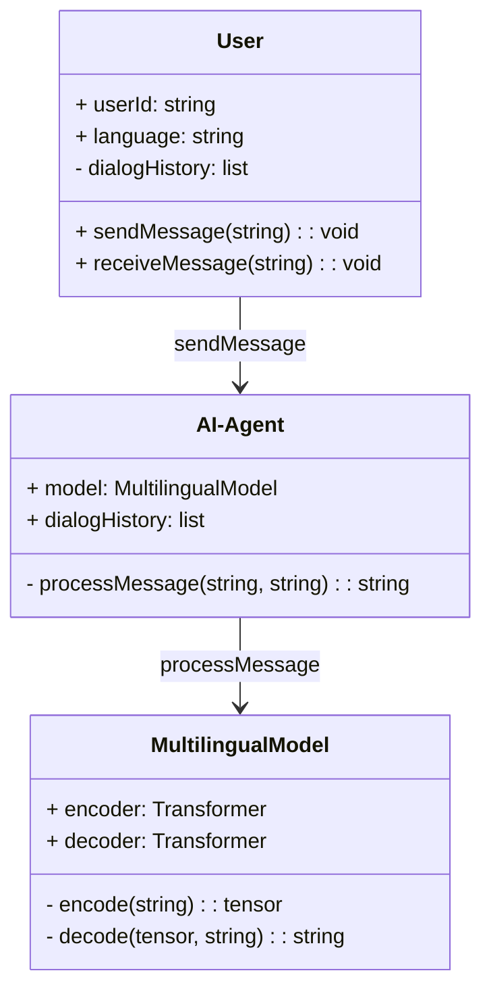

                 


# 跨语言AI Agent的开发挑战与解决方案

> **关键词**: 跨语言AI Agent, 多语言处理, 人工智能, 跨语言对齐, 机器学习, 深度学习, 語言模型

> **摘要**: 本文深入探讨了跨语言AI Agent的开发挑战与解决方案，从核心概念、算法原理、系统架构到项目实战，全面分析了跨语言AI Agent的技术实现。通过对比分析和实际案例，本文提出了有效的开发策略和优化建议，为开发者提供了实用的指导。

---

## 第一部分：跨语言AI Agent的背景与挑战

### 第1章：跨语言AI Agent的背景与概念

#### 1.1 跨语言AI Agent的发展背景

随着全球化的深入，跨语言交流的需求日益增长。AI Agent作为一种能够与人类交互并执行复杂任务的智能体，其跨语言能力成为实现真正智能化的关键。跨语言AI Agent能够理解并生成多种语言，解决了传统单语言模型在多语言场景下的局限性。

#### 1.2 跨语言AI Agent的核心概念

- **定义**: 跨语言AI Agent是指能够理解、生成和处理多种语言的智能体，能够在不同的语言环境中提供服务。
- **区别**: 与单语言AI Agent相比，跨语言AI Agent具备多语言处理能力，能够跨越语言障碍进行交互。
- **特征**: 支持多语言输入输出、跨语言语义理解、语言间的语义对齐。

#### 1.3 跨语言AI Agent的边界与外延

- **应用场景**: 跨语言客服、多语言内容生成、全球化的智能助手。
- **局限性**: 跨语言理解的准确性受限于语言间的语义差异，多语言模型的训练难度较高。
- **与其他技术的关系**: 跨语言AI Agent依赖于自然语言处理（NLP）、机器学习和深度学习技术。

---

### 第2章：跨语言AI Agent的核心概念与联系

#### 2.1 多语言处理的原理

- **多语言模型的基本结构**: 基于Transformer的多语言模型（如Marian）支持多种语言的编码和解码。
- **训练方法**: 使用多语言数据集进行联合训练，采用语言嵌入（language embeddings）区分不同语言。
- **评估指标**: 采用跨语言BLEU、ROUGE等指标评估生成质量。

#### 2.2 跨语言理解与生成的机制

- **跨语言语义理解**: 通过预训练模型（如mBert）实现跨语言语义表示。
- **跨语言生成**: 基于语言间的语义对齐，生成目标语言的文本。
- **语义对齐技术**: 使用对比学习或对齐层（alignment layer）对齐不同语言的语义表示。

#### 2.3 語言对齐技术的对比

| 方法类型             | 基于统计   | 基于深度学习 | 混合方法   |
|----------------------|------------|-------------|------------|
| 对齐目标             | 统计特征    | 深度语义     | 统计+语义   |
| 优势                 | 计算简单    | 对齐更准确   | 结合两者优点 |
| 动态性               | 较低       | 较高         | 较高       |

---

## 第二部分：跨语言AI Agent的算法原理

### 第3章：跨语言AI Agent的算法原理

#### 3.1 多语言模型的训练方法

- **模型结构**: 使用Transformer架构，编码器和解码器支持多语言输入输出。
- **训练目标**: 最小化交叉熵损失函数，优化多语言任务的性能。
- **数学模型**: 损失函数定义如下：

$$ \mathcal{L} = -\frac{1}{N}\sum_{i=1}^{N}\sum_{j=1}^{M} y_{ij}\log(p(y_{ij})) $$

其中，$N$是样本数量，$M$是目标语言的数量。

#### 3.2 跨语言迁移学习

- **预训练模型**: 使用大规模多语言数据预训练模型（如XLM）。
- **微调策略**: 在特定领域数据上进行微调，提升任务相关性。
- **对齐层**: 在编码器中加入对齐层，增强不同语言之间的语义对齐。

---

## 第三部分：跨语言AI Agent的系统分析与架构设计

### 第4章：系统分析与架构设计

#### 4.1 项目背景与需求分析

- **项目背景**: 开发一个支持多种语言的智能客服系统。
- **功能需求**: 多语言理解、生成、对话历史记录。

#### 4.2 系统功能设计

- **领域模型**: 使用Mermaid类图展示系统模块关系。



#### 4.3 系统架构设计

- **架构图**: 使用Mermaid架构图展示系统模块。


---

## 第四部分：跨语言AI Agent的项目实战

### 第5章：项目实战

#### 5.1 环境搭建

- **工具安装**: 安装Python、TensorFlow、Hugging Face库。
- **代码实现**: 实现一个简单的跨语言翻译器。

```python
from transformers import MarianMTModel, MarianTokenizer

# 加载预训练模型
tokenizer = MarianTokenizer.from_pretrained("Helsinki-NLP/marian-multi")
model = MarianMTModel.from_pretrained("Helsinki-NLP/marian-multi")

def translate(source_lang, target_lang, text):
    # 对齐语言对
    src = f"{source_lang}->{target_lang}"
    inputs = tokenizer.prepare_seq2seq_batch(text, src=src)
    outputs = model.generate(inputs['input_ids'])
    return tokenizer.decode(outputs[0], skip_special_tokens=True)

# 示例
print(translate("en", "zh", "Hello, how are you?"))
```

#### 5.2 代码解读与分析

- **对齐语言对**: 使用预训练模型支持的语言对进行翻译。
- **模型生成**: 通过模型生成目标语言文本。
- **语义对齐**: 使用预训练模型的对齐层实现语言间的语义对齐。

---

## 第五部分：跨语言AI Agent的最佳实践

### 第6章：最佳实践与总结

#### 6.1 小结

- **总结**: 跨语言AI Agent的开发需要结合多语言处理技术和语义对齐技术。
- **经验**: 使用预训练模型和对比学习提升对齐效果。
- **注意事项**: 注意语言间的语义差异，避免误解。

#### 6.2 扩展阅读

- 推荐阅读《Cross-Language Transfer of Pretrained NLP Models》。
- 参考Hugging Face的多语言模型库。

---

## 结语

跨语言AI Agent的开发挑战与解决方案是一个复杂而重要的领域。通过本文的分析，读者可以深入了解跨语言AI Agent的技术实现和应用策略。未来，随着NLP技术的不断进步，跨语言AI Agent将更加智能化，为多语言场景下的应用提供更强大的支持。

---

**（全文结束）**

