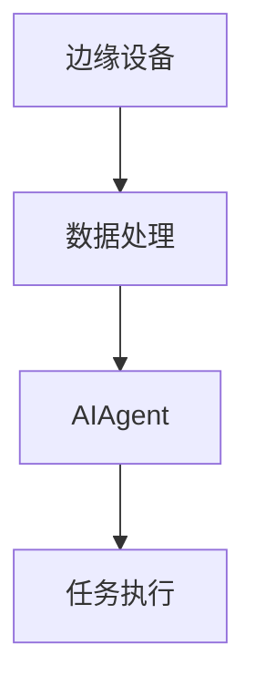
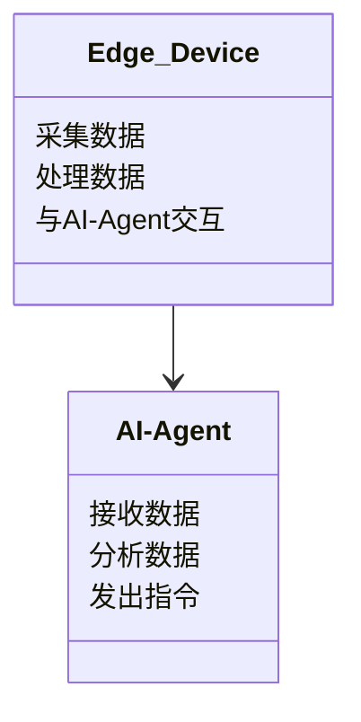
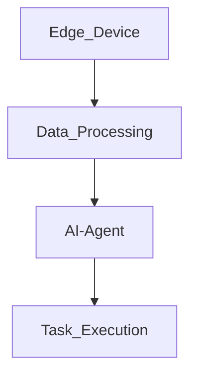
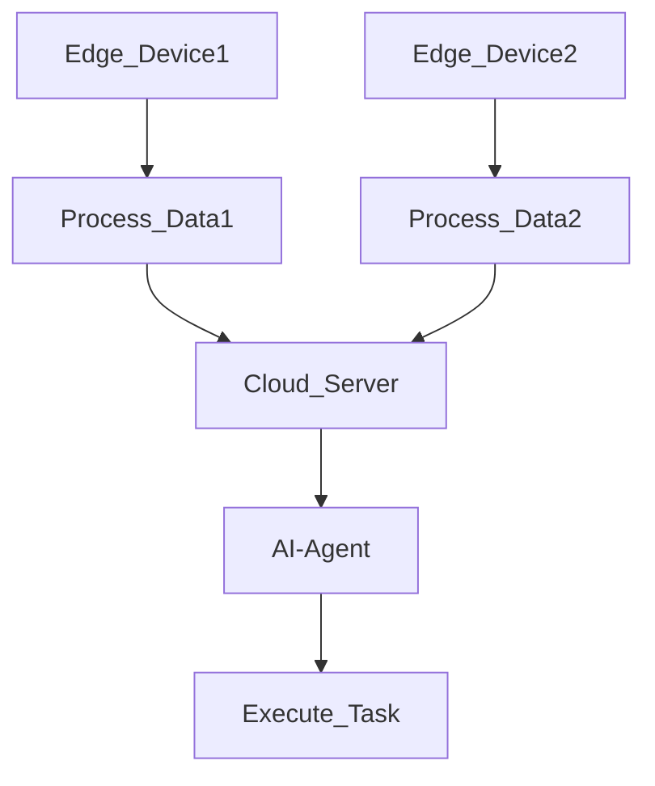

                 


# 边缘计算在AI Agent中的应用

---

## 关键词：边缘计算，AI Agent，分布式计算，智能系统，实时处理

---

## 摘要：  
边缘计算与AI Agent的结合为智能系统的设计与实现提供了新的思路。通过在数据源附近进行计算和决策，边缘计算能够显著降低延迟、减少带宽消耗，并提高系统的实时性和可靠性。本文将从边缘计算与AI Agent的核心概念出发，探讨它们的结合方式、应用场景、系统架构设计、算法实现及优化策略，最后通过项目实战展示如何在实际中应用这些技术。

---

# 第1章：边缘计算与AI Agent的背景与概念

## 1.1 边缘计算的发展与现状

### 1.1.1 边缘计算的定义与特点  
边缘计算是指在数据源附近进行数据处理和计算的技术，其特点包括：  
- **低延迟**：数据在本地处理，减少网络传输时间。  
- **高实时性**：能够在边缘设备上实时响应。  
- **带宽优化**：减少云端数据传输量，降低网络负载。  
- **分布式架构**：数据处理分散在多个边缘节点上，提高系统的鲁棒性。  

### 1.1.2 边缘计算的发展历程  
边缘计算的概念起源于分布式计算和物联网技术的发展，随着5G和AI技术的进步，边缘计算逐渐成为智能系统设计中的重要技术。  

### 1.1.3 边缘计算在AI Agent中的重要性  
AI Agent需要实时感知环境并做出决策，边缘计算为其提供了数据处理和计算的能力，使其能够在本地快速响应，而无需依赖云端。

---

## 1.2 AI Agent的基本概念

### 1.2.1 AI Agent的定义与分类  
AI Agent是一种能够感知环境、自主决策并执行任务的智能实体。根据功能和应用场景，AI Agent可以分为：  
- **反应式Agent**：基于当前感知做出反应。  
- **认知式Agent**：具备推理和规划能力。  
- **协作式Agent**：能够与其他Agent或人类进行协作。  

### 1.2.2 AI Agent的核心功能与特点  
- **感知环境**：通过传感器或其他数据源获取信息。  
- **自主决策**：基于感知信息做出决策并执行任务。  
- **学习与优化**：通过机器学习算法不断优化自身性能。  

### 1.2.3 AI Agent的应用场景  
- 智能制造  
- 智慧城市  
- 智能家居  
- 自动驾驶  

---

## 1.3 边缘计算与AI Agent的结合

### 1.3.1 边缘计算在AI Agent中的作用  
- 提供实时数据处理能力。  
- 减少云端依赖，提高系统的可用性。  

### 1.3.2 边缘计算与AI Agent的协同工作模式  
- 数据在边缘设备上进行初步处理后，再传送到云端进行深度分析。  
- AI Agent在边缘设备上直接执行任务，无需依赖云端。  

### 1.3.3 边缘计算在AI Agent中的优势与挑战  
- **优势**：低延迟、高实时性、带宽优化。  
- **挑战**：计算资源受限、数据隐私保护、系统容错性设计。  

---

## 1.4 本章小结  
本章介绍了边缘计算和AI Agent的基本概念，并探讨了它们的结合方式及应用场景。边缘计算为AI Agent提供了强大的计算能力和实时性支持，使其能够在复杂环境中高效运行。

---

# 第2章：边缘计算与AI Agent的核心概念与联系

## 2.1 边缘计算与AI Agent的核心概念

### 2.1.1 边缘计算的特点  
- **分布式架构**：数据处理分散在多个边缘节点。  
- **低延迟**：本地处理减少网络传输时间。  

### 2.1.2 AI Agent的特点  
- **自主性**：无需外部干预即可执行任务。  
- **反应性**：能够实时感知并做出反应。  

### 2.1.3 两者的结合点  
- 数据处理：边缘计算为AI Agent提供实时数据。  
- 计算能力：边缘设备为AI Agent提供计算资源。  

---

## 2.2 边缘计算与AI Agent的系统架构

### 2.2.1 系统功能设计  
- 数据采集：通过传感器获取环境数据。  
- 数据处理：在边缘设备上进行初步分析。  
- 任务执行：AI Agent根据处理结果执行任务。  

### 2.2.2 系统架构设计  


### 2.2.3 系统接口设计  
- **数据接口**：边缘设备与AI Agent之间的数据传输接口。  
- **控制接口**：AI Agent对边缘设备的控制接口。  

---

## 2.3 边缘计算与AI Agent的协同机制

### 2.3.1 数据流分析  
- 数据从边缘设备流向AI Agent，AI Agent根据数据做出决策并反馈到边缘设备。  

### 2.3.2 任务分配与协作  
- AI Agent可以将部分任务分配给边缘设备，实现任务的分布式处理。  

---

## 2.4 本章小结  
本章分析了边缘计算与AI Agent的核心概念及其系统架构，为后续的算法实现和项目实战奠定了基础。

---

# 第3章：边缘计算与AI Agent的系统架构设计

## 3.1 问题场景介绍  
假设我们正在设计一个智能摄像头系统，摄像头作为边缘设备，需要实时检测环境中的异常情况，并通过AI Agent做出响应。

---

## 3.2 系统功能设计

### 3.2.1 领域模型设计  


### 3.2.2 系统功能模块  
- 数据采集模块：负责采集环境数据。  
- 数据处理模块：对数据进行预处理和分析。  
- AI Agent模块：根据数据做出决策并执行任务。  

---

## 3.3 系统架构设计

### 3.3.1 系统架构图  


### 3.3.2 系统实现细节  
- 数据采集：使用传感器或摄像头采集数据。  
- 数据处理：在边缘设备上进行初步分析，如图像识别。  
- AI Agent决策：根据处理结果做出决策并执行任务。  

---

## 3.4 本章小结  
本章通过智能摄像头的案例，详细介绍了系统架构设计和实现细节，为后续的算法实现奠定了基础。

---

# 第4章：边缘计算与AI Agent的算法实现

## 4.1 算法选择与优化

### 4.1.1 分布式计算算法  
- 数据分片：将数据分成多个部分，分别在边缘设备上处理。  

### 4.1.2 边缘推理算法  
- 在边缘设备上进行实时推理，减少云端依赖。  

---

## 4.2 算法实现细节

### 4.2.1 数据压缩算法  
- 使用压缩算法减少数据传输量。  

### 4.2.2 数据加密算法  
- 对数据进行加密，确保数据安全。  

---

## 4.3 算法流程图

### 4.3.1 分布式计算流程图  


---

## 4.4 本章小结  
本章详细介绍了边缘计算与AI Agent的算法实现，包括数据压缩、加密和分布式计算等技术。

---

# 第5章：边缘计算与AI Agent的项目实战

## 5.1 项目背景与目标

### 5.1.1 项目背景  
开发一个基于边缘计算的智能摄像头系统，实现实时监控和异常检测。  

### 5.1.2 项目目标  
- 实现边缘设备上的实时数据处理。  
- 集成AI Agent进行决策和任务执行。  

---

## 5.2 环境搭建

### 5.2.1 硬件环境  
- 边缘设备：树莓派或嵌入式设备。  
- 传感器：摄像头、温湿度传感器等。  

### 5.2.2 软件环境  
- 操作系统：Linux或RTOS。  
- 开发工具：Python、OpenCV、TensorFlow Lite。  

---

## 5.3 核心代码实现

### 5.3.1 数据采集代码  
```python
import cv2

def capture_frame():
    cap = cv2.VideoCapture(0)
    while True:
        ret, frame = cap.read()
        if not ret:
            break
        yield frame
```

### 5.3.2 数据处理代码  
```python
def process_data(frame):
    # 图像处理逻辑
    gray = cv2.cvtColor(frame, cv2.COLOR_BGR2GRAY)
    return gray
```

### 5.3.3 AI Agent决策代码  
```python
def ai_decision(data):
    # 使用机器学习模型进行推理
    prediction = model.predict(data)
    return prediction
```

---

## 5.4 系统测试与优化

### 5.4.1 测试用例设计  
- 测试数据采集的准确性。  
- 测试数据处理的延迟。  
- 测试AI Agent的决策正确性。  

### 5.4.2 性能优化  
- 优化数据处理算法，减少计算时间。  
- 优化数据传输协议，减少带宽消耗。  

---

## 5.5 本章小结  
本章通过一个具体的项目实战，详细介绍了边缘计算与AI Agent的实现过程，包括环境搭建、代码实现和系统测试。

---

# 第6章：边缘计算与AI Agent的总结与展望

## 6.1 本章总结  
本文详细介绍了边缘计算与AI Agent的核心概念、系统架构设计、算法实现及项目实战。边缘计算为AI Agent提供了强大的计算能力和实时性支持，使其能够在复杂环境中高效运行。

---

## 6.2 未来展望  
- **技术优化**：进一步优化边缘计算的性能，提升AI Agent的决策能力。  
- **应用场景拓展**：探索边缘计算与AI Agent在更多领域的应用。  
- **安全性提升**：加强数据隐私保护，确保系统的安全性。  

---

## 6.3 最佳实践 Tips  
- 在实际项目中，优先选择轻量级的算法和框架，以减少计算资源消耗。  
- 定期进行系统优化，提升系统的性能和稳定性。  

---

## 6.4 本章小结  
本文总结了边缘计算与AI Agent的核心内容，并展望了未来的发展方向，为读者提供了宝贵的参考。

---

# 附录：参考文献与工具推荐

- **参考文献**：  
  1. [文献1] 边缘计算的发展与应用。  
  2. [文献2] AI Agent的核心技术与实现。  
- **工具推荐**：  
  - 开发工具：Python、TensorFlow、OpenCV。  
  - 调试工具：GDB、Wireshark。  
  - 仿真工具：QEMU、Docker。  

---

# 结束语  
边缘计算与AI Agent的结合为智能系统的设计与实现提供了新的思路。通过本文的探讨，读者可以深入了解边缘计算与AI Agent的核心技术，并能够在实际项目中灵活应用这些技术。未来，随着技术的不断发展，边缘计算与AI Agent的结合将更加紧密，为智能系统的实现带来更多的可能性。

