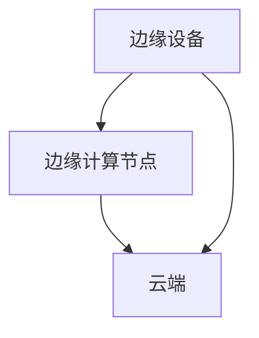

                 


# 边缘计算技术带来的新一轮IT革命与投资机会

## 关键词
边缘计算, IT革命, 投资机会, 5G技术, 智能应用

## 摘要
边缘计算作为一种新兴的分布式计算范式，正在推动IT行业的深刻变革。本文将详细探讨边缘计算的核心概念、技术特点及其在各个领域的应用场景。通过分析边缘计算与5G技术的结合，我们将揭示其为企业和社会带来的巨大价值。最后，我们将深入探讨边缘计算技术的投资机会，帮助投资者抓住这一技术革命带来的红利。

---

## 第一部分：边缘计算技术的背景与核心概念

### 第1章：边缘计算技术的起源与发展

#### 1.1 边缘计算的起源
边缘计算的概念最早可以追溯到分布式计算和边缘计算的起源。随着物联网（IoT）和5G技术的发展，边缘计算逐渐从学术研究走向实际应用。边缘计算的起源可以归结为以下几个方面：

- **分布式计算的演变**：传统的云计算模式将计算资源集中在数据中心，而边缘计算则将计算能力推向数据源端。
- **物联网的推动**：随着物联网设备的普及，数据量急剧增加，传统的云计算模式在延迟和带宽方面面临瓶颈，边缘计算应运而生。
- **5G技术的驱动**：5G的高带宽、低延迟和大规模连接能力为边缘计算的发展提供了技术基础。

#### 1.2 边缘计算的核心概念与定义
边缘计算是一种分布式计算范式，其核心是将计算能力部署在靠近数据源的边缘设备上，而不是集中在云端。边缘计算的特点包括：

- **分布式架构**：边缘计算采用分层架构，包括边缘设备、边缘计算节点和云端。
- **本地化处理**：数据在边缘节点进行预处理和计算，减少对云端的依赖。
- **低延迟和实时性**：边缘计算能够实时处理数据，适用于对延迟要求高的场景。

#### 1.3 边缘计算与云计算的对比分析
边缘计算与云计算有明显的区别，但两者并非互斥，而是互补。云计算的优势在于强大的计算能力和数据存储能力，而边缘计算的优势在于实时性和低延迟。通过结合边缘计算和云计算，可以实现更高效的资源利用。

---

### 第2章：边缘计算的核心概念与技术特点

#### 2.1 边缘计算的核心概念
边缘计算的核心概念包括以下几个方面：

- **边缘设备**：边缘设备是边缘计算的基本单元，包括传感器、摄像头、智能终端等。这些设备负责数据的采集和初步处理。
- **边缘计算节点**：边缘计算节点是边缘计算的核心，负责数据的处理、分析和存储。边缘节点通常部署在靠近数据源的位置。
- **边缘云**：边缘云是边缘计算的延伸，是将云计算的能力扩展到边缘节点，提供更强大的计算和存储能力。

#### 2.2 边缘计算的技术特点
边缘计算具有以下几个技术特点：

- **分布式架构**：边缘计算采用分布式架构，数据处理和计算能力分布在边缘节点。
- **低延迟**：边缘计算能够快速响应，适用于实时性要求高的场景。
- **异构性**：边缘设备和节点具有多样性，包括不同的硬件和软件架构。
- **安全性**：边缘计算需要考虑数据的安全性和隐私保护，尤其是在边缘设备和节点之间的数据传输过程中。

---

### 第3章：边缘计算与新一轮IT革命

#### 3.1 边缘计算对IT架构的影响
边缘计算正在改变传统的IT架构，推动新一轮的IT革命。以下是边缘计算对IT架构的主要影响：

- **从中心化到分布式**：传统的云计算模式是中心化的，而边缘计算则是分布式的，数据处理和计算能力分布在边缘节点。
- **实时性和低延迟**：边缘计算能够快速响应，适用于实时性要求高的场景，如工业自动化、自动驾驶等。
- **数据主权和隐私保护**：边缘计算通过在边缘节点处理数据，可以更好地保护数据主权和隐私。

#### 3.2 边缘计算与5G技术的结合
5G技术的高速度、低延迟和大规模连接能力为边缘计算的发展提供了技术基础。边缘计算与5G技术的结合将推动新一轮的数字化转型。

- **5G网络的边缘化**：5G网络将计算能力部署在边缘，实现数据的本地化处理。
- **边缘计算与5G的应用场景**：边缘计算与5G技术的结合将推动智能制造、智慧城市、智能交通等领域的发展。

---

## 第二部分：边缘计算技术的应用场景与价值

### 第4章：边缘计算在企业级应用中的价值

#### 4.1 边缘计算对企业数字化转型的推动
边缘计算通过将计算能力部署在边缘，能够帮助企业实现数字化转型，提升效率和竞争力。

- **智能制造**：边缘计算可以实时监控生产设备的状态，优化生产流程。
- **智能物流**：边缘计算可以实时跟踪物流车辆的位置和状态，优化物流路径。
- **智能金融**：边缘计算可以实时处理金融交易，提升交易效率和安全性。

#### 4.2 边缘计算在工业互联网中的应用
工业互联网是边缘计算的重要应用场景。通过边缘计算，可以实现生产设备的实时监控和优化。

- **工业物联网（IIoT）**：边缘计算可以实时处理生产设备的数据，优化生产流程。
- **预测性维护**：边缘计算可以通过分析设备数据，预测设备的故障，提前进行维护。

---

### 第5章：边缘计算在消费级应用中的创新

#### 5.1 边缘计算在智能家居中的应用
边缘计算在智能家居中的应用主要体现在设备的本地化处理和实时响应。

- **智能家居设备**：边缘计算可以实时处理智能家居设备的数据，实现设备的联动和智能控制。
- **能源管理**：边缘计算可以通过分析能源消耗数据，优化能源管理。

#### 5.2 边缘计算在车联网中的创新
边缘计算在车联网中的应用主要体现在车辆的实时监控和自动驾驶。

- **自动驾驶**：边缘计算可以通过实时处理车辆传感器数据，实现自动驾驶。
- **车辆通信**：边缘计算可以实现车辆与车辆之间的通信，优化交通流量。

---

## 第三部分：边缘计算技术的投资机会与市场分析

### 第6章：边缘计算技术的投资机会

#### 6.1 边缘计算市场的现状与发展趋势
边缘计算市场正在快速增长，预计未来几年将保持高速发展的趋势。以下是边缘计算市场的现状与发展趋势：

- **市场规模**：边缘计算市场的规模将快速增长，预计到2025年，全球边缘计算市场规模将达到数百亿美元。
- **技术驱动**：边缘计算的发展将由5G技术、人工智能和物联网等技术驱动。
- **应用场景**：边缘计算将在智能制造、智慧城市、智能交通等领域得到广泛应用。

#### 6.2 边缘计算技术的投资策略
投资者在选择边缘计算技术作为投资目标时，需要考虑以下几点：

- **技术门槛**：边缘计算技术具有较高的技术门槛，投资者需要选择具有技术优势的企业。
- **市场需求**：边缘计算在多个领域有广泛的应用，投资者需要关注市场需求的变化。
- **竞争格局**：边缘计算市场目前竞争激烈，投资者需要关注行业领先企业的动态。

---

### 第7章：边缘计算技术的未来趋势

#### 7.1 边缘计算与人工智能的结合
边缘计算与人工智能的结合将推动智能化的发展。边缘计算可以通过本地化处理数据，提升人工智能算法的效率和实时性。

- **边缘AI**：边缘计算可以通过本地化处理数据，实现人工智能算法的实时应用。
- **边缘推理**：边缘计算可以通过推理引擎，实现边缘设备的智能决策。

#### 7.2 边缘计算与绿色计算的结合
边缘计算与绿色计算的结合将推动能源效率的提升。

- **能源效率**：边缘计算通过优化计算资源的利用，可以降低能源消耗。
- **绿色数据中心**：边缘计算可以通过分布式架构，减少数据中心的能源消耗。

---

## 第四部分：边缘计算技术的系统分析与架构设计方案

### 第8章：边缘计算的系统架构设计

#### 8.1 系统架构概述
边缘计算的系统架构包括以下几个部分：

- **边缘设备**：边缘设备负责数据的采集和初步处理。
- **边缘计算节点**：边缘计算节点负责数据的处理、分析和存储。
- **云端**：云端负责全局的管理和协调。

#### 8.2 系统架构设计图
以下是边缘计算系统的架构设计图：



---

### 第9章：边缘计算的通信协议

#### 9.1 通信协议概述
边缘计算的通信协议包括以下几个方面：

- **边缘设备之间的通信**：边缘设备之间需要通过通信协议进行数据传输。
- **边缘设备与边缘计算节点的通信**：边缘设备与边缘计算节点之间需要通过通信协议进行数据传输。
- **边缘计算节点与云端的通信**：边缘计算节点与云端之间需要通过通信协议进行数据传输。

#### 9.2 通信协议设计图
以下是边缘计算系统的通信协议设计图：


---

## 第五部分：边缘计算技术的项目实战

### 第10章：边缘计算项目的环境安装与实现

#### 10.1 环境安装
边缘计算项目的环境安装包括以下几个步骤：

1. **硬件准备**：准备边缘设备和边缘计算节点。
2. **软件安装**：安装边缘计算相关的软件和工具。
3. **网络配置**：配置网络，确保边缘设备和边缘计算节点之间的通信。

#### 10.2 核心代码实现
以下是边缘计算项目的核心代码实现：

```python
import edge_node
from edge_device import EdgeDevice

class EdgeComputeNode:
    def __init__(self, devices):
        self.devices = devices
        self.data = {}

    def process_data(self):
        for device in self.devices:
            data = device.collect_data()
            self.data[data['id']] = data['value']
        return self.data

if __name__ == "__main__":
    devices = [EdgeDevice('device1'), EdgeDevice('device2')]
    node = EdgeComputeNode(devices)
    node.process_data()
```

---

### 第11章：边缘计算项目的案例分析与总结

#### 11.1 案例分析
以下是一个边缘计算项目的案例分析：

- **项目背景**：某制造企业希望利用边缘计算技术实现生产设备的实时监控和优化。
- **项目实施**：在生产设备上部署边缘设备，采集设备数据，通过边缘计算节点进行数据处理和分析。
- **项目成果**：实现了生产设备的实时监控，优化了生产流程，提升了效率。

#### 11.2 项目总结
通过以上案例分析可以看出，边缘计算技术在企业级应用中的价值和潜力。边缘计算可以通过实时处理数据，优化企业运营，提升效率和竞争力。

---

## 结语
边缘计算技术正在推动新一轮的IT革命，为企业和社会带来巨大的价值和机会。投资者需要抓住这一技术革命带来的投资机会，关注边缘计算技术的发展和应用。未来，边缘计算将与5G技术、人工智能等技术结合，推动更广泛的应用和发展。

---

**注**：以上内容仅为示例，实际文章需要根据具体情况进行补充和调整。

