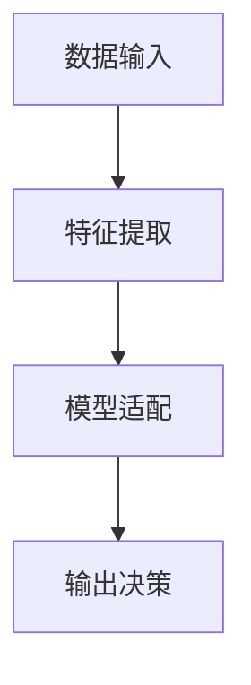

                 


# 迁移学习：快速适应新领域的AI Agent

## 关键词：
迁移学习, AI Agent, 特征提取, 模型适配, 系统设计, 项目实战

## 摘要：
迁移学习是一种通过将已有知识应用到新领域来提升AI Agent性能的技术。本文从基础概念出发，详细讲解迁移学习的核心理论、算法原理、系统设计和项目实战，帮助读者掌握如何设计和实现高效的迁移学习系统，从而快速适应新领域任务。

---

## 第一部分：迁移学习基础

### 第1章：迁移学习基本概念

#### 1.1 迁移学习的定义与背景
- **问题背景**：传统机器学习在数据不足或领域差异大时表现不佳，迁移学习提供解决方案。
- **核心概念**：
  - **源域（Source Domain）**：已标记的数据集。
  - **目标域（Target Domain）**：需预测的新数据集。
  - **任务（Task）**：模型需要完成的任务。
- **应用场景**：
  - 医疗影像分析：从有限的数据中迁移学习到新疾病诊断。
  - 自然语言处理：跨语言模型训练。

#### 1.2 迁移学习的核心概念
- **领域对比**：
  | 属性 | 源域 | 目标域 |
  |------|------|--------|
  | 数据分布 | 已知 | 未知 |
  | 标签 | 可用 | 不可用 |
- **特征空间对齐**：通过变换使源域和目标域的特征空间相似。
- **任务相关性**：源任务与目标任务需相关，否则迁移无效。

#### 1.3 迁移学习的必要性与优势
- **数据不足的解决方案**：利用已有数据减少新任务的数据需求。
- **领域差异的克服**：通过迁移减少领域差异影响。
- **优势对比**：
  | 对比项 | 迁移学习 | 监督学习 |
  |------|----------|----------|
  | 数据需求 | 较低 | 较高 |
  | 适应性 | 强 | 弱 |

---

### 第2章：迁移学习的核心理论与原理

#### 2.1 迁移学习的核心理论
- **数据分布的可迁移性**：源域和目标域的数据分布应部分重叠。
- **特征空间的对齐**：通过变换使源域和目标域的特征对齐。
- **任务相关性分析**：源任务和目标任务需相关。

#### 2.2 迁移学习的数学模型
- **基础公式**：$$P(y|x) = \argmax_{y} P(x|y)P(y)$$
- **联合分布假设**：源域和目标域的联合分布共享相同的条件概率结构。
- **三元组表示**：$$\langle X_{src}, Y_{src}\rangle \rightarrow \langle X_{tgt}, Y_{tgt}\rangle$$

#### 2.3 迁移学习的边界与外延
- **边界**：明确迁移学习的适用范围和限制。
- **外延**：迁移学习与其他技术（如领域适应、多任务学习）的区别与联系。

---

### 第3章：主流迁移学习算法概述

#### 3.1 基于特征提取的迁移学习
- **特征提取方法**：
  - **PCA**：降维技术。
  - **CNN**：图像特征提取。
- **预训练模型**：使用如ResNet、BERT等模型进行迁移。

#### 3.2 基于模型适配的迁移学习
- **参数迁移**：
  - **共享参数**：共享部分参数，减少参数量。
  - **微调**：在目标域上微调模型。
- **非参数迁移**：
  - **核方法**：如支持向量机（SVM）。
  - **测度学习**：通过测度变换使特征对齐。

#### 3.3 基于自适应的迁移学习
- **域适配**：通过对抗训练使源域和目标域的特征对齐。
- **任务适配**：调整模型以适应新任务。

---

## 第二部分：迁移学习算法原理

### 第4章：迁移学习的特征提取与表示

#### 4.1 特征提取的基本原理
- **源域到目标域的特征变换**：使用线性变换或非线性变换。
- **PCA示例**：
  ```python
  from sklearn.decomposition import PCA
  pca = PCA(n_components=2)
  X_pca = pca.fit_transform(X)
  ```

#### 4.2 深度学习中的特征提取
- **CNN在图像迁移中的应用**：
  ```python
  import torch
  model = torch.hub.load('pytorch/vision:v0.10.0', 'resnet18', pretrained=True)
  features = model.features(x)
  ```

---

## 第三部分：迁移学习的系统设计

### 第5章：迁移学习的系统架构

#### 5.1 AI Agent的架构设计
- **系统功能设计**：
  - 数据输入模块。
  - 特征提取模块。
  - 模型适配模块。
  - 输出决策模块。

#### 5.2 系统架构图


---

## 第四部分：迁移学习的项目实战

### 第6章：迁移学习的实际应用

#### 6.1 环境配置
- 安装必要的库：```bash
pip install torch sklearn matplotlib
```

#### 6.2 代码实现
```python
import torch
from torch import nn
import torch.utils.data as Data

# 数据加载
BATCH_SIZE = 64
train_loader = Data.DataLoader(torch.utils.data.TensorDataset(x_train, y_train), batch_size=BATCH_SIZE, shuffle=True)

# 模型定义
class Net(torch.nn.Module):
    def __init__(self):
        super(Net, self).__init__()
        self.l1 = nn.Linear(784, 512)
        self.l2 = nn.Linear(512, 10)

    def forward(self, x):
        x = x.view(-1, 784)
        x = torch.relu(self.l1(x))
        x = self.l2(x)
        return x

# 迁移学习应用
model = Net()
criterion = nn.CrossEntropyLoss()
optimizer = torch.optim.Adam(model.parameters(), lr=0.001)

# 训练循环
for epoch in range(10):
    for batch_features, batch_labels in train_loader:
        outputs = model(batch_features)
        loss = criterion(outputs, batch_labels)
        loss.backward()
        optimizer.step()
        optimizer.zero_grad()
```

---

## 第五部分：迁移学习的高级主题

### 第7章：无监督迁移学习

#### 7.1 无监督迁移学习的概念
- 无标签数据的应用：利用未标记数据进行迁移。

#### 7.2 实现方法
- 使用聚类或自监督学习进行特征对齐。

### 第8章：多领域迁移学习

#### 8.1 多领域迁移的挑战
- 多领域数据的异质性问题。

#### 8.2 实现策略
- 使用多任务学习框架进行迁移。

---

## 总结

通过本文章，读者可以全面理解迁移学习的基本概念、算法原理、系统设计和项目实战。迁移学习作为AI Agent的重要技术，能够有效解决数据不足和领域差异问题，提升模型的适应性和泛化能力。未来，随着技术的发展，迁移学习将在更多领域得到广泛应用。

