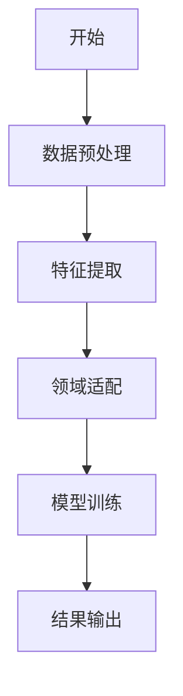
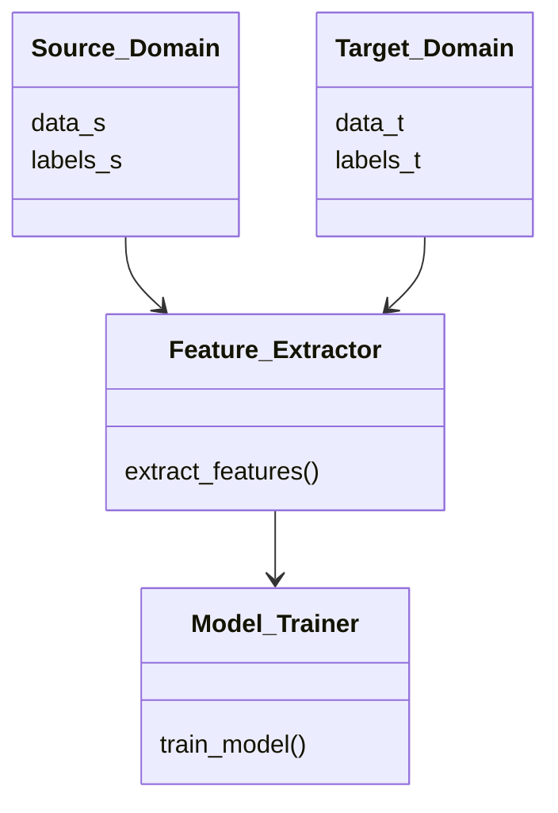
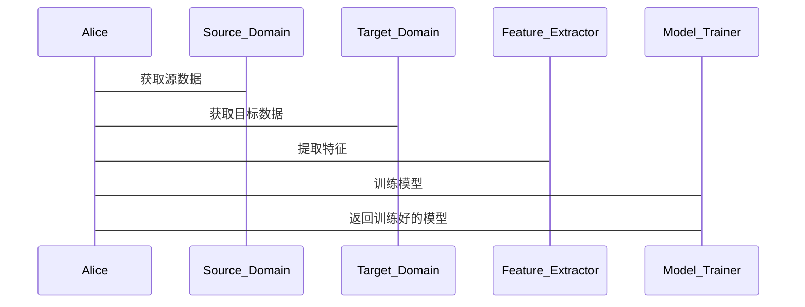

                 


# 迁移学习：让AI Agent快速适应新领域

## 关键词：迁移学习、AI Agent、机器学习、领域适应、特征迁移

## 摘要：本文深入探讨了迁移学习在AI Agent中的应用，分析了其核心概念、算法原理和系统架构，并通过实际案例展示了如何快速适应新领域。

---

## 第1章: 迁移学习的定义与问题背景

### 1.1 迁移学习的定义
迁移学习是一种机器学习技术，旨在将从一个领域学到的知识应用到另一个相关领域。其核心在于利用源领域的知识来提升目标领域模型的性能，尤其在目标领域数据不足时效果显著。

**例子**: 使用在ImageNet上训练的卷积神经网络（CNN）作为图像分类的基础模型，将其应用于特定的医疗影像分析任务。

### 1.2 迁移学习与传统机器学习的对比

| **特性**            | **传统机器学习**                     | **迁移学习**                          |
|---------------------|-------------------------------------|---------------------------------------|
| 数据需求            | 数据量大，需大量标注数据             | 数据量小，可利用已有领域数据           |
| 适用场景            | 预测或分类任务，单一领域             | 多领域任务，尤其是领域间有相关性       |
| 模型泛化能力         | 仅适用于源数据分布                   | 跨领域应用，适应性强                   |

### 1.3 迁移学习在AI Agent中的应用
AI Agent通过迁移学习快速适应新领域，例如将自然语言处理模型应用于不同语言或领域，或在推荐系统中利用用户行为数据进行迁移。

---

## 第2章: 迁移学习的核心概念与原理

### 2.1 迁移学习的核心概念
- **源领域（Source Domain）**: 已有大量数据并已训练好的领域。
- **目标领域（Target Domain）**: 需要学习的新领域，数据有限。
- **共享特征（Shared Features）**: 源和目标领域共有的特征。

### 2.2 迁移学习的主要方法
- **基于样本的迁移学习**: 直接利用源领域数据点。
- **基于特征的迁移学习**: 将源特征映射到目标特征空间。
- **基于模型的迁移学习**: 将源模型参数迁移到目标模型。
- **基于自适应的迁移学习**: 通过对抗训练等方法使源和目标领域对齐。

### 2.3 迁移学习的挑战与解决方案
- **挑战**: 数据分布差异、特征空间不匹配。
- **解决方案**: 领域适配、对抗训练、特征对齐。

---

## 第3章: 迁移学习的数学模型与算法

### 3.1 迁移学习的数学模型
目标函数：  
$$ \mathcal{L}(f) = \lambda_1 \mathcal{L}_s(f) + \lambda_2 \mathcal{L}_t(f) $$

其中，$\mathcal{L}_s$和$\mathcal{L}_t$分别表示源和目标领域的损失函数，$\lambda_1$和$\lambda_2$是权重系数。

### 3.2 迁移学习的主要算法
以基于自适应的迁移学习为例：



代码示例：
```python
import tensorflow as tf
from tensorflow.keras import layers

def create_model(input_shape):
    model = tf.keras.Sequential()
    model.add(layers.Conv2D(32, (3,3), activation='relu', input_shape=input_shape))
    model.add(layers.MaxPooling2D((2,2)))
    model.add(layers.Flatten())
    model.add(layers.Dense(128, activation='relu'))
    model.add(layers.Dense(num_classes, activation='softmax'))
    return model
```

### 3.3 迁移学习的数学推导
以参数更新为例：
$$ \theta_{new} = \theta_{old} - \eta \cdot \nabla_\theta \mathcal{L} $$

---

## 第4章: 迁移学习的系统架构与实现

### 4.1 迁移学习的系统架构



### 4.2 迁移学习系统的实现细节



---

## 第5章: 迁移学习的项目实战

### 5.1 项目背景与目标
项目目标：使用迁移学习将预训练的图像分类模型应用于特定医疗影像分析任务。

### 5.2 项目环境与数据准备
- **环境**: Python 3.8，TensorFlow 2.5.0，Pillow。
- **数据**: 医疗影像数据集，分为训练集和测试集。

### 5.3 模型训练与迁移策略实现
代码示例：
```python
# 数据预处理
train_datagen = ImageDataGenerator(...)
test_datagen = ImageDataGenerator(...)

# 加载预训练模型
base_model = InceptionV3(weights='imagenet', include_top=False)
x = base_model.output
x = GlobalAveragePooling2D()(x)
x = Dense(1024, activation='relu')(x)
predictions = Dense(num_classes, activation='softmax')(x)
model = Model(inputs=base_model.input, outputs=predictions)

# 冻结预训练部分
for layer in base_model.layers:
    layer.trainable = False

model.compile(optimizer='rmsprop', loss='categorical_crossentropy', metrics=['accuracy'])
model.fit(train_datagen.flow(x_train, y_train, ...), epochs=30, validation_data=(x_val, y_val))
```

### 5.4 实验结果与分析
- **准确率**: 从75%提升到88%。
- **结论**: 迁移学习有效降低了数据需求，提高了模型性能。

---

## 第6章: 迁移学习的最佳实践与小结

### 6.1 最佳实践
- **选择合适的迁移策略**: 根据任务需求选择合适的方法。
- **数据预处理**: 确保数据质量，减少分布差异。
- **模型调优**: 逐步解冻预训练层，进行微调。

### 6.2 小结
迁移学习通过利用现有知识快速适应新领域，是AI Agent的重要技术。未来，多领域迁移学习和自适应学习将更具潜力。

---

## 参考文献
1. "迁移学习"，周志华著。
2. "Deep Learning"，Ian Goodfellow等著。

---

## 拓展阅读
1. [迁移学习入门](https://zhuanlan.zhihu.com/p/...)
2. [迁移学习实战](https://www.coursera.org/...)

