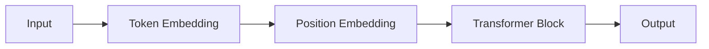
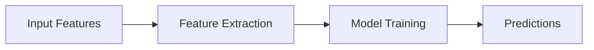
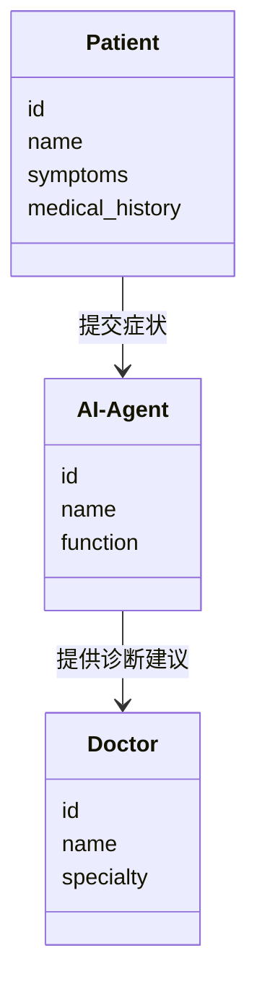
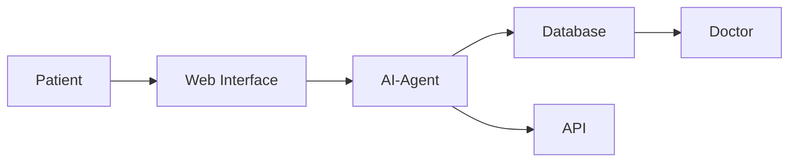
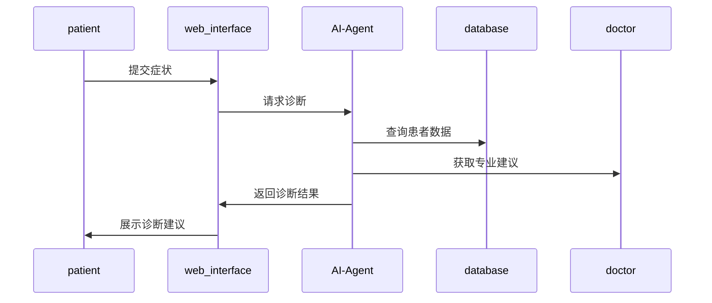

                 


# 远程医疗中的AI Agent诊断助手

## 关键词：AI Agent, 远程医疗, 诊断助手, 自然语言处理, 机器学习, 医疗信息化

## 摘要：  
随着远程医疗的快速发展，AI Agent作为智能化的诊断助手，在医疗领域发挥着越来越重要的作用。本文详细探讨了AI Agent在远程医疗中的核心概念、技术原理、系统架构及应用场景，分析了其在提升诊断效率、优化医疗资源分配和改善患者体验方面的重要价值。通过结合实际案例和系统设计，本文为远程医疗中的AI Agent应用提供了深刻的见解和实践指导。

---

# 第一部分: 远程医疗与AI Agent的背景介绍

## 第1章: 远程医疗的发展与现状

### 1.1 远程医疗的定义与历史发展  
远程医疗（Telemedicine）是指通过信息技术手段，实现医生与患者之间远程的医疗咨询、诊断、治疗和管理。随着互联网和通信技术的发展，远程医疗逐渐从简单的视频问诊扩展到包括远程会诊、远程监护、远程手术指导等多种形式。  

远程医疗的起源可以追溯到20世纪60年代，但真正的发展得益于互联网技术的普及。21世纪以来，随着5G网络、人工智能和物联网技术的融合，远程医疗进入了一个快速发展的新阶段。  

### 1.2 当前远程医疗的主要应用场景  
1. **远程会诊**：专家通过视频会议为偏远地区的患者提供诊断建议。  
2. **远程监护**：通过可穿戴设备实时监测患者的生理指标，及时发现异常。  
3. **远程治疗**：如远程心理咨询、远程康复指导等。  
4. **远程急诊**：在紧急情况下，通过远程手段快速响应患者需求。  

### 1.3 远程医疗的挑战与机遇  
- **挑战**：  
  1. 数据隐私与安全问题。  
  2. 医疗信息的准确性和完整性。  
  3. 医生与患者之间的信任建立。  
- **机遇**：  
  1. 提高医疗资源的利用效率。  
  2. 降低患者的医疗成本。  
  3. 促进医疗资源的均衡分配。  

---

## 第2章: AI Agent在医疗领域的应用背景  

### 2.1 AI Agent的核心概念与技术特点  
AI Agent（人工智能代理）是指能够感知环境并采取行动以实现目标的智能体。在医疗领域，AI Agent通常通过自然语言处理（NLP）、机器学习（ML）和知识图谱等技术，帮助医生和患者完成诊断、咨询和治疗方案推荐等任务。  

AI Agent的关键特点包括：  
1. **智能交互**：能够理解并生成自然语言文本。  
2. **自主学习**：通过数据不断优化自身的诊断能力。  
3. **实时响应**：能够在短时间内提供高效的诊断支持。  

### 2.2 医疗领域对AI Agent的需求分析  
1. **提高诊断效率**：AI Agent可以快速分析大量病历和医学文献，辅助医生做出更准确的诊断。  
2. **解决医疗资源不足**：通过远程医疗，AI Agent可以帮助偏远地区患者获得优质医疗资源。  
3. **改善患者体验**：患者可以通过AI Agent进行初步症状评估，减少等待时间。  

### 2.3 远程医疗中AI Agent诊断助手的边界与外延  
- **边界**：AI Agent主要用于辅助诊断和提供医疗建议，不能完全替代医生的决策。  
- **外延**：AI Agent可以集成到医院的信息系统中，与电子病历（EMR）、医疗影像系统等无缝对接。  

---

# 第二部分: AI Agent诊断助手的核心概念与联系

## 第3章: AI Agent与远程医疗的核心概念  

### 3.1 AI Agent的核心原理  
AI Agent的工作原理可以分为以下几个步骤：  
1. **信息采集**：通过自然语言处理技术，提取患者的症状描述和病史信息。  
2. **数据分析**：利用机器学习模型，分析数据并生成初步诊断建议。  
3. **结果输出**：将诊断结果以自然语言形式反馈给医生或患者。  

### 3.2 远程医疗中的关键概念与实体关系  
在远程医疗场景中，涉及的主要实体包括患者、医生、AI Agent和医疗数据。以下是它们之间的关系：  

```mermaid
erDiagram
    patient {
        id
        name
        age
        medical_record
    }
    doctor {
        id
        name
        specialty
    }
    agent {
        id
        name
        function
    }
    patient --> doctor: 咨询医生
    patient --> agent: 与AI Agent交互
    doctor --> agent: 提供医疗建议
```

### 3.3 AI Agent与远程医疗的结合方式  
AI Agent可以通过以下方式与远程医疗结合：  
1. **患者端**：患者通过AI Agent进行初步症状评估，减少不必要的就医次数。  
2. **医生端**：医生利用AI Agent快速获取患者的病史和诊断建议，提高工作效率。  
3. **数据端**：AI Agent整合患者的医疗数据，为医生提供更全面的决策支持。  

---

# 第三部分: AI Agent诊断助手的算法原理

## 第4章: AI Agent诊断助手的算法与数学模型  

### 4.1 自然语言处理在AI Agent中的应用  
自然语言处理（NLP）是AI Agent实现智能交互的核心技术。以下是NLP在医疗领域的几个关键应用：  
1. **症状分析**：通过NLP技术分析患者的症状描述，提取关键信息。  
2. **医疗问答**：AI Agent能够理解医生和患者的对话内容，并生成相应的回答。  
3. **文档摘要**：对患者的病历或检查报告进行摘要，帮助医生快速了解患者情况。  

#### 4.1.1 基于Transformer的NLP模型  
当前，基于Transformer的模型（如BERT）在NLP任务中表现出色。以下是BERT的基本结构：  



#### 4.1.2 医疗领域的NLP优化  
在医疗领域，NLP模型需要处理大量专业术语和复杂句式。因此，需要进行领域特定的优化，例如：  
1. 增加医疗领域的词表。  
2. 调整模型参数以适应医疗数据的分布。  

### 4.2 机器学习在AI Agent诊断中的应用  
机器学习（ML）在AI Agent的诊断过程中起着关键作用，特别是在分类和预测任务中。  

#### 4.2.1 机器学习的基本原理  
机器学习的核心是通过数据训练模型，使其能够从输入中预测输出。以下是常用的几种机器学习算法：  
1. **支持向量机（SVM）**：用于分类任务。  
2. **随机森林**：用于分类和回归任务。  
3. **神经网络**：用于复杂的模式识别任务。  

#### 4.2.2 基于机器学习的诊断模型  
以下是基于机器学习的诊断模型的流程图：  



#### 4.2.3 医疗数据的特征工程  
在医疗数据处理中，特征工程是关键。以下是常用的特征处理方法：  
1. **数值型特征**：如年龄、血压等。  
2. **类别型特征**：如性别、病史等。  
3. **文本型特征**：如病历描述、症状描述等。  

---

## 第5章: AI Agent诊断助手的系统架构设计  

### 5.1 系统功能设计  
以下是AI Agent诊断助手的核心功能模块：  
1. **患者信息采集**：通过自然语言交互或表格填写收集患者症状和病史。  
2. **诊断推理**：基于机器学习模型生成诊断建议。  
3. **结果输出**：将诊断结果以自然语言形式反馈给医生或患者。  

#### 5.1.1 领域模型设计  
以下是AI Agent诊断助手的领域模型：  



### 5.2 系统架构设计  
以下是AI Agent诊断助手的系统架构图：  



### 5.3 系统接口设计  
以下是系统的主要接口：  
1. **患者端接口**：通过Web界面提交症状信息。  
2. **AI Agent接口**：接收患者信息并返回诊断建议。  
3. **数据库接口**：存储和检索患者数据。  

### 5.4 系统交互设计  
以下是系统的交互流程图：  



---

## 第6章: AI Agent诊断助手的项目实战  

### 6.1 环境安装与配置  
以下是项目所需的环境和工具：  
1. **编程语言**：Python 3.8+  
2. **深度学习框架**：TensorFlow或Keras  
3. **自然语言处理库**：spaCy或NLTK  
4. **开发工具**：Jupyter Notebook或VS Code  

### 6.2 核心功能实现  
以下是AI Agent诊断助手的核心功能实现代码：  

```python
import tensorflow as tf
from tensorflow.keras import layers

# 数据预处理
def preprocess_data(data):
    # 假设data为患者症状列表
    # 返回处理后的特征向量
    pass

# 模型构建
def build_model(input_dim):
    model = tf.keras.Sequential()
    model.add(layers.Dense(64, activation='relu', input_dim=input_dim))
    model.add(layers.Dense(32, activation='relu'))
    model.add(layers.Dense(1, activation='sigmoid'))
    model.compile(optimizer='adam', loss='binary_crossentropy', metrics=['accuracy'])
    return model

# 模型训练
def train_model(model, X_train, y_train):
    model.fit(X_train, y_train, epochs=10, batch_size=32, validation_split=0.2)

# 模型推理
def predict_diagnosis(model, X_test):
    predictions = model.predict(X_test)
    return predictions > 0.5
```

### 6.3 代码解读与分析  
1. **数据预处理**：将患者的症状描述转换为数值型特征向量。  
2. **模型构建**：使用多层感知机（MLP）模型进行分类任务。  
3. **模型训练**：在训练数据上训练模型，优化参数以提高准确率。  
4. **模型推理**：对测试数据进行预测，生成诊断结果。  

### 6.4 实际案例分析  
假设一个患者报告的症状是“持续性咳嗽、发热和胸痛”，AI Agent需要根据这些症状进行初步诊断。以下是AI Agent的诊断过程：  
1. **信息采集**：通过自然语言交互获取患者的症状描述。  
2. **特征提取**：将症状描述转换为特征向量。  
3. **诊断推理**：基于机器学习模型生成诊断建议，如“疑似肺炎”。  
4. **结果输出**：将诊断建议反馈给医生或患者。  

---

## 第7章: AI Agent诊断助手的最佳实践与展望  

### 7.1 最佳实践  
1. **数据隐私保护**：确保患者的医疗数据得到严格加密和保护。  
2. **模型可解释性**：提高AI Agent的诊断过程的透明度，帮助医生理解模型的决策依据。  
3. **持续优化**：定期更新模型参数，提升诊断准确率。  

### 7.2 本章小结  
AI Agent诊断助手在远程医疗中的应用前景广阔，但同时也面临数据隐私、模型准确性和用户信任等挑战。未来，随着人工智能技术的不断进步，AI Agent将在远程医疗中发挥更大的作用，为医生和患者提供更高效、更精准的诊断支持。

---

# 结语  
远程医疗中的AI Agent诊断助手是一项具有巨大潜力的技术，它不仅能够提升医疗效率，还能优化医疗资源的分配，改善患者的就医体验。通过本文的详细探讨，我们希望能够为远程医疗的智能化发展提供一些新的思路和方向。

