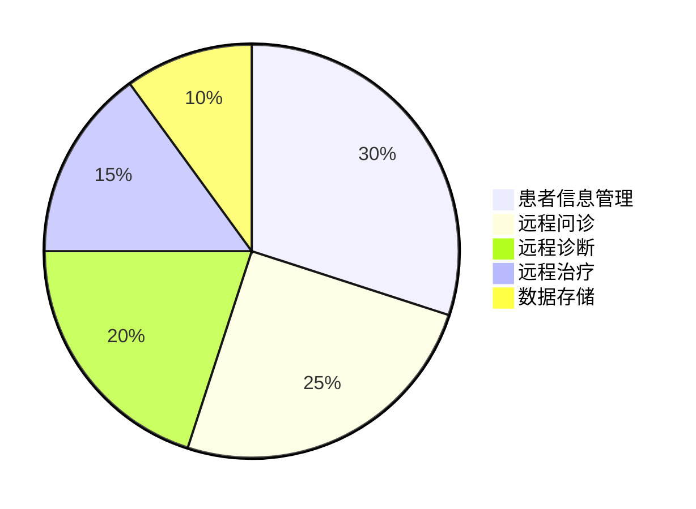

                 


# 远程医疗技术的普及对医疗行业的影响

> 关键词：远程医疗技术、医疗行业、医疗资源、医疗效率、数据安全

> 摘要：远程医疗技术的普及正在深刻改变医疗行业的运作方式。本文将探讨远程医疗技术的核心概念、实现基础及其对医疗流程、医患关系和资源分配的影响。文章还将分析远程医疗技术在社会和伦理方面面临的挑战，并提出相应的解决方案。通过系统设计和项目实战，本文旨在为医疗行业的从业者和技术开发者提供有价值的参考和启发。

---

# 第1章 远程医疗技术的定义与现状

## 1.1 远程医疗技术的定义与内涵

远程医疗技术是指通过通信技术和医疗设备，将患者与医疗专家之间的诊疗过程远程化、数字化和智能化的一种医疗服务模式。其核心在于通过互联网、物联网和人工智能等技术，实现患者数据的实时传输、诊断和治疗方案的远程制定。

- **远程医疗技术的内涵**：远程医疗不仅仅是简单的视频问诊，而是涵盖了从患者数据采集、传输、分析到诊断和治疗的全流程。通过技术手段，医生可以突破地域限制，为患者提供高效、便捷的医疗服务。

- **远程医疗技术的核心要素**：
  - 数据采集：通过可穿戴设备、医疗传感器等获取患者的生理数据。
  - 数据传输：利用高速通信网络将患者数据传输到医疗机构或云端平台。
  - 数据分析：通过人工智能和大数据技术对患者数据进行分析和诊断。
  - 远程诊疗：医生基于分析结果，为患者提供个性化的诊断和治疗方案。

## 1.2 远程医疗技术的现状与趋势

目前，远程医疗技术在全球范围内得到了广泛应用，尤其是在新冠疫情之后，远程医疗的需求急剧增加。以下是一些典型的应用场景：

- **远程问诊**：患者通过视频通话向医生描述症状，医生根据患者的描述和提供的检查结果进行诊断。
- **远程会诊**：多个医疗机构的专家可以通过远程会诊系统共同讨论患者的病情，制定最佳治疗方案。
- **远程监测**：通过可穿戴设备，医生可以实时监测患者的生理数据，及时发现异常情况。

远程医疗技术的未来发展将朝着以下几个方向推进：

- **智能化**：结合人工智能技术，实现更加精准的诊断和个性化的治疗方案。
- **集成化**：远程医疗系统将与医院的信息系统（如电子病历系统）深度融合，实现数据的无缝对接。
- **移动化**：远程医疗将更加依赖移动设备和移动应用，方便患者随时随地获得医疗服务。

## 1.3 远程医疗技术的重要性和必要性

远程医疗技术的普及对医疗行业具有重要意义：

- **提高医疗服务的可及性**：通过远程医疗，偏远地区的患者可以享受到优质医疗资源。
- **降低医疗成本**：远程医疗可以减少患者和医生的时间和经济成本，降低医疗系统的整体负担。
- **提升医疗效率**：通过远程监测和数据分析，医生可以快速诊断病情，减少患者的等待时间。

---

# 第2章 远程医疗技术的实现基础

## 2.1 远程医疗技术的通信技术基础

远程医疗技术的实现离不开先进的通信技术，以下是一些关键的技术：

- **5G技术**：5G的高速率和低延迟为远程医疗提供了强大的网络支持，能够实时传输高清视频和大量医疗数据。
- **物联网技术**：通过物联网设备，医生可以实时监测患者的生理数据，如心率、血压等。
- **云计算技术**：云计算提供了强大的数据存储和计算能力，支持远程医疗系统的运行和数据分析。

## 2.2 远程医疗技术的数据安全与隐私保护

远程医疗系统的安全性至关重要，以下是一些关键的数据安全技术：

- **数据加密**：通过加密技术保护患者数据在传输过程中的安全性。
- **数据访问控制**：通过权限管理确保只有授权的人员才能访问患者数据。
- **隐私保护**：通过匿名化处理和最小化数据收集原则，保护患者的隐私。

## 2.3 远程医疗技术的标准化与规范

为了确保远程医疗技术的健康发展，需要建立统一的行业标准和规范：

- **国际标准**：如国际电信联盟（ITU）制定的远程医疗标准。
- **国家标准**：如中国的《远程医疗信息系统建设指南》。
- **行业规范**：各医疗机构可以根据自身需求制定具体的实施细则。

---

# 第3章 远程医疗技术对医疗行业的影响分析

## 3.1 远程医疗技术对医疗流程的影响

远程医疗技术对医疗流程的优化主要体现在以下几个方面：

- **远程问诊的流程优化**：患者可以通过在线预约系统快速挂号，医生可以通过视频问诊快速了解患者的病情。
- **远程诊断的流程优化**：通过远程影像系统，医生可以快速查看患者的检查结果并制定诊断方案。
- **远程治疗的流程优化**：通过远程监测和智能设备，医生可以实时调整治疗方案，确保患者的治疗效果。

## 3.2 远程医疗技术对医患关系的影响

远程医疗技术对医患关系的改善主要体现在：

- **改善医患沟通**：医生可以通过远程问诊与患者建立更加便捷的沟通渠道。
- **增强患者信任**：通过实时监测和数据分析，医生可以为患者提供更加精准的诊断和治疗方案，从而增强患者的信任感。

## 3.3 远程医疗技术对医疗资源分配的影响

远程医疗技术对医疗资源的优化配置具有重要意义：

- **均衡分配医疗资源**：通过远程医疗，优质医疗资源可以覆盖更多地区的患者。
- **提高医疗资源的利用率**：通过远程监测和数据分析，医生可以更高效地利用医疗资源。

---

# 第4章 远程医疗技术的社会与伦理问题

## 4.1 远程医疗技术的隐私与数据安全问题

远程医疗技术的应用涉及大量的患者数据，隐私和数据安全问题尤为重要：

- **隐私泄露风险**：患者数据可能在传输过程中被截获或泄露。
- **数据安全挑战**：远程医疗系统的安全性需要得到充分保障，防止黑客攻击和数据泄露。

## 4.2 远程医疗技术的法律与伦理问题

远程医疗技术的法律和伦理问题主要包括：

- **法律地位**：远程医疗的法律地位尚未完全明确，如远程诊断的法律效力问题。
- **伦理争议**：远程医疗是否会影响医生与患者之间的互动和信任？

## 4.3 远程医疗技术的社会接受度问题

远程医疗技术的普及需要得到社会的广泛认可：

- **公众认知**：部分患者和医生对远程医疗技术的接受度较低，认为其缺乏人性化。
- **文化差异**：不同文化背景下的患者对远程医疗的接受程度不同。

---

# 第5章 远程医疗技术的系统设计

## 5.1 系统架构设计

远程医疗系统的架构设计需要考虑以下几个方面：

- **系统功能设计**：包括患者信息管理、远程问诊、远程诊断、远程治疗等功能模块。
- **系统架构图**：展示系统的主要组件和它们之间的交互关系。



## 5.2 系统接口设计

系统接口设计需要考虑以下几个方面：

- **患者端接口**：包括患者预约、问诊、查看检查结果等功能。
- **医生端接口**：包括医生接诊、诊断、治疗方案制定等功能。

---

# 第6章 远程医疗技术的项目实战

## 6.1 环境安装

在进行远程医疗系统的开发之前，需要先搭建开发环境：

- **操作系统**：建议使用Linux系统。
- **开发工具**：安装Python、Java等编程语言的开发环境。
- **数据库**：选择MySQL或MongoDB等数据库管理系统。

## 6.2 系统核心实现

以下是远程医疗系统的核心实现代码示例：

```python
def remote_diagnosis(patient_data):
    # 数据预处理
    processed_data = preprocess(patient_data)
    
    # 病症识别
    diagnosis_result = identify_disease(processed_data)
    
    # 治疗方案制定
    treatment_plan = generate_treatment_plan(diagnosis_result)
    
    return diagnosis_result, treatment_plan
```

---

# 第7章 总结与展望

## 7.1 本章小结

远程医疗技术的普及对医疗行业产生了深远的影响。它不仅提高了医疗服务的效率和可及性，还优化了医疗资源的分配。然而，远程医疗技术的推广也面临着隐私、法律和伦理等方面的挑战。

## 7.2 未来展望

未来，远程医疗技术将朝着更加智能化、集成化和移动化方向发展。人工智能和区块链技术的应用将进一步提升远程医疗的效率和安全性。

---

# 参考文献

1. 《远程医疗技术与应用》
2. 《医疗信息学》
3. 《数据安全与隐私保护》

---

通过以上内容，我们可以看到远程医疗技术对医疗行业的影响是多方面的。它不仅改变了传统的医疗模式，还推动了医疗行业向更加高效、便捷和智能化的方向发展。尽管面临一些挑战，但远程医疗技术的前景无疑是光明的。

