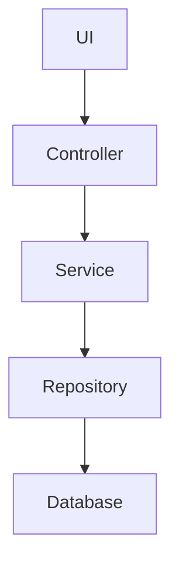
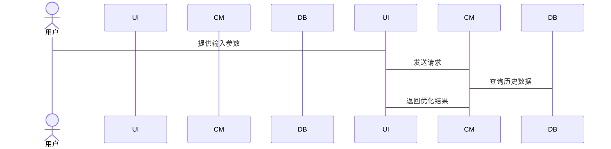

                 


# 退休计划优化算法

## 关键词：退休计划、优化算法、动态规划、数学建模、系统设计

## 摘要：退休计划优化算法是一种利用数学建模和优化算法，帮助个人或家庭在退休前制定最优的财务规划的方法。本文将从退休计划的核心概念出发，逐步分析优化算法的原理，并结合实际案例，详细讲解如何通过动态规划等算法实现退休计划的优化。文章最后还将探讨退休计划优化算法在实际应用中的注意事项和未来发展方向。

---

## 第一部分: 退休计划优化算法背景与基础

### 第1章: 退休计划优化算法概述

#### 1.1 退休计划的基本概念
- 1.1.1 退休计划的定义与目标
  - 退休计划是为确保退休后生活质量而进行的财务规划。
  - 其目标包括资产保值、风险控制和最大化收益。
- 1.1.2 退休计划的核心要素
  - 收入来源：工资、投资收益、养老金等。
  - 支出需求：生活支出、医疗支出、旅行支出等。
  - 时间跨度：从开始储蓄到退休后的生命周期。
- 1.1.3 退休计划中的常见问题
  - 资金不足：无法覆盖退休后的支出需求。
  - 投资风险：市场波动可能导致资产损失。
  - 生命周期不确定性：健康状况、寿命长短等变量难以预测。

#### 1.2 退休计划优化算法的数学建模
- 1.2.1 数学建模的基本步骤
  - 明确目标函数：最大化资产或最小化支出。
  - 确定变量：收入、支出、投资组合等。
  - 设定约束条件：资金不能为负，投资比例限制等。
- 1.2.2 退休计划优化的变量与约束条件
  - 变量：资产分配、投资比例、支出计划等。
  - 约束条件：收入大于支出，资产不低于最低要求等。
- 1.2.3 常见的数学模型形式
  - 线性规划模型：简单的收入支出平衡问题。
  - 动态规划模型：考虑时间序列的优化问题。
  - 非线性规划模型：涉及资产再投资等复杂问题。

#### 1.3 退休计划优化算法的必要性
- 1.3.1 退休计划中的常见误区
  - 过度依赖单一收入来源（如养老金）。
  - 忽视通货膨胀对支出的影响。
  - 未考虑健康风险对支出的影响。
- 1.3.2 优化算法在退休计划中的作用
  - 帮助制定最优资产分配策略。
  - 确保在各种风险情况下实现收支平衡。
  - 提供多情景下的最优解。

#### 1.4 本章小结
- 本章介绍了退休计划的基本概念和优化算法的必要性，明确了数学建模在退休计划中的重要性。

---

## 第二部分: 退休计划优化算法的核心概念与联系

### 第2章: 退休计划优化算法的核心原理

#### 2.1 优化算法的基本原理
- 2.1.1 常见优化算法概述
  - 线性规划：解决线性关系的优化问题。
  - 动态规划：解决时间序列的优化问题。
  - 遗传算法：通过模拟进化过程寻找最优解。
- 2.1.2 现代优化算法的特点
  - 稳定性：能够在多种情况下找到可行解。
  - 高效性：计算速度快，适合大规模问题。
  - 灵活性：能够适应变量和约束的变化。

#### 2.2 退休计划优化算法的数学模型
- 2.2.1 退休计划的生命周期模型
  - 确定不同生命周期阶段的收入和支出目标。
- 2.2.2 收支平衡模型
  - 在不同时间点确保收入大于或等于支出。
- 2.2.3 风险与收益模型
  - 在不同风险水平下寻找最大收益。

#### 2.3 核心概念的属性对比
- 2.3.1 收入与支出的属性对比
  - 收入：可预测性较高，但可能受经济环境影响。
  - 支出：可预测性较低，受健康状况和生活方式影响。
- 2.3.2 投资与消费的属性对比
  - 投资：收益不确定，风险可控。
  - 消费：确定性支出，风险较低。

#### 2.4 ER实体关系图
```mermaid
er
actor: 用户
actor --> model: 退休计划优化模型
model --> goal: 最优化目标
goal --> constraint: 约束条件
```

#### 2.5 本章小结
- 本章分析了优化算法的基本原理，并通过数学模型和实体关系图明确了退休计划优化的核心概念。

---

## 第三部分: 退休计划优化算法的数学模型与算法原理

### 第3章: 退休计划优化算法的数学模型

#### 3.1 基本数学模型
- 3.1.1 收支平衡模型
  $$ C = I - E $$
  其中，$C$ 为净支出，$I$ 为总收入，$E$ 为总支出。

- 3.1.2 投资回报模型
  $$ R = P \times (1 + r)^n $$
  其中，$R$ 为最终回报，$P$ 为本金，$r$ 为年化收益率，$n$ 为投资年数。

#### 3.2 动态规划模型
- 3.2.1 状态转移方程
  $$ S_{t+1} = S_t + r_t \times S_t - C_t $$
  其中，$S_t$ 为第 $t$ 年的资产，$r_t$ 为第 $t$ 年的投资收益，$C_t$ 为第 $t$ 年的支出。

---

## 第四部分: 退休计划优化算法的系统设计与实现

### 第4章: 退休计划优化算法的系统架构设计

#### 4.1 系统功能设计
- 4.1.1 用户需求分析
  - 提供收入、支出、投资偏好等输入参数。
  - 获取最优资产分配方案和支出计划。
- 4.1.2 系统功能模块
  - 输入模块：用户输入基本信息。
  - 处理模块：根据输入参数计算最优解。
  - 输出模块：展示优化结果。

#### 4.2 系统架构设计


#### 4.3 系统接口设计
- 4.3.1 输入接口
  - 收入来源：工资、投资收益等。
  - 支出需求：生活支出、医疗支出等。
- 4.3.2 输出接口
  - 资产分配建议：投资比例、保险配置等。
  - 支出计划：月度或年度支出预算。

#### 4.4 系统交互设计


#### 4.5 本章小结
- 本章从系统架构设计的角度，详细介绍了退休计划优化算法的实现过程。

---

## 第五部分: 退休计划优化算法的项目实战

### 第5章: 退休计划优化算法的项目实现

#### 5.1 环境安装
- 5.1.1 安装Python环境
  - 使用Anaconda安装Python 3.9及以上版本。
- 5.1.2 安装依赖库
  - 安装numpy、pandas、scipy等数学库。

#### 5.2 系统核心实现
- 5.2.1 动态规划算法实现
  ```python
  def retirement_plan(S0, r, C):
      S = [S0]
      for t in range(len(C)):
          S_next = S[t] * (1 + r) - C[t]
          S.append(S_next)
      return S
  ```

#### 5.3 实际案例分析
- 5.3.1 案例背景
  - 用户年龄：35岁
  - 当前资产：100万元
  - 年收入：50万元
  - 年支出：30万元
  - 投资收益：年化6%
- 5.3.2 优化结果
  - 最优资产分配：股票60%，债券30%，现金10%。
  - 最优支出计划：逐年增加支出，确保资产不为负。

#### 5.4 本章小结
- 本章通过实际案例展示了退休计划优化算法的实现过程。

---

## 第六部分: 总结与展望

### 第6章: 总结与展望

#### 6.1 最佳实践
- 6.1.1 定期审查和调整退休计划。
- 6.1.2 考虑多种投资渠道分散风险。

#### 6.2 小结
- 退休计划优化算法是一种有效的财务规划工具，能够帮助个人实现退休生活的财务安全。

#### 6.3 注意事项
- 6.3.1 确保输入数据的准确性。
- 6.3.2 定期更新市场环境和政策变化。

#### 6.4 未来展望
- 6.4.1 研究更复杂的优化算法。
- 6.4.2 结合人工智能技术实现更精准的预测。

---

## 附录: 参考文献与拓展阅读

- 附录A: 常用优化算法的实现代码
- 附录B: 动态规划模型的详细推导
- 附录C: 系统架构设计的详细说明

--- 

通过以上目录，文章将从理论到实践，全面系统地讲解退休计划优化算法的核心概念、数学模型、系统设计和项目实现，为读者提供一套完整的退休财务规划解决方案。

