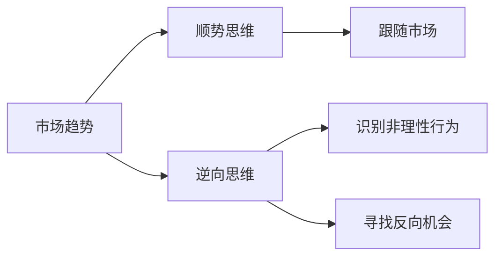
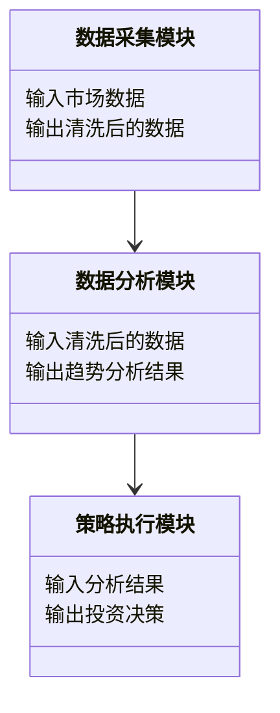

                 


# 逆向投资思维：为什么要与市场趋势相反操作

> 关键词：逆向投资，市场趋势，投资策略，风险管理，数学模型

> 摘要：逆向投资是一种在市场趋势相反方向进行操作的投资策略，其核心在于识别市场非理性行为和潜在机会。本文将从逆向投资的核心概念、数学模型、系统架构以及实际案例等方面，详细阐述逆向投资的原理和应用，帮助读者理解并掌握这一投资策略。

---

## 第二章：逆向思维的原理与数学模型

### 2.1 逆向思维的原理

逆向思维是一种与传统思维相反的思维方式，其核心在于从问题的反面入手，寻找解决问题的新思路。在投资领域，逆向思维的应用尤为显著，尤其是在市场趋势分析和投资决策中。

#### 2.1.1 趋势分析的反向思考

在传统投资中，投资者通常会跟随市场趋势进行操作，即在市场上涨时买入，市场下跌时卖出。然而，这种顺势操作往往会导致投资者陷入羊群效应，难以获得超额收益。逆向思维的核心在于识别市场的非理性行为，并在市场趋势的反方向寻找投资机会。

##### 图表：逆向思维与顺势思维的对比



#### 2.1.2 逆向思维的核心要素

逆向思维的核心要素包括：

1. **识别市场情绪**：通过分析市场参与者的心理和行为，判断市场的非理性波动。
2. **寻找估值偏离**：当市场估值偏离内在价值时，逆向投资者会考虑在市场底部买入，在市场顶部卖出。
3. **长期视角**：逆向投资需要投资者具备长期视角，忽略短期波动，专注于长期价值。

---

### 2.2 逆向思维的数学模型

为了量化逆向思维的策略，我们可以建立一个简单的数学模型，用于判断市场趋势的反转点。

#### 2.2.1 趋势反转的判断标准

假设我们定义市场趋势反转的条件如下：

1. **价格与价值的偏离**：当市场价格远低于内在价值时，市场可能处于底部，存在反转的可能。
2. **市场情绪指标**：通过分析市场情绪指标（如恐慌指数、投资者情绪指数等）判断市场是否处于极端状态。
3. **技术指标**：通过技术分析指标（如RSI、MACD等）判断市场是否超买或超卖。

#### 2.2.2 数学模型的构建

我们可以将上述条件量化为一个综合评分系统。具体步骤如下：

1. **计算价格与价值的偏离度**：
   $$ \text{偏离度} = \frac{\text{市场价格}}{\text{内在价值}} - 1 $$
   
2. **计算市场情绪评分**：
   $$ \text{情绪评分} = \text{恐慌指数} \times \text{投资者情绪指数} $$

3. **计算技术指标评分**：
   $$ \text{技术评分} = \text{RSI} + \text{MACD} $$

4. **综合评分**：
   $$ \text{综合评分} = \text{偏离度} \times \text{情绪评分} \times \text{技术评分} $$

当综合评分低于某个阈值时，表明市场可能处于底部，适合逆向操作。

---

## 第三章：系统分析与架构设计

### 3.1 逆向投资决策支持系统

为了实现逆向投资策略的自动化，我们可以设计一个逆向投资决策支持系统。该系统将整合市场数据、情绪分析和量化模型，为投资者提供实时的决策支持。

#### 3.1.1 系统功能设计



#### 3.1.2 系统架构设计


---

## 第四章：项目实战与案例分析

### 4.1 环境安装与数据准备

#### 4.1.1 环境安装

为了实现逆向投资策略，我们需要安装以下工具：

- **Python**：用于数据处理和建模。
- **Pandas**：用于数据清洗和分析。
- **Matplotlib**：用于数据可视化。
- **Scikit-learn**：用于机器学习模型。

#### 4.1.2 数据准备

我们需要收集以下市场数据：

- 开盘价、收盘价、最高价、最低价。
- 成交量。
- 市场情绪指标（如恐慌指数）。

---

### 4.2 核心代码实现

#### 4.2.1 数据清洗与分析

```python
import pandas as pd

# 读取数据
data = pd.read_csv('market_data.csv')

# 数据清洗
data.dropna(inplace=True)
data = data[~data['price'].isin([0])]

# 计算偏离度
data['偏离度'] = data['price'] / data['内在价值'] - 1

# 计算情绪评分
data['情绪评分'] = data['恐慌指数'] * data['投资者情绪指数']

# 计算技术评分
data['技术评分'] = data['RSI'] + data['MACD']

# 计算综合评分
data['综合评分'] = data['偏离度'] * data['情绪评分'] * data['技术评分']
```

#### 4.2.2 投资决策逻辑

```python
def 逆向投资策略(综合评分):
    if 综合评分 < -0.5:
        return "买入"
    elif 综合评分 > 0.5:
        return "卖出"
    else:
        return "观望"

# 应用策略
data['决策'] = data['综合评分'].apply(逆向投资策略)
```

---

## 第五章：总结与展望

### 5.1 总结

逆向投资思维是一种在市场趋势相反方向进行操作的投资策略，其核心在于识别市场的非理性行为和潜在机会。通过量化模型和系统设计，我们可以实现逆向投资策略的自动化和智能化。

### 5.2 展望

未来，随着人工智能和大数据技术的不断发展，逆向投资策略将更加精准和高效。投资者可以通过实时数据分析和机器学习模型，进一步优化投资决策，提高投资收益。

---

### 最佳实践 Tips

- **保持冷静**：逆向投资需要投资者具备冷静的心态，避免被市场情绪左右。
- **持续学习**：市场环境不断变化，投资者需要持续学习和调整策略。
- **风险管理**：在实际操作中，应严格控制仓位和风险，避免重大损失。

通过本文的分析和实践，我们希望读者能够更好地理解逆向投资思维，并在实际投资中灵活运用这一策略。

