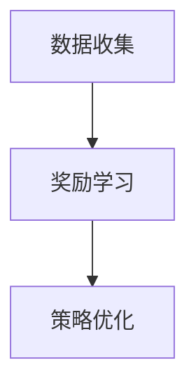

                 


# 逆强化学习：理解人类偏好的AI Agent

> 关键词：逆强化学习，AI Agent，人类偏好，强化学习，奖励模型

> 摘要：逆强化学习是一种通过观察人类行为来推断其偏好和奖励函数的AI技术，旨在让AI Agent更自然地与人类协作。本文将详细介绍逆强化学习的背景、核心概念、算法原理、系统架构以及实际应用。

---

## 第一部分: 逆强化学习背景与基础

### 第1章: 逆强化学习的起源与背景

#### 1.1 逆强化学习的定义与核心概念

##### 1.1.1 逆强化学习的定义

逆强化学习（Inverse Reinforcement Learning, IRL）是一种机器学习技术，旨在通过观察人类的行为模式，推断出人类的偏好和奖励函数。与传统强化学习（Reinforcement Learning, RL）不同，IRL不需要人工定义奖励函数，而是通过学习人类的行为来反推出奖励函数。

##### 1.1.2 逆强化学习的核心要素

- **状态空间 (State Space)**：系统所处的环境状态。
- **动作空间 (Action Space)**：AI Agent在给定状态下可以执行的动作。
- **奖励函数 (Reward Function)**：衡量AI Agent行为是否符合人类偏好的函数。

##### 1.1.3 逆强化学习与传统强化学习的区别

| 方面         | 传统强化学习                | 逆强化学习                |
|--------------|-----------------------------|---------------------------|
| 奖励函数定义 | 由专家定义                   | 由AI学习人类行为推断       |
| 应用场景     | 已知目标                     | 不知道目标，需要从行为推断目标 |
| 数据来源     | 人工设计                     | 从人类行为中学习           |

#### 1.2 逆强化学习的背景与应用

##### 1.2.1 逆强化学习的起源

逆强化学习的概念最早可以追溯到20世纪90年代，但真正的发展始于2010年后，随着深度学习和强化学习的兴起，逆强化学习逐渐成为研究热点。

##### 1.2.2 逆强化学习的现实需求

- 人类与AI协作时，明确定义奖励函数往往困难。
- 需要AI Agent能够理解人类的偏好，从而更自然地与人类互动。

##### 1.2.3 逆强化学习的主要应用场景

- **自动驾驶**：理解人类驾驶行为，优化自动驾驶策略。
- **机器人控制**：通过学习人类操作行为，实现更自然的机器人控制。
- **游戏AI**：通过观察人类玩家的行为，学习游戏策略。

#### 1.3 逆强化学习的核心问题

##### 1.3.1 问题背景与问题描述

逆强化学习的核心问题是：如何通过观察人类行为，推断出人类的奖励函数。

##### 1.3.2 问题解决的思路与方法

- **行为建模**：通过建模人类行为，推断奖励函数。
- **逆向优化**：通过优化模型参数，使得生成的行为与人类行为一致。

##### 1.3.3 问题的边界与外延

- 边界：假设人类行为是理性的，即人类行为是基于自身偏好做出的最优选择。
- 外延：扩展到多智能体系统，考虑多个AI Agent之间的协作与竞争。

#### 1.4 逆强化学习的核心概念结构

##### 1.4.1 核心概念的组成

- **状态 (State)**：系统的输入，例如自动驾驶中的道路状况。
- **动作 (Action)**：AI Agent的输出，例如转向和加速。
- **奖励 (Reward)**：衡量动作是否符合人类偏好的函数。

##### 1.4.2 概念属性特征对比表

| 概念   | 属性                     | 特征                     |
|--------|--------------------------|--------------------------|
| 状态   | 描述方式                 | 离散/连续                 |
| 动作   | 执行方式                 | 离散/连续                 |
| 奖励   | 计算方式                 | 标量/向量                 |

##### 1.4.3 ER实体关系图架构

```mermaid
erd
    A[状态] --N:1-> B[动作]
    B --N:1-> C[奖励]
```

### 第2章: 逆强化学习的核心概念与联系

#### 2.1 核心概念的原理

##### 2.1.1 状态空间的定义与特征

- **定义**：所有可能状态的集合。
- **特征**：状态可以是离散或连续的，例如在自动驾驶中，状态可以是车辆的位置和速度。

##### 2.1.2 动作空间的定义与特征

- **定义**：AI Agent在每个状态下可以执行的动作的集合。
- **特征**：动作可以是离散的（如转向左、转向右）或连续的（如加速力度）。

##### 2.1.3 奖励模型的定义与特征

- **定义**：衡量AI Agent动作是否符合人类偏好的函数。
- **特征**：奖励函数可以是显式或隐式的，例如在自动驾驶中，避免碰撞可以是一个隐式奖励。

#### 2.2 核心概念的联系

##### 2.2.1 状态与动作的关联

- 状态定义了当前环境的输入，动作是AI Agent对当前状态的响应。

##### 2.2.2 动作与奖励的关系

- 奖励是对动作的评价，反映了动作是否符合人类偏好。

##### 2.2.3 奖励与策略的互动

- 策略决定动作的选择，奖励函数指导策略优化。

#### 2.3 核心概念的数学模型与公式

##### 2.3.1 状态空间的数学表示

$$ S = \{ s_1, s_2, ..., s_n \} $$

##### 2.3.2 动作空间的数学表示

$$ A = \{ a_1, a_2, ..., a_m \} $$

##### 2.3.3 奖励模型的数学表示

$$ R: S \times A \rightarrow \mathbb{R} $$

### 第3章: 逆强化学习的算法原理

#### 3.1 算法原理的概述

##### 3.1.1 逆强化学习的基本算法框架

1. 收集人类行为数据。
2. 学习奖励函数。
3. 使用奖励函数优化策略。

##### 3.1.2 逆强化学习的核心思想

通过观察人类行为，学习奖励函数，然后优化策略以最大化奖励。

##### 3.1.3 逆强化学习的主要步骤

1. 数据收集：收集人类在不同状态下的动作。
2. 奖励学习：通过数据推断奖励函数。
3. 策略优化：使用奖励函数优化策略。

#### 3.2 算法原理的详细讲解

##### 3.2.1 状态转移的概率模型

- 定义状态转移概率矩阵：
$$ P(s', s, a) = \text{执行动作 } a \text{ 后从状态 } s \text{ 转移到状态 } s' \text{ 的概率} $$

##### 3.2.2 奖励函数的估计方法

- 使用最大似然估计：
$$ R(s, a) = \log P(s' | s, a) $$

##### 3.2.3 策略优化的数学公式

- 最大化期望奖励：
$$ \arg \max_{\pi} \mathbb{E}_{s \sim \rho, a \sim \pi} [R(s, a)] $$

#### 3.3 算法原理的数学模型与公式

##### 3.3.1 状态转移矩阵的定义

$$ P_{sa}^{s'} = P(s' | s, a) $$

##### 3.3.2 奖励函数的估计公式

$$ R(s, a) = \sum_{s'} P(s' | s, a) \log \frac{P(s' | s, a)}{P(s')} $$

##### 3.3.3 策略优化的目标函数

$$ J(\pi) = \mathbb{E}_{s \sim \rho, a \sim \pi} [R(s, a)] $$

### 第4章: 逆强化学习的系统分析与架构设计

#### 4.1 系统分析

##### 4.1.1 问题场景的描述

- **目标**：设计一个AI Agent，能够通过观察人类行为理解人类偏好。
- **输入**：人类在不同状态下的动作。
- **输出**：优化后的策略。

##### 4.1.2 系统功能的需求分析

- **需求1**：收集人类行为数据。
- **需求2**：学习奖励函数。
- **需求3**：优化策略。

##### 4.1.3 系统性能的指标定义

- **指标1**：学习奖励函数的准确率。
- **指标2**：策略优化的效率。

#### 4.2 系统架构设计

##### 4.2.1 系统架构的总体设计

- **模块1**：数据收集模块。
- **模块2**：奖励学习模块。
- **模块3**：策略优化模块。

##### 4.2.2 系统模块的划分

- **模块1**：数据收集模块。
  - 功能：收集人类行为数据。
- **模块2**：奖励学习模块。
  - 功能：通过数据推断奖励函数。
- **模块3**：策略优化模块。
  - 功能：使用奖励函数优化策略。

##### 4.2.3 系统组件的交互设计

- 数据收集模块向奖励学习模块提供数据。
- 奖励学习模块向策略优化模块提供奖励函数。
- 策略优化模块输出优化后的策略。

#### 4.3 系统架构的mermaid图



### 第5章: 逆强化学习的项目实战

#### 5.1 环境安装与配置

##### 5.1.1 开发环境的搭建

- **操作系统**：Linux或MacOS。
- **编程语言**：Python 3.8+。
- **开发工具**：Jupyter Notebook或PyCharm。

##### 5.1.2 依赖库的安装

- 安装TensorFlow和Keras：
  ```bash
  pip install tensorflow keras
  ```

##### 5.1.3 工具链的配置

- 配置Python环境：
  ```bash
  conda create -n irl python=3.8
  conda activate irl
  ```

#### 5.2 系统核心实现

##### 5.2.1 状态空间

- 代码示例：
  ```python
  states = ['state1', 'state2', 'state3']
  ```

##### 5.2.2 动作空间

- 代码示例：
  ```python
  actions = ['action1', 'action2', 'action3']
  ```

##### 5.2.3 奖励模型

- 代码示例：
  ```python
  def reward_function(state, action):
      return 1 if (state, action) in desired_behavior else 0
  ```

#### 5.3 代码应用解读与分析

##### 5.3.1 数据收集模块

- 代码示例：
  ```python
  def collect_data():
      data = []
      for state in states:
          for action in actions:
              data.append((state, action))
      return data
  ```

##### 5.3.2 奖励学习模块

- 代码示例：
  ```python
  def learn_reward(data):
      reward_model = {}
      for state, action in data:
          reward_model[(state, action)] = 1
      return reward_model
  ```

##### 5.3.3 策略优化模块

- 代码示例：
  ```python
  def optimize_policy(reward_model):
      policy = {}
      for state in states:
          max_reward = -float('inf')
          best_action = ''
          for action in actions:
              current_reward = reward_model.get((state, action), 0)
              if current_reward > max_reward:
                  max_reward = current_reward
                  best_action = action
          policy[state] = best_action
      return policy
  ```

#### 5.4 实际案例分析和详细讲解剖析

##### 5.4.1 案例分析

- **案例**：自动驾驶场景。
- **数据**：人类在不同道路状况下的驾驶行为。
- **奖励函数**：避免碰撞，保持安全车距。

##### 5.4.2 详细讲解

- **步骤1**：收集数据。
- **步骤2**：学习奖励函数。
- **步骤3**：优化策略。

#### 5.5 项目小结

- **总结**：通过逆强化学习，AI Agent能够理解人类的偏好，优化策略。
- **注意事项**：数据质量和数量直接影响奖励函数的准确性。

---

## 第二部分: 逆强化学习的应用与未来

### 第6章: 逆强化学习的优势与挑战

#### 6.1 优势

- **优势1**：无需人工定义奖励函数。
- **优势2**：能够处理复杂的人类偏好。

#### 6.2 挑战

- **挑战1**：数据收集困难。
- **挑战2**：奖励函数的不确定性。

### 第7章: 逆强化学习的未来发展方向

#### 7.1 多智能体系统

- **发展1**：研究多智能体逆强化学习。

#### 7.2 跨领域应用

- **发展2**：将逆强化学习应用于更多领域。

### 第8章: 逆强化学习的注意事项与最佳实践

#### 8.1 注意事项

- **注意1**：确保数据的多样性和代表性。
- **注意2**：定期验证奖励函数的准确性。

#### 8.2 最佳实践

- **实践1**：使用高质量的数据集。
- **实践2**：结合领域知识优化奖励函数。

---

## 第三部分: 总结与展望

### 第9章: 逆强化学习的总结

#### 9.1 核心观点回顾

- **观点1**：逆强化学习通过观察人类行为推断奖励函数。
- **观点2**：逆强化学习能够提高AI Agent与人类协作的能力。

#### 9.2 本文小结

- **小结1**：详细介绍了逆强化学习的背景、核心概念、算法原理、系统架构以及实际应用。
- **小结2**：通过案例分析展示了逆强化学习的实际应用价值。

### 第10章: 逆强化学习的未来展望

#### 10.1 未来研究方向

- **方向1**：研究更复杂的逆强化学习算法。
- **方向2**：探索逆强化学习在更多领域的应用。

#### 10.2 结语

逆强化学习作为人工智能领域的重要技术，未来将在更多领域发挥重要作用，帮助人类与AI更自然地协作。

---

## 参考文献

- 文献1：[Inverse Reinforcement Learning]，Russell, Stuart J. et al.
- 文献2：[Recent Advances in Inverse Reinforcement Learning]， Levine, Sergey et al.

---

## 致谢

感谢读者的耐心阅读，感谢同行的指正与支持。

