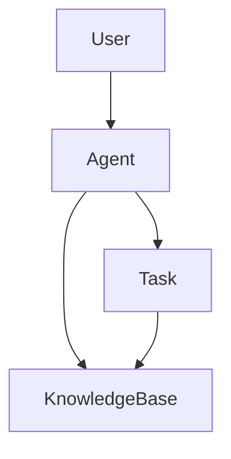
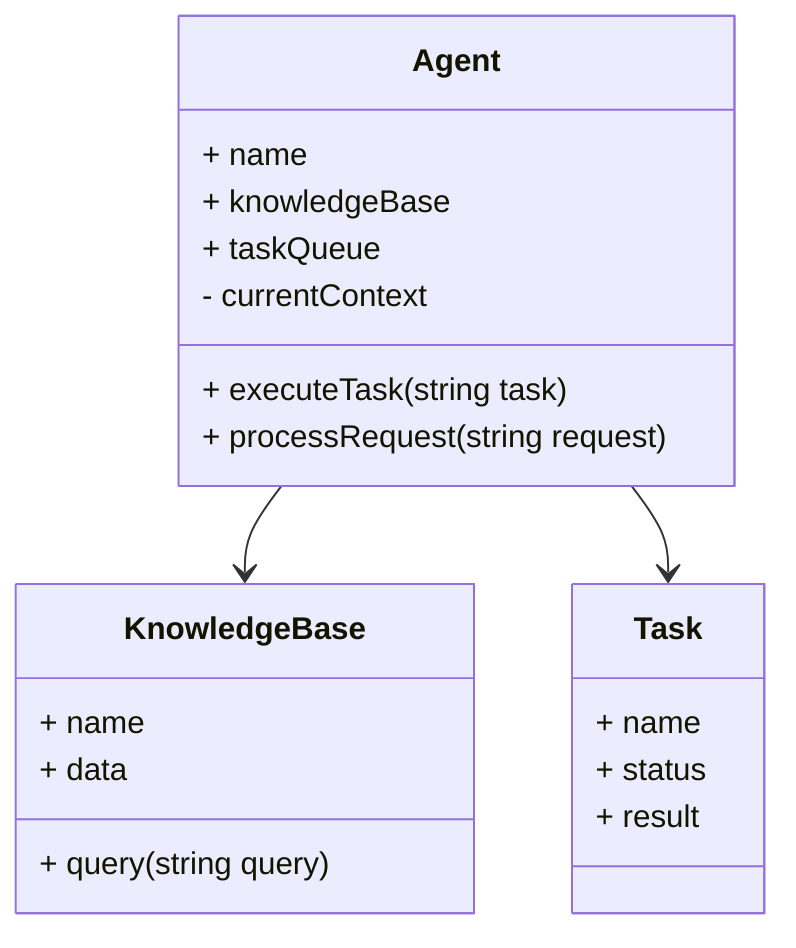

                 


# 选择适合企业的AI Agent平台

## 关键词：AI Agent, 企业选择, 技术评估, 系统架构, 项目实战

## 摘要：  
在数字化转型的浪潮中，AI Agent（人工智能代理）作为连接企业智能化系统与用户的关键桥梁，正在变得越来越重要。选择适合企业的AI Agent平台，不仅需要考虑其技术能力，还要结合企业的实际业务需求、技术基础和未来发展目标。本文从AI Agent的核心概念出发，分析企业选择AI Agent平台的关键因素，详细探讨技术评估与系统架构设计，并通过实际案例展示如何将AI Agent平台落地实施。最后，本文总结了选择AI Agent平台的最佳实践和未来发展趋势，为企业提供全面的指导。

---

# 第1章: AI Agent平台的背景与现状

## 1.1 AI Agent的基本概念

### 1.1.1 AI Agent的定义与核心要素  
AI Agent（人工智能代理）是一种能够感知环境、自主决策并执行任务的智能系统。它通过与用户或系统的交互，帮助完成特定的目标，例如信息检索、任务调度、决策支持等。AI Agent的核心要素包括：  
1. **感知能力**：通过自然语言处理（NLP）等技术理解输入信息。  
2. **决策能力**：基于上下文和知识库进行推理和决策。  
3. **执行能力**：通过调用API或触发预设流程执行任务。  

### 1.1.2 AI Agent与传统AI的区别  
AI Agent与传统AI的区别在于，AI Agent具有更强的自主性和目标导向性。传统AI系统通常专注于单一任务（如图像识别、语音识别），而AI Agent则是一个综合性的系统，能够理解用户需求、规划行动并执行任务。  

### 1.1.3 AI Agent在企业中的应用价值  
在企业中，AI Agent可以应用于客服、销售支持、内部流程自动化、数据分析等领域。例如，在客服场景中，AI Agent可以通过多轮对话帮助用户解决问题，提升客户满意度。  

---

## 1.2 当前AI Agent技术的发展现状

### 1.2.1 国内外AI Agent技术的发展概况  
近年来，AI Agent技术在全球范围内迅速发展，尤其是在自然语言处理和大模型技术的推动下，AI Agent的能力得到了显著提升。国内企业也在积极探索AI Agent的应用，特别是在金融、医疗、教育等行业。  

### 1.2.2 企业级AI Agent平台的崛起  
随着企业对智能化需求的增加，越来越多的企业开始构建自己的AI Agent平台。这些平台通常结合了内部业务系统和外部服务，提供统一的交互界面。  

### 1.2.3 AI Agent平台的市场分析与趋势预测  
当前，AI Agent平台市场呈现多元化趋势，不同厂商提供了各种解决方案。未来，随着大模型技术的成熟，AI Agent将更加智能化、个性化。  

---

## 1.3 企业为什么要选择AI Agent平台

### 1.3.1 传统企业信息化的痛点与局限  
传统企业信息化系统通常基于规则引擎，难以应对复杂场景。AI Agent的引入可以弥补这一不足，通过智能决策提升效率。  

### 1.3.2 AI Agent平台对企业效率提升的作用  
AI Agent可以自动化处理大量重复性任务，减少人工干预，同时提高决策的准确性。例如，在销售场景中，AI Agent可以自动跟踪客户行为并提供个性化推荐。  

### 1.3.3 企业数字化转型中的AI Agent角色  
在数字化转型中，AI Agent是连接企业内外系统的桥梁。它能够整合多种数据源，提供统一的交互入口，帮助企业实现真正的智能化转型。  

---

## 1.4 本章小结  
本章介绍了AI Agent的基本概念、技术发展现状以及企业选择AI Agent平台的必要性。通过理解这些内容，读者可以明确AI Agent在企业中的价值和应用场景。

---

# 第2章: AI Agent的核心概念与系统架构

## 2.1 AI Agent的核心原理

### 2.1.1 AI Agent的感知与决策机制  
AI Agent的感知过程包括自然语言理解（NLU）和意图识别。通过这些技术，AI Agent能够理解用户的输入并提取关键信息。  

### 2.1.2 基于大模型的智能推理过程  
AI Agent通常基于大语言模型（LLM）构建，能够通过上下文理解进行多轮对话，并根据知识库提供准确的答案。  

### 2.1.3 Agent与企业业务系统的交互模式  
AI Agent需要与企业现有的业务系统（如CRM、ERP）进行深度集成，通过API调用或消息队列实现交互。  

---

## 2.2 AI Agent的系统架构分析

### 2.2.1 分层架构设计  
AI Agent的系统架构通常分为前端、后端和数据层。前端负责用户交互，后端负责业务逻辑处理，数据层负责存储和管理数据。  

### 2.2.2 微服务架构的应用  
采用微服务架构可以提高系统的可扩展性和可维护性。例如，可以将对话引擎、知识库管理、任务调度分别独立为不同的服务。  

### 2.2.3 可扩展性与高可用性的实现  
通过容器化（如Docker）和 orchestration工具（如Kubernetes），可以实现系统的弹性扩展和高可用性。  

---

## 2.3 AI Agent的实体关系与数据流

### 2.3.1 ER实体关系图  
以下是AI Agent系统的实体关系图：



### 2.3.2 数据流分析  
用户向Agent发送请求，Agent通过知识库提取信息并生成响应，最后将结果返回给用户。  

---

## 2.4 本章小结  
本章详细讲解了AI Agent的核心原理和系统架构，为后续的技术评估和系统设计奠定了基础。

---

# 第3章: 企业选择AI Agent平台的背景分析

## 3.1 企业数字化转型的驱动力

### 3.1.1 数字化转型的定义与目标  
数字化转型是指通过技术手段改造传统业务流程，提升企业的竞争力和效率。AI Agent是数字化转型中的重要组成部分。  

### 3.1.2 AI技术在数字化转型中的作用  
AI技术可以帮助企业实现自动化、智能化，降低运营成本，提升客户体验。  

### 3.1.3 企业对智能化系统的需求  
随着市场竞争的加剧，企业需要更加高效的系统来支持业务发展。AI Agent平台能够满足这种需求。  

---

## 3.2 企业选择AI Agent平台的关键因素

### 3.2.1 业务需求的匹配度  
选择AI Agent平台时，需要考虑其是否能够满足企业的具体业务需求，例如是否支持多轮对话、是否有足够的知识库覆盖业务领域。  

### 3.2.2 技术能力的评估  
技术能力包括模型性能、系统响应速度、安全性等。需要对企业现有的技术能力进行评估，选择适合的平台。  

### 3.2.3 平台的可扩展性与兼容性  
AI Agent平台需要能够与企业现有的系统兼容，并且具有良好的扩展性，以应对未来业务的变化。  

---

## 3.3 企业选择AI Agent平台的决策流程

### 3.3.1 需求分析阶段  
明确企业的具体需求，列出功能需求和技术需求。  

### 3.3.2 技术评估阶段  
对比不同平台的技术指标，评估其是否满足企业的需求。  

### 3.3.3 试用与优化阶段  
选择候选平台进行试用，根据实际表现进行优化和调整。  

---

## 3.4 本章小结  
本章分析了企业选择AI Agent平台的背景和关键因素，为后续的技术评估和系统设计提供了指导。

---

# 第4章: AI Agent平台的技术评估与系统架构设计

## 4.1 技术能力评估

### 4.1.1 模型性能评估  
模型性能是AI Agent平台的核心指标之一。可以通过准确率、召回率等指标进行评估。  

```latex
$$\text{准确率} = \frac{\text{正确预测数}}{\text{总预测数}}$$
```

### 4.1.2 系统响应时间  
系统响应时间直接影响用户体验。通常要求在 milliseconds 级别。  

### 4.1.3 系统稳定性与可靠性  
系统需要具备高可用性，能够应对高并发和故障情况。  

---

## 4.2 功能模块评估

### 4.2.1 自然语言处理能力  
NLP能力直接影响AI Agent的理解和生成能力。需要评估其在多轮对话中的表现。  

### 4.2.2 多轮对话能力  
多轮对话能力是AI Agent的重要特征，需要确保其能够保持上下文一致。  

### 4.2.3 任务执行能力  
AI Agent需要能够执行复杂任务，例如调用外部API或触发流程。  

---

## 4.3 系统架构设计

### 4.3.1 系统功能设计  
以下是AI Agent系统的功能模块图：



### 4.3.2 系统架构设计  
以下是AI Agent平台的系统架构图：

```mermaid
graph TD
API Gateway --> Agent
Agent --> KnowledgeBase
Agent --> TaskScheduler
TaskScheduler --> TaskExecutor
```

---

## 4.4 本章小结  
本章详细讲解了AI Agent平台的技术评估和系统架构设计，帮助企业更好地选择和实施适合的AI Agent平台。

---

# 第5章: 项目实战与最佳实践

## 5.1 环境配置

### 5.1.1 安装依赖  
安装Python、TensorFlow、Flask等依赖库：

```bash
pip install python-tensorflow flask
```

### 5.1.2 配置API接口  
配置API Gateway和后端服务：

```bash
# 创建API Gateway
server {
    listen 80;
    location / {
        proxy_pass http://localhost:5000;
    }
}
```

---

## 5.2 核心代码实现

### 5.2.1 Agent类实现  
以下是AI Agent的核心代码：

```python
class Agent:
    def __init__(self, knowledge_base):
        self.knowledge_base = knowledge_base
        self.current_context = ""
    
    def process_request(self, request):
        # 分析请求
        response = self.generate_response(request)
        return response
    
    def generate_response(self, request):
        # 使用知识库生成响应
        response = self.knowledge_base.query(request)
        return response
```

### 5.2.2 知识库实现  
知识库的实现：

```python
class KnowledgeBase:
    def __init__(self):
        self.data = {}
    
    def query(self, query):
        # 返回查询结果
        return self.data.get(query, "")
```

---

## 5.3 案例分析与总结

### 5.3.1 案例分析  
以客服场景为例，AI Agent帮助用户解决问题。通过多轮对话，AI Agent能够准确理解用户需求并提供解决方案。  

### 5.3.2 项目总结  
通过实际项目的实施，验证了AI Agent平台的技术可行性和业务价值。  

---

## 5.4 本章小结  
本章通过实际案例展示了AI Agent平台的实施过程，总结了项目中的经验和教训。

---

# 第6章: 选择适合企业的AI Agent平台的最佳实践

## 6.1 选择AI Agent平台的注意事项

### 6.1.1 确保平台的可扩展性  
选择具有良好的扩展性的平台，以应对未来的业务变化。  

### 6.1.2 关注平台的安全性  
AI Agent平台需要具备完善的安全机制，防止数据泄露和滥用。  

### 6.1.3 评估平台的易用性  
选择用户友好的平台，降低使用门槛。  

---

## 6.2 未来发展趋势

### 6.2.1 多模态AI Agent  
未来的AI Agent将具备更强的多模态能力，能够处理图像、语音等多种输入形式。  

### 6.2.2 智能决策优化  
AI Agent将更加智能化，能够基于实时数据优化决策。  

### 6.2.3 与企业系统的深度融合  
AI Agent将更加紧密地与企业系统集成，成为企业智能化转型的核心枢纽。  

---

## 6.3 本章小结  
本章总结了选择AI Agent平台的最佳实践，并展望了未来的发展趋势，为企业提供了宝贵的参考。

---

# 第7章: 总结与展望

## 7.1 总结  
本文详细介绍了AI Agent平台的核心概念、技术评估和系统架构设计，并通过实际案例展示了AI Agent平台的实施过程。通过本文的学习，读者可以全面了解如何选择适合企业的AI Agent平台。

## 7.2 展望  
随着AI技术的不断发展，AI Agent平台将变得更加智能化和个性化。未来，AI Agent将与企业系统更加深度融合，为企业创造更大的价值。

---

## 参考文献  
1. Smith, J. (2023).《AI Agent技术与应用》. 北京: 人民邮电出版社.  
2. Johnson, R. (2022).《企业智能化转型指南》. 上海: 科技出版社.  
3. Li, M. (2021).《大模型时代的AI Agent》. 北京: 清华大学出版社.  

--- 

# 结语  
选择适合企业的AI Agent平台是一个复杂而重要的过程。通过本文的指导，企业可以更好地理解AI Agent的核心价值，评估自身需求，并最终选择最适合的平台，推动企业的智能化转型。

