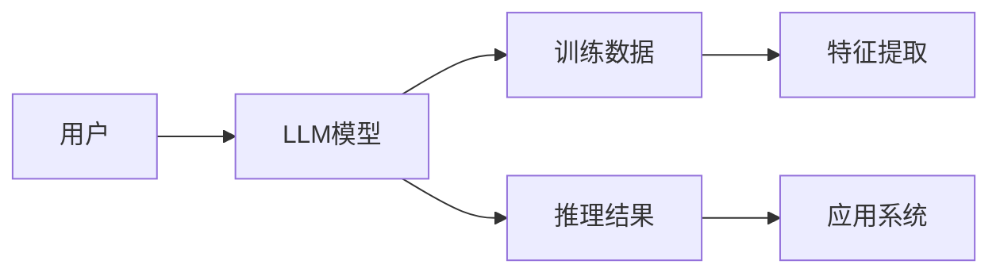

                 


# 选择适合企业的LLM大模型：考虑因素与决策框架

> 关键词：LLM大模型、企业选择、决策框架、NLP技术、人工智能

> 摘要：本文从背景、核心概念、算法原理、系统架构到项目实战，详细分析了企业在选择大语言模型（LLM）时需要考虑的关键因素和决策框架。通过深入的技术解析和实际案例，为读者提供全面的指导。

---

## 第一部分: 选择适合企业的LLM大模型背景与核心概念

### 第1章: LLM大模型的定义与技术特点

#### 1.1 LLM大模型的定义
- **1.1.1 大语言模型（LLM）的定义**  
  大语言模型（Large Language Model, LLM）是指基于深度学习技术构建的、具有大规模参数的自然语言处理模型。与传统的小模型相比，LLM通过海量数据的训练，能够理解上下文、生成连贯的文本，并具备更强的推理能力。

- **1.1.2 LLM的核心技术特点**  
  - **大规模参数量**：通常拥有 billions 级别的参数，如 GPT-3 拥有 175 亿参数。  
  - **自监督学习**：通过无监督预训练，模型从大规模文本数据中学习语言规律。  
  - **Transformer 架构**：采用自注意力机制，能够捕捉长距离依赖关系。  
  - **零样本学习**：在未见过的领域也能生成合理答案。  

- **1.1.3 LLM与传统NLP模型的区别**  
  - 传统NLP模型：基于规则或小规模数据，适用于特定任务，如词性标注、情感分析。  
  - LLM：通用性强，能够处理多种任务，支持动态调整，适应不同场景。  

#### 1.2 LLM大模型的技术背景
- **1.2.1 从浅层模型到深度学习的演进**  
  - 早期NLP模型：基于统计学的浅层模型，如朴素贝叶斯、支持向量机。  
  - 深度学习的崛起：引入RNN和LSTM，但存在训练难度大、计算资源需求高的问题。  
  - Transformer的突破：2014年提出，彻底改变了NLP领域的模型架构。  

- **1.2.2 大模型的训练与推理机制**  
  - **训练阶段**：通过大量数据的预训练，学习语言的分布规律。  
  - **推理阶段**：基于训练好的模型，生成符合上下文的文本。  

- **1.2.3 LLM在企业中的应用潜力**  
  - **客户支持**：自动化回答常见问题，提升客户满意度。  
  - **内容生成**：辅助营销文案创作、报告撰写等。  
  - **数据分析**：从文本数据中提取有价值的信息。  

#### 1.3 LLM大模型与企业需求的结合
- **1.3.1 企业智能化转型的背景**  
  - 数字化转型已成为企业核心战略，NLP技术是其中的重要组成部分。  
  - 企业需要通过自动化工具提升效率，降低运营成本。  

- **1.3.2 LLM在企业中的应用场景**  
  - **内部沟通**：自动摘要会议记录、生成邮件模板。  
  - **客户服务**：智能客服系统，处理客户咨询和投诉。  
  - **数据处理**：从文档中提取关键信息，如合同条款、财务数据。  

- **1.3.3 企业选择LLM的挑战与机遇**  
  - **挑战**：模型训练成本高、数据隐私问题、技术门槛高。  
  - **机遇**：提升效率、优化流程、增强竞争力。  

---

## 第2章: LLM大模型的核心概念与联系

### 2.1 LLM大模型的核心原理
- **2.1.1 注意力机制的原理**  
  - 注意力机制允许模型在生成文本时，关注输入中的重要部分。  
  - 通过计算词与词之间的相关性，确定每个词的重要性。  

- **2.1.2 Transformer架构的详解**  
  - **编码器**：将输入序列映射到固定长度的向量。  
  - **解码器**：根据编码器的输出生成目标序列。  
  - **自注意力机制**：编码器内部的注意力机制，捕捉序列中的长距离依赖关系。  

- **2.1.3 LLM的训练与微调过程**  
  - **预训练**：在大规模通用数据上进行无监督训练。  
  - **微调**：在特定任务或领域数据上进行有监督训练，提升模型性能。  

### 2.2 LLM与相关技术的对比
- **2.2.1 LLM与传统NLP模型的对比**  
  | 特性         | 小模型            | LLM               |  
  |--------------|------------------|-------------------|  
  | 参数规模      | 一般在百万级别   | 通常在 billions 级别 |  
  | 任务适应性    | 适合单一任务     | 适合多种任务      |  
  | 训练数据      | 数据量较小       | 数据量非常大       |  

- **2.2.2 LLM与小模型的性能对比**  
  - **小模型**：适用于资源有限的场景，如移动设备端。  
  - **LLM**：性能更强，但需要强大的计算资源支持。  

- **2.2.3 LLM与AI伦理的关系**  
  - **数据偏见**：训练数据可能存在偏见，影响模型输出。  
  - **隐私问题**：处理敏感数据时，需注意数据泄露风险。  
  - **伦理规范**：企业需确保模型的使用符合伦理规范，避免滥用。  

### 2.3 LLM大模型的实体关系图


---

## 第3章: LLM大模型的算法原理

### 3.1 LLM的训练过程
- **3.1.1 前向传播过程**  
  - 输入序列经过编码器和解码器的处理，生成概率分布。  
  - 每个位置的输出依赖于前面的所有位置。  

- **3.1.2 反向传播与参数优化**  
  - 通过计算损失函数的梯度，更新模型参数。  
  - 使用Adam优化器，结合学习率衰减策略。  

- **3.1.3 损失函数的计算**  
  - 交叉熵损失：衡量预测概率与真实概率的差异。  
  $$ \text{loss} = -\sum_{i=1}^{n} y_i \log(p_i) $$  

### 3.2 LLM的推理过程
- **3.2.1 解码过程的详细步骤**  
  - 初始化解码器的输入（通常为模型生成的特殊符号）。  
  - 逐步生成下一个词，直到达到最大长度或生成结束符号。  

- **3.2.2 注意力机制的计算公式**  
  $$ \text{Attention}(Q,K,V) = \text{softmax}\left(\frac{QK^T}{\sqrt{d_k}}\right)V $$  

- **3.2.3 概率分布的计算**  
  - 每个词的概率由softmax函数决定，表示模型对生成下一个词的概率分布。  

### 3.3 LLM的数学模型
- **3.3.1 Transformer的数学公式**  
  $$ f(x) = \text{ReLU}(Wx + b) $$  

- **3.3.2 前向网络的结构**  
  $$ \text{FFN}(x) = \text{ReLU}(W_1x + b_1)W_2 + b_2 $$  

---

## 第4章: 企业选择LLM的决策框架

### 4.1 企业需求分析
- **4.1.1 企业目标与LLM的匹配**  
  - 明确企业需求：提升效率、降低成本、优化流程。  
  - 选择适合任务的模型：生成任务、理解任务、对话任务。  

- **4.1.2 企业资源与LLM的成本**  
  - 计算资源：是否具备支持大规模模型的硬件条件。  
  - 人力资源：是否有足够的技术团队进行模型部署和维护。  

- **4.1.3 企业数据与LLM的匹配**  
  - 数据质量：数据是否足够干净、多样化。  
  - 数据隐私：是否符合数据保护法规。  

### 4.2 企业选择LLM的决策框架
- **4.2.1 明确业务目标**  
  - 确定LLM的应用场景和预期效果。  

- **4.2.2 评估技术可行性**  
  - 检查企业是否具备相应的技术能力。  

- **4.2.3 选择合适的模型**  
  - 根据任务需求选择开源模型或商业模型。  

- **4.2.4 优化与部署**  
  - 对模型进行微调，确保在企业数据上的表现。  
  - 部署模型到生产环境，监控性能和效果。  

---

## 第5章: 项目实战——企业内部客服系统的升级

### 5.1 项目背景
- 企业现有的客服系统效率低下，无法满足日益增长的客户需求。  
- 通过引入LLM，提升客服系统的智能化水平。  

### 5.2 环境配置
- **硬件配置**：选择具备足够计算能力的服务器，如 GPU 集群。  
- **软件环境**：安装Python、TensorFlow、Hugging Face库。  

### 5.3 代码实现
```python
from transformers import GPT2LMHeadModel, GPT2Tokenizer

model_name = "gpt2-large"
tokenizer = GPT2Tokenizer.from_pretrained(model_name)
model = GPT2LMHeadModel.from_pretrained(model_name)

def generate_response(prompt):
    inputs = tokenizer.encode(prompt, return_tensors="pt")
    outputs = model.generate(inputs, max_length=50, temperature=0.7, do_sample=True)
    response = tokenizer.decode(outputs[0], skip_special_tokens=True)
    return response

# 示例
prompt = "用户询问产品功能的问题："
response = generate_response(prompt)
print(response)
```

### 5.4 代码解读与分析
- **tokenizer**：将输入文本转换为模型可接受的格式。  
- **model**：加载预训练好的GPT-2模型。  
- **generate_response**：根据输入生成响应文本。  
- **temperature**：控制生成结果的随机性，温度越高，结果越多样化。  

### 5.5 实际案例分析
- **输入**：用户询问产品功能的问题。  
- **输出**：生成详细的产品介绍，帮助用户解决问题。  

### 5.6 项目小结
- 成功实现了客服系统的升级，显著提升了响应效率。  
- 通过微调模型，进一步优化了生成效果。  

---

## 第6章: 最佳实践与小结

### 6.1 最佳实践
- **选择模型时，优先考虑开源模型**：开源模型具有更高的透明度和灵活性。  
- **数据预处理是关键**：确保数据质量，避免偏见。  
- **结合企业需求进行微调**：提升模型在特定场景下的表现。  

### 6.2 小结
- 企业在选择LLM时，需要综合考虑技术、资源和业务需求。  
- 通过合理的决策框架和最佳实践，能够最大化LLM的价值。  

### 6.3 注意事项
- **数据隐私**：确保数据处理符合相关法规。  
- **模型维护**：定期更新模型，确保其性能。  
- **用户反馈**：根据用户反馈优化模型。  

### 6.4 拓展阅读
- 建议深入学习Transformer架构和注意力机制的原理。  
- 关注最新的LLM研究成果和应用案例。  

---

通过以上步骤，我们可以系统地选择和部署适合企业的LLM大模型，为企业智能化转型提供有力支持。希望本文能够为读者在选择和应用LLM时提供有价值的参考。

