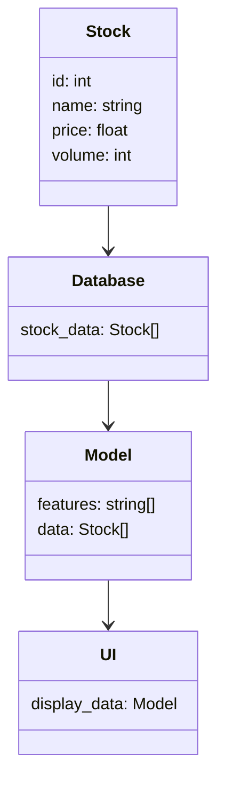
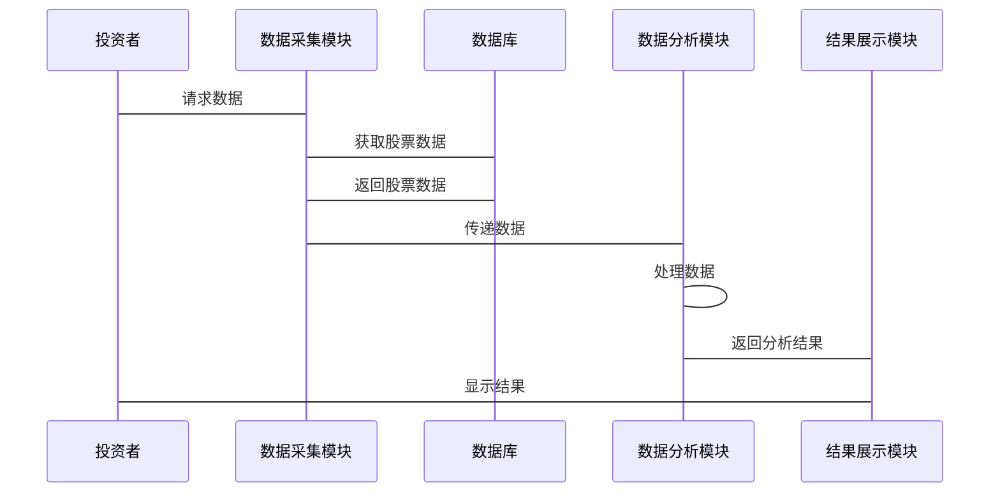

                 


# 《选股技巧：如何在市场混乱中识别优质公司》

> 关键词：选股技巧、市场混乱、优质公司、基本面分析、技术分析、投资策略

> 摘要：本文将详细介绍如何在市场混乱中识别优质公司。通过基本面分析、技术分析、综合分析方法、量化选股模型、系统架构设计和项目实战，帮助投资者掌握选股的核心技巧，从而在复杂多变的市场中做出明智的投资决策。

---

## 第一章：投资市场的基本概念与选股的重要性

### 1.1 投资市场的基本概念

#### 1.1.1 什么是投资市场
投资市场是指通过买卖金融资产（如股票、债券、基金等）进行投资的场所。市场参与者包括个人投资者、机构投资者、券商、交易所等。投资市场的核心功能是资金的流动与资源配置。

#### 1.1.2 市场波动性与投资者心理
市场波动性是投资市场的常态，受到多种因素的影响，如经济数据、政策变化、公司业绩等。投资者心理在市场波动中起着重要作用，常见的心理包括贪婪、恐惧、乐观和悲观。

#### 1.1.3 选股的基本原则
选股是投资的核心步骤，基本原则包括：
1. 长期投资，关注公司基本面。
2. 分散投资，降低风险。
3. 顺势而为，跟随市场趋势。
4. 价值投资，寻找被低估的公司。

### 1.2 优质公司的定义与特征

#### 1.2.1 优质公司的核心特征
优质公司通常具有以下特征：
- **持续盈利能力**：ROE（净资产收益率）高，净利润稳定增长。
- **强大的财务状况**：低负债率，健康的现金流。
- **行业地位**：市场占有率高，竞争优势明显。
- **管理团队**：管理团队经验丰富，公司治理透明。

#### 1.2.2 公司财务健康指标
以下是衡量公司财务健康的关键指标：

| 指标名称       | 公式                     | 意义                                   |
|----------------|--------------------------|---------------------------------------|
| 净利润         | 净利润 = 收入 - 成本 - 费用 | 公司盈利能力的核心指标               |
| ROE            | ROE = 净利润 / 净资产     | 衡量公司使用股东资金的效率           |
| 偿债能力       | 负债率 = 负债 / 资产      | 衡量公司偿债能力                     |
| 现金流         | 现金流 = 收入 - 支出       | 衡量公司运营资金的健康性             |

#### 1.2.3 行业地位与竞争优势
行业地位决定了公司在行业中的位置，竞争优势是公司在行业内胜出的关键。例如，行业龙头通常具有更强的议价能力和资源分配能力。

### 1.3 选股的重要性与挑战

#### 1.3.1 选股在投资中的核心地位
选股是投资回报的决定性因素。即使在牛市中，选择错误的股票也可能导致亏损；而在熊市中，选择优质的股票可以有效规避风险。

#### 1.3.2 市场混乱中的选股挑战
市场混乱时，信息不透明，情绪波动大，投资者容易受到市场情绪的干扰，导致决策失误。

#### 1.3.3 选股与投资回报的关系
选股能力直接决定投资回报。通过科学的选股方法，投资者可以在市场混乱中找到优质公司，实现长期稳定的投资收益。

---

## 第二章：基本面分析的核心指标

### 2.1 常用财务指标解析

#### 2.1.1 市盈率（P/E）的计算与意义
市盈率是衡量股票估值的重要指标，公式为：
\[ P/E = \frac{股价}{每股净利润} \]
市盈率低的股票通常被视为低估，而高市盈率的股票可能意味着高风险。

#### 2.1.2 市净率（P/B）的计算与意义
市净率是股价与每股净资产的比率，公式为：
\[ P/B = \frac{股价}{每股净资产} \]
市净率低的股票通常具有较高的安全边际。

#### 2.1.3 净利润与ROE的分析
净利润是公司盈利能力的核心指标，而ROE（净资产收益率）则衡量了公司使用股东资金的效率。

### 2.2 财务报表分析基础

#### 2.2.1 资产负债表的核心要素
资产负债表反映了公司资产、负债和所有者权益的情况。以下是资产负债表的核心要素：

| 类别       | 定义                       |
|------------|----------------------------|
| 资产       | 公司拥有的资源，如现金、应收账款等 |
| 负债       | 公司欠款，如贷款、应付账款等    |
| 所有者权益 | 公司净资产，等于资产减去负债   |

#### 2.2.2 利润表的关键指标
利润表反映了公司在一定时期内的收入和支出情况。以下是利润表的关键指标：

| 指标       | 公式                     | 意义                   |
|------------|--------------------------|-----------------------|
| 收入       | 收入 = 销售额 + 其他收入   | 公司的总收入来源     |
| 成本       | 成本 = 直接成本 + 间接成本 | 生产商品或服务的成本   |
| 净利润     | 净利润 = 收入 - 成本 - 费用 | 公司的最终利润         |

#### 2.2.3 现金流量表的重要性
现金流量表反映了公司现金的流入和流出情况，分为经营活动、投资活动和筹资活动的现金流。

### 2.3 行业分析与公司估值

#### 2.3.1 行业周期与公司选择
行业周期分为复苏期、增长期、成熟期和衰退期。投资者应选择处于增长期或复苏期的行业。

#### 2.3.2 市场地位与竞争优势
公司市场地位强、竞争优势明显，通常具有更强的盈利能力。

#### 2.3.3 相对估值法的应用
相对估值法通过比较公司与行业平均水平的估值指标，判断公司是否被低估或高估。

---

## 第三章：技术分析的关键工具

### 3.1 技术分析基础

#### 3.1.1 技术分析的定义与原理
技术分析是通过分析历史价格和成交量数据，预测未来价格走势的方法。

#### 3.1.2 K线图的基本解读
K线图是技术分析的基础工具，反映了股票在某一时间段内的开盘价、收盘价、最高价和最低价。

#### 3.1.3 技术分析与市场情绪
技术分析不仅反映了价格走势，还反映了市场参与者的心理和情绪。

### 3.2 常用技术指标解析

#### 3.2.1 移动平均线（MA）
移动平均线是将一定时期内的收盘价进行平均，用以平滑价格波动。

#### 3.2.2 相对强弱指数（RSI）
RSI用于衡量股票的超买或超卖状态，公式为：
\[ RSI = \frac{100 \times (\text{平均上涨幅度})}{\text{平均上涨幅度} + \text{平均下跌幅度}} \]

#### 3.2.3 移动平均收敛散度（MACD）
MACD是通过短期和长期移动平均线的差异来判断市场趋势。

---

## 第四章：综合分析方法

### 4.1 综合分析方法的定义
综合分析方法结合了基本面分析和技术分析，通过多维度评估股票的投资价值。

### 4.2 综合分析步骤

#### 4.2.1 确定投资目标
明确投资目标，包括投资期限、风险承受能力等。

#### 4.2.2 基本面筛选
通过基本面分析筛选出财务健康、行业地位高的公司。

#### 4.2.3 技术面确认
通过技术分析确认股票的买卖时机。

#### 4.2.4 综合评估
结合基本面和技术面，综合评估股票的投资价值。

---

## 第五章：量化选股模型

### 5.1 量化选股模型的定义
量化选股模型是通过数学模型和算法，筛选出符合条件的股票。

### 5.2 量化选股算法设计

#### 5.2.1 数据采集与预处理
采集股票的历史数据，并进行清洗和标准化处理。

#### 5.2.2 特征提取
从财务数据和技术数据中提取特征，例如市盈率、MACD等。

#### 5.2.3 模型训练
通过机器学习算法，训练模型预测股票的价格走势或评级。

#### 5.2.4 模型优化
通过回测和调整参数，优化模型的性能。

### 5.3 量化选股模型的实现

#### 5.3.1 Python代码实现
以下是量化选股模型的Python代码示例：

```python
import pandas as pd
import numpy as np

# 数据预处理
data = pd.read_csv('stock_data.csv')
data = data.dropna()

# 特征提取
features = ['PE', 'ROE', 'MACD']
X = data[features].values
y = data['Target'].values

# 模型训练
from sklearn.model_selection import train_test_split
from sklearn.ensemble import RandomForestClassifier

X_train, X_test, y_train, y_test = train_test_split(X, y, test_size=0.2)
model = RandomForestClassifier()
model.fit(X_train, y_train)

# 模型预测
y_pred = model.predict(X_test)
print('Accuracy:', model.score(X_test, y_test))
```

#### 5.3.2 模型优化与回测
通过回测验证模型的性能，并根据回测结果优化模型参数。

---

## 第六章：系统架构设计

### 6.1 系统功能设计

#### 6.1.1 领域模型
以下是领域模型的Mermaid类图：



#### 6.1.2 系统架构
以下是系统架构的Mermaid架构图：

```mermaid
archi
    title 选股系统架构图
    component 投资者 {
        label "投资者"
    }
    component 数据采集模块 {
        label "数据采集模块"
    }
    component 数据分析模块 {
        label "数据分析模块"
    }
    component 结果展示模块 {
        label "结果展示模块"
    }
    数据采集模块 --> 数据分析模块
    数据分析模块 --> 结果展示模块
    投资者 --> 数据采集模块
    投资者 --> 结果展示模块
```

#### 6.1.3 系统交互
以下是系统交互的Mermaid序列图：



---

## 第七章：项目实战

### 7.1 环境安装

#### 7.1.1 安装必要的库
安装以下Python库：
- pandas
- numpy
- matplotlib
- scikit-learn

#### 7.1.2 获取股票数据
从数据源（如Yahoo Finance）获取股票数据。

### 7.2 核心实现

#### 7.2.1 数据预处理
对获取的股票数据进行清洗和标准化处理。

#### 7.2.2 特征提取
从数据中提取有用的特征，例如市盈率、MACD等。

#### 7.2.3 模型训练
使用机器学习算法训练模型，预测股票的价格走势或评级。

### 7.3 实际案例分析

#### 7.3.1 案例分析
以某只股票为例，展示如何通过量化选股模型筛选出优质公司。

#### 7.3.2 案例结果
展示模型筛选出的优质公司及其投资价值。

### 7.4 项目小结
总结项目实现的步骤和成果，分析模型的优缺点，并提出改进建议。

---

## 第八章：最佳实践

### 8.1 小结
本文详细介绍了如何在市场混乱中识别优质公司，通过基本面分析、技术分析、综合分析方法、量化选股模型和系统架构设计，帮助投资者掌握选股的核心技巧。

### 8.2 注意事项
- 投资有风险，入市需谨慎。
- 选股模型仅供参考，实际操作中需结合市场实际情况。
- 定期回顾和调整投资组合，以适应市场变化。

### 8.3 拓展阅读
- 《巴菲特选股法则》
- 《技术分析实战》
- 《量化投资入门》

---

通过本文的学习，读者可以掌握在市场混乱中识别优质公司的核心技巧，从而在复杂多变的市场中做出明智的投资决策。

