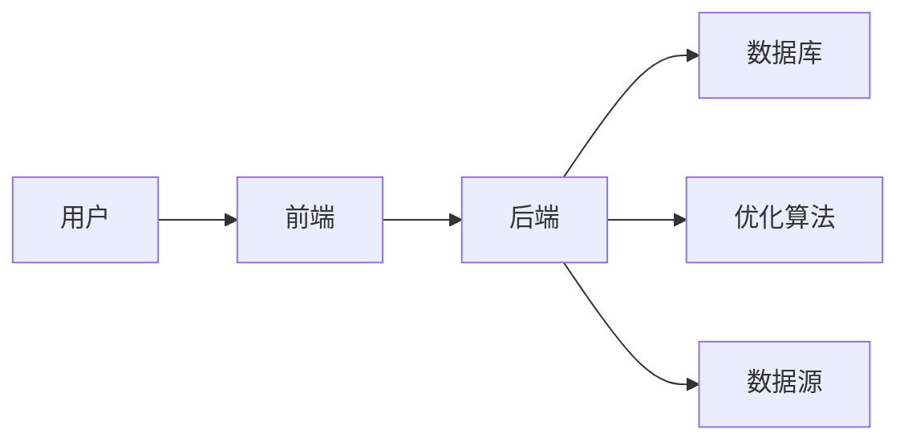
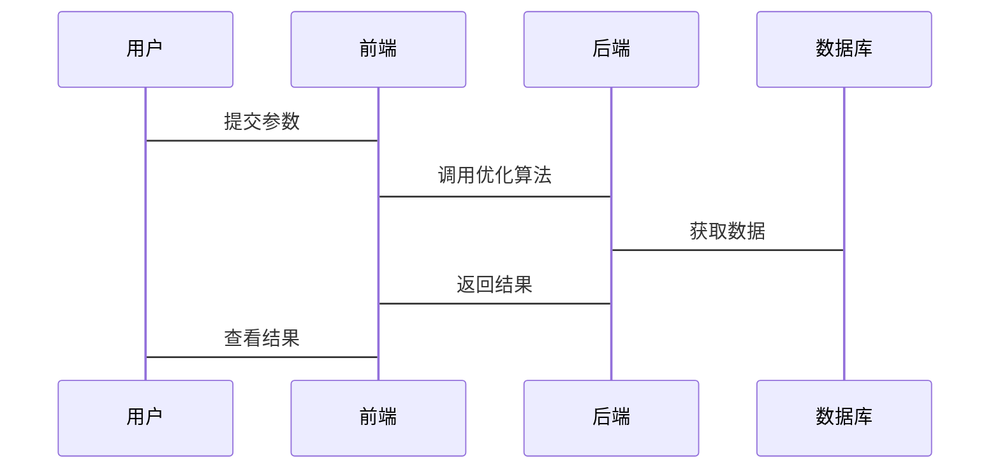

                 


# 通胀周期中的资产配置策略

> **关键词**：通胀周期、资产配置、数学模型、算法实现、系统架构、案例分析

> **摘要**：本文系统地探讨了通胀周期中的资产配置策略，从背景介绍到数学模型，再到系统架构和实战案例，全面分析了如何在不同通胀阶段优化资产配置，以应对经济波动和通胀风险。

---

## 第一部分：通胀周期中的资产配置背景与核心概念

### 第1章：通胀周期的定义与特征

#### 1.1 通胀的定义与类型
**1.1.1 通胀的基本定义**
通胀（Inflation）是指物价总水平在一段时间内持续上涨的经济现象。通常用消费者价格指数（CPI）或生产者价格指数（PPI）来衡量。通胀可能导致货币购买力下降，影响个人消费和投资决策。

**1.1.2 不同类型的通胀及其特点**
- **温和通胀**：通胀率在2%-3%之间，是大多数国家的货币政策目标，被视为经济增长的良性信号。
- **恶性通胀**：通胀率急剧上升，货币购买力大幅下降，可能导致经济崩溃。
- **成本推动型通胀**：由于生产成本（如工资、原材料）上升引发的通胀。
- **需求拉动型通胀**：由于总需求超过总供给导致的价格上涨。

**1.1.3 通胀与通缩的对比分析**
- 通胀可能导致货币贬值，而通缩可能导致货币升值。
- 通胀环境下，债务的实际价值下降，有利于债务人；通缩环境下，债务的实际价值上升，有利于债权人。

#### 1.2 通胀对经济的影响
**1.2.1 通胀对消费者价格水平的影响**
- 消费者购买力下降，实际收入减少。
- 消费者可能减少非必需品的购买，转而储存必需品。

**1.2.2 通胀对企业和市场行为的影响**
- 企业成本上升，利润减少，可能导致裁员或减少投资。
- 市场预期通胀上升，可能导致资产价格泡沫。

**1.2.3 通胀对政府政策的挑战**
- 政府可能通过加息、减少货币供应等手段控制通胀，但也可能引发经济衰退。

#### 1.3 通胀周期的形成机制
**1.3.1 经济周期与通胀的关系**
- 经济周期波动与通胀密切相关，经济繁荣阶段通胀率可能上升，经济衰退阶段通胀率可能下降。

**1.3.2 货币政策与通胀周期的关联**
- 中央银行通过调整利率和货币供应量影响通胀水平。
- 宽松的货币政策可能导致通胀上升，紧缩的货币政策可能导致通胀下降。

**1.3.3 通胀预期的形成与影响**
- 通胀预期会影响企业和消费者的当前行为，可能导致自我实现的通胀。

---

### 第2章：资产配置的核心概念与目标

#### 2.1 资产配置的基本原理
**2.1.1 资产配置的定义与目的**
资产配置是指将资金分配到不同资产类别（如股票、债券、现金、房地产等）以实现投资目标的过程。其目的是在不同市场条件下优化风险和收益。

**2.1.2 资产配置的基本原则**
- 分散投资：通过多样化降低风险。
- 风险与收益匹配：根据风险承受能力选择资产。
- 定期再平衡：根据市场变化调整资产配置。

**2.1.3 资产配置与投资目标的关系**
- 投资目标包括保值、增值和现金流等，资产配置需根据目标进行调整。

#### 2.2 不同类型资产的特性分析
**2.2.1 股票、债券、现金等主要资产的通胀对冲能力**
- 股票：在通胀上升期间，企业可能通过提高产品价格转移成本，股票价格可能上涨。
- 债券：通胀上升可能导致债券收益率上升，价格下跌。
- 现金：通胀可能导致货币购买力下降。

**2.2.2 商品类资产（如黄金、原油）的通胀对冲作用**
- 黄金：常被视为通胀对冲工具，在通胀上升时价格通常上涨。
- 原油：与通胀密切相关，常用于对冲能源价格上涨风险。

**2.2.3 其他另类资产的通胀应对策略**
- 不动产：在通胀上升时，租金和房价可能上涨，提供对冲通胀的潜力。
- 商品期货：通过持有商品头寸对冲通胀风险。

#### 2.3 资产配置与通胀周期的关系
**2.3.1 通胀周期中资产表现的差异**
- 在通胀上升阶段，股票和商品可能表现较好。
- 在通胀下降阶段，债券和现金可能更安全。

**2.3.2 不同通胀阶段的资产配置策略**
- 低通胀阶段：增加债券和现金配置。
- 高通胀阶段：增加股票和商品配置。

**2.3.3 资产配置在通胀风险管理中的作用**
- 通过分散投资降低通胀风险。
- 根据通胀预期动态调整资产配置。

---

## 第二部分：资产配置策略的数学模型与算法

### 第3章：资产配置的数学模型

#### 3.1 资产配置的基本数学框架
**3.1.1 投资组合优化的数学模型**
投资组合优化的目标是最大化收益，同时最小化风险。常用的模型包括均值-方差模型（由Harry Markowitz提出）。

**公式**：  
$$\text{Minimize } \sigma^2 \text{ s.t. } \mu \geq \text{目标收益}$$  
其中，$\sigma^2$是投资组合的方差（风险），$\mu$是期望收益。

**3.1.2 资产回报率的期望与方差计算**
- 期望回报率：$\mu_i = \sum_{j=1}^n p_{ij} r_j$，其中$p_{ij}$是资产$i$在市场状态$j$下的概率，$r_j$是市场状态$j$下的回报率。
- 方差：$\sigma_i^2 = \sum_{j=1}^n p_{ij} (r_j - \mu_i)^2$。

**3.1.3 现金流贴现模型在通胀周期中的应用**
现金流贴现模型（DCF）用于评估资产的内在价值。在通胀周期中，未来现金流需要根据通胀调整。

**公式**：  
$$V = \sum_{t=1}^n \frac{CF_t}{(1 + r)^t}$$  
其中，$CF_t$是第$t$期的现金流，$r$是折现率，需考虑通胀因素。

#### 3.2 基于通胀的资产配置模型
**3.2.1 拉格朗日乘数法在资产配置中的应用**
拉格朗日乘数法用于在约束条件下优化资产配置。例如，在给定的通胀预期下，优化资产权重以最大化收益或最小化风险。

**拉格朗日函数**：  
$$L = \lambda (\mu - r) - \frac{1}{2} \sigma^2$$  
其中，$\lambda$是拉格朗日乘数，$\mu$是期望收益，$r$是目标收益，$\sigma^2$是风险。

**3.2.2 动态规划模型在通胀周期中的应用**
动态规划模型用于长期资产配置，考虑不同通胀阶段的动态变化。

**状态转移方程**：  
$$\mu_{t+1} = \mu_t + \alpha \text{Inflation}_t$$  
其中，$\alpha$是调整系数，$\text{Inflation}_t$是第$t$期的通胀率。

**3.2.3 资产配置的马科维茨有效前沿分析**
马科维茨有效前沿展示了在给定风险下，能够获得的最高收益的投资组合。

**公式**：  
$$\text{Minimize } \sigma^2 \text{ s.t. } \sum_{i=1}^n w_i \mu_i = \mu$$  
$$\sum_{i=1}^n w_i = 1$$  
其中，$w_i$是资产$i$的权重，$\mu$是目标收益。

### 第4章：资产配置算法的实现

#### 4.1 资产配置算法的原理
**4.1.1 现金流贴现模型的算法实现**
- 收集历史数据，计算现金流。
- 确定合适的折现率，考虑通胀因素。
- 计算现值，评估资产价值。

**4.1.2 基于通胀预期的资产权重调整算法**
- 根据通胀预期调整资产权重，例如在通胀上升时增加股票权重。
- 使用动态规划模型，预测未来通胀对资产回报的影响。

**4.1.3 动态资产配置模型的实现步骤**
- 确定通胀目标和风险偏好。
- 计算不同资产类别的期望回报和风险。
- 根据动态规划模型调整资产权重。

#### 4.2 资产配置算法的代码实现
**4.2.1 Python代码实现资产配置模型**
```python
import numpy as np
import pandas as pd

# 示例数据：资产的期望回报和协方差矩阵
mu = np.array([0.1, 0.05, 0.02])
sigma = np.array([[0.16, 0.05, 0],
                  [0.05, 0.06, 0.02],
                  [0, 0.02, 0.08]])

# 使用拉格朗日乘数法求解最优权重
def optimize_weights(mu, sigma, target_return):
    n = len(mu)
    G = np.zeros((n, n))
    h = np.zeros(n)
    A = np.c_[np.ones(n), mu]
    b = np.array([1, target_return])
    w = np.linalg.lstsq(A.T @ A, A.T @ b, rcond=None)[0]
    return w

# 示例目标回报为5%
target_return = 0.05
weights = optimize_weights(mu, sigma, target_return)
print("Optimal weights:", weights)
```

**4.2.2 使用NumPy和Pandas进行数据处理**
- 数据清洗和预处理。
- 计算资产的期望回报和协方差矩阵。
- 应用优化算法求解最优权重。

---

## 第三部分：通胀周期中的资产配置系统与实战

### 第5章：资产配置系统的架构设计

#### 5.1 系统功能设计
- 数据采集：收集通胀数据和资产价格数据。
- 数据处理：清洗和转换数据，计算回报率和通胀指标。
- 模型计算：应用数学模型进行资产配置优化。
- 结果展示：可视化资产配置结果和绩效评估。

#### 5.2 系统架构设计
- **前端**：用户界面，显示资产配置建议和历史数据。
- **后端**：处理计算逻辑，调用优化算法。
- **数据库**：存储历史数据和用户配置信息。
- **接口**：与外部数据源（如金融数据API）连接。

**系统架构图（Mermaid）**


#### 5.3 系统交互流程
- 用户输入目标收益和风险偏好。
- 系统调用优化算法，生成资产配置建议。
- 用户查看结果并调整参数。

**交互流程图（Mermaid）**


### 第6章：项目实战与案例分析

#### 6.1 项目实战
- 选择一个具体市场（如美国市场）。
- 收集历史通胀数据和资产回报数据。
- 应用优化算法，生成资产配置建议。

#### 6.2 案例分析
**案例：2020年美国通胀周期中的资产配置**
- 数据：2020年通胀率为2.5%，股票回报率为10%，债券回报率为3%。
- 目标：在通胀上升期间，优化资产配置以最大化回报。
- 方法：应用拉格朗日乘数法，假设目标收益为8%。

**代码实现**
```python
# 示例数据：2020年美国市场
mu = np.array([0.1, 0.03])
sigma = np.array([[0.12, 0],
                  [0, 0.05]])

# 目标收益为8%
target_return = 0.08
weights = optimize_weights(mu, sigma, target_return)
print("Optimal weights:", weights)
```

**结果解读**
- 优化后的权重可能为[0.6, 0.4]，即60%股票，40%债券。
- 在通胀上升阶段，股票的高回报能力被重视，债券用于平衡风险。

#### 6.3 总结与改进建议
- 项目成功实现了基于通胀的资产配置模型。
- 可以进一步考虑更多资产类别和动态调整策略。

---

## 第四部分：总结与展望

### 总结
本文系统地探讨了通胀周期中的资产配置策略，从理论到实践，详细分析了如何在不同通胀阶段优化资产配置。通过数学模型和算法实现，结合实际案例，展示了如何应对通胀风险，实现长期投资目标。

### 展望
未来的研究可以进一步探索人工智能在资产配置中的应用，如使用机器学习模型预测通胀和优化资产组合。同时，可以研究多因素模型，考虑更多市场变量对资产配置的影响。

---

**感谢您的耐心阅读！希望本文能为您提供有价值的信息和启发。**

