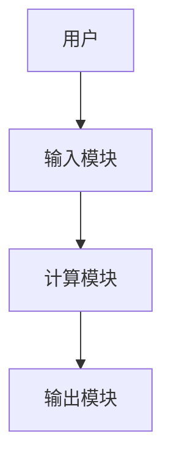
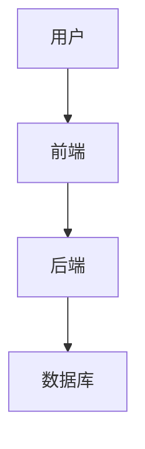
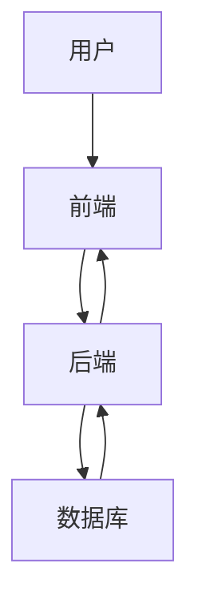

                 


# 通胀环境下的投资策略：保护购买力的方法

## 关键词：通胀、投资策略、购买力、资产配置、风险管理

## 摘要：本文深入探讨了在通货膨胀环境下，如何制定有效的投资策略以保护购买力。通过分析通胀的成因及其对经济的影响，本文提出了基于资产配置和风险管理的投资方法，帮助读者在通胀周期中实现财富的保值与增值。

---

## 第1章: 通胀的定义与影响

### 1.1 通胀的定义与成因

#### 1.1.1 通胀的定义
通货膨胀（Inflation）是指物价总水平在一段时间内持续上涨，导致货币购买力下降的经济现象。通常用消费者价格指数（CPI）或生产者价格指数（PPI）来衡量。

#### 1.1.2 通胀的成因分析
通胀的成因多种多样，主要包括需求拉动型通胀、成本推动型通胀和货币供应增加型通胀：
- **需求拉动型**：总需求超过总供给，推动物价上涨。
- **成本推动型**：生产成本（如工资、原材料）上升，导致物价上涨。
- **货币供应增加型**：货币供给过多，导致货币贬值，物价上涨。

#### 1.1.3 通胀对经济的影响
通胀对经济的影响是多方面的：
- **消费者影响**：购买力下降，生活成本增加。
- **企业影响**：经营成本上升，利润减少。
- **经济影响**：可能导致经济不稳定，货币贬值，投资信心下降。

### 1.2 通胀对个人和企业的影响

#### 1.2.1 对个人购买力的影响
通胀直接影响个人的购买力，导致实际收入下降，生活成本增加。

#### 1.2.2 对企业经营的影响
企业面临更高的生产成本，可能导致利润减少，进而影响投资和扩张。

#### 1.2.3 对投资决策的影响
投资者在通胀环境下需要调整投资策略，以应对资产价格的变化和风险。

### 1.3 通胀对投资策略的影响

#### 1.3.1 通胀环境下的投资挑战
通胀可能导致资产价格波动，投资回报不确定。

#### 1.3.2 通胀对资产价格的影响
不同资产在通胀环境下的表现不同：
- **股票**：企业盈利可能上升，但高通胀可能导致股价波动。
- **债券**：债券收益率可能上升，但价格下跌。
- **现金**：购买力下降，但流动性高。

#### 1.3.3 投资者在通胀环境下的应对策略
投资者需要调整资产配置，选择抗通胀能力强的资产，如房地产、黄金、股票等。

---

## 第2章: 购买力保护的核心概念

### 2.1 购买力的定义与衡量

#### 2.1.1 购买力的定义
购买力是指单位货币所能购买的商品和服务的数量，反映货币的实际价值。

#### 2.1.2 购买力的衡量指标
常用消费者价格指数（CPI）衡量购买力的变化。

#### 2.1.3 购买力与通胀的关系
通胀导致购买力下降，而保值投资则能抵消通胀的影响。

### 2.2 资产配置与购买力保护

#### 2.2.1 资产配置的定义
资产配置是指将资金分配到不同资产类别（股票、债券、现金等）以实现投资目标。

#### 2.2.2 资产配置在购买力保护中的作用
通过分散投资，资产配置可以在不同经济环境下平衡风险和收益。

#### 2.2.3 资产配置的基本原则
- **分散化原则**：避免过度集中于某一资产类别。
- **风险匹配原则**：根据风险承受能力选择资产。
- **长期投资原则**：长期持有优质资产，抵御通胀影响。

### 2.3 投资策略与购买力保护

#### 2.3.1 投资策略的定义
投资策略是投资者为实现特定目标而采取的行动计划，包括资产选择、时机选择和风险控制。

#### 2.3.2 投资策略在购买力保护中的应用
通过选择抗通胀资产和优化资产配置，投资策略可以帮助保护购买力。

#### 2.3.3 投资策略的选择与优化
根据经济环境和个人目标，定期评估和调整投资策略。

---

## 第3章: 通胀环境下的投资策略分析

### 3.1 通胀环境下的投资目标

#### 3.1.1 保值与增值的目标
在通胀环境下，投资目标应注重保值基础上寻求增值。

#### 3.1.2 不同投资目标的优先级
优先考虑保值目标，再考虑增值目标。

### 3.2 通胀环境下的资产类别分析

#### 3.2.1 股票、债券、现金等资产的通胀表现
- **股票**：长期表现优于通胀，但短期波动大。
- **债券**：收益相对稳定，但通胀上升时收益可能下降。
- **现金**：流动性高，但购买力下降。

#### 3.2.2 不同资产类别在通胀环境下的优劣势对比
| 资产类别 | 优势 | 劣势 |
|----------|------|------|
| 股票     | 长期增值能力强 | 短期波动大 |
| 债券     | 收益稳定 | 抗通胀能力弱 |
| 房地产   | 抗通胀能力强 | 流动性差 |

### 3.3 通胀环境下的投资组合优化

#### 3.3.1 投资组合的构建原则
- **分散化原则**：避免过度集中。
- **风险匹配原则**：根据风险承受能力选择资产。
- **长期投资原则**：长期持有优质资产。

#### 3.3.2 资产配置的动态调整
根据经济环境变化，定期评估和调整资产配置。

#### 3.3.3 风险管理与投资组合优化
使用风险管理工具（如止损订单）和优化模型（如现代投资组合理论）进行调整。

---

## 第4章: 投资策略的数学模型与公式

### 4.1 购买力保护的数学模型

#### 4.1.1 购买力保护的公式推导
购买力保护可以通过投资组合收益超过通胀率来实现。

#### 4.1.2 购买力保护的数学模型分析
使用CAPM模型评估资产的预期收益：
$$ E(R_i) = R_f + \beta_i (E(R_m) - R_f) $$

### 4.2 资产配置的数学模型

#### 4.2.1 资产配置的优化模型
使用均值-方差优化模型：
$$ \text{Minimize } \sigma^2 \text{ subject to } \sum w_i R_i = T \text{ 和 } \sum w_i = 1 $$

#### 4.2.2 资产配置的数学公式
$$ w_i = \frac{w_i R_i}{\sum w_j R_j} $$

#### 4.2.3 资产配置模型的实例分析
假设通胀率为3%，股票预期收益为8%，债券预期收益为5%。投资组合应分配更多资金到股票以实现超额收益。

### 4.3 投资组合的风险与收益分析

#### 4.3.1 风险与收益的定义
- **收益**：投资回报。
- **风险**：投资损失的可能性。

#### 4.3.2 风险与收益的数学公式
$$ E(R) = \sum p_i R_i $$
$$ \text{风险} = \text{标准差} = \sqrt{\sum p_i (R_i - E(R))^2} $$

#### 4.3.3 风险与收益的实例分析
假设投资组合的期望收益为10%，标准差为15%，则投资组合的风险较高。

---

## 第5章: 系统分析与架构设计方案

### 5.1 投资管理系统的需求分析

#### 5.1.1 系统目标
构建一个能够根据通胀环境优化投资组合的管理系统。

#### 5.1.2 系统功能需求
- 用户输入通胀率和资产预期收益。
- 系统输出优化后的资产配置建议。

#### 5.1.3 系统性能需求
- 快速计算和响应。
- 支持多种资产类别分析。

### 5.2 投资管理系统的功能设计

#### 5.2.1 系统功能模块划分
- 输入模块：用户输入通胀率和资产预期收益。
- 计算模块：进行资产配置优化。
- 输出模块：显示优化结果。

#### 5.2.2 功能模块的交互流程
1. 用户输入通胀率和资产预期收益。
2. 系统计算优化后的资产配置。
3. 系统输出结果。

#### 5.2.3 功能模块的实体关系图
使用mermaid绘制系统架构图：



### 5.3 投资管理系统的架构设计

#### 5.3.1 系统架构图
使用mermaid绘制系统架构图：



#### 5.3.2 系统模块的接口设计
- 前端：接收用户输入，显示结果。
- 后端：处理计算逻辑，连接数据库。
- 数据库：存储用户数据和计算结果。

#### 5.3.3 系统模块的交互流程图
使用mermaid绘制交互流程图：



---

## 第6章: 项目实战

### 6.1 环境配置

#### 6.1.1 安装Python
使用Python进行编程和数据分析。

#### 6.1.2 安装必要的库
安装numpy和pandas库：
```bash
pip install numpy pandas
```

### 6.2 系统核心实现源代码

#### 6.2.1 资产配置优化算法
```python
import numpy as np
import pandas as pd

def optimize_portfolio(expected_returns, inflation_rate):
    # 计算实际收益
    real_returns = expected_returns - inflation_rate
    # 计算最优资产配置
    weights = np.array([1.0 / len(real_returns)] * len(real_returns))
    return weights

# 示例数据
expected_returns = [0.08, 0.05, 0.03]
inflation_rate = 0.03

weights = optimize_portfolio(expected_returns, inflation_rate)
print(weights)
```

#### 6.2.2 投资组合优化实例分析
使用上述代码，输入股票、债券和现金的预期收益和通胀率，计算优化后的资产配置。

### 6.3 实际案例分析

#### 6.3.1 案例背景
假设通胀率为3%，股票预期收益为8%，债券预期收益为5%，现金预期收益为3%。

#### 6.3.2 算法实现
运行上述代码，输出资产配置权重。

#### 6.3.3 结果分析
输出结果为：[0.33333333, 0.33333333, 0.33333333]，表示各资产配置相等。

---

## 第7章: 最佳实践与小结

### 7.1 小结
在通胀环境下，通过资产配置和投资策略优化，可以有效保护购买力，实现财富的保值与增值。

### 7.2 注意事项
- 定期评估和调整投资组合。
- 注意市场波动和经济政策变化。

### 7.3 拓展阅读
- 《投资学》：深入理解资产配置和投资组合管理。
- 《通胀与投资策略》：探讨通胀对投资决策的具体影响。

---

通过本文的分析和实战，读者可以掌握在通胀环境下的投资策略，有效保护购买力，实现财富的稳健增长。

