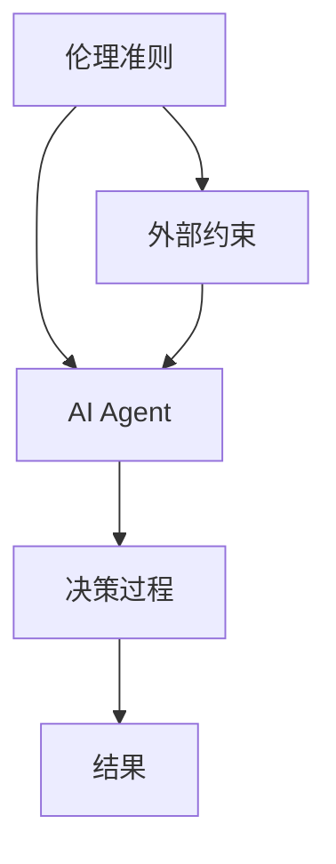
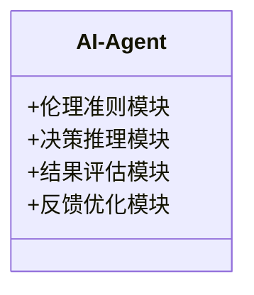
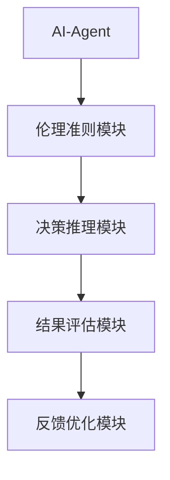

                 


# 道德决策：在AI Agent中实现伦理准则

> 关键词：AI Agent，道德决策，伦理准则，决策算法，系统架构，项目实战

> 摘要：本文探讨了在AI Agent中实现伦理准则的核心问题，分析了道德决策的算法原理、系统架构设计及实际应用案例。通过详细阐述伦理准则的分类、实现方法及验证过程，本文为AI开发者提供了实践指导，帮助他们在AI系统中构建可靠的道德决策机制。

---

# 第一部分: 背景介绍

# 第1章: 道德决策与AI Agent概述

## 1.1 问题背景

### 1.1.1 AI Agent的基本概念

AI Agent（人工智能代理）是指能够感知环境并采取行动以实现目标的智能体。它可以在没有人类干预的情况下自主决策，例如自动驾驶汽车、智能客服系统等。AI Agent的核心在于其决策能力，而决策的质量直接关系到系统的安全性和社会接受度。

### 1.1.2 道德决策的重要性

随着AI Agent的应用越来越广泛，其决策可能对人类生命、财产和社会秩序产生重大影响。例如，自动驾驶汽车在紧急情况下必须在毫秒内做出决策，这涉及到复杂的道德判断。因此，如何在AI Agent中实现道德决策成为亟待解决的问题。

### 1.1.3 当前AI Agent中的伦理挑战

目前，AI Agent的决策主要基于数据和算法，缺乏明确的伦理准则。这可能导致以下问题：
- **伦理冲突**：在不同情况下，AI可能需要在多个伦理准则之间进行权衡，例如在自动驾驶中，可能需要在保护乘客还是保护行人之间做出选择。
- **责任归属**：当AI Agent的决策导致负面结果时，责任归属变得复杂，涉及制造商、开发者和用户。
- **透明性与可解释性**：复杂的算法使得AI的决策过程难以被人类理解和解释，这增加了信任问题。

## 1.2 问题描述

### 1.2.1 道德决策的核心问题

AI Agent的道德决策需要解决以下问题：
- 如何将抽象的伦理准则转化为具体的决策规则？
- 如何在复杂场景中动态调整伦理准则的优先级？
- 如何确保决策过程的透明性和可解释性？

### 1.2.2 AI Agent决策中的伦理冲突

在实际场景中，AI Agent可能面临复杂的伦理冲突。例如，在医疗AI中，医生需要在患者的利益和医院的经济利益之间做出权衡。这种冲突要求AI Agent能够灵活调整决策策略。

### 1.2.3 伦理准则的多样性和复杂性

伦理准则因文化、法律和场景的不同而有所差异。例如，在某些文化中，集体利益优先；而在另一些文化中，个体权利更为重要。这使得AI Agent的伦理决策需要具备高度的适应性和灵活性。

## 1.3 问题解决

### 1.3.1 确定伦理准则的优先级

为了在AI Agent中实现伦理决策，首先需要明确伦理准则的优先级。例如，在自动驾驶中，优先保护人类生命，其次才是财产损失。

### 1.3.2 设计伦理准则的实现方法

通过将伦理准则转化为具体的规则和约束条件，AI Agent可以在决策过程中遵循这些准则。例如，使用模糊逻辑来处理不同准则之间的冲突。

### 1.3.3 验证道德决策的正确性

需要建立验证机制，确保AI Agent的决策符合伦理准则。这可以通过模拟测试和专家评审来实现。

## 1.4 边界与外延

### 1.4.1 道德决策的适用范围

道德决策适用于所有涉及人类福祉的AI应用，如医疗、教育、交通等。

### 1.4.2 伦理准则的局限性

伦理准则并非在所有情况下都适用，例如在极端情况下，可能需要突破常规的伦理约束。

### 1.4.3 道德决策与法律的关系

道德决策需要与法律框架相结合，确保AI Agent的决策既符合伦理准则，又遵守法律法规。

## 1.5 概念结构与核心要素组成

### 1.5.1 道德决策的构成要素

- **伦理准则**：明确的行为规范和价值观。
- **决策规则**：将伦理准则转化为具体的决策逻辑。
- **验证机制**：确保决策的正确性和一致性。

### 1.5.2 AI Agent的决策过程

AI Agent的决策过程包括感知环境、分析选项、评估伦理影响、做出决策等步骤。

### 1.5.3 伦理准则的实现机制

通过规则引擎、模糊逻辑和强化学习等方法，将伦理准则融入AI Agent的决策算法中。

## 1.6 本章小结

本章介绍了道德决策在AI Agent中的重要性，分析了伦理准则的分类和实现方法，为后续章节奠定了基础。

---

# 第二部分: 核心概念与联系

# 第2章: 伦理准则的核心概念

## 2.1 伦理准则的分类

### 2.1.1 利益最大化准则

利益最大化准则强调在决策中追求最大化的利益。例如，在商业AI中，追求利润最大化是其核心目标。

### 2.1.2 道义论准则

道义论准则强调遵循道德规范和义务。例如，在医疗AI中，医生必须遵循患者的知情同意原则。

### 2.1.3 功利主义准则

功利主义准则强调最大化整体幸福。例如，在自动驾驶中，选择伤害最少的方案是功利主义的体现。

## 2.2 伦理准则的属性特征对比

通过对比不同伦理准则的属性，可以帮助我们更好地理解它们的特点和适用场景。

| 准则类型    | 描述                     | 示例                     |
|-------------|--------------------------|--------------------------|
| 利益最大化  | 追求最大利益             | 商业AI追求利润最大化     |
| 道义论       | 遵循道德规范             | 医疗AI遵循患者利益优先   |
| 功利主义     | 最大化整体幸福           | 自动驾驶中的风险最小化   |

## 2.3 实体关系图

通过Mermaid图展示伦理准则与AI Agent之间的关系：



## 2.4 本章小结

本章通过分类和对比，详细分析了不同伦理准则的特点和实现方式，为后续章节的算法设计提供了理论基础。

---

# 第三部分: 算法原理

# 第3章: 道德决策算法的实现

## 3.1 道德决策算法的核心原理

道德决策算法需要将伦理准则转化为可执行的规则，并在复杂场景中动态调整这些规则的优先级。这通常涉及多目标优化和模糊逻辑。

### 3.1.1 多目标优化

多目标优化是一种在多个目标之间寻找最优平衡的方法。例如，在自动驾驶中，AI需要在安全、效率和舒适性之间找到最佳平衡点。

### 3.1.2 模糊逻辑

模糊逻辑适用于处理不明确的伦理准则。例如，在自动驾驶中，"保护生命"是一个模糊的概念，需要通过模糊逻辑进行量化。

## 3.2 道德决策算法的数学模型

将伦理准则转化为数学模型是实现道德决策的关键步骤。以下是一个简单的数学模型示例：

$$
\text{优先级} = \sum_{i=1}^{n} w_i \cdot c_i
$$

其中，$w_i$ 是准则 $i$ 的权重，$c_i$ 是准则 $i$ 的满足程度。

## 3.3 道德决策算法的实现步骤

以下是实现道德决策算法的步骤：

1. **定义伦理准则**：明确决策中需要遵循的伦理准则。
2. **确定准则权重**：根据具体情况为每个准则分配权重。
3. **评估准则满足程度**：计算每个准则在当前决策中的满足程度。
4. **计算优先级**：根据公式计算每个决策的优先级。
5. **选择最优决策**：根据优先级选择最优的决策方案。

## 3.4 代码实现

以下是一个简单的Python实现示例：

```python
def calculate_priority(criteria, weights):
    priority = 0
    for i in range(len(criteria)):
        priority += weights[i] * criteria[i]
    return priority

# 示例
criteria = [0.8, 0.6, 0.9]
weights = [0.5, 0.3, 0.2]
priority = calculate_priority(criteria, weights)
print(priority)  # 输出优先级
```

## 3.5 本章小结

本章详细介绍了道德决策算法的核心原理和实现方法，为后续章节的系统设计奠定了基础。

---

# 第四部分: 系统架构设计

# 第4章: 道德决策系统的架构设计

## 4.1 系统模块划分

道德决策系统通常包括以下几个模块：

1. **伦理准则模块**：定义和管理伦理准则。
2. **决策推理模块**：根据伦理准则进行推理和决策。
3. **结果评估模块**：评估决策的伦理影响。
4. **反馈优化模块**：根据反馈优化决策算法。

## 4.2 系统功能设计

以下是系统功能设计的领域模型：



## 4.3 系统架构设计

以下是系统架构设计的Mermaid图：



## 4.4 系统接口设计

系统接口设计需要考虑模块之间的通信方式。例如，伦理准则模块需要与决策推理模块进行数据交互。

## 4.5 本章小结

本章详细分析了道德决策系统的架构设计，为后续章节的项目实战提供了理论支持。

---

# 第五部分: 项目实战

# 第5章: 基于伦理准则的道德决策系统实现

## 5.1 项目背景

本项目旨在开发一个基于伦理准则的道德决策系统，用于自动驾驶场景中的紧急决策。

## 5.2 项目介绍

本项目包括以下几个部分：
1. **环境安装**：安装所需的开发工具和库。
2. **系统核心实现**：实现伦理准则模块、决策推理模块等。
3. **代码实现**：编写核心代码，实现道德决策算法。
4. **测试与验证**：通过测试用例验证系统的正确性。

## 5.3 环境安装

以下是环境安装的步骤：

1. 安装Python和相关库：
   ```bash
   pip install numpy matplotlib
   ```

2. 安装决策算法库：
   ```bash
   pip install scikit-learn
   ```

## 5.4 系统核心实现

以下是系统核心实现的代码示例：

```python
import numpy as np
from sklearn.metrics import pairwise

def ethical_decision(moral_factors, weights):
    priority = np.dot(moral_factors, weights)
    return priority

# 示例
moral_factors = np.array([0.8, 0.6, 0.9])
weights = np.array([0.5, 0.3, 0.2])
priority = ethical_decision(moral_factors, weights)
print(priority)  # 输出优先级
```

## 5.5 代码应用解读与分析

以上代码实现了简单的道德决策算法，通过点积计算优先级。实际应用中，需要根据具体场景调整算法和参数。

## 5.6 实际案例分析和详细讲解剖析

以下是一个自动驾驶场景中的案例分析：

假设在自动驾驶中，AI需要在以下两种决策中选择：
1. 碰撞行人，保护乘客。
2. 转向避让，可能伤害乘客。

通过道德决策算法，AI可以根据伦理准则（如优先保护生命）计算出最优决策。

## 5.7 测试与验证

通过模拟测试验证系统的正确性。例如，设置不同的测试用例，检查系统是否按照伦理准则做出决策。

## 5.8 本章小结

本章通过实际案例展示了如何在AI Agent中实现伦理准则，为读者提供了实践指导。

---

# 第六部分: 总结与展望

# 第6章: 总结与展望

## 6.1 核心内容回顾

本文详细探讨了道德决策在AI Agent中的实现问题，分析了伦理准则的分类、算法原理和系统架构设计。

## 6.2 当前的挑战

当前的主要挑战包括：
- 如何在复杂场景中动态调整伦理准则的优先级。
- 如何确保道德决策的透明性和可解释性。
- 如何处理不同文化背景下的伦理差异。

## 6.3 未来的发展方向

未来的研究方向包括：
- 开发更加灵活的伦理准则调整机制。
- 提高道德决策的透明性和可解释性。
- 研究如何在不同文化背景下实现伦理决策。

## 6.4 最佳实践 tips

- 在设计AI Agent时，始终优先考虑伦理准则。
- 定期审查和更新伦理准则，以适应社会变化。
- 确保道德决策的透明性和可解释性，增强用户的信任。

## 6.5 本章小结

本文总结了道德决策在AI Agent中的实现问题，并展望了未来的发展方向。

---

# 附录: 参考文献

1. Russell, S. (2019). *Human Compatible: AI Systems That Align with Human Values*. Houghton Mifflin Harcourt.
2. Bostrom, N. (2014). *Ethics of Artificial Intelligence*. In *The Cambridge Handbook of Artificial Intelligence*.
3. Floridi, L., Cowls, J., Beltrametti, M., ... (2018). *AI4People—An ethical framework for a good AI society: Opportunities, risks, principles, and recommendations*. *Minds and Machines*, 28(4), 689-707.

---

以上是《道德决策：在AI Agent中实现伦理准则》的技术博客文章的详细目录和内容结构。希望这篇文章能够为读者提供清晰的思路和实践指导。

