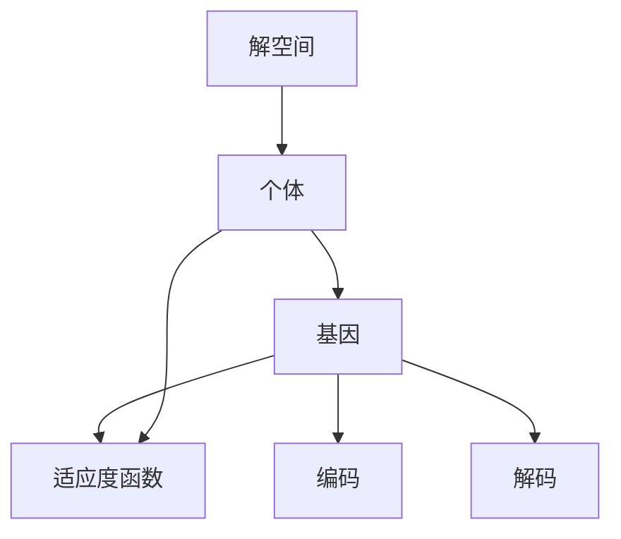
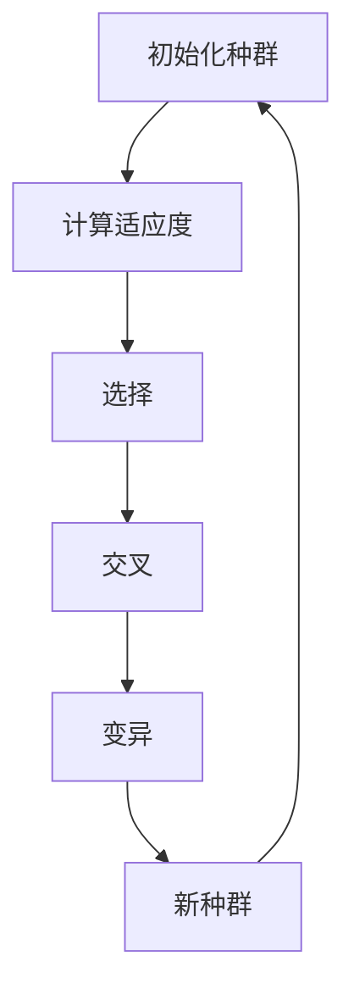
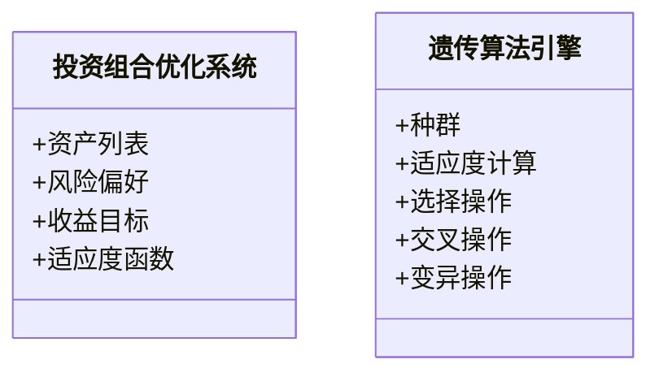
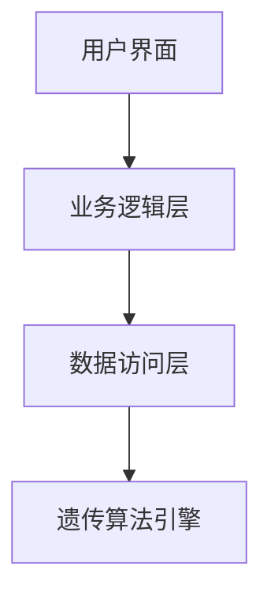

                 


# 遗传算法在投资策略优化中的实践

## 关键词：遗传算法、投资策略优化、数学模型、系统架构、项目实战

## 摘要：  
本文详细探讨了遗传算法在投资策略优化中的应用，从理论基础到实际案例，系统性地分析了遗传算法在投资策略优化中的优势、实现过程及实际效果。文章通过清晰的逻辑和专业的技术语言，结合数学模型和系统架构设计，展示了如何利用遗传算法解决复杂的投资策略优化问题，并提供了可参考的代码实现和实际案例分析。  

---

# 第一部分: 遗传算法在投资策略优化中的背景与基础

## 第1章: 遗传算法与投资策略优化概述

### 1.1 遗传算法的基本概念

#### 1.1.1 遗传算法的定义  
遗传算法（Genetic Algorithm, GA）是一种模拟生物进化过程的优化算法，通过模拟自然选择、遗传和变异等生物进化机制，逐步优化问题的解。  

#### 1.1.2 遗传算法的核心原理  
遗传算法的核心思想是“适者生存”，通过不断迭代优化，逐步逼近最优解。其核心步骤包括：  
1. 初始化种群：随机生成一组解（个体）。
2. 计算适应度：评估每个个体的适应度值。
3. 选择：根据适应度值选择优秀个体。
4. 交叉：将优秀个体的基因进行重组。
5. 变异：对新个体的基因进行随机扰动。
6. 迭代：重复上述步骤，直到满足终止条件。

#### 1.1.3 投资策略优化的定义与目标  
投资策略优化是指通过数学方法寻找最优的投资组合，以在风险可控的前提下最大化收益。其核心目标是平衡风险与收益，实现资产的最优配置。

### 1.2 遗传算法在投资中的应用背景  

#### 1.2.1 投资策略优化的复杂性  
投资市场具有高度不确定性，影响投资收益的因素包括市场波动、经济周期、政策变化等。传统的数学优化方法（如均值-方差模型）在处理多目标优化问题时存在局限性。

#### 1.2.2 传统投资策略优化的局限性  
传统方法通常假设市场是有效且稳定的，但实际情况往往更复杂。此外，传统方法在处理非线性问题和多目标优化时效果不佳。

#### 1.2.3 遗传算法的优势与适用场景  
遗传算法具有以下优势：  
1. 具备全局搜索能力，能够避免陷入局部最优。
2. 能够处理非线性、多目标优化问题。
3. 对问题的连续性要求较低，适用于离散解空间。

### 1.3 遗传算法与投资策略优化的核心联系  

#### 1.3.1 遗传算法的适应性与投资策略的动态性  
遗传算法的适应性使其能够适应市场环境的变化，而投资策略的动态性则要求算法能够快速响应市场波动。

#### 1.3.2 遗传算法的多样性与投资组合的分散性  
遗传算法通过交叉和变异操作保持种群多样性，这与投资组合分散化原则不谋而合。

#### 1.3.3 遗传算法的收敛性与投资收益的最大化  
遗传算法通过不断迭代优化，最终逼近最优解，这与投资策略优化的目标一致。

### 1.4 本章小结  
本章介绍了遗传算法的基本概念和核心原理，并分析了其在投资策略优化中的优势和适用场景，为后续内容奠定了理论基础。

---

# 第二部分: 遗传算法的核心概念与数学模型

## 第2章: 遗传算法的核心概念  

### 2.1 遗传算法的基本组成部分  

#### 2.1.1 解空间与适应度函数  
解空间是所有可能可行解的集合，适应度函数是衡量解优劣的函数。例如，在投资策略优化中，解可以是一个资产配置方案，适应度函数可以是收益-风险指标。

#### 2.1.2 编码与解码  
编码是将问题解表示为基因型的过程，解码是将基因型转换为解的过程。例如，可以将资产配置方案编码为二进制字符串。

#### 2.1.3 选择、交叉与变异操作  
选择操作根据适应度值选择优秀个体，交叉操作将两个优秀个体的基因进行重组，变异操作对基因进行随机扰动。

### 2.2 遗传算法的关键参数与属性  

#### 2.2.1 种群大小与迭代次数  
种群大小是种群中个体的数量，迭代次数是算法运行的轮数。

#### 2.2.2 适应度阈值与收敛条件  
适应度阈值是算法停止的条件之一，当最优解的适应度值达到该阈值时，算法终止。

#### 2.2.3 交叉概率与变异概率  
交叉概率是两个个体进行交叉操作的概率，变异概率是对新个体进行变异操作的概率。

### 2.3 遗传算法的核心概念对比表  

| 概念       | 描述                                                         |
|------------|--------------------------------------------------------------|
| 解空间     | 所有可能可行解的集合                                         |
| 适应度函数 | 衡量解优劣的函数                                             |
| 编码       | 将问题解表示为基因型的编码方式                               |
| 选择       | 根据适应度值选择优秀个体的方式                               |
| 交叉       | 将两个优秀个体的基因进行重组的操作                           |
| 变异       | 对基因进行随机改变的操作                                     |

### 2.4 遗传算法的ER实体关系图  



---

## 第3章: 遗传算法的数学模型  

### 3.1 遗传算法的基本数学模型  

#### 3.1.1 适应度函数  
$$适应度函数：f(x) = \text{收益} - \text{风险}$$  

#### 3.1.2 选择概率  
选择概率与个体的适应度值成正比，具体公式如下：  
$$p_i = \frac{f(x_i)}{\sum_{j=1}^{N} f(x_j)}$$  

#### 3.1.3 交叉概率  
交叉概率通常设为0.8，具体公式如下：  
$$p_{\text{cross}} = 0.8$$  

#### 3.1.4 变异概率  
变异概率通常设为0.01，具体公式如下：  
$$p_{\text{mutate}} = 0.01$$  

### 3.2 遗传算法的优化过程  



---

## 第4章: 遗传算法在投资策略优化中的系统架构设计  

### 4.1 问题场景介绍  
假设我们有一个包含多个资产的投资组合优化问题，目标是在给定风险水平下最大化收益。

### 4.2 系统功能设计  

#### 4.2.1 领域模型  


### 4.3 系统架构设计  

#### 4.3.1 分层架构  


### 4.4 系统接口设计  
系统接口包括：  
1. 输入接口：接收用户输入的资产列表和风险偏好。
2. 输出接口：输出优化后的投资组合。

---

## 第5章: 遗传算法在投资策略优化中的项目实战  

### 5.1 环境安装  
需要安装Python和相关库（如NumPy、Matplotlib）。  

### 5.2 核心代码实现  

#### 5.2.1 初始化种群  
```python
def init_population(size, bounds):
    return [random.uniform(bounds[0], bounds[1]) for _ in range(size)]
```

#### 5.2.2 计算适应度  
```python
def fitness(individual):
    return individual[0] - individual[1]
```

#### 5.2.3 选择操作  
```python
def selection(population, fitness_values):
    # 计算适应度总和
    total = sum(fitness_values)
    # 计算选择概率
    probabilities = [fv / total for fv in fitness_values]
    # 选择两个个体
    parent1 = random.choices(population, weights=probabilities)[0]
    parent2 = random.choices(population, weights=probabilities)[1]
    return parent1, parent2
```

#### 5.2.4 交叉操作  
```python
def crossover(parent1, parent2):
    point = random.randint(1, len(parent1)-1)
    return parent1[:point] + parent2[point:], parent2[:point] + parent1[point:]
```

#### 5.2.5 变异操作  
```python
def mutation(individual):
    point = random.randint(0, len(individual)-1)
    individual[point] += random.uniform(-0.1, 0.1)
    return individual
```

### 5.3 案例分析  
假设我们有3个资产，目标是找到最优的资产配置比例。  

### 5.4 详细解读  
通过代码实现，我们可以看到遗传算法如何逐步优化投资组合，最终找到最优解。

---

## 第6章: 遗传算法在投资策略优化中的最佳实践  

### 6.1 注意事项  
1. 适应度函数的设计要合理。
2. 参数设置要根据具体问题调整。
3. 种群大小和迭代次数要适当。

### 6.2 小结  
本文详细介绍了遗传算法在投资策略优化中的应用，从理论到实践，为读者提供了全面的指导。

### 6.3 拓展阅读  
推荐阅读相关书籍：  
1. 《遗传算法与工程优化》
2. 《投资学》

---

通过以上内容，我们可以看到遗传算法在投资策略优化中的巨大潜力。希望本文能为读者提供有价值的参考和启发。

