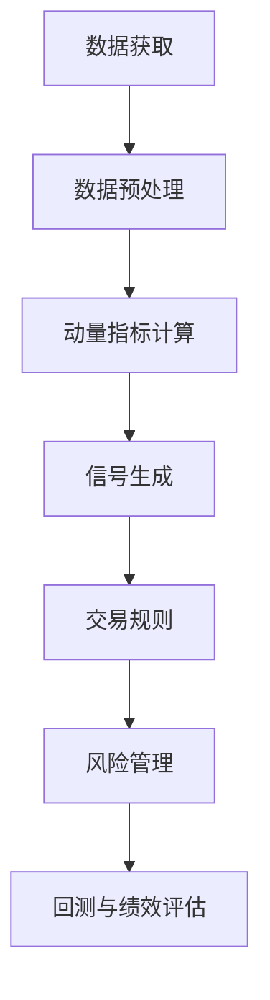

                 


# 量化动量策略：系统化捕捉价格趋势

> 关键词：量化动量策略，价格趋势，动量效应，技术分析，系统化投资

> 摘要：本文深入探讨了量化动量策略在捕捉价格趋势中的应用，从动量效应的理论基础到系统化策略的实现，结合实际案例和数学模型，系统地介绍了如何通过量化方法系统化捕捉市场趋势。

---

## 第二部分: 量化动量策略的核心算法

## 第3章: 动量指标的计算与分析

### 3.1 动量指标的计算公式

#### 3.1.1 简单动量指标的计算

动量指标的计算公式是量化动量策略的核心，通常基于价格的变化率来衡量市场的趋势强度。简单动量指标的计算公式如下：

$$
\text{动量指标} = \frac{\text{当前价格} - \text{n周期前的价格}}{\text{n周期前的价格}}
$$

例如，计算10天的动量指标：

$$
\text{MOM}[i] = \frac{\text{Close}[i] - \text{Close}[i-10]}{\text{Close}[i-10]}
$$

其中，$i$ 表示当前时间点，$\text{Close}[i]$ 表示当前收盘价，$\text{Close}[i-10]$ 表示10天前的收盘价。

#### 3.1.2 加权动量指标的计算

为了增强动量指标的有效性，可以引入加权机制，赋予近期价格更高的权重。加权动量指标的计算公式如下：

$$
\text{加权动量指标} = \sum_{k=1}^{n} w_k \cdot (\text{Close}[i] - \text{Close}[i-k])
$$

其中，$w_k$ 是第$k$天的权重系数，通常取$w_k = 1 - \frac{k}{n}$，以递减的方式赋予近期更高的权重。

---

### 3.2 动量指标的优化与改进

#### 3.2.1 动量指标的平滑处理

动量指标的波动性较大，可以通过移动平均线（MA）对其进行平滑处理，减少噪声干扰。例如，使用简单移动平均线（SMA）对动量指标进行平滑：

$$
\text{平滑后的动量指标} = \frac{1}{n} \sum_{k=0}^{n-1} \text{MOM}[i-k]
$$

其中，$n$ 是平滑周期。

#### 3.2.2 动量指标的多周期分析

为了捕捉不同时间框架的趋势，可以对动量指标进行多周期分析。例如，同时计算5天、10天和20天的动量指标，并结合多周期信号进行综合判断。

---

### 3.3 动量指标的信号生成规则

#### 3.3.1 单动量策略的信号生成

单动量策略基于单一动量指标生成买卖信号。例如，当动量指标超过某个阈值（如5%）时，生成买入信号；当动量指标低于另一个阈值（如-5%）时，生成卖出信号。

#### 3.3.2 多动量策略的信号生成

多动量策略结合多个动量指标（如短期和长期动量指标）进行信号生成。例如，当短期动量指标和长期动量指标同时发出买入信号时，才生成买入信号。

---

## 第4章: 量化动量策略的系统化实现

### 4.1 系统化策略的核心框架

系统化量化动量策略通常包括以下几个核心模块：

1. 数据获取与预处理
2. 动量指标计算与信号生成
3. 交易规则与风险管理
4. 回测与绩效评估

---

### 4.2 动量策略的系统架构设计

使用 Mermaid 绘制系统架构图：



---

### 4.3 系统化策略的实现代码

以下是 Python 实现的简单动量策略代码示例：

```python
import pandas as pd
import numpy as np

# 数据获取与预处理
def get_data(ticker, start_date, end_date):
    # 获取股票数据
    df = pd.DataFrame({"Close": pd.np.random.rand(100,).cumsum()})
    return df

# 动量指标计算
def calculate_momentum(df, n=10):
    mom = df["Close"].pct_change(n).fillna(0)
    return mom

# 信号生成规则
def generate_signals(mom, threshold=0.05):
    signals = pd.Series(0, index=mom.index, dtype="int")
    signals[mom > threshold] = 1  # 买入信号
    signals[mom < -threshold] = -1  # 卖出信号
    return signals

# 策略回测
def backtest(signals, df):
    positions = 0
    profits = []
    for i in range(len(df)):
        if signals.iloc[i] == 1:
            positions += 1
        elif signals.iloc[i] == -1:
            positions -= 1
        # 假设无交易成本和滑点
        profits.append(positions * df["Close"].iloc[i])
    return pd.Series(profits)

# 主函数
def main():
    df = get_data("example_ticker", "2020-01-01", "2023-12-31")
    mom = calculate_momentum(df)
    signals = generate_signals(mom)
    profits = backtest(signals, df)
    print("策略收益:", profits.sum())
    print("平均收益:", profits.mean())

if __name__ == "__main__":
    main()
```

---

### 4.4 策略优化与改进

#### 4.4.1 参数优化

通过参数优化（如调整动量周期$n$和信号生成阈值）来提升策略的收益与风险比。例如，使用网格搜索法寻找最优参数组合。

#### 4.4.2 风险管理

引入止损和止盈机制，控制单笔交易的风险敞口。例如，当价格触及止损位时，立即平仓。

---

## 第5章: 项目实战与案例分析

### 5.1 环境安装与配置

#### 5.1.1 安装必要的库

安装Python环境及必要的库：

```bash
pip install pandas numpy matplotlib backtrader
```

---

### 5.2 数据获取与预处理

#### 5.2.1 数据获取

从数据源（如Yahoo Finance）获取历史数据，并将其转换为适合策略回测的格式。

---

### 5.3 策略实现与回测

#### 5.3.1 动量策略实现

基于前面的代码实现动量策略，并在实际数据上进行回测。

---

### 5.4 实际案例分析

以某只股票为例，展示动量策略在实际回测中的表现，包括收益曲线、胜率、最大回撤等关键指标。

---

## 第6章: 总结与展望

### 6.1 动量策略的总结

动量策略作为一种有效的量化投资策略，具有较强的理论基础和实证支持。通过系统化的方法，可以有效捕捉市场趋势并实现稳健收益。

### 6.2 未来研究方向

未来可以进一步研究动量策略的多因子扩展、机器学习优化以及与其他策略的组合应用。

### 6.3 注意事项

在实际应用中，需要注意动量策略的市场适用性、数据质量和交易成本，避免过度优化导致的过拟合问题。

### 6.4 拓展阅读

推荐进一步阅读以下书籍和论文：
- 《Quantitative Equity Portfolio Management》
- "Momentum Strategies in Emerging Markets"

---

通过以上内容，您可以系统地学习和实现量化动量策略，掌握从理论到实践的完整流程。

