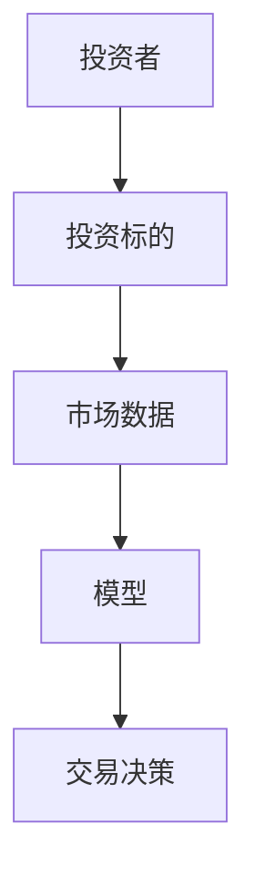
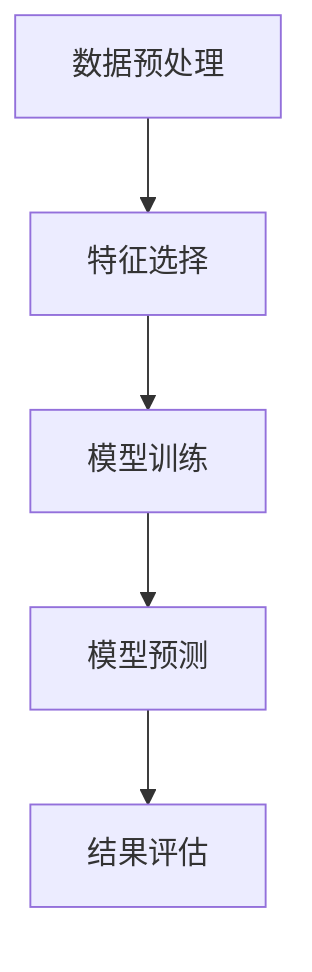
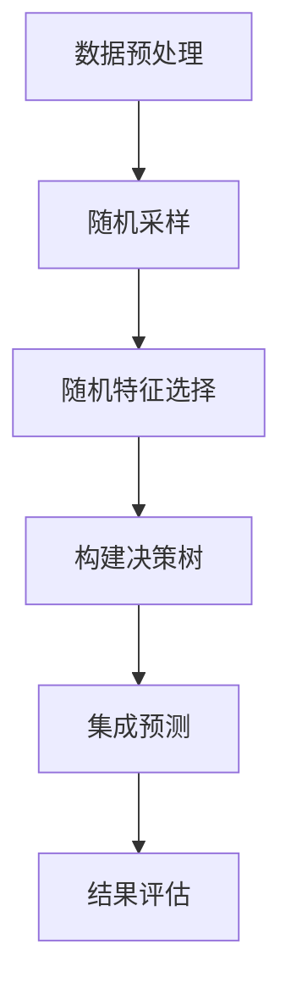
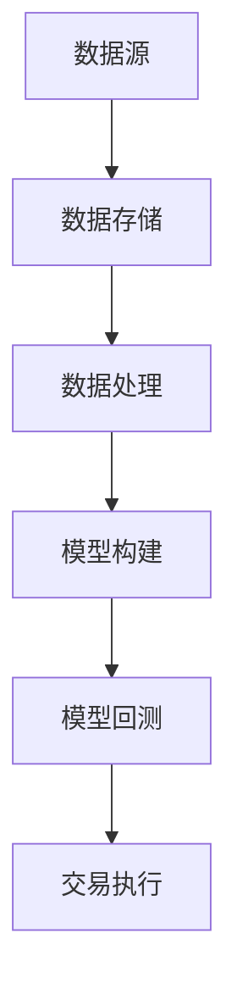

                 


# 量化投资模型：大数据时代的投资决策工具

## 关键词

量化投资模型，大数据，投资决策，机器学习，算法交易，风险管理

## 摘要

量化投资模型是一种基于大数据分析的投资决策工具，它利用先进的算法和数学模型来分析市场数据，预测价格走势，优化投资组合。随着大数据时代的到来，量化投资模型在金融领域发挥着越来越重要的作用。本文将从量化投资模型的背景、核心概念、算法原理、系统架构、项目实战等方面进行详细探讨，帮助读者全面理解量化投资模型的构建和应用。

---

# 第1章 量化投资模型的背景与概念

## 1.1 量化投资的起源与发展

### 1.1.1 传统投资与量化投资的对比

- 传统投资：依赖于基本面分析和市场情绪，主观性强，决策周期长。
- 量化投资：基于数据和算法，客观、高效，适合高频交易和大数据分析。

### 1.1.2 大数据时代对量化投资的影响

- 数据量的爆炸式增长为量化投资提供了丰富的数据来源。
- 计算能力的提升使得复杂模型的构建和计算成为可能。
- 算法交易的兴起，使得量化投资成为主流趋势。

### 1.1.3 量化投资的核心理念与优势

- 核心理念：利用数学模型和算法分析市场数据，发现投资机会。
- 优势：高效性、客观性、可重复性。

## 1.2 量化投资模型的基本概念

### 1.2.1 量化投资模型的定义

量化投资模型是通过数学公式和算法对金融市场数据进行分析，从而生成投资策略和交易信号的工具。

### 1.2.2 量化投资模型的分类

- 时间序列模型：ARIMA、GARCH等。
- 机器学习模型：随机森林、神经网络等。
- 统计套利模型：配对交易、统计套利等。

### 1.2.3 量化投资模型的数学基础

- 线性代数：矩阵运算、特征分解。
- 概率论与统计学：概率分布、假设检验。
- 优化理论：线性规划、非线性规划。

## 1.3 大数据在量化投资中的应用

### 1.3.1 大数据的特点与优势

- 数据量大：PB级别数据。
- 数据多样性：市场数据、新闻数据、社交媒体数据。
- 数据实时性：高频交易需要实时数据处理。

### 1.3.2 大数据在金融领域的应用案例

- 股票市场预测：利用大数据分析市场情绪。
- 债券定价：基于公司财务数据和市场数据。
- 量化对冲：利用大数据寻找市场套利机会。

### 1.3.3 大数据对量化投资模型的推动作用

- 提供更丰富的数据来源，提升模型的准确性。
- 实现高频交易，提高交易效率。
- 降低人为干扰，确保决策的客观性。

---

# 第2章 量化投资模型的核心概念与联系

## 2.1 核心概念原理

### 2.1.1 数据来源与特征分析

- 数据来源：市场数据（K线图、订单簿）、新闻数据、公司财报、社交媒体数据。
- 特征分析：通过特征工程提取有用的特征，如动量效应、波动率、市场情绪等。

### 2.1.2 模型构建与优化

- 模型选择：根据数据特征选择合适的模型。
- 模型优化：通过交叉验证、网格搜索等方法优化模型参数。

### 2.1.3 风险管理与收益最大化

- 风险管理：通过VaR、CVaR等方法量化风险。
- 收益最大化：通过优化投资组合实现收益与风险的平衡。

## 2.2 核心概念属性特征对比表格

| 概念 | 特征 |
|------|------|
| 数据来源 | 市场数据、新闻数据、公司财报等 |
| 模型类型 | 线性回归、随机森林、时间序列分析等 |
| 风险管理 | VaR、CVaR、波动率等 |

## 2.3 ER实体关系图



---

# 第3章 量化投资模型的算法原理

## 3.1 常见算法介绍

### 3.1.1 线性回归

#### 3.1.1.1 线性回归模型

$$ y = \beta_0 + \beta_1x + \epsilon $$

- $\beta_0$ 是截距，$\beta_1$ 是斜率，$\epsilon$ 是误差项。

#### 3.1.1.2 线性回归的实现步骤

1. 数据预处理：标准化、特征选择。
2. 模型训练：使用最小二乘法求解系数。
3. 模型预测：根据训练好的模型预测目标值。
4. 模型评估：计算R²值、均方误差等指标。

#### 3.1.1.3 线性回归的优缺点

- 优点：简单、解释性强。
- 缺点：只能处理线性关系，对非线性关系表现不佳。

### 3.1.2 支持向量机

#### 3.1.2.1 支持向量机原理

支持向量机通过找到一个超平面，使得数据点在该超平面上的投影距离最大化，从而实现分类或回归。

#### 3.1.2.2 支持向量机的实现步骤

1. 数据预处理：标准化、降维。
2. 核函数选择：常用RBF核。
3. 模型训练：求解支持向量和系数。
4. 模型预测：根据训练好的模型预测目标值。

#### 3.1.2.3 支持向量机的优缺点

- 优点：适用于非线性关系，泛化能力强。
- 缺点：计算复杂度高，不适合大规模数据。

### 3.1.3 随机森林

#### 3.1.3.1 随机森林原理

随机森林是一种基于决策树的集成学习方法，通过随机采样和特征随机选择构建多个决策树，并通过投票或平均的方式进行预测。

#### 3.1.3.2 随机森林的实现步骤

1. 数据预处理：特征选择、标准化。
2. 树的构建：随机采样数据，随机选择特征构建决策树。
3. 集成预测：通过投票或平均的方式得到最终结果。

#### 3.1.3.3 随机森林的优缺点

- 优点：适用于各种数据类型，鲁棒性强。
- 缺点：计算复杂度高，解释性差。

### 3.1.4 时间序列分析

#### 3.1.4.1 时间序列分析原理

时间序列分析是通过分析数据的时序特性，如趋势、周期性、随机性，来预测未来的值。

#### 3.1.4.2 时间序列分析的实现步骤

1. 数据预处理：去除趋势、周期性。
2. 模型选择：ARIMA、GARCH等。
3. 模型训练：估计参数。
4. 模型预测：预测未来值。

#### 3.1.4.3 时间序列分析的优缺点

- 优点：适合处理时间相关的数据。
- 缺点：对异常值敏感，模型选择复杂。

## 3.2 算法流程图

### 3.2.1 线性回归算法流程图



### 3.2.2 随机森林算法流程图



---

# 第4章 量化投资模型的系统架构设计

## 4.1 系统架构概述

### 4.1.1 数据采集模块

- 功能：从数据源获取市场数据、新闻数据等。
- 实现：使用API接口获取实时数据，或者从数据库中读取历史数据。

### 4.1.2 数据处理模块

- 功能：对数据进行清洗、特征提取、数据增强。
- 实现：使用Pandas、NumPy等工具进行数据处理。

### 4.1.3 模型构建模块

- 功能：选择合适的模型，训练模型，保存模型。
- 实现：使用Scikit-learn、XGBoost等机器学习库构建模型。

### 4.1.4 模型回测模块

- 功能：对模型进行回测，评估模型的性能。
- 实现：使用Backtrader等工具进行回测，计算收益、风险指标。

### 4.1.5 交易执行模块

- 功能：根据模型的预测结果，生成交易信号，执行交易。
- 实现：使用Interactive Brokers等交易接口进行自动化交易。

## 4.2 系统架构图



---

# 第5章 量化投资模型的项目实战

## 5.1 环境安装与配置

### 5.1.1 安装Python环境

- 使用Anaconda安装Python 3.8及以上版本。

### 5.1.2 安装必要的库

```bash
pip install numpy pandas scikit-learn xgboost backtrader
```

## 5.2 系统核心实现源代码

### 5.2.1 数据采集模块

```python
import pandas as pd
import requests

def get_data(ticker, start_date, end_date):
    url = f"https://api.example.com/{ticker}/{start_date}/{end_date}"
    response = requests.get(url)
    data = response.json()
    df = pd.DataFrame(data)
    return df
```

### 5.2.2 数据处理模块

```python
import pandas as pd
from sklearn.preprocessing import StandardScaler

def preprocess_data(df):
    # 数据清洗
    df.dropna(inplace=True)
    # 特征选择
    features = ['open', 'high', 'low', 'close', 'volume']
    target = 'close'
    # 数据标准化
    scaler = StandardScaler()
    df_scaled = scaler.fit_transform(df[features])
    return df_scaled, df[target]
```

### 5.2.3 模型构建模块

```python
from sklearn.ensemble import RandomForestRegressor
from sklearn.metrics import mean_squared_error

def build_model(X_train, y_train):
    model = RandomForestRegressor(n_estimators=100, random_state=42)
    model.fit(X_train, y_train)
    return model

def evaluate_model(model, X_test, y_test):
    y_pred = model.predict(X_test)
    mse = mean_squared_error(y_test, y_pred)
    print(f"均方误差：{mse}")
```

### 5.2.4 模型回测模块

```python
import backtrader as bt

class QuantStrategy(bt.Strategy):
    def __init__(self):
        self.data = self.datas[0]
        self.order = None

    def start(self):
        pass

    def next(self):
        # 根据模型预测结果生成信号
        if model.predict(self.data)[0] > 0.5:
            if self.order is None:
                self.order = self.buy()
        else:
            if self.order is not None:
                self.order.close()

    def stop(self):
        pass

cerebro = bt.Cerebro()
cerebro.addstrategy(QuantStrategy)
data = bt.feeds.PandasData(dataname=df)
cerebro.adddata(data)
cerebro.run()
```

### 5.2.5 交易执行模块

```python
import ibساطون

# 初始化Interactive Brokers接口
ibt = ibساطون.Client(account_number, password)

# 发送交易指令
ibt.order('AAPL', 'BUY', 100, 'STK', 100.0)
```

## 5.3 实际案例分析与详细讲解

### 5.3.1 数据采集与处理

假设我们想要构建一个股票价格预测模型，首先需要从数据源获取股票的历史数据，包括开盘价、收盘价、最高价、最低价和成交量等。然后，对数据进行清洗，去除缺失值和异常值，提取有用的特征，如动量、相对强弱指数（RSI）、平均趋向指数（ADX）等。

### 5.3.2 模型构建与训练

选择随机森林回归模型作为预测模型，使用训练数据进行模型训练。通过交叉验证优化模型参数，如树的棵数、最大深度等。

### 5.3.3 模型回测与评估

使用回测工具对模型进行回测，计算模型的收益、最大回撤、夏普比率等指标，评估模型的性能。

### 5.3.4 交易执行与策略优化

根据模型的预测结果生成交易信号，执行交易指令，同时监控交易执行情况，调整策略参数，优化交易成本和风险。

## 5.4 项目小结

通过本章的实战案例，我们了解了量化投资模型的构建和应用过程，包括数据采集、数据处理、模型构建、模型回测和交易执行等步骤。在实际操作中，需要注意数据的质量、模型的选择和优化，以及交易策略的风险管理。

---

# 第6章 最佳实践与小结

## 6.1 最佳实践

### 6.1.1 数据处理

- 数据清洗：去除缺失值、异常值。
- 特征工程：提取有用的特征，减少特征维度。
- 数据增强：通过数据变换提高模型的泛化能力。

### 6.1.2 模型优化

- 参数调优：使用网格搜索、随机搜索优化模型参数。
- 特征选择：通过特征重要性筛选关键特征。
- 模型集成：通过集成学习提高模型的准确性和稳定性。

### 6.1.3 风险管理

- 设置止损和止盈：控制单笔交易的最大亏损。
- 分散投资：避免过度集中，降低整体风险。
- 风险指标：使用VaR、CVaR等指标量化风险。

## 6.2 小结

量化投资模型是一种基于大数据和算法的投资决策工具，通过科学的方法和先进的技术，帮助投资者提高投资效率和收益。在实际应用中，需要注意数据的质量、模型的优化和风险管理，确保模型的稳定性和可靠性。

## 6.3 注意事项

- 数据隐私：注意数据的保密性和合规性。
- 模型过拟合：避免模型过拟合训练数据，降低泛化能力。
- 交易成本：考虑交易费用和滑点对收益的影响。

## 6.4 拓展阅读

- 《Python机器学习实战》：了解机器学习的基本概念和实现方法。
- 《量化交易入门到精通》：系统学习量化交易的理论和实践。
- 《大数据分析与挖掘》：深入理解大数据的处理和分析方法。

---

# 附录

## 附录A 常用量化投资模型工具

### 1. 数据采集工具

- QuantInst：提供实时市场数据和历史数据。
- AlphaSense：提供新闻数据和市场情绪分析。
- Quandl：提供丰富的开放数据源。

### 2. 模型构建工具

- Scikit-learn：机器学习库。
- XGBoost：梯度提升树算法。
- TensorFlow：深度学习框架。

### 3. 回测工具

- Backtrader：免费的回测框架。
- TradingView：在线回测工具。
- MetaTrader：多平台回测工具。

## 附录B 常用数学公式

### 1. 线性回归公式

$$ y = \beta_0 + \beta_1x + \epsilon $$

### 2. 随机森林公式

随机森林通过集成多个决策树的预测结果，得到最终的预测值。

### 3. 时间序列公式

ARIMA模型：

$$ y_t = \phi_1 y_{t-1} + \phi_2 y_{t-2} + \theta_1 \epsilon_{t-1} + \epsilon_t $$

---

# 结语

量化投资模型是大数据时代的重要工具，通过科学的方法和先进的技术，帮助投资者在复杂多变的市场中找到投资机会。希望本文能够为读者提供有价值的参考和启示，帮助他们在量化投资领域取得更大的成功。

